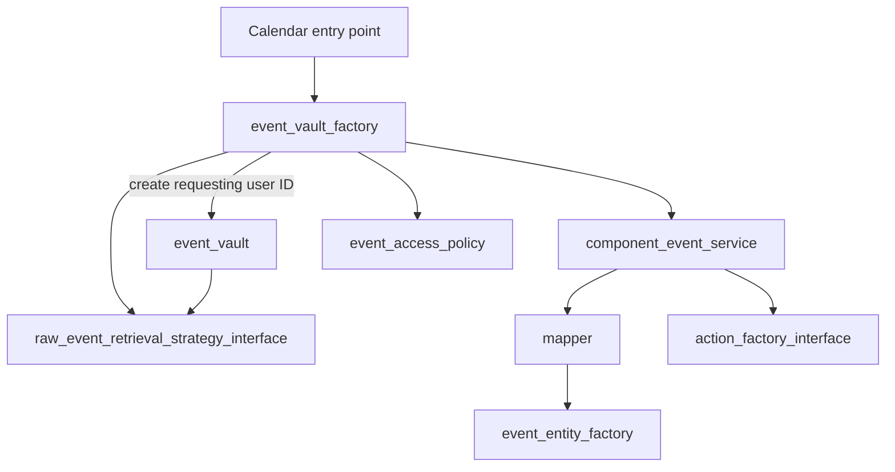
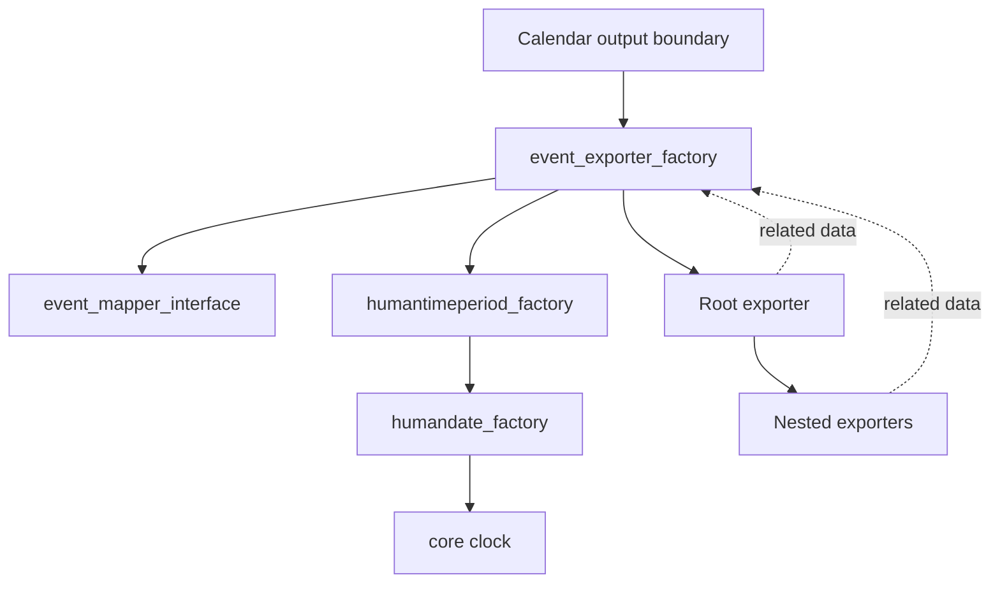

<Since version="4.4" issueNumber="MDL-80072" />

Dependency injection means supplying an object with the dependencies that it needs, rather than having the object find or
create those dependencies itself. In Moodle, dependencies should normally be passed through the constructor.

The Dependency Injection (DI) container is a tool for assembling those objects. Moodle provides a
[PSR-11](https://www.php-fig.org/psr/psr-11/) compatible container through `\core\di`, backed by
[PHP-DI](https://php-di.org). The container is not dependency injection itself.

:::note[The important distinction]

Passing a dependency into a constructor is dependency injection. Calling `\core\di::get()` from inside the class that needs
the dependency is service location.

Use the container at a composition root to create the highest-level service or factory, then let constructor injection provide the rest
of its object graph.

:::

## Core concepts {/* #core-concepts */}

- A **dependency** is a collaborator that an object needs to do its work, such as `\moodle_database` or `\core\clock`.
- **Injection** is the act of supplying that collaborator from outside the object.
- The **container** knows how to construct and reuse services and their dependencies.
- An application **boundary** is the outermost code for one operation: the point where Moodle's runtime or a framework invokes
  component code.
- A **composition root** is the place where the operation's top-level objects and their dependency graphs are obtained or
  assembled. A boundary may own composition itself, or the surrounding framework may do it.

Runtime values are not services. User IDs, course IDs, event IDs, form data, and other per-operation values should be method or
factory arguments. They must not be stored as mutable state in a shared container service.

## Constructor injection {/* #constructor-injection */}

Constructor injection is not a feature of Moodle's DI container. For required collaborators, it is a long-established PHP
design practice that has been widely used for well over a decade. A class declares only its immediate dependencies and remains
unaware of whether they were supplied by application code, a test, hand-written composition code, or a container. This makes
the class easier to understand, reuse, and test. It also makes the class naturally compatible with Moodle's container, which
can use its constructor types to assemble the object graph.

The following example shows how this practice looks in a Moodle component. The repository contract and service live in
separate autoloaded files:

```php title="mod/example/classes/local/reminder_repository_interface.php"
namespace mod_example\local;

interface reminder_repository_interface {
    public function create(int $userid, int $timecreated): void;
}
```

```php title="mod/example/classes/local/reminder_service.php"
namespace mod_example\local;

final class reminder_service {
    public function __construct(
        private readonly reminder_repository_interface $repository,
        private readonly \core\clock $clock,
    ) {
    }

    public function create_for_user(int $userid): void {
        $this->repository->create(
            userid: $userid,
            timecreated: $this->clock->time(),
        );
    }
}
```

Here `reminder_repository_interface` and `\core\clock` are dependencies. The `$userid` is runtime context, so it is passed to the
operation.

The constructor declares the contracts that the service needs; it does not select implementations for interfaces. Those
mappings are [configured separately](#configuring-dependencies).

[Constructor property promotion](https://www.php.net/manual/en/language.oop5.decon.php#language.oop5.decon.constructor.promotion)
and [readonly properties](https://www.php.net/manual/en/language.oop5.properties.php#language.oop5.properties.readonly-properties)
make the dependency graph explicit and prevent dependencies from being replaced accidentally.

With the interface mapping configured, Moodle's container can construct `reminder_service` and recursively supply its
dependencies when application code requests the top-level service through
`\core\di::get(\mod_example\local\reminder_service::class)`. The next section explains where such top-level requests belong.

## Boundaries and composition roots {/* #composition-root */}

Where `\core\di::get()` is called must be considered carefully. Moodle spans more than two decades of architectural styles,
so its entry points are not all composed in the same way.

Start by identifying the operation's application boundary: the outermost component code invoked for that operation. Common
boundaries include route controller methods, external functions, hook callbacks, scheduled task `execute()` methods, and CLI
or legacy PHP scripts. Runtime values such as validated request parameters and the current user ID enter at the boundary. It
then invokes the top-level application objects for that operation. The classes called beneath it are inside the application's
object graph; they are not boundaries merely because they call other classes.

At that boundary, determine whether the surrounding framework already owns composition. Some framework-managed entry points
are composed through the container. Others may be invoked without application dependencies being injected and must obtain
their top-level application objects explicitly.

When the surrounding framework does not inject the top-level objects, the boundary also owns composition. Fetch the
highest-level service or factory there:

```php title="Composing the graph at an entry point"
$service = \core\di::get(\mod_example\local\reminder_service::class);
$service->create_for_user($USER->id);
```

Using the configured mappings for `reminder_repository_interface` and `\core\clock`, the container constructs
`reminder_service` and supplies both dependencies to its constructor. Those collaborators can have their own constructor
dependencies; application code does not need to fetch each one.

This explicit lookup is appropriate at those boundaries because they are not currently invoked with injected application
dependencies.

### Framework-owned composition roots {/* #framework-owned-composition-roots */}

The boundary and the composition root do not have to be the same piece of code. The
[Routing subsystem](../../subsystems/routing/index.md) owns composition for routed web requests. It constructs the route
controller through the container, so the controller can declare its highest-level service as an ordinary constructor
dependency:

```php title="A route controller composed by Moodle"
final class reminder_controller {
    public function __construct(
        private readonly \mod_example\local\reminder_service $service,
    ) {
    }

    #[\core\router\route(path: '/reminders', method: ['POST'])]
    public function create(
        \Psr\Http\Message\ResponseInterface $response,
    ): \Psr\Http\Message\ResponseInterface {
        global $USER;

        $this->service->create_for_user($USER->id);
        return $response;
    }
}
```

Here, `create()` is the application boundary, while the router owns the composition root. The controller contains no container
lookup because the router composes it and the complete dependency graph. A service needed by only one route may instead be
declared as a typed route-method parameter; the router resolves those parameters through the container too. In both forms,
the application classes below the controller continue to use ordinary constructor injection and know nothing about the
container.

Avoid container lookups in the classes below that boundary:

<InvalidExample title="Do not use the container as a service locator">

```php
final class reminder_service {
    public function create_for_user(int $userid): void {
        // Do not do this. The dependency is hidden and this class is coupled to the container.
        $clock = \core\di::get(\core\clock::class);
    }
}
```

</InvalidExample>

Constructor injection makes dependencies visible, keeps classes usable without Moodle's global container, and allows the
container to replace a dependency throughout the graph.

:::warning[Do not inject the container]

Do not inject `\Psr\Container\ContainerInterface`, `\DI\Container`, or `\core\di`. Doing so turns the container into a
service locator and hides the real dependencies of the class.

The standard [`moodle` PHP CodeSniffer ruleset](/general/development/tools/phpcs) enforces this with
`moodle.PHP.ForbiddenContainerInjection`. It reports an error when application code receives one of these container types;
declare the service that the code actually needs instead.

:::

The recommended `moodle-extra` ruleset also enables `MoodleExtra.PHP.DiscouragedContainerLookup`. It reports a warning when
a class calls `\core\di::get()` or `\core\di::get_container()`, because such calls usually indicate service location. If a
class method is intentionally an entry-point composition root, keep the lookup at that boundary and document the exception
with a targeted suppression:

```php title="An intentional composition root inside a class"
// phpcs:ignore MoodleExtra.PHP.DiscouragedContainerLookup.InClass -- Scheduled task composition root.
$service = \core\di::get(\mod_example\local\reminder_service::class);
```

Classes below that boundary should declare their dependencies and should not suppress the warning.

## Core example: the Calendar API {/* #calendar-example */}

This section illustrates the architecture used inside Moodle core. Classes in the `core_calendar\local` namespace are internal
to the Calendar component and are not public APIs for plugins.

:::info[Dependency injection predates Moodle's core container]

Calendar already used constructor injection in Moodle 3.3, seven years before Moodle 4.4 introduced `\core\di`. Work in
[MDL-57442](https://moodle.atlassian.net/browse/MDL-57442) and
[MDL-57750](https://moodle.atlassian.net/browse/MDL-57750), as part of the
[MDL-55611](https://moodle.atlassian.net/browse/MDL-55611) project, created this dependency graph. The
[hand-written composition code in Moodle 3.3](https://github.com/moodle/moodle/blob/v3.3.0/calendar/classes/local/event/container.php#L89-L183)
constructed the event factories, mapper, vault, and retrieval strategy, passing dependencies into their constructors.

That bespoke class was itself named `container` and exposed static accessors, so callers used it partly as a service locator.
The graph it assembled still used dependency injection. The core DI container standardises and automates object assembly; it
did not introduce the act of injecting dependencies into Moodle code.

:::

The Calendar API has a substantial dependency graph. Moodle-owned entry points obtain the event vault factory, provide the
requesting user as runtime context, and then use the resulting vault for the operation:

```php title="Using the Calendar API query root"
$vaultfactory = \core\di::get(\core_calendar\local\event\data_access\event_vault_factory::class);
$eventvault = $vaultfactory->create($USER->id);
$events = $eventvault->get_events(
    timestartfrom: $timestart,
    timestartto: $timeend,
);
```

The first line above is the query graph's only container lookup. It belongs in the Moodle-owned entry point, which is the
composition root. The requested factory declares its dependencies as ordinary constructor arguments:

```php title="Calendar event vault factory constructor"
class event_vault_factory {
    public function __construct(
        private readonly component_event_service $componenteventservice,
        private readonly event_access_policy $eventaccesspolicy,
        private readonly raw_event_retrieval_strategy_interface $retrievalstrategy,
    ) {
    }
}
```

The same pattern continues further down the graph:

```php title="A dependency declaring its own contracts"
class component_event_service {
    public function __construct(
        private readonly event_mapper_interface $mapper,
        private readonly action_factory_interface $actionfactory,
    ) {
    }
}
```

Neither class calls the container or knows which implementations were configured. Each declares only the collaborators it
needs and codes to their contracts. From the single `\core\di::get()` call at the boundary, the container follows those
constructors recursively until it has assembled the complete graph.

The container assembles the rest of the graph:



`event_vault_factory::create()` accepts the requesting user ID and captures it for one vault. The ID is not retained by the
container-managed factory. This matters because container services can live for the whole request and may be shared by several
operations. Resolving `event_vault_interface` directly would either leave the container without the runtime user ID or hide that
context in mutable global state.

### A boundary that owns composition {/* #composition-boundary-example */}

The external-services framework invokes `get_calendar_event_by_id()` as a static method and does not inject application
dependencies. The method is therefore both the boundary and the composition root for that operation.

The following shortened version shows all of its container lookups in context:

```php title="Several top-level objects at one boundary"
public static function get_calendar_event_by_id($eventid) {
    global $PAGE, $USER;

    // Start the query graph.
    $eventvault = \core\di::get(
        \core_calendar\local\event\data_access\event_vault_factory::class,
    )->create($USER->id);
    $event = $eventvault->get_event_by_id($eventid);
    if (!$event) {
        throw new \required_capability_exception(
            \context_system::instance(),
            'moodle/course:view',
            'nopermissions',
            'error',
        );
    }

    // Obtain a separate top-level collaborator used directly by this boundary.
    $mapper = \core\di::get(
        \core_calendar\local\event\mappers\event_mapper_interface::class,
    );
    if (!calendar_view_event_allowed($mapper->from_event_to_legacy_event($event))) {
        throw new \moodle_exception('nopermissiontoviewcalendar', 'error');
    }

    $cache = new \core_calendar\external\events_related_objects_cache([$event]);
    $relatedobjects = [
        'context' => $cache->get_context($event),
        'course' => $cache->get_course($event),
    ];

    // Start the independent output graph.
    $outputfactory = \core\di::get(
        \core_calendar\local\output\event_exporter_factory::class,
    );
    $exporter = $outputfactory->create_event_exporter($event, $relatedobjects);

    return $exporter->export($PAGE->get_renderer('core_calendar'));
}
```

The three lookups obtain top-level capabilities used directly by the entry point:

- `event_vault_factory` starts the query graph and receives the requesting user as runtime context.
- `event_mapper_interface` converts the event for a legacy permission check performed by the boundary.
- `event_exporter_factory` starts the output graph.

The goal is not mechanically limiting every request to one `\core\di::get()` call. A boundary can obtain more than one
top-level service or factory when it directly coordinates independent parts of an operation. It should not obtain the
dependencies of those objects: their constructors declare those dependencies and the container supplies them. If one
application service naturally owns the complete use case, obtain that single service. Do not introduce a facade whose only
purpose is to hide several otherwise legitimate boundary lookups.

The `event_exporter_factory` itself is added to the exporter's optional related data and passed to nested exporters. Leaf
exporters call the supplied factory to map events and create human-readable dates; they do not fetch those collaborators from
the container.



Existing directly constructed exporters use an isolated compatibility path, while the normal graph does not perform
container lookups in leaf exporters.

## Autowiring {/* #autowiring */}

Autowiring means inspecting the constructor of a known concrete class and resolving its declared dependencies. It does not
mean searching the codebase for a class which implements an interface.

When the container is asked for a concrete class, it can normally construct that class without configuration:

```php
final class reminder_repository implements reminder_repository_interface {
    public function __construct(
        private readonly \moodle_database $db,
    ) {
    }

    public function create(int $userid, int $timecreated): void {
        $this->db->insert_record('example_reminders', (object) [
            'userid' => $userid,
            'timecreated' => $timecreated,
        ]);
    }
}
```

The container can construct `reminder_repository` without extra instructions from the component: it inspects the constructor,
sees `\moodle_database`, and Moodle core already knows how to provide it. The fact that `reminder_repository` implements
`reminder_repository_interface` does not create a reverse mapping from the interface to this implementation.

A request for `reminder_repository_interface::class` must first be mapped to an implementation. The
[configuration section below](#configuring-dependencies) explains how a component supplies that mapping. Once the mapping is
configured, autowiring takes over: the container follows it to `reminder_repository`, inspects its constructor, and builds its
dependencies recursively.

## Configuring interfaces and complex services {/* #configuring-dependencies */}

The interface-to-implementation mapping described above is a container definition. A definition tells the container how to
resolve an entry which autowiring cannot decide or construct by itself. Moodle core supplies the definition for
`\moodle_database` used in the previous example. Components contribute their own definitions with the
`\core\hook\di_configuration` hook. Choosing an implementation for an interface is the most common example; definitions can
also supply scalar configuration or delegate construction to a legacy factory.

Container entries are identified by a string ID, normally a fully-qualified class or interface name. Arbitrary string IDs are
strongly discouraged because they hide the type relationship.

Register the hook callback in the component's `db/hooks.php`:

```php title="mod/example/db/hooks.php"
<?php
$callbacks = [
    [
        'hook' => \core\hook\di_configuration::class,
        'callback' => [\mod_example\hook_callbacks::class, 'provide_di_configuration'],
    ],
];
```

Map the interface to a concrete implementation in the callback:

```php title="mod/example/classes/hook_callbacks.php"
<?php
namespace mod_example;

use core\hook\di_configuration;
use mod_example\local\reminder_repository;
use mod_example\local\reminder_repository_interface;

final class hook_callbacks {
    public static function provide_di_configuration(di_configuration $hook): void {
        $hook->add_definition(
            reminder_repository_interface::class,
            \DI\get(reminder_repository::class),
        );
    }
}
```

Consumers continue to declare the interface in their constructors. They do not need to know which implementation was
configured.

## Unit testing {/* #unit-testing */}

Constructor injection makes small unit tests possible without a container: instantiate the class and pass stubs or mocks to
its constructor.

```php title="Testing a service without a container"
public function test_reminder_uses_the_repository(): void {
    $repository = $this->createMock(reminder_repository_interface::class);
    $repository->expects($this->once())
        ->method('create')
        ->with(42, 1234567890);

    $clock = $this->createStub(\core\clock::class);
    $clock->method('time')
        ->willReturn(1234567890);

    $service = new reminder_service(
        repository: $repository,
        clock: $clock,
    );
    $service->create_for_user(42);
}
```

This test has no container setup: the constructor receives the two dependencies directly.

For tests which exercise a complete object graph, replace a dependency before obtaining the aggregate root:

```php title="Replacing a dependency in a container-backed test"
public function test_reminder_uses_the_repository(): void {
    $repository = $this->createMock(reminder_repository_interface::class);
    $repository->expects($this->once())
        ->method('create');

    \core\di::set(reminder_repository_interface::class, $repository);

    // Fetch the root only after all replacements have been configured.
    $service = \core\di::get(reminder_service::class);
    $service->create_for_user(42);
}
```

The [Clock API test helpers](../clock/index.md#unit-testing) wrap this container-backed pattern for `\core\clock`: they
install a replacement before the root is resolved and return that same clock object to the test.

Moodle resets the DI container between PHPUnit tests.

:::warning[Replace dependencies before fetching the root]

Container-managed services can be shared for the lifetime of the container. Replacing a dependency after its consumer has
already been constructed does not rewrite the existing object.

:::

## Legacy and static entry points {/* #legacy-entry-points */}

Some procedural APIs and static factory methods cannot receive constructor dependencies without a backwards-incompatible
signature change. A container lookup may be retained at that boundary as a compatibility bridge.

Keep such bridges small and explicit. New code should enter through an injected service or factory, and the compatibility
lookup should not be copied into the normal object graph.

## Advanced usage {/* #advanced-usage */}

All access to the active container should use `\core\di`. Application code should not access the underlying PHP-DI container
directly.

### Resetting the container {/* #resetting-the-container */}

The container is normally instantiated during bootstrap and lives for the request. Resetting it in application code can leave
existing objects holding dependencies from an older graph.

```php title="Resetting the container"
\core\di::reset_container();
```

This is intended for infrastructure and specialised test scenarios. PHPUnit already resets the container between tests, so
tests should not normally call it themselves.
