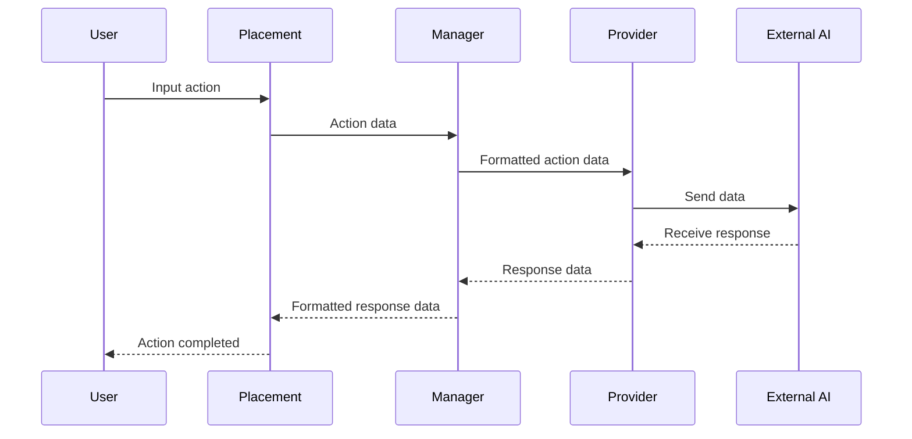

<Since version="4.5" issueNumber="MDL-80888" />

The AI Subsystem in Moodle LMS provides a consistent and user-friendly way for users to interact with AI
in Moodle. It has been designed for easy integration with various AI providers and the development of [AI plugins](/apis/plugintypes/ai/index.md).

## What is AI in this context?

The term 'AI' is very broad and covers a range of concepts like Artificial Intelligence (AI), Machine Learning (ML),
Large Language Models (LLMs), Generative AI, etc.

However, in the context of Moodle, we are simplifying the term 'AI' to mean the tools and actions AI technologies provide to the LMS learning experience.
These AI tools are supplied in the form of [plugins](/apis/plugintypes/ai/index.md) that feature a set of possible actions.

For example, the [Placement plugin](/apis/plugintypes/ai/placement.md) allows users to gain access to the Course Assistant. This AI tool enables
users to have information within their course summarised by the integrated AI.

This is the context of the term 'AI'.

## Design Overview



The AI Subsystem consists of the following (main) components:

- **Placements**
  - Are the UI components and associated workflows that allow users to interact with AI.
  - They implement one or more AI actions.
  - They provide a consistent experience for users regardless of which AI is providing the action.
  - They are LMS plugins.
- **Actions**
  - These are the 'things' users can do with AI.
  - Examples of an action include: generating text, generating an image, providing a chat interface.
  - Actions don't have a UI, they are classes that provide a predictable interface.
- **Providers**
  - Providers are the interface between AI systems and the Moodle LMS.
  - They implement support for one or more actions.
  - Providers should not have a UI, apart from those required to configure the provider.
  - The aim of Providers is to make it easy to integrate AI systems with Moodle LMS.
  - They are LMS plugins.
- **Subsystem Manager**
  - This is implemented at code level and is a core part of the subsystem design.
  - It is the 'controller' that sits between Placement and Provider plugins.
  - It allows Placements to pass user requests to Providers and handles all the calls to the Providers, including prioritisation and logging.
  - It allows Providers to respond to action requests.

### Placements

Placements provide a consistent UX and UI for users when they use AI backed functionality (e.g. generating an image).

Placement plugins leverage the functionality of the other components of the AI subsystem.
This means plugin authors can focus on how users interact with the AI functionality, without needing to
implement the AI functionality itself.

Because Placements are plugins in their own right, it allows for greater flexibility in how AI functionality is presented to users.

See the [Placements](/apis/plugintypes/ai/placement.md) documentation for more information
on developing Placement plugins.

### Providers

Providers are the interface between the [AI subsystem](/apis/subsystems/ai/index.md) and external AI.
Their focus should be on converting the data requested into the format needed
by the external AI, and then correctly providing the response back.

See the [Providers](/apis/plugintypes/ai/provider.md) documentation for more information
on developing Provider plugins.

### Subsystem Manager

The Subsystem Manager is the 'controller' that sits between Placements and Providers.
In general it will be how most processes will interact with the AI subsystem.

:::warning The Golden Rule:

Placements **do not** know about Providers, and Providers **do not** know about Placements.
Everything should go via the Manager.

:::

The main method in the class is `process_action(base $action): responses\response_base`.
This is the entry point for Action processing. Every Placement that wants to process an AI action calls this method.
The Manager will determine which Providers support this action and then hand-off the action object to
a Provider. The Provider **must** return an action response object. This method will also store the
result of each action call.

The Manager class also provides various utility methods, such as retrieving the list of providers for specific actions.
These methods are useful for rendering administration settings.

### Actions

Actions provide instructions to the integrated AI.
Placements create an Action object which is then consumed by the Provider.

Actions are defined as classes in the `\core_ai\aiactions` namespace.
The naming convention for Action classes is `<verb>_<noun singular>`.

#### Actions in AI subsystem

- `generate_image`
- `generate_text`
- `summarise_text`

#### Base abstract class

Each Action **must** inherit from the `\core_ai\aiactions\base` abstract class.
They must also implement two methods:

##### 1. `__construct()`

- The constructor method is allowed to have a variable signature, so that each Action can define its own
configuration requirements.
- The method **must** take a `contextid` as one of the variables.
- An Action **must** be correctly instantiated before it can be used and passed to the AI manager.

```php title="Example: The __construct() method for the generate_image Action"
public function __construct(
    int $contextid,
    /** @var int The user id requesting the action. */
    protected int $userid,
    /** @var string The prompt text used to generate the image */
    protected string $prompttext,
    /** @var string The quality of the generated image */
    protected string $quality,
    /** @var string The aspect ratio of the generated image */
    protected string $aspectratio,
    /** @var int The number of images to generate */
    protected int $numimages,
    /** @var string The visual style of the generated image */
    protected string $style,
) {
    parent::__construct($contextid);
}
```

##### 2. `store()`

- This method is responsible for storing data related to the Action in the LMS database.
- Each Action must store its own data that can be referenced later.
- It takes a matching response class that contains the result of the Action call.

```php title="Example: The store() method for the generate_image Action"
#[\Override]
public function store(response_base $response): int {
    global $DB;

    $responsearr = $response->get_response_data();

    $record = new \stdClass();
    $record->prompt = $this->prompttext;
    $record->numberimages = $this->numimages;
    $record->quality = $this->quality;
    $record->aspectratio = $this->aspectratio;
    $record->style = $this->style;
    $record->sourceurl = $responsearr['sourceurl']; // Can be null.
    $record->revisedprompt = $responsearr['revisedprompt']; // Can be null.

    return $DB->insert_record($this->get_tablename(), $record);
}
```

Each Action will need to define its own database schema and stored data that is relevant to what it does.

```xml title="Example: The database table definition for the generate_image Action"
<TABLE NAME="ai_action_generate_image" COMMENT="Stores specific data about generate image actions">
    <FIELDS>
        <FIELD NAME="id" TYPE="int" LENGTH="10" NOTNULL="true" SEQUENCE="true"/>
        <FIELD NAME="prompt" TYPE="text" NOTNULL="false" SEQUENCE="false" COMMENT="The text from the user that was used to generate the image"/>
        <FIELD NAME="numberimages" TYPE="int" LENGTH="10" NOTNULL="true" SEQUENCE="false" COMMENT="The number of images requested to be generated"/>
        <FIELD NAME="quality" TYPE="char" LENGTH="21" NOTNULL="true" SEQUENCE="false" COMMENT="The quality of the image, e.g. hd."/>
        <FIELD NAME="aspectratio" TYPE="char" LENGTH="20" NOTNULL="false" SEQUENCE="false" COMMENT="The aspect ratio of the generate image, e.g landscape"/>
        <FIELD NAME="style" TYPE="char" LENGTH="20" NOTNULL="false" SEQUENCE="false" COMMENT="The style of the image, e.g. vivid"/>
        <FIELD NAME="sourceurl" TYPE="text" NOTNULL="false" SEQUENCE="false" COMMENT="URL of the generated response."/>
        <FIELD NAME="revisedprompt" TYPE="text" NOTNULL="false" SEQUENCE="false" COMMENT="The actual prompt the AI used to generate the image"/>
    </FIELDS>
    <KEYS>
        <KEY NAME="primary" TYPE="primary" FIELDS="id"/>
    </KEYS>
</TABLE>
```

The naming convention for Action database tables is `ai_action_<action_name>`. For example: `ai_action_generate_image`, `ai_action_translate_text`.

#### Responses

When a Provider processes an Action it **must** return a response object.
This allows Placements to receive an expected response for any Action call.
Each Action has a matching response class. The Provider that processes the Action will instantiate
an instance of this response class and populate it with the data required for this type of response.

Each Action response **must** inherit from the `\core_ai\aiactions\responses\response_base` abstract
class. They must also implement two methods:

##### 1. `set_response_data()`

Taking an array of response variables (which must be defined as class variables),
it sets these against class variables so they can be retrieved by the Manager and calling Placement.

```php title="Example: The set_response_data() for the generate_image Action response"
    #[\Override]
    public function set_response_data(array $response): void {
        $this->draftfile = $response['draftfile'] ?? null;
        $this->revisedprompt = $response['revisedprompt'] ?? null;
        $this->sourceurl = $response['sourceurl'] ?? null;
    }
```

##### 2. `get_response_data()`

Returns the set response data.

```php title="Example: The get_response_data() for the generate_image Action response"
    #[\Override]
    public function get_response_data(): array {
        return [
            'draftfile' => $this->draftfile,
            'revisedprompt' => $this->revisedprompt,
            'sourceurl' => $this->sourceurl,
        ];
    }
```

The naming convention for Action response classes is `response_<action_name>`. For example: `response_generate_image`, `response_translate_text`.

## AI User Policy

Inline with Moodle's AI Principles, and as guided by emerging legislation, users must accept the
AI User Policy before using AI in LMS. As the requirements are different from a site policy,
separate policy functionality has been implemented for the AI subsystem (legislation indicates acknowledgement of AI must be made at point of use).

- Placements must implement a check to see if a user has accepted the policy.
- Placements must provide a way for users to accept the policy.
- If a user has not previously accepted the policy, the Placement must display the policy to the user.
- The user is not able to use the Placement until they accept the policy.
- Users only need to accept the policy once.

To assist Placements with displaying the AI User Policy, the Manager provides the following functionality:

### Direct call

The Manager makes the following methods available for Placements to call directly:

#### `\core_ai\manager::get_user_policy_status(int $userid): bool`

Given a User ID (record id in user table), returns `true` if the user has accepted the policy,
`false` otherwise. It handles looking up the status and caching the response.

#### `\core_ai\manager::user_policy_accepted(int $userid, int $contextid): bool`

Given a User ID and a Context ID (context the policy was displayed in), set the policy
acceptance.

### Webservices

The Manager class also makes available webservices to be used for policy setting and getting.
This helps Placements set policy acceptance via Ajax as part of a UI workflow:

#### `core_ai_get_policy_status`

Gets the policy status for a user. Calls: `core_ai\external\get_policy_status`

#### `core_ai_set_policy_status`

Sets the policy status for a user. Calls: `core_ai\external\set_policy_status`
