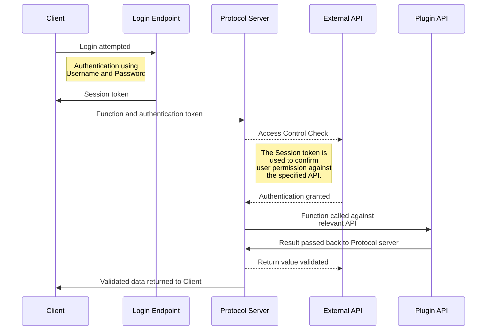

Moodle has a full-featured Web Service framework, allowing you to use and create web services for use in external systems.
The Web Service framework and the External API work closely together providing a number of _Endpoints_, and self-describing classes to support a wide range of uses.

Moodle uses these web services internally for:

- AJAX interactions in the Moodle Web Interface; and
- The official Moodle Mobile App.

The following example shows a typical authentication and protocol workflow.

## Developer documentation

The External Service API has two categories of documentation:

1. this documentation details how to _write_ a web service and use the External API; and
2. API documentation for a live Moodle site, which can be found under ** Site administration > Server > Web services > API Documentation **.

In addition to the standard API endpoints, several additional API endpoints are available for the purpose of uploading, and downloading, files. For more information on these endpoints, see the [file handling](./files.md) documentation.

- [How to contribute a web service function to core](https://docs.moodle.org/dev/How_to_contribute_a_web_service_function_to_core)
- [Adding a web service to your plugin](./writing-a-service.md)
- Code example: [Adding a web service, using APIs](https://gist.github.com/timhunt/51987ad386faca61fe013904c242e9b4) by (Tim Hunt)
- [Implement a web service client](https://docs.moodle.org/dev/Creating_a_web_service_client)
- [Web services files handling](./files.md)
- [Web service Listing & Roadmap](https://docs.moodle.org/dev/Web_services_Roadmap)

## Specification and brainstorming

- [External services security](./security.md)
- [External services description](./description.md)

## See also

- [Web service API functions](https://docs.moodle.org/dev/Web_service_API_functions)
- [Web services FAQ](https://docs.moodle.org/en/Web_services_FAQ)
- [How to create and enable a web service](https://docs.moodle.org/en/How_to_create_and_enable_a_web_service)
- [How to enable the mobile web service](https://docs.moodle.org/en/Enable_mobile_web_services)
- [Web services user documentation](https://docs.moodle.org/en/Web_services)
- [Mastering Moodle Web Services development](http://www.slideshare.net/juanleyva/mastering-moodle-web-services-development) - Last session of the Hackfest in the MoodleMoot UK 2016
