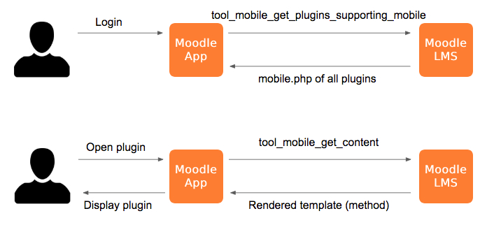
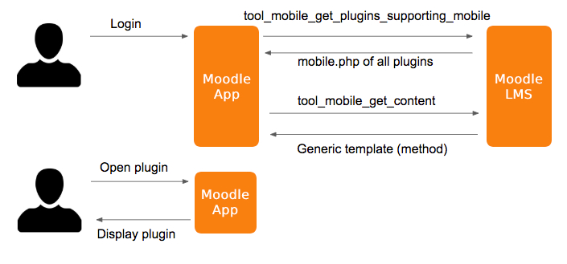

If you want add mobile support to your plugins, **you only need to write PHP code**. You can also use JavaScript for advanced functionality, but mobile plugins are written the same way as any other Moodle plugin: using PHP and Mustache templates.

In this guide we'll go over everything you need to know, but we recommend having read the [Moodle App Overview](../../overview.md) before starting.

In order to get your mobile plugin, you'll need to do the following:

1. Create a `db/mobile.php` file. This file indicates which areas of the app the plugin extends.
2. Create new functions in a reserved namespace to return app templates. This content will be rendered as html, but using the application UI and components rather than core. That means that instead of Bootstrap components and CSS, you'll need to use Ionic.

Let's clarify some points:

- You don't need to create new Web Service functions (although you will be able to use them for advanced features). You just need plain php functions that will be placed in a reserved namespace.
- These functions are exported via the `tool_mobile_get_content` Web Service.
- These functions will receive arguments such as `userid` and other relevant details of the app like app version or current language. Depending on the type of plugin, they will also receive some contextual data like `courseid` or `cmid`.
- In addition to [built-in Ionic components](https://ionicframework.com/docs/components), the app also implements some [custom components](./api-reference.md#components) and [directives](./api-reference.md#components) specific to Moodle.

## Getting started

If you only want to write a plugin, it is not necessary that you set up your environment to work with the Moodle App. In fact, you don't even need to compile it. You can just [use a Chromium-based browser](./setup/app-in-browser) to add mobile support to your plugins!

You can use the app from one of the hosted versions on [latest.apps.moodledemo.net](https://latest.apps.moodledemo.net) (the latest stable version) and [main.apps.moodledemo.net](https://main.apps.moodledemo.net) (the latest development version). If you need any specific environment (hosted versions are deployed with a production environment), you can also use [Docker images](./setup/docker-images). And if you need to test your plugin in a native device, you can always use [Moodle HQ's application](https://download.moodle.org/mobile).

This should suffice for developing plugins. However, if you are working on advanced functionality and you need to run the application from the source code, you can find more information in the [Moodle App Development guide](./development-guide).

### Your first plugin

Before getting into the specifics of your plugin, we recommend that you start adding a simple "Hello World" button in the app to see that everything works properly.

Let's say your plugin is called `local_hello`, you can start by adding the following files:

```php title="db/mobile.php"
<?php

defined('MOODLE_INTERNAL') || die();

$addons = [
    'local_hello' => [
        'handlers' => [
            'hello' => [
                'delegate' => 'CoreMainMenuDelegate',
                'method' => 'view_hello',
                'displaydata' => [
                    'title' => 'hello',
                    'icon' => 'earth',
                ],
            ],
        ],
        'lang' => [
            ['hello', 'local_hello'],
        ],
    ],
];
```

```php title="classes/output/mobile.php"
<?php

namespace local_hello\output;

defined('MOODLE_INTERNAL') || die();

class mobile {

    public static function view_hello() {
        return [
            'templates' => [
                [
                    'id' => 'main',
                    'html' => '<h1 class="text-center">{{ "plugin.local_hello.hello" | translate }}</h1>',
                ],
            ],
        ];
    }

}
```

```php title="lang/en/local_hello.php"
<?php

$string['hello'] = 'Hello World';
$string['plugin_name'] = 'Hello';
```

Once you've done that, try logging into your site in the app. If you open the More menu (the three dots), you should see a new button saying "Hello World" that will open a page saying "Hello World!".

Congratulations, you have written your first Moodle plugin with mobile support!

### Seeing plugin changes in the app

When you make some changes to your plugin, they won't always show up in the app immediately. This can happen because the plugin code has been cached somewhere, and you need to clear this cache to get the latest version.

Here's some things you can try:

- If you changed the `mobile.php` file, you need to refresh the browser. Also remember to [disable the network cache](https://developer.chrome.com/docs/devtools/network/reference/#disable-cache).
- If you changed an existing template or function, doing a PTR (Pull To Refresh) in the page that displays the template will suffice in most cases.
- If doing these doesn't show your changes, you may need to [purge all caches](https://docs.moodle.org/en/Developer_tools#Purge_all_caches).
- If you still can't see your changes, you may have to log out from the site and log in again. If your changes affected plugin installation, you will also need to increase the version in your plugin's `version.php` file and upgrade the site.

### Next steps

As we have seen in the first example, the extension mechanism used in the app is based on [Delegates and handlers](../../overview.md#delegates-and-handlers). That means that it is only possible to add functionality in the parts that have been made customizable. Handlers are registered in `mobile.php` under the `handlers` key, and you can declare as many as you like. If there is something missing that you'd like to customize with your plugin, we encourage you to let us know in [the forum](https://moodle.org/mod/forum/view.php?id=7798) or [the Matrix developer room](https://docs.moodle.org/dev/Chat).

Now you should have a basic idea of how Site Plugins work in the app. If you want to continue learning, you can keep reading this guide. When you are ready, you can check out the [Examples](./examples/index.md) page for some step-by-step guides of common scenarios; or you can directly check out the [API Reference](./api-reference.md) for a comprehensive list of all the APIs and options available in Site Plugins.

## Rendering UI

Most handlers will render some custom UI using the `method` property in their configuration. They will return some templates in the [content response](./api-reference.md#content-responses), and the templates will be treated differently depending on the handler.

Templates will be rendered in the app using Angular, but you can still process them using mustache in your PHP code by using `$OUTPUT->render_from_template`. However, keep in mind that the `{{ }}` syntax is also used for interpolating values in Angular. We recommend switching Mustache's interpolation syntax in mobile templates to `<% %>`. This can be achieved by adding `{{=<% %>=}}` at the beginning of the file. Here's an example:

```php title="method in classes/output/mobile.php"
public static function mobile_course_view($args) {
    global $OUTPUT;

    return [
        'templates' => [
            [
                'id' => 'main',
                'html' => $OUTPUT->render_from_template('local_hello/greeting', ['name' => 'John']),
            ],
        ],
        'otherdata' => [
            'surname' => 'Doe',
        ],
    ];
}
```

```html handlebars title="template in templates/greeting.mustache"
{{=<% %>=}}
<!-- This will render "Hello, John Doe" in the app -->
<h1 class="text-center">Hello, <% name %> {{ CONTENT_OTHERDATA.surname }}</h1>
```

You can find the type of template for each handler in the [API Reference](./api-reference.md#handlers).

### Dynamic templates

These templates are generated each time they are used in the app. This means that the PHP function will receive some contextual parameters, and the template can be rendered dynamically in the server.

For example, if you're developing a [course module plugin](./api-reference.md#corecoursemoduledelegate) you will receive the `courseid` and the `cmid`.



### Static templates

These templates are generated once when the user logs in and cached in the device. This means that the PHP function will not receive any contextual parameters, and it must return a generic template. But it doesn't mean that the UI has to be completely static in the app; it can still use JavaScript to render dynamic elements.



## Localisation

You can declare the language strings used in your plugin in the `lang` property of the configuration. Normally these will be strings from your own plugin, but you can list any strings. For example, you could include `moodle.cancel` from Moodle core.

Strings can be used in the templates using `plugin.{plugin_name}.{string_identifier}`, where `{plugin_name}` will be the name of your plugin and `{string_identifier}` the unscoped string identifier. Note that even strings from different namespaces will use the plugin name, not their original namespace.

Here's an example for `local_hello`:

```php title="db/mobile.php"
$addons = [
    'local_hello' => [
        'handlers' => [
            // ...
        ],
        'lang' => [
            ['hello', 'local_hello'],
            ['cancel', 'moodle'],
        ],
    ],
];
```

```html ng2 title="Template"
{{ 'plugin.local_hello.hello' | translate }}
{{ 'plugin.local_hello.cancel' | translate }}
```

Make sure to only include the strings you actually need. The Web Service that returns the plugin information will include the translations for every language, and this will be cached in the device. So listing too many strings can be wasteful.

### Dynamic strings

If you wish to have an element that displays a localised string based on value from your template you can do something like this:

```html handlebars
<ion-card>
    <ion-card-content>
        {{ 'plugin.mod_myactivity.<% status %>' | translate }}
    </ion-card-content>
</ion-card>
```

This will be more efficient and easier to read than handling each possibility individually:

```html handlebars
<ion-card>
    <ion-card-content>
        <%#isedting%>{{ 'plugin.mod_myactivity.editing' | translate }}<%/isediting%>
        <%#isopen%>{{ 'plugin.mod_myactivity.open' | translate }}<%/isopen%>
        <%#isclosed%>{{ 'plugin.mod_myactivity.closed' | translate }}<%/isclosed%>
    </ion-card-content>
</ion-card>
```

### Date strings

If you need to include a formatted date in a string, you can achieve it using `coreFormatDate`:

```php title="String definition"
$string['start'] = 'Activity starts on {$a}.';
```

```html handlebars title="Template"
{{
    'plugin.mod_myactivity.start' | translate: {
        $a: <% timestamp %> * 1000 | coreFormatDate: 'dffulldate'
    }
}}
```

Make sure that you are passing milliseconds. Unix timestamp are usually expressed in seconds, so you'll usually need to multiply them by 1000 in the app.

The following formats are available (expressed in [Moment.js format](https://momentjs.com/docs/#/displaying/format/)):

:::note Notice
These formats can change depending on the language in the app. You can find the translations in [AMOS](https://lang.moodle.org).
:::

| Name                    | Value (English)                         | Example                          |
|-------------------------|-----------------------------------------|----------------------------------|
| `dfdaymonthyear`        | `MM-DD-YYYY`                            | 04-25-2024                       |
| `dfdayweekmonth`        | `ddd, D MMM`                            | Thu, 25 Apr                      |
| `dffulldate`            | `dddd, D MMMM YYYY h[:]mm A`            | Thursday, 25 April 2024 4:28 PM  |
| `dflastweekdate`        | `ddd`                                   | Thu                              |
| `dfmediumdate`          | `LLL`                                   | April 25, 2024 4:28 PM           |
| `dftimedate`            | `h[:]mm A`                              | 4:28 PM                          |
| `strftimedate`          | `D[ ]MMMM[ ]YYYY[   ]`                  | 25 April 2024                    |
| `strftimedatefullshort` | `D[/]MM[/]YY`                           | 25/04/24                         |
| `strftimedateshort`     | `D[ ]MMMM`                              | 25 April                         |
| `strftimedatetime`      | `D[ ]MMMM[ ]YYYY[, ]h[:]mm[ ]A`         | 25 April 2024, 4:28 PM           |
| `strftimedatetimeshort` | `D[/]MM[/]YY[, ]HH[:]mm`                | 25/04/24, 16:28                  |
| `strftimedaydate`       | `dddd[, ]D[ ]MMMM[ ]YYYY`               | Thursday, 25 April 2024          |
| `strftimedaydatetime`   | `dddd[, ]D[ ]MMMM[ ]YYYY[, ]h[:]mm[ ]A` | Thursday, 25 April 2024, 4:28 PM |
| `strftimedayshort`      | `dddd[, ]D[ ]MMMM`                      | Thursday, 25 April               |
| `strftimedaytime`       | `ddd[, ]HH[:]mm`                        | Thu, 16:28                       |
| `strftimemonthyear`     | `MMMM[ ]YYYY`                           | April 2024                       |
| `strftimerecent`        | `D[ ]MMM[, ]HH[:]mm`                    | 25 Apr, 16:28                    |
| `strftimerecentfull`    | `ddd[, ]D[ ]MMM[ ]YYYY[, ]h[:]mm[ ]A`   | Thu, 25 Apr 2024, 4:28 PM        |
| `strftimetime`          | `h[:]mm[ ]A`                            | 4:28 PM                          |
| `strftimetime12`        | `h[:]mm[ ]A`                            | 4:28 PM                          |
| `strftimetime24`        | `HH[:]mm`                               | 16:28                            |

## JavaScript initialisation

All handlers can specify an `init` method in their configuration, and the JavaScript from the [content response](./api-reference.md#content-responses) will be executed as soon as the plugin is retrieved. The templates can be accessible in all JavaScript scripts of the handler at `this.INIT_TEMPLATES`, and the `otherdata` object at `this.INIT_OTHERDATA`.

This JavaScript can be used to manually register handlers in delegates, without having to rely on the default handlers built based on the `mobile.php` data. Some handlers, such as [CoreContentLinksDelegate](./api-reference.md#corecontentlinksdelegate) handlers, can only be registered this way. However, keep in mind that handlers registered using JavaScript won't respect the `restrict` and `disable` configuration from the content response, so make sure to make the checks yourself in JavaScript.

Finally, the last statement in the JavaScript code will be used to evaluate an object with properties passed to all the JavaScript code of the handler.

You can find which APIs are available in JavaScript in the [Services](./api-reference.md#services) documentation.

Here's an example using `templates`, `otherdata`, and custom properties:

```php title="PHP init method"
public static function my_init() {
    return [
        'templates' => [
            [
                'id' => 'greeting',
                'html' => '<p>Hello!</p>',
            ],
        ],
        'otherdata' => ['foo' => 'bar'],
        'javascript' => "
            var result = { lorem: 'ipsum' };

            result;
        ",
    ];
}
```

```js title="any JavaScript in the handler, not just the initialisation script"
console.log(this.INIT_TEMPLATES.greeting); // "<p>Hello!</p>"
console.log(this.INIT_OTHERDATA.foo); // "bar"
console.log(this.lorem); // "ipsum"
```

## JavaScript overrides

Handlers using [Static templates](#static-templates) can override the default handler methods using JavaScript. This also works for [CoreEnrolDelegate](./api-reference.md#coreenroldelegate-43) when using `self` or `guest` enrolment action.

In order to do this, the last statement in the JavaScript returned from the [content response](./api-reference.md#content-responses) will be evaluated for method overrides.

Additionally, you can also implement a `componentInit` function. This function will be bound to the scope of the Angular component, which can be the one provided by the app or a custom component returned by one of the handler methods (such as `getComponent()`).

You can find more details about the specific methods and components available in the [API Reference](./api-reference.md). You can also find all the APIs are available in JavaScript in the [Services](./api-reference.md#services) documentation.

For example, this is how you would override the `getData` method for a [CoreUserProfileFieldDelegate](./api-reference.md#coreuserprofilefielddelegate) handler; and hook into the component initialization for a [CoreSitePluginsUserProfileFieldComponent](https://github.com/moodlehq/moodleapp/blob/latest/src/core/features/siteplugins/components/user-profile-field/user-profile-field.ts) component:

```js
var that = this;

var result = {
    componentInit: function() {
        if (this.field && this.edit && this.form) {
            this.field.modelName = 'profile_field_' + this.field.shortname;

            if (this.field.param2) {
                this.field.maxlength = parseInt(this.field.param2, 10) || '';
            }

            this.field.inputType = that.CoreUtilsProvider.isTrueOrOne(this.field.param3) ? 'password' : 'text';

            var formData = {
                value: this.field.defaultdata,
                disabled: this.disabled,
            };

            this.form.addControl(this.field.modelName,
                that.FormBuilder.control(formData, this.field.required && !this.field.locked ? that.Validators.required : null));
        }
    },
    getData: function(field, signup, registerAuth, formValues) {
        var name = 'profile_field_' + field.shortname;

        return {
            type: "text",
            name: name,
            value: that.CoreTextUtilsProvider.cleanTags(formValues[name]),
        };
    }
};

result;
```

## Web Services

If you need to use some Web Services in your plugin, make sure to include `MOODLE_OFFICIAL_MOBILE_SERVICE` in their declaration.

You can learn how to use Web Services in mobile plugins in the [Forms example](./examples/forms.md).

## Testing

You can also write automated tests for your plugin using Behat, you can read more about it on the [Acceptance testing for the Moodle App](./testing/acceptance-testing) page.

## Moodle plugins with mobile support

If you want to see some real examples, you can find plugins with mobile support in the plugins database:

- [Custom certificate module](https://github.com/mdjnelson/moodle-mod_customcert)
- [Group choice module](https://github.com/ndunand/moodle-mod_choicegroup)
- [Gapfill question type](https://github.com/marcusgreen/moodle-qtype_gapfill)
- [Wordselect question type](https://github.com/marcusgreen/moodle-qtype_wordselect)
- [RegExp question type](https://github.com/rezeau/moodle-qtype_regexp)
- [Attendance module](https://github.com/danmarsden/moodle-mod_attendance)
- [ForumNG module](https://github.com/moodleou/moodle-mod_forumng)
- [News block](https://github.com/moodleou/moodle-block_news)

See [the complete list](https://moodle.org/plugins/browse.php?list=award&id=6) to find more, but keep in mind  that it may contain some outdated plugins.

### Mobile app support award

In order to recognise plugin developers that have added mobile support, we give a Mobile app support award in the plugins directory. If you've developed a plugin and want to receive this recognition, please contact us at [mobile@moodle.com](mailto:mobile@moodle.com). You'll need to send us a link to your plugin page and the location of its source code.
