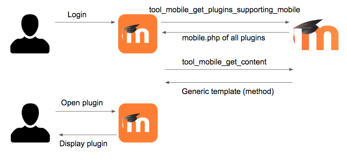

If you want to add mobile support to your Moodle plugin, you can achieve it by extending different areas of the app using **just PHP server side code** and providing templates written with [Ionic](https://ionicframework.com/docs/components) and custom components.

You will have to:

1. Create a `db/mobile.php` file in your plugin. In this file, you will be able to indicate which areas of the app you want to extend. For example, adding a new option in the main menu, implementing support for a new activity module, including a new option in the course menu, including a new option in the user profile, etc. All the areas supported are described further in this document.
2. Create new functions in a reserved namespace that will return the content of the new options. The content should be returned rendered as html. This html should use Ionic components so that it looks native, but it can be generated using mustache templates.

Let's clarify some points:

- You don't need to create new Web Service functions (although you will be able to use them for advanced features). You just need plain php functions that will be placed in a reserved namespace.
- Those functions will be exported via the Web Service function `tool_mobile_get_content`.
- As arguments of your functions you will always receive the `userid`, some relevant details of the app (like the app version or the current language in the app), and some specific data depending on the type of plugin (`courseid`, `cmid`, ...).
- The mobile app also implements a list of custom Ionic components and directives that provide dynamic behaviour; like indicating that you are linking a file that can be downloaded, allowing a transition to new pages into the app calling a specific function in the server, submitting form data to the server, etc.

## Getting started

If you only want to write a plugin, it is not necessary that you set up your environment to work with the Moodle App. In fact, you don't even need to compile it. You can just [use a Chromium-based browser](./setup/app-in-browser) to add mobile support to your plugins!

You can use the app from one of the hosted versions on [latest.apps.moodledemo.net](https://latest.apps.moodledemo.net) (the latest stable version) and [main.apps.moodledemo.net](https://main.apps.moodledemo.net) (the latest development version). If you need any specific environment (hosted versions are deployed with a **production** environment), you can also use [Docker images](./setup/docker-images). And if you need to test your plugin in a native device, you can always use [Moodle HQ's application](https://download.moodle.org/mobile).

This should suffice for developing plugins. However, if you are working on advanced functionality and you need to run the application from the source code, you can find more information in the [Moodle App Development guide](./development-guide).

### Development workflow

Before getting into the specifics of your plugin, we recommend that you start adding a simple "Hello World" button in the app to see that everything works properly.

Let's say your plugin is called `local_hello`, you can start by adding the following files:

```php title="db/mobile.php"
<?php

$addons = [
    'local_hello' => [
        'handlers' => [
            'hello' => [
                'delegate' => 'CoreMainMenuDelegate',
                'method' => 'view_hello',
                'displaydata' => [
                    'title' => 'hello',
                    'icon' => 'earth',
                ],
            ],
        ],
        'lang' => [
            ['hello', 'local_hello'],
        ],
    ],
];
```

```php title="classes/output/mobile.php"
<?php

namespace local_hello\output;

defined('MOODLE_INTERNAL') || die();

class mobile {

    public static function view_hello() {
        return [
            'templates' => [
                [
                    'id' => 'main',
                    'html' => '<h1 class="text-center">{{ "plugin.local_hello.hello" | translate }}</h1>',
                ],
            ],
        ];
    }

}
```

```php title="lang/en/local_hello.php"
<?php

$string['hello'] = 'Hello World';
```

Once you've done that, try logging into your site in the app and you should see a new button in the main menu or more menu (depending on the device) saying "Hello World". If you press this button, you should see a page saying "Hello World!".

Congratulations, you have written your first Moodle plugin with moodle support!

You can read the rest of this page to learn more about mobile plugins and start working on your plugin. Here's some things to keep in mind:

- If you change the `mobile.php` file, you will have to refresh the browser. And remember to [disable the network cache](https://developer.chrome.com/docs/devtools/network/reference/#disable-cache).
- If you change an existing template or function, you won't have to refresh the browser. In most cases, doing a PTR (Pull To Refresh) in the page that displays the template will suffice.
- If any of these doesn't show your changes, you may need to [purge all caches](https://docs.moodle.org/en/Developer_tools#Purge_all_caches) to avoid problems with the auto-loading cache.
- Ultimately, if that doesn't work either, you may have to log out from the site and log in again. If any changes affect plugin installation, you may also need to increase the version in your plugin's `version.php` file and upgrade it in the site.

## Types of plugins

There are 3 types of plugins:

### Templates generated and downloaded when the user opens the plugins

With this type of plugin, the template of your plugin will be generated and downloaded when the user opens the plugin in the app. This means that your function will receive some context parameters. For example, if you're developing a course module plugin you will receive the `courseid` and the `cmid` (course module ID). You can see the list of delegates that support this type of plugin in the [Delegates](#delegates) section.


### Templates downloaded on login and rendered using JS data

With this type of plugin, the template for your plugin will be downloaded when the user logs in into the app and will be stored in the device. This means that your function will not receive any context parameters, and you need to return a generic template that will be built with JS data like the ones in the Moodle App. When the user opens a page that includes your plugin, your template will receive the required JS data and your template will be rendered. You can see the list of delegates that support this type of plugin in the [Delegates](#delegates) section.



### Pure JavaScript plugins

You can always implement the whole plugin yourself using JavaScript instead of using our API. In fact, this is required if you want to implement some features like capturing links in the Mobile app. You can see the list of delegates that only support this type of plugin in the [Delegates](#delegates) section.

## Step by step example

In this example, we are going to update an existing plugin, the [Certificate activity module](https://github.com/mdjnelson/moodle-mod_certificate), that previously used a [Remote add-on](https://docs.moodle.org/dev/Moodle_Mobile_2_(Ionic_1)_Remote_add-ons) (a legacy approach to implement mobile plugins).

This is a simple activity module that displays the certificate issued for the current user along with the list of the dates of previously issued certificates. It also stores in the course log that the user viewed a certificate. This module also works offline: when the user downloads the course or activity, the data is pre-fetched and can be viewed offline.

### Step 1. Update the `db/mobile.php` file

In this case, we are updating an existing file. For new plugins, you should create this new file.

```php title="db/mobile.php"
$addons = [
    'mod_certificate' => [ // Plugin identifier
        'handlers' => [ // Different places where the plugin will display content.
            'coursecertificate' => [ // Handler unique name (alphanumeric).
                'displaydata' => [
                    'icon' => $CFG->wwwroot . '/mod/certificate/pix/icon.gif',
                    'class' => '',
                ],

                'delegate' => 'CoreCourseModuleDelegate', // Delegate (where to display the link to the plugin)
                'method' => 'mobile_course_view', // Main function in \mod_certificate\output\mobile
                'offlinefunctions' => [
                    'mobile_course_view' => [],
                    'mobile_issues_view' => [],
                ], // Function that needs to be downloaded for offline.
            ],
        ],
        'lang' => [ // Language strings that are used in all the handlers.
            ['pluginname', 'certificate'],
            ['summaryofattempts', 'certificate'],
            ['getcertificate', 'certificate'],
            ['requiredtimenotmet', 'certificate'],
            ['viewcertificateviews', 'certificate'],
        ],
    ],
];
```

**Plugin identifier**

A unique name for the plugin, it can be anything (there's no need to match the module name).

**Handlers (Different places where the plugin will display content)**

A plugin can be displayed in different views in the app. Each view should have a unique name inside the plugin scope (alphanumeric).

**Display data**

This is only needed for certain types of plugins. Also, depending on the type of delegate it may require additional (or less fields). In this case, we are indicating the module icon.

**Delegate**

Where to display the link to the plugin, see the [Delegates](#delegates) section for all the possible options.

**Method**

This is the method in the Moodle `{component-name}\output\mobile` class to be executed the first time the user clicks in the new option displayed in the app.

**Offline functions**

This is the list of functions that need to be called and stored when the user downloads a course for offline usage. Please note that you can add functions here that are not even listed in the `mobile.php` file.

In our example, downloading for offline access will mean that we'll execute the functions for getting the certificate and issued certificates passing as parameters the current `userid` (and `courseid` when we are using the mod or course delegate). If we have the result of those functions stored in the app, we'll be able to display the certificate information even if the user is offline.

Offline functions will be mostly used to display information for final users, any further interaction with the view won't be supported offline (for example, trying to send information when the user is offline).

You can indicate here other Web Services functions, indicating the parameters that they might need from a defined subset (currently `userid` and `courseid`).

Prefetching the module will also download all the files returned by the methods in these offline functions (in the `files` array).

Note that if your functions use additional custom parameters (for example, if you implement multiple pages within a module's view function by using a `page` parameter in addition to the usual `cmid`, `courseid`, and `userid`) then the app will not know which additional parameters to supply. In this case, do not list the function in `offlinefunctions`; instead, you will need to manually implement a [module prefetch handler](#module-prefetch-handler).

**Lang**

The language pack string ids used in the plugin by all the handlers. Normally these will be strings from your own plugin, however, you can list any strings you need here, like `['cancel', 'moodle']`. If you do this, be warned that in the app you will then need to refer to that string as `{{ 'plugin.myplugin.cancel' | translate }}` (not `{{ 'plugin.moodle.cancel' | translate }}`).

Please only include the strings you actually need. The Web Service that returns the plugin information will include the translation of each string id for every language installed in the platform, and this will then be cached, so listing too many strings is very wasteful.

There are additional attributes supported by the `mobile.php` list, you can find about them in the [Mobile.php supported options](#mobilephp-supported-options) section.

### Step 2. Creating the main function

The main function displays the current issued certificate (or several warnings if it's not possible to issue a certificate). It also displays a link to view the dates of previously issued certificates.

All the functions must be created in the plugin or subsystem `classes/output` directory, the name of the class must be `mobile`.

For this example, the namespace name will be `mod_certificate\output`.

```php title="mod/certificate/classes/output/mobile.php"
<?php

namespace mod_certificate\output;

use context_module;
use mod_certificate_external;

class mobile {

    /**
     * Returns the certificate course view for the mobile app.
     *
     * @param  array $args Arguments from tool_mobile_get_content WS.
     *
     * @return array       HTML, JS and other data.
     */
    public static function mobile_course_view($args) {
        global $OUTPUT, $USER, $DB;

        $args = (object) $args;
        $cm = get_coursemodule_from_id('certificate', $args->cmid);

        // Capabilities check.
        require_login($args->courseid, false, $cm, true, true);

        $context = \context_module::instance($cm->id);

        require_capability('mod/certificate:view', $context);
        if ($args->userid != $USER->id) {
            require_capability('mod/certificate:manage', $context);
        }
        $certificate = $DB->get_record('certificate', ['id' => $cm->instance]);

        // Get certificates from external (taking care of exceptions).
        try {
            $issued = \mod_certificate_external::issue_certificate($cm->instance);
            $certificates = \mod_certificate_external::get_issued_certificates($cm->instance);
            $issues = array_values($certificates['issues']); // Make it mustache compatible.
        } catch (Exception $e) {
            $issues = [];
        }

        // Set timemodified for each certificate.
        foreach ($issues as $issue) {
            if (empty($issue->timemodified)) {
                $issue->timemodified = $issue->timecreated;
            }
        }

        $showget = true;
        if ($certificate->requiredtime && !has_capability('mod/certificate:manage', $context)) {
            if (certificate_get_course_time($certificate->course) < ($certificate->requiredtime * 60)) {
                $showget = false;
            }
        }

        $certificate->name = format_string($certificate->name);
        [$certificate->intro, $certificate->introformat] =
                external_format_text($certificate->intro, $certificate->introformat, $context->id, 'mod_certificate', 'intro');
        $data = [
            'certificate' => $certificate,
            'showget' => $showget && count($issues) > 0,
            'issues' => $issues,
            'issue' => $issues[0],
            'numissues' => count($issues),
            'cmid' => $cm->id,
            'courseid' => $args->courseid,
        ];

        return [
            'templates' => [
                [
                    'id' => 'main',
                    'html' => $OUTPUT->render_from_template('mod_certificate/mobile_view_page', $data),
                ],
            ],
            'javascript' => '',
            'otherdata' => '',
            'files' => $issues,
        ];
    }
}
```

**Function declaration**

The function name is the same as the one used in the `mobile.php` file (`method` field). There is only one argument, `$args`, which is an array containing all the information sent by the mobile app (the `courseid`, `userid`, `appid`, `appversionname`, `appversioncode`, `applang`, `appcustomurlscheme`, ...).

**Function implementation**

In the first part of the function, we check permissions and capabilities (like a `view.php` script would do normally). Then we retrieve the certificate information that's necessary to display the template.

**Function return**

- `templates` — The rendered template (notice that we could return more than one template, but we usually would only need one). By default the app will always render the first template received, the rest of the templates can be used if the plugin defines some JavaScript code.
- `javascript` — Empty, because we don't need any in this case.
- `otherdata` — Empty as well, because we don't need any additional data to be used by directives or components in the template. This field will be published as an object supporting 2-way data-binding in the template.
- `files` — A list of files that the app should be able to download (for offline usage mostly).

### Step 3. Creating the template for the main function

This is the most important part of your plugin because it contains the code that will be rendered on the mobile app.

In this template we'll be using Ionic, together with directives and components specific to the Moodle App.

All the HTML elements starting with `ion-` are ionic components. Most of the time, the component name is self-explanatory but you may refer to a detailed guide here: <https://ionicframework.com/docs/components/>

All the HTML elements starting with `core-` are custom components of the Moodle App.

```html title="mod/certificate/templates/mobile_view_page.mustache"
{{=<% %>=}}
<div>
    <core-course-module-description description="<% certificate.intro %>" component="mod_certificate" componentId="<% cmid %>">
    </core-course-module-description>

    <ion-list>
        <ion-list-header>
            <p class="item-heading">{{ 'plugin.mod_certificate.summaryofattempts' | translate }}</p>
        </ion-list-header>

        <%#issues%>
            <ion-item>
                <ion-label><ion-button expand="block" color="light" core-site-plugins-new-content title="<% certificate.name %>"
                        component="mod_certificate" method="mobile_issues_view"
                        [args]="{cmid: <% cmid %>, courseid: <% courseid %>}">
                    {{ 'plugin.mod_certificate.viewcertificateviews' | translate: {$a: <% numissues %>} }}
                </ion-button></ion-label>
            </ion-item>
        <%/issues%>

        <%#showget%>
            <ion-item>
                <ion-label>
                    <ion-button expand="block" core-course-download-module-main-file moduleId="<% cmid %>"
                        courseId="<% certificate.course %>" component="mod_certificate"
                        [files]="[{
                            fileurl: '<% issue.fileurl %>',
                            filename: '<% issue.filename %>',
                            timemodified: '<% issue.timemodified %>', mimetype: '<% issue.mimetype %>',
                        }]">

                        <ion-icon name="cloud-download" slot="start"></ion-icon>
                            {{ 'plugin.mod_certificate.getcertificate' | translate }}
                    </ion-button>
                </ion-label>
            </ion-item>
        <%/showget%>

        <%^showget%>
            <ion-item>
                <ion-label><p>{{ 'plugin.mod_certificate.requiredtimenotmet' | translate }}</p></ion-label>
            </ion-item>
        <%/showget%>

        <!-- Call log WS when the template is loaded. -->
        <span core-site-plugins-call-ws-on-load name="mod_certificate_view_certificate"
                [params]="{certificateid: <% certificate.id %>}" [preSets]="{getFromCache: 0, saveToCache: 0}">
        </span>
    </ion-list>
</div>
```

In the first line of the template we switch delimiters to avoid conflicting with Ionic delimiters (that are curly brackets like mustache).

Then we display the module description using `core-course-module-description`, which is a component used to include the course module description.

For displaying the certificate information we create a list of elements, adding a header on top.

The following line using the `translate` filter indicates that the app will translate the `summaryofattempts` string id (here we could've used mustache translation but it is usually better to delegate the strings translations to the app). The string id has the following format:

```text
plugin.{plugin-identifier}.{string-id}
```

Where `{plugin-identifier}` is taken from `mobile.php` and `{string-id}` must be indicated in the `lang` field in `mobile.php`.

Then, we display a button to transition to another page if there are certificates issued. The attribute (directive) `core-site-plugins-new-content` indicates that if the user clicks the button, we need to call the `mobile_issues_view` function in the `mod_certificate` component; passing as arguments the `cmid` and `courseid`. The content returned by this function will be displayed in a new page (read the following section to see the code of this new page).

Just after this button, we display another one but this time for downloading an issued certificate. The `core-course-download-module-main-file` directive indicates that clicking this button is for downloading the whole activity and opening the main file. This means that, when the user clicks this button, the whole certificate activity will be available offline.

Finally, just before the `ion-list` is closed, we use the `core-site-plugins-call-ws-on-load` directive to indicate that once the page is loaded, we need to call a Web Service function in the server, in this case we are calling the `mod_certificate_view_certificate` that will log that the user viewed this page.

As you can see, no JavaScript was necessary at all. We used plain HTML elements and attributes that did all the complex dynamic logic (like calling a Web Service) behind the scenes.

### Step 4. Adding an additional page

Add the following method to `mod/certificate/classes/output/mobile.php`:

```php title="mod/certificate/classes/output/mobile.php"
/**
 * Returns the certificate issues view for the mobile app.
 * @param  array $args Arguments from tool_mobile_get_content WS.
 *
 * @return array       HTML, JS and other data.
 */
public static function mobile_issues_view($args) {
    global $OUTPUT, $USER, $DB;

    $args = (object) $args;
    $cm = get_coursemodule_from_id('certificate', $args->cmid);

    // Capabilities check.
    require_login($args->courseid, false, $cm, true, true);

    $context = context_module::instance($cm->id);

    require_capability ('mod/certificate:view', $context);
    if ($args->userid != $USER->id) {
        require_capability('mod/certificate:manage', $context);
    }
    $certificate = $DB->get_record('certificate', ['id' => $cm->instance]);

    // Get certificates from external (taking care of exceptions).
    try {
        $issued = mod_certificate_external::issue_certificate($cm->instance);
        $certificates = mod_certificate_external::get_issued_certificates($cm->instance);
        $issues = array_values($certificates['issues']); // Make it mustache compatible.
    } catch (Exception $e) {
        $issues = [];
    }

    $data = ['issues' => $issues];

    return [
        'templates' => [
            [
                'id' => 'main',
                'html' => $OUTPUT->render_from_template('mod_certificate/mobile_view_issues', $data),
            ],
        ],
        'javascript' => '',
        'otherdata' => '',
    ];
}
```

This method for the new page was added just after `mobile_course_view`, the code is quite similar: checks the capabilities, retrieves the information required for the template, and returns the template rendered.

The code of the mustache template is also very simple.

```html handlebars title="mod/certificate/templates/mobile_view_issues.mustache"
{{=<% %>=}}
<div>
    <ion-list>
        <%#issues%>
            <ion-item>
                <ion-label>
                    <p class="item-heading">{{ <%timecreated%> | coreToLocaleString }}</p>
                    <p><%grade%></p>
                </ion-label>
            </ion-item>
        <%/issues%>
    </ion-list>
</div>
```

As we did in the previous template, in the first line of the template we switch delimiters to avoid conflicting with Ionic delimiters (that are curly brackets like mustache).

Here we are creating an Ionic list that will display a new item in the list per each issued certificated.

For the issued certificated we'll display the time when it was created (using the app filter `coreToLocaleString`). We are also displaying the grade displayed in the certificate (if any).

### Step 5. Plugin webservices, if included

If your plugin uses its own web services, they will also need to be enabled for mobile access in your `db/services.php` file.

The following line should be included in each webservice definition:

```php title="db/services.php"
'services' => [MOODLE_OFFICIAL_MOBILE_SERVICE, 'local_mobile'],
```

```php title="mod/certificate/db/services.php"
<?php

$functions = [
    'mod_certificate_get_certificates_by_courses' => [
        'classname'     => 'mod_certificate_external',
        'methodname'    => 'get_certificates_by_courses',
        'description'   => 'Returns a list of certificate instances...',
        'type'          => 'read',
        'capabilities'  => 'mod/certificate:view',
        'services'      => [MOODLE_OFFICIAL_MOBILE_SERVICE, 'local_mobile'],
    ],
];
```

## Mobile.php supported options

In the previous section, we learned about some of the existing options for handlers configuration. This is the full list of supported options.

### Common options

- `delegate` (mandatory) — Name of the delegate to register the handler in.
- `method` (mandatory) — The method to call to retrieve the main page content.
- `init` (optional) — A method to call to retrieve the initialisation JS and the restrictions to apply to the whole handler. It can also return templates that can be used from JavaScript. You can learn more about this in the [Initialisation](#initialisation) section.
- `restricttocurrentuser` (optional) — Only used if the delegate has a `isEnabledForUser` function. If true, the handler will only be shown for the current user. For more info about displaying the plugin only for certain users, please see [Display the plugin only if certain conditions are met](#display-the-plugin-only-if-certain-conditions-are-met).
- `restricttoenrolledcourses` (optional) — Only used if the delegate has a `isEnabledForCourse` function. If true or not defined, the handler will only be shown for courses the user is enrolled in. For more info about displaying the plugin only for certain courses, please see [Display the plugin only if certain conditions are met](#display-the-plugin-only-if-certain-conditions-are-met).
- `styles` (optional) — An array with two properties: `url` and `version`. The URL should point to a CSS file, either using an absolute URL or a relative URL. This file will be downloaded and applied by the app. It's recommended to include styles that will only affect your plugin templates. The version number is used to determine if the file needs to be downloaded again, you should change the version number every time you change the CSS file.
- `moodlecomponent` (optional) — If your plugin supports a component in the app different than the one defined by your plugin, you can use this property to specify it. For example, you can create a local plugin to support a certain course format, activity, etc. The component of your plugin in Moodle would be `local_whatever`, but in `moodlecomponent` you can specify that this handler will implement `format_whatever` or `mod_whatever`. This property was introduced in the version 3.6.1 of the app.

### Options only for CoreMainMenuDelegate

- `displaydata` (mandatory):
  - `title` — A language string identifier that was included in the `lang` section.
  - `icon` — The name of an ionic icon. [See icons section](#using-font-icons-with-ion-icon).
  - `class` — A CSS class.
- `priority` (optional) — Priority of the handler. Higher priority is displayed first. Main Menu plugins are always displayed in the More tab, they cannot be displayed as tabs in the bottom bar.
- `ptrenabled` (optional) — Whether to enable pull-to-refresh gesture to refresh page content.

### Options only for CoreMainMenuHomeDelegate

- `displaydata` (mandatory):
  - `title` — A language string identifier that was included in the `lang` section.
  - `class` — A CSS class.
- `priority` (optional) — Priority of the handler. Higher priority is displayed first.
- `ptrenabled` (optional) — Whether to enable pull-to-refresh gesture to refresh page content.

### Options only for CoreCourseOptionsDelegate

- `displaydata` (mandatory):
  - `title` — A language string identifier that was included in the `lang` section.
  - `class` — A CSS class.
- `priority` (optional) — Priority of the handler. Higher priority is displayed first.
- `ismenuhandler` (optional) — Supported from the 3.7.1 version of the app. Set it to `true` if you want your plugin to be displayed in the contextual menu of the course instead of in the top tabs. The contextual menu is displayed when you click in the 3-dots button at the top right of the course.
- `ptrenabled` (optional) — Whether to enable pull-to-refresh gesture to refresh page content.

### Options only for CoreCourseModuleDelegate

- `displaydata` (mandatory):
  - `icon` — Path to the module icon. After Moodle app 4.0, this icon is only used as a fallback, the app will always try to use the theme icon so themes can override icons in the app.
  - `class` — A CSS class.
- `method` (optional) — The function to call to retrieve the main page content. In this delegate the method is optional. If the method is not set, the module won't be clickable.
- `offlinefunctions` (optional) — List of functions to call when prefetching the module. It can be a `get_content` method or a WS. You can filter the params received by the WS. By default, WS will receive these params: `courseid`, `cmid`, `userid`. Other valid values that will be added if they are present in the list of params: `courseids` (it will receive a list with the courses the user is enrolled in), `{component}id` (For example, `certificateid`).
- `downloadbutton` (optional) — Whether to display download button in the module. If not defined, the button will be shown if there is any `offlinefunctions`.
- `isresource` (optional) — Whether the module is a resource or an activity. Only used if there is any offline function. If your module relies on the `contents` field, then it should be `true`.
- `updatesnames` (optional) — Only used if there is any offline function. A regular expression to check if there's any update in the module. It will be compared to the result of `core_course_check_updates`.
- `displayopeninbrowser` (optional) — Whether the module should display the "Open in browser" option in the top-right menu. This can be done in JavaScript too: `this.displayOpenInBrowser = false;`. Supported from the 3.6 version of the app.
- `displaydescription` (optional) — Whether the module should display the "Description" option in the top-right menu. This can be done in JavaScript too: `this.displayDescription = false;`. Supported from the 3.6 version of the app.
- `displayrefresh` (optional) — Whether the module should display the "Refresh" option in the top-right menu. This can be done in JavaScript too: `this.displayRefresh = false;`. Supported from the 3.6 version of the app.
- `displayprefetch` (optional) — Whether the module should display the download option in the top-right menu. This can be done in JavaScript too: `this.displayPrefetch = false;`. Supported from the 3.6 version of the app.
- `displaysize` (optional) — Whether the module should display the downloaded size in the top-right menu. This can be done in JavaScript too: `this.displaySize = false;`. Supported from the 3.6 version of the app.
- `supportedfeatures` (optional) — It can be used to specify the supported features of the plugin. Currently the app only uses `FEATURE_MOD_ARCHETYPE` and `FEATURE_NO_VIEW_LINK`. It should be an array with features as keys (For example, `FEATURE_NO_VIEW_LINK => true`). If you need to calculate this dynamically please see [Module plugins: dynamically determine if a feature is supported](#module-plugins-dynamically-determine-if-a-feature-is-supported). Supported from the 3.6 version of the app.
- `coursepagemethod` (optional) — If set, this method will be called when the course is rendered and the HTML returned will be displayed in the course page for the module. Please notice the HTML returned should not contain directives or components, only default HTML. Supported from the 3.8 version of the app.
- `ptrenabled` (optional) — Whether to enable pull-to-refresh gesture to refresh page content.

### Options only for CoreCourseFormatDelegate

- `canviewallsections` (optional) — Whether the course format allows seeing all sections in a single page. Defaults to `true`.
- `displayenabledownload` (optional) — Deprecated in the 4.0 app, it's no longer used.
- `displaysectionselector` (optional) — Deprecated in the 4.0 app, use `displaycourseindex` instead.
- `displaycourseindex` (optional) — Whether the default course index should be displayed. Defaults to `true`.

### Options only for CoreUserDelegate

- `displaydata` (mandatory):
  - `title` — A language string identifier that was included in the `lang` section.
  - `icon` — The name of an ionic icon. [See icons section](#using-font-icons-with-ion-icon).
  - `class` — A CSS class.
- `type` — The type of the addon. The values accepted are `'newpage'` (default) and `'communication'`.
- `priority` (optional) — Priority of the handler. Higher priority is displayed first.
- `ptrenabled` (optional) — Whether to enable pull-to-refresh gesture to refresh page content.

### Options only for CoreSettingsDelegate

- `displaydata` (mandatory):
  - `title` — A language string identifier that was included in the `lang` section.
  - `icon` — The name of an ionic icon. [See icons section](#using-font-icons-with-ion-icon).
  - `class` — A CSS class.
- `priority` (optional) — Priority of the handler. Higher priority is displayed first.
- `ptrenabled` (optional) — Whether to enable pull-to-refresh gesture to refresh page content.

### Options only for AddonMessageOutputDelegate

- `displaydata` (mandatory):
  - `title` — A language string identifier that was included in the `lang` section.
  - `icon` — The name of an ionic icon. [See icons section](#using-font-icons-with-ion-icon).
- `priority` (optional) — Priority of the handler. Higher priority is displayed first.
- `ptrenabled` (optional) — Whether to enable pull-to-refresh gesture to refresh page content.

### Options only for CoreBlockDelegate

- `displaydata` (optional):
  - `title` — A language string identifier that was included in the `lang` section. If this is not supplied, it will default to `'plugins.block\_{block-name}.pluginname'`, where `{block-name}` is the name of the block.
  - `class` — A CSS class. If this is not supplied, it will default to `block\_{block-name}`, where `{block-name}` is the name of the block.
  - `type` — Possible values are:
    - `"title"` — Your block will only display the block title, and when it's clicked it will open a new page to display the block contents (the template returned by the block's method).
    - `"prerendered"` — Your block will display the content and footer returned by the WebService to get the blocks (for example, `core_block_get_course_blocks`), so your block's method will never be called.
    - Any other value — Your block will immediately call the method specified in `mobile.php` and it will use the template to render the block.
- `fallback` (optional) — This option allows you to specify a block to use in the app instead of your block. For example, you can make the app display the "My overview" block instead of your block in the app by setting `'fallback' => 'myoverview'`. The fallback will only be used if you don't specify a `method` and the `type` is different to `'title'` or `'prerendered'`. Supported from the 3.9.0 version of the app.

## Delegates

Delegates can be classified by type of plugin. For more info about type of plugins, please see the [Types of plugins](#types-of-plugins) section.

### Templates generated and downloaded when the user opens the plugins

#### `CoreMainMenuDelegate`

You must use this delegate when you want to add new items to the main menu (currently displayed at the bottom of the app).

#### `CoreMainMenuHomeDelegate`

You must use this delegate when you want to add new tabs in the home page (by default the app is displaying the "Dashboard" and "Site home" tabs).

#### `CoreCourseOptionsDelegate`

You must use this delegate when you want to add new options in a course (Participants or Grades are examples of this type of delegate).

#### `CoreCourseModuleDelegate`

You must use this delegate for supporting activity modules or resources.

#### `CoreUserDelegate`

You must use this delegate when you want to add additional options in the user profile page in the app.

#### `CoreCourseFormatDelegate`

You must use this delegate for supporting course formats. When you open a course from the course list in the mobile app, it will check if there is a `CoreCourseFormatDelegate` handler for the format that site uses. If so, it will display the course using that handler. Otherwise, it will use the default app course format.

You can learn more about this at the [Creating mobile course formats](./plugins-development-guide/examples/create-course-formats) page.

#### `CoreSettingsDelegate`

You must use this delegate to add a new option in the settings page.

#### `AddonMessageOutputDelegate`

You must use this delegate to support a message output plugin.

#### `CoreBlockDelegate`

You must use this delegate to support a block. For example, blocks can be displayed in Site Home, Dashboard and the Course page.

### Templates downloaded on login and rendered using JS data

#### `CoreQuestionDelegate`

You must use this delegate for supporting question types.

You can learn more about this at the [Creating mobile question types](https://docs.moodle.org/dev/Creating_mobile_question_types) page.

#### `CoreQuestionBehaviourDelegate`

You must use this delegate for supporting question behaviours.

#### `CoreUserProfileFieldDelegate`

You must use this delegate for supporting user profile fields.

#### `AddonModQuizAccessRuleDelegate`

You must use this delegate to support a quiz access rule.

#### `AddonModAssignSubmissionDelegate` and `AddonModAssignFeedbackDelegate`

You must use these delegates to support assign submission or feedback plugins.

#### `AddonWorkshopAssessmentStrategyDelegate`

You must use this delegate to support a workshop assessment strategy plugin.

### Pure JavaScript plugins

These delegates require JavaScript to be supported. See [Initialisation](#initialisation) for more information.

- `CoreContentLinksDelegate`
- `CoreCourseModulePrefetchDelegate`
- `CoreFileUploaderDelegate`
- `CorePluginFileDelegate`
- `CoreFilterDelegate`

## Available components and directives

### Difference between components and directives

A directive is usually represented as an HTML attribute, allows you to extend a piece of HTML with additional information or functionality. Example of directives are: `core-auto-focus`, `\*ngIf`, and `ng-repeat`.

Components are also directives, but they are usually represented as an HTML tag and they are used to add custom elements to the app. Example of components are `ion-list`, `ion-item`, and `core-search-box`.

Components and directives are Angular concepts; you can learn more about them and the components come out of the box with Ionic in the following links:

- [Angular directives documentation](https://angular.io/guide/built-in-directives)
- [Ionic components](https://ionicframework.com/docs/components)

### Custom core components and directives

These are some useful custom components and directives that are only available in the Moodle App. Please note that this isn't the full list of custom components and directives, it's just an extract of the most common ones.

You can find a full list of components and directives in the source code of the app, within [`src/core/components`](https://github.com/moodlehq/moodleapp/tree/latest/src/core/components) and [`src/core/directives`](https://github.com/moodlehq/moodleapp/tree/latest/src/core/directives).

#### `core-format-text`

This directive formats the text and adds some directives needed for the app to work as it should. For example, it treats all links and all the embedded media so they work fine in the app. If some content in your template includes links or embedded media, please use this directive.

This directive automatically applies `core-external-content` and `core-link` to all the links and embedded media.

Data that can be passed to the directive:

- `text` (string) — The text to format.
- `siteId` (string) — Optional. Site ID to use. If not defined, it will use the id of the current site.
- `component` (string) — Optional. Component to use when downloading embedded files.
- `componentId` (string|number) — Optional. ID to use in conjunction with the component.
- `adaptImg` (boolean) — Optional, defaults to `true`. Whether to adapt images to screen width.
- `clean` (boolean) — Optional, defaults to `false`. Whether all HTML tags should be removed.
- `singleLine` (boolean) — Optional, defaults to `false`. Whether new lines should be removed to display all the text in single line. Only if `clean` is `true`.
- `maxHeight` (number) — Optional. Max height in pixels to render the content box. The minimum accepted value is 50. Using this parameter will force `display: block` to calculate the height better. If you want to avoid this, use `class="inline"` at the same time to use `display: inline-block`.

```html ng2 title="Example of usage"
<core-format-text text="<% cm.description %>" component="mod_certificate" componentId="<% cm.id %>"></core-format-text>
```

#### `core-link`

Directive to handle a link. It performs several checks, like checking if the link needs to be opened in the app, and opens the link as it should (without overriding the app).

This directive is automatically applied to all the links and media inside `core-format-text`.

Data that can be passed to the directive:

- `capture` (boolean) — Optional, defaults to `false`. Whether the link needs to be captured by the app (check if the link can be handled by the app instead of opening it in a browser).
- `inApp` (boolean) — Optional, defaults to `false`. Whether to open in an embedded browser within the app or in the system browser.
- `autoLogin` (string) — Optional, defaults to `"check"`. If the link should be open with auto-login. Accepts the following values:
  - `"yes"` — Always auto-login.
  - `"no"` — Never auto-login.
  - `"check"` — Auto-login only if it points to the current site.

```html ng2 title="Example of usage"
<a href="<% cm.url %>" core-link>
```

#### `core-external-content`

Directive to handle links to files and embedded files. This directive should be used in any link to a file or any embedded file that you want to have available when the app is offline.

If a file is downloaded, its URL will be replaced by the local file URL.

This directive is automatically applied to all the links and media inside `core-format-text`.

Data that can be passed to the directive:

- `siteId` (string) — Optional. Site ID to use. If not defined, it will use the id of the current site.
- `component` (string) — Optional. Component to use when downloading embedded files.
- `componentId` (string|number) — Optional. ID to use in conjunction with the component.

```html ng2 title="Example of usage"
" core-external-content component="mod_certificate" componentId="<% event.id %>">
```

#### `core-user-link`

Directive to go to user profile on click. When the user clicks the element where this directive is attached, the right user profile will be opened.

Data that can be passed to the directive:

- `userId` (number) — User id to open the profile.
- `courseId` (number) — Optional. Course id to show the user info related to that course.

```html ng2 title="Example of usage"
<a ion-item core-user-link userId="<% userid %>">
```

#### `core-file`

Component to handle a remote file. It shows the file name, icon (depending on mime type) and a button to download or refresh it. The user can identify if the file is downloaded or not based on the button.

Data that can be passed to the directive:

- `file` (object) — The file. Must have a `filename` property and either `fileurl` or `url`.
- `component` (string) — Optional. Component the file belongs to.
- `componentId` (string|number) — Optional. ID to use in conjunction with the component.
- `canDelete` (boolean) — Optional. Whether the file can be deleted.
- `alwaysDownload` (boolean) — Optional. Whether it should always display the refresh button when the file is downloaded. Use it for files that you cannot determine if they're outdated or not.
- `canDownload` (boolean) — Optional, defaults to `true`. Whether file can be downloaded.

```html ng2 title="Example of usage"
<core-file
        [file]="{
            fileurl: '<% issue.url %>',
            filename: '<% issue.name %>',
            timemodified: '<% issue.timemodified %>',
            filesize: '<% issue.size %>'
        }"
        component="mod_certificate"
        componentId="<% cm.id %>">
</core-file>
```

#### `core-download-file`

Directive to allow downloading and opening a file. When the item with this directive is clicked, the file will be downloaded (if needed) and opened.

It is usually recommended to use the `core-file` component since it also displays the state of the file.

Data that can be passed to the directive:

- `core-download-file` (object) — The file to download.
- `component` (string) — Optional. Component to link the file to.
- `componentId` (string|number) — Optional. Component ID to use in conjunction with the component.

```html ng2 title="Example of usage (a button to download a file)"
<ion-button
        [core-download-file]="{
            fileurl: <% issue.url %>,
            timemodified: <% issue.timemodified %>,
            filesize: <% issue.size %>
        }"
        component="mod_certificate"
        componentId="<% cm.id %>">
    {{ 'plugin.mod_certificate.download | translate }}
</ion-button>
```

#### `core-course-download-module-main-file`

Directive to allow downloading and opening the main file of a module.

When the item with this directive is clicked, the whole module will be downloaded (if needed) and its main file opened. This is meant for modules like `mod_resource`.

This directive must receive either a `module` or a `moduleId`. If no files are provided, it will use `module.contents`.

Data that can be passed to the directive:

- `module` (object) — Optional, required if module is not supplied. The module object.
- `moduleId` (number) — Optional, required if module is not supplied. The module ID.
- `courseId` (number) — The course ID the module belongs to.
- `component` (string) — Optional. Component to link the file to.
- `componentId` (string|number) — Optional, defaults to the same value as `moduleId`. Component ID to use in conjunction with the component.
- `files` (object[])— Optional. List of files of the module. If not provided, uses `module.contents`.

```html ng2 title="Example of usage"
<ion-button expand="block" core-course-download-module-main-file moduleId="<% cmid %>"
        courseId="<% certificate.course %>" component="mod_certificate"
        [files]="[{
            fileurl: '<% issue.fileurl %>',
            filename: '<% issue.filename %>',
            timemodified: '<% issue.timemodified %>',
            mimetype: '<% issue.mimetype %>',
        }]">
    {{ 'plugin.mod_certificate.getcertificate' | translate }}
</ion-button>
```

#### `core-navbar-buttons`

Component to add buttons to the app's header without having to place them inside the header itself. Using this component in a site plugin will allow adding buttons to the header of the current page.

If this component indicates a position (start/end), the buttons will only be added if the header has some buttons in that position. If no start/end is specified, then the buttons will be added to the first `<ion-buttons>` found in the header.

You can use the `[hidden]` input to hide all the inner buttons if a certain condition is met.

```html ng2 title="Example of usage"
<core-navbar-buttons slot="end">
    <ion-button (click)="action()">
        <ion-icon slot="icon-only" name="funnel"></ion-icon>
    </ion-button>
</core-navbar-buttons>
```

You can also use this to add options to the context menu, for example:

```html ng2
<core-navbar-buttons>
    <core-context-menu>
        <core-context-menu-item
                [priority]="500" content="Nice boat" (action)="boatFunction()"
                iconAction="boat">
        </core-context-menu-item>
    </core-context-menu>
</core-navbar-buttons>
```

#### Using 'font' icons with `ion-icon`

Font icons are widely used on the app and Moodle LMS website. In order to support [Font Awesome 6.3 icons](https://fontawesome.com/search?o=r&m=free). We've added a directive that uses prefixes on the `name` attribute to use different font icons.

- Name prefixed with `fas-` or `fa-` will use [Font Awesome solid library](https://fontawesome.com/search?o=r&m=free&s=solid).
- Name prefixed with `far-` will use [Font Awesome regular library](https://fontawesome.com/search?o=r&m=free&s=regular).
- Name prefixed with `fab-` will use [Font Awesome brands library](https://fontawesome.com/search?o=r&m=free&f=brands) (But only a few are supported and we discourage to use them).
- Name prefixed with `moodle-` will use some svg icons [imported from Moodle LMS](https://github.com/moodlehq/moodleapp/tree/master/src/assets/fonts/moodle/moodle).
- Name prefixed with `fam-` will use [customized Font Awesome icons](https://github.com/moodlehq/moodleapp/tree/master/src/assets/fonts/moodle/font-awesome).
- If the prefix is not found or not valid, the app will search the icon name on the [Ionicons library](https://ionic.io/ionicons).

```html title="Example of usage to show icon "pizza-slice" from Font Awesome regular library"
<ion-icon name="fas-pizza-slice"></ion-icon>
```

We encourage the use of Font Awesome 6.3 icons to match the appearance from the LMS website version.

### Specific component and directives for plugins

These are component and directives created specifically for supporting Moodle plugins.

#### `core-site-plugins-new-content`

Directive to display a new content when clicked. This new content can be displayed in a new page or in the current page (only if the current page is already displaying a site plugin content).

Data that can be passed to the directive:

- `component` (string) — The component of the new content.
- `method` (string) — The method to get the new content.
- `args` (object) — The params to get the new content.
- `preSets` (object) — Extra options for the WS call of the new content: whether to use cache or not, etc. This field was added in v3.6.0.
- `title` (string) — The title to display with the new content. Only if `samePage` is `false`.
- `samePage` (boolean) — Optional, defaults to `false`. Whether to display the content in same page or open a new one.
- `useOtherData` (any) — Whether to include `otherdata` (from the `get_content` WS call) in the arguments for the new `get_content` call. If not supplied, no other data will be added. If supplied but empty (`null`, `false` or an empty string) all the `otherdata` will be added. If it's an array, it will only copy the properties whose names are in the array. Please notice that doing `[useOtherData]=""` is the same as not supplying it, so nothing will be copied. Also, objects or arrays in `otherdata` will be converted to a JSON encoded string.
- `form` (string) — ID or name to identify a form in the template. The form will be obtained from `document.forms`. If supplied and a form is found, the form data will be retrieved and sent to the new `get_content` WS call. If your form contains an `ion-radio`, `ion-checkbox` or `ion-select`, please see [Values of \`ion-radio\`, \`ion-checkbox\` or \`ion-select\` aren't sent to my WS](#values-of-ion-radio-ion-checkbox-or-ion-select-arent-sent-to-my-ws).

Let's see some examples.

```html ng2 title="A button to go to a new content page"
<ion-button core-site-plugins-new-content
        title="<% certificate.name %>" component="mod_certificate"
        method="mobile_issues_view" [args]="{cmid: <% cmid %>, courseid: <% courseid %>}">
     {{ 'plugin.mod_certificate.viewissued' | translate }}
</ion-button>
```

```html ng2 title="A button to load new content in current page using userid from otherdata"
<ion-button core-site-plugins-new-content
        component="mod_certificate" method="mobile_issues_view"
        [args]="{cmid: <% cmid %>, courseid: <% courseid %>}" samePage="true" [useOtherData]="['userid']">
    {{ 'plugin.mod_certificate.viewissued' | translate }}
</ion-button>
```

#### `core-site-plugins-call-ws`

Directive to call a WS when the element is clicked. The action to do when the WS call is successful depends on the provided data: display a message, go back or refresh current view.

If you want to load a new content when the WS call is done, please see [core-site-plugins-call-ws-new-content](#core-site-plugins-call-ws-new-content).

Data that can be passed to the directive:

- `name` (string) — The name of the WS to call.
- `params` (object) — The params for the WS call.
- `preSets` (object) — Extra options for the WS call: whether to use cache or not, etc.
- `useOtherDataForWS` (any) — Whether to include `otherdata` (from the `get_content` WS call) in the params for the WS call. If not supplied, no other data will be added. If supplied but empty (`null`, `false` or an empty string) all the `otherdata` will be added. If it's an array, it will only copy the properties whose names are in the array.Please notice that `[useOtherDataForWS]=""` is the same as not supplying it, so nothing will be copied. Also, objects or arrays in `otherdata` will be converted to a JSON encoded string.
- `form` (string) — ID or name to identify a form in the template. The form will be obtained from `document.forms`. If supplied and a form is found, the form data will be retrieved and sent to the new `get_content` WS call. If your form contains an `ion-radio`, `ion-checkbox` or `ion-select`, please see [Values of \`ion-radio\`, \`ion-checkbox\` or \`ion-select\` aren't sent to my WS](#values-of-ion-radio-ion-checkbox-or-ion-select-arent-sent-to-my-ws).
- `confirmMessage` (string) — Message to confirm the action when the user clicks the element. If not supplied, no confirmation will be requested. If supplied but empty, "Are you sure?" will be used.
- `showError` (boolean) — Optional, defaults to `true`. Whether to show an error message if the WS call fails. This field was added in 3.5.2.
- `successMessage` (string) — Message to show on success. If not supplied, no message. If supplied but empty, defaults to "Success".
- `goBackOnSuccess` (boolean) — Whether to go back if the WS call is successful.
- `refreshOnSuccess` (boolean) — Whether to refresh the current view if the WS call is successful.
- `onSuccess` (Function) — A function to call when the WS call is successful (HTTP call successful and no exception returned). This field was added in 3.5.2.
- `onError` (Function) — A function to call when the WS call fails (HTTP call fails or an exception is returned). This field was added in 3.5.2.
- `onDone` (Function) — A function to call when the WS call finishes (either success or fail). This field was added in 3.5.2.

Let's see some examples.

```html ng2 title="A button to send some data to the server without using cache, displaying default messages and refreshing on success"
<ion-button core-site-plugins-call-ws
        name="mod_certificate_view_certificate" [params]="{certificateid: <% certificate.id %>}"
        [preSets]="{getFromCache: 0, saveToCache: 0}" confirmMessage successMessage
        refreshOnSuccess="true">
    {{ 'plugin.mod_certificate.senddata' | translate }}
</ion-button>
```

```html ng2 title="A button to send some data to the server using cache without confirming, going back on success and using userid from otherdata"
<ion-button core-site-plugins-call-ws
        name="mod_certificate_view_certificate" [params]="{certificateid: <% certificate.id %>}"
        goBackOnSuccess="true" [useOtherData]="['userid']">
     {{ 'plugin.mod_certificate.senddata' | translate }}
</ion-button>
```

```html ng2 title="Same as the previous example, but implementing custom JS code to run on success"
<ion-button core-site-plugins-call-ws
        name="mod_certificate_view_certificate" [params]="{certificateid: <% certificate.id %>}"
        [useOtherData]="['userid']" (onSuccess)="certificateViewed($event)">
     {{ 'plugin.mod_certificate.senddata' | translate }}
</ion-button>
```

In the JavaScript side, you would do:

```javascript
this.certificateViewed = function(result) {
    // Code to run when the WS call is successful.
};
```

#### `core-site-plugins-call-ws-new-content`

Directive to call a WS when the element is clicked and load a new content passing the WS result as arguments. This new content can be displayed in a new page or in the same page (only if current page is already displaying a site plugin content).

If you don't need to load some new content when done, please see [core-site-plugins-call-ws](#core-site-plugins-call-ws).

- `name` (string) — The name of the WS to call.
- `params` (object) — The parameters for the WS call.
- `preSets` (object) — Extra options for the WS call: whether to use cache or not, etc.
- `useOtherDataForWS` (any) — Whether to include `otherdata` (from the `get_content` WS call) in the params for the WS call. If not supplied, no other data will be added. If supplied but empty (`null`, `false` or an empty string) all the `otherdata` will be added. If it's an array, it will only copy the properties whose names are in the array.  Please notice that `[useOtherDataForWS]=""` is the same as not supplying it, so nothing will be copied. Also, objects or arrays in `otherdata` will be converted to a JSON encoded string.
- `form` (string) — ID or name to identify a form in the template. The form will be obtained from `document.forms`. If supplied and a form is found, the form data will be retrieved and sent to the new `get_content` WS call. If your form contains an `ion-radio`, `ion-checkbox` or `ion-select`, please see [Values of \`ion-radio\`, \`ion-checkbox\` or \`ion-select\` aren't sent to my WS](#values-of-ion-radio-ion-checkbox-or-ion-select-arent-sent-to-my-ws).
- `confirmMessage` (string) — Message to confirm the action when the user clicks the element. If not supplied, no confirmation will be requested. If supplied but empty, "Are you sure?" will be used.
- `showError` (boolean) — Optional, defaults to `true`. Whether to show an error message if the WS call fails. This field was added in 3.5.2.
- `component` (string) — The component of the new content.
- `method` (string) — The method to get the new content.
- `args` (object) — The parameters to get the new content.
- `title` (string) — The title to display with the new content. Only if `samePage` is `false`.
- `samePage` (boolean) — Optional, defaults to `false`. Whether to display the content in the same page or open a new one.
- `useOtherData` (any) — Whether to include `otherdata` (from the `get_content` WS call) in the arguments for the new `get_content` call. The format is the same as in `useOtherDataForWS`.
- `jsData` (any) — JS variables to pass to the new page so they can be used in the template or JS. If `true` is supplied instead of an object, all initial variables from current page will be copied. This field was added in 3.5.2.
- `newContentPreSets` (object) — Extra options for the WS call of the new content: whether to use cache or not, etc. This field was added in 3.6.0.
- `onSuccess` (Function) — A function to call when the WS call is successful (HTTP call successful and no exception returned). This field was added in 3.5.2.
- `onError` (Function) — A function to call when the WS call fails (HTTP call fails or an exception is returned). This field was added in 3.5.2.
- `onDone` (Function) — A function to call when the WS call finishes (either success or fail). This field was added in 3.5.2.

Let's see some examples.

```html ng2 title="A button to get some data from the server without using cache, showing default confirm and displaying a new page"
<ion-button core-site-plugins-call-ws-new-content
        name="mod_certificate_get_issued_certificates" [params]="{certificateid: <% certificate.id %>}"
        [preSets]="{getFromCache: 0, saveToCache: 0}" confirmMessage
        title="<% certificate.name %>" component="mod_certificate"
        method="mobile_issues_view" [args]="{cmid: <% cmid %>, courseid: <% courseid %>}">
    {{ 'plugin.mod_certificate.getissued' | translate }}
</ion-button>
```

```html ng2 title="A button to get some data from the server using cache, without confirm, displaying new content in same page and using userid from otherdata"
<ion-button core-site-plugins-call-ws-new-content
        name="mod_certificate_get_issued_certificates" [params]="{certificateid: <% certificate.id %>}"
        component="mod_certificate" method="mobile_issues_view"
        [args]="{cmid: <% cmid %>, courseid: <% courseid %>}"
        samePage="true" [useOtherData]="['userid']">
    {{ 'plugin.mod_certificate.getissued' | translate }}
</ion-button>
```

```html ng2 title="Same as the previous example, but implementing a custom JS code to run on success"
<ion-button core-site-plugins-call-ws-new-content
        name="mod_certificate_get_issued_certificates" [params]="{certificateid: <% certificate.id %>}"
        component="mod_certificate" method="mobile_issues_view"
        [args]="{cmid: <% cmid %>, courseid: <% courseid %>}"
        samePage="true" [useOtherData]="['userid']" (onSuccess)="callDone($event)">
    {{ 'plugin.mod_certificate.getissued' | translate }}
</ion-button>
```

In the JavaScript side, you would do:

```javascript
this.callDone = function(result) {
    // Code to run when the WS call is successful.
};
```

#### `core-site-plugins-call-ws-on-load`

Directive to call a WS as soon as the template is loaded. This directive is meant for actions to do in the background, like calling logging Web Services.

If you want to call a WS when the user clicks on a certain element, please see [core-site-plugins-call-ws](#core-site-plugins-call-ws).

- `name` (string) — The name of the WS to call.
- `params` (object) — The parameters for the WS call.
- `preSets` (object) — Extra options for the WS call: whether to use cache or not, etc.
- `useOtherDataForWS` (any) — Whether to include `otherdata` (from the `get_content` WS call) in the params for the WS call. If not supplied, no other data will be added. If supplied but empty (`null`, `false` or an empty string) all the `otherdata` will be added. If it's an array, it will only copy the properties whose names are in the array. Please notice that `[useOtherDataForWS]=""` is the same as not supplying it, so nothing will be copied. Also, objects or arrays in `otherdata` will be converted to a JSON encoded string.
- `form` (string) — ID or name to identify a form in the template. The form will be obtained from `document.forms`. If supplied and a form is found, the form data will be retrieved and sent to the new `get_content` WS call. If your form contains an `ion-radio`, `ion-checkbox` or `ion-select`, please see [Values of \`ion-radio\`, \`ion-checkbox\` or \`ion-select\` aren't sent to my WS](#values-of-ion-radio-ion-checkbox-or-ion-select-arent-sent-to-my-ws).
- `onSuccess` (Function) — A function to call when the WS call is successful (HTTP call successful and no exception returned). This field was added in 3.5.2.
- `onError` (Function) — A function to call when the WS call fails (HTTP call fails or an exception is returned). This field was added in 3.5.2.
- `onDone` (Function) — A function to call when the WS call finishes (either success or fail). This field was added in 3.5.2.

```html ng2 title="Example of usage"
<span core-site-plugins-call-ws-on-load
        name="mod_certificate_view_certificate" [params]="{certificateid: <% certificate.id %>}"
        [preSets]="{getFromCache: 0, saveToCache: 0}" (onSuccess)="callDone($event)">
</span>
```

In the JavaScript side, you would do:

```javascript
this.callDone = function(result) {
    // Code to run when the WS call is successful.
};
```

## Advanced features

### Display the plugin only if certain conditions are met

You might want to display your plugin in the mobile app only if certain dynamic conditions are met, so the plugin would be displayed only for some users. This can be achieved using the initialisation method (for more info, please see the [Initialisation](#initialisation) section ahead)

All initialisation methods are called as soon as your plugin is retrieved. If you don't want your plugin to be displayed for the current user, then you should return the following in the initialisation method (only for Moodle site 3.8 and onwards):

```php
return ['disabled' => true];
```

If the Moodle site is older than 3.8, then the initialisation method should return this instead:

```php
return ['javascript' => 'this.HANDLER_DISABLED'];
```

On the other hand, you might want to display a plugin only for certain courses (`CoreCourseOptionsDelegate`) or only if the user is viewing certain users' profiles (`CoreUserDelegate`). This can be achieved with the initialisation method too.

In the initialisation method you can return a `restrict` property with two fields in it: `courses` and `users`. If you return a list of courses IDs in this property, then your plugin will only be displayed when the user views any of those courses. In the same way, if you return a list of user IDs then your plugin will only be displayed when the user views any of those users' profiles.

### Using `otherdata`

The values returned by the functions in `otherdata` are added to a variable so they can be used both in JavaScript and in templates. The `otherdata` returned by an initialisation call is added to a variable named `INIT_OTHERDATA`, while the `otherdata` returned by a `get_content` WS call is added to a variable named `CONTENT_OTHERDATA`.

The `otherdata` returned by an initialisation call will be passed to the JS and template of all the `get_content` calls in that handler. The `otherdata` returned by a `get_content` call will only be passed to the JS and template returned by that `get_content` call.

This means that, in your JavaScript, you can access and use the data like this:

```javascript
this.CONTENT_OTHERDATA.myVar;
```

And in the template you could use it like this:

```html ng2
{{ CONTENT_OTHERDATA.myVar }}
```

`myVar` is the name we put to one of our variables, it can be any name that you want. In the example above, this is the `otherdata` returned by the PHP method:

```php
['myVar' => 'Initial value']
```

#### Example

In our plugin, we want to display an input text with a certain initial value. When the user clicks a button, we want the value in the input to be sent to a certain Web Service. This can be done using `otherdata`.

We will return the initial value of the input in the `otherdata` of our PHP method:

```php
'otherdata' => ['myVar' => 'My initial value'],
```

Then in the template we will use it like this:

```html ng2
<ion-item text-wrap>
    <ion-label position="stacked">{{ 'plugin.mod_certificate.textlabel | translate }}</ion-label>
    <ion-input type="text" [(ngModel)]="CONTENT_OTHERDATA.myVar"></ion-input>
</ion-item>
<ion-item>
    <ion-label><ion-button expand="block" color="light" core-site-plugins-call-ws name="mod_certificate_my_webservice" [useOtherDataForWS]="['myVar']">
        {{ 'plugin.mod_certificate.send | translate }}
    </ion-button></ion-label>
</ion-item>
```

In the example above, we are creating an input text and we use `[(ngModel)]` to use the value in `myVar` as the initial value and to store the changes in the same `myVar` variable. This means that the initial value of the input will be "My initial value", and if the user changes the value of the input these changes will be applied to the `myVar` variable. This is called 2-way data binding in Angular.

Then we add a button to send this data to a WS, and for that we use the `core-site-plugins-call-ws` directive. We use the `useOtherDataForWS` attribute to specify which variable from `otherdata` we want to send to our WebService. So if the user enters "A new value" in the input and then clicks the button, it will call the WebService `mod_certificate_my_webservice` and will send as a parameter `['myVar' => 'A new value']`.

We can also achieve the same result using the `params` attribute of the `core-site-plugins-call-ws` directive instead of using `useOtherDataForWS`:

```html ng2
<ion-button expand="block" color="light" core-site-plugins-call-ws
        name="mod_certificate_my_webservice" [params]="{myVar: CONTENT_OTHERDATA.myVar}">
    {{ 'plugin.mod_certificate.send | translate }}
</ion-button>
```

The Web Service call will be exactly the same with both versions.

Notice that this example could be done without using `otherdata` too, using the `form` input of the `core-site-plugins-call-ws` directive.

### Running JS code after a content template has loaded

When you return JavaScript code from a handler function using the `javascript` array key, this code is executed immediately after the web service call returns, which may be before the returned template has been rendered into the DOM.

If your code needs to run after the DOM has been updated, you can use `setTimeout` to call it. For example:

```php
return [
    'templates' => [
        // ...
    ],
    'javascript' => 'setTimeout(function() { console.log("DOM is available now"); });',
    'otherdata' => '',
    'files' => [],
];
```

Notice that if you wanted to write a lot of code here, you might be better off putting it in a function defined in the response from an initialisation template, so that it does not get loaded again with each page of content.

### JS functions visible in the templates

The app provides some JavaScript functions that can be used from the templates to update, refresh or view content. These are the functions:

- `openContent(title: string, args: any, component?: string, method?: string)` — Open a new page to display some new content. You need to specify the `title` of the new page and the `args` to send to the method. If `component` and `method` aren't provided, it will use the same as in the current page.
- `refreshContent(showSpinner = true)` — Refresh the current content. By default, it will display a spinner while refreshing. If you don't want it to be displayed, you should pass `false` as a parameter.
- `updateContent(args: any, component?: string, method?: string)` — Refresh the current content using different parameters. You need to specify the `args` to send to the method. If `component` and `method` aren't provided, it will use the same as in the current page.

#### Examples

##### Group selector

Imagine we have an activity that uses groups and we want to let the user select which group they want to see. A possible solution would be to return all the groups in the same template (hidden), and then show the group user selects. However, we can make it more dynamic and return only the group the user is requesting.

To do so, we'll use a drop down to select the group. When the user selects a group using this drop down, we'll update the page content to display the new group.

The main difficulty in this is to tell the view which group needs to be selected when the view is loaded. There are 2 ways to do it: using plain HTML or using Angular's `ngModel`.

###### Using plain HTML

We need to add a `selected` attribute to the option that needs to be selected. To do so, we need to pre-calculate the selected option in the PHP code:

```php
$groupid = empty($args->group) ? 0 : $args->group; // By default, group 0.
$groups = groups_get_activity_allowed_groups($cm, $user->id);

// Detect which group is selected.
foreach ($groups as $gid=>$group) {
    $group->selected = $gid === $groupid;
}

$data = [
    'cmid' => $cm->id,
    'courseid' => $args->courseid,
    'groups' => $groups,
];

return [
    'templates' => [
        [
            'id' => 'main',
            'html' => $OUTPUT->render_from_template('mod_certificate/mobile_view_page', $data),
        ],
    ],
];
```

In the code above, we're retrieving the groups the user can see and then we're adding a `selected` boolean to each one to determine which one needs to be selected in the drop down. Finally, we pass the list of groups to the template.

In the template, we display the drop down like this:

```html handlebars
<ion-select (ionChange)="updateContent({cmid: <% cmid %>, courseid: <% courseid %>, group: $event})" interface="popover">
    <%#groups%>
        <ion-option value="<% id %>" <%#selected%>selected<%/selected%> ><% name %></ion-option>
    <%/groups%>
</ion-select>
```

The `ionChange` function will be called every time the user selects a different group with the drop down. We're using the `updateContent` function to update the current view using the new group. `$event` is an Angular variable that will have the selected value (in our case, the group ID that was just selected). This is enough to make the group selector work.

###### Using `ngModel`

`ngModel` is an Angular directive that allows storing the value of a certain input or select in a JavaScript variable, and also the opposite way: tell the input or select which value to set. The main problem is that we cannot initialise a JavaScript variable from the template, so we'll use `otherdata`.

In the PHP function we'll return the group that needs to be selected in the `otherdata` array:

```php
$groupid = empty($args->group) ? 0 : $args->group; // By default, group 0.
$groups = groups_get_activity_allowed_groups($cm, $user->id);

// ...

return [
    'templates' => [
        [
            'id' => 'main',
            'html' => $OUTPUT->render_from_template('mod_certificate/mobile_view_page', $data),
        ],
    ],
    'otherdata' => [
        'group' => $groupid,
    ],
];
```

In the example above we don't need to iterate over the groups array like in the plain HTML example. However, now we're returning the group id in the `otherdata` array. As it's explained in the [Using \`otherdata\`](#using-otherdata) section, this `otherdata` is visible in the templates inside a variable named `CONTENT_OTHERDATA`. So in the template we'll use this variable like this:

```html handlebars
<ion-select [(ngModel)]="CONTENT_OTHERDATA.group"
        (ionChange)="updateContent({cmid: <% cmid %>, courseid: <% courseid %>, group: CONTENT_OTHERDATA.group})"
        interface="popover">
    <%#groups%>
        <ion-option value="<% id %>"><% name %></ion-option>
    <%/groups%>
</ion-select>
```

### Use the rich text editor

The rich text editor included in the app requires a `FormControl` to work. You can use the `FormBuilder` library to create this control (or to create a whole `FormGroup` if you prefer).

With the following JavaScript you'll be able to create a `FormControl`:

```javascript
this.control = this.FormBuilder.control(this.CONTENT_OTHERDATA.rte);
```

In the example above we're using a value returned in `OTHERDATA` as the initial value of the rich text editor, but you can use whatever you want.

Then you need to pass this control to the rich text editor in your template:

```html ng2
<ion-item>
    <core-rich-text-editor item-content [control]="control" placeholder="Enter your text here" name="rte_answer">
    </core-rich-text-editor>
</ion-item>
```

Finally, there are several ways to send the value in the rich text editor to a Web Service to save it. This is one of the simplest options:

```html ng2
<ion-button expand="block" type="submit" core-site-plugins-call-ws name="my_webservice" [params]="{rte: control.value}" ...
```

As you can see, we're passing the value of the rich text editor as a parameter to our Web Service.

### Initialisation

All handlers can specify an `init` method in the `mobile.php` file. This method is meant to return some JavaScript code that needs to be executed as soon as the plugin is retrieved.

When the app retrieves all the handlers, the first thing it will do is call the `tool_mobile_get_content` Web Service with the initialisation method. This WS call will only receive the default arguments.

The app will immediately execute the JavaScript code returned by this WS call. This JavaScript can be used to manually register your handlers in the delegates you want, without having to rely on the default handlers built based on the `mobile.php` data.

The templates returned by this method will be added to a `INIT_TEMPLATES` variable that will be passed to all the JavaScript code of that handler. This means that the JavaScript returned by the initialisation method or the main method can access any of the templates HTML like this:

```javascript
this.INIT_TEMPLATES['main'];
```

In this case, `main` is the ID of the template we want to use.

The same happens with the `otherdata` returned by the initialisation method, it is added to an `INIT_OTHERDATA` variable.

The `restrict` field returned by this call will be used to determine if your handler is enabled or not. For example, if your handler is for the delegate `CoreCourseOptionsDelegate` and you return a list of course ids in `restrict.courses`, then your handler will only be enabled in the courses you returned. This only applies to the default handlers, if you register your own handler using the JavaScript code then you should check yourself if the handler is enabled.

Finally, if you return an object in this initialisation JavaScript code, all the properties of that object will be passed to all the JavaScript code of that handler so you can use them when the code is run. For example, if your JavaScript code does something like this:

```javascript
var result = {
    MyAddonClass: new MyAddonClass()
};

result;
```

Then, for the rest of JavaScript code of your handler (for example, the main method) you can use this variable like this:

```javascript
this.MyAddonClass
```

#### Examples

##### Link handlers

A link handler allows you to decide what to do when a link with a certain URL is clicked. This is useful, for example, to open your plugin page when a link to your plugin is clicked.

After the 4.0 version, the Moodle app automatically creates two link handlers for module plugins, you don't need to create them in your plugin's JavaScript code anymore:

- A handler to treat links to *mod/pluginname/view.php?id=X*. When this link is clicked, it will open your module in the app.
- A handler to treat links to *mod/pluginname/index.php?id=X*. When this link is clicked, it will open a page in the app listing all the modules of your type inside a certain course.

Link handlers have some advanced features that allow you to change how links behave under different conditions.

###### Patterns

You can define a Regular Expression pattern to match certain links. This will apply the handler only to links that match the pattern.

```javascript
class AddonModFooLinkHandler extends this.CoreContentLinksHandlerBase {

    constructor() {
        super();

        this.pattern = RegExp('\/mod\/foo\/specialpage.php');
    }

}
```

###### Priority

Multiple link handlers may apply to a given link. You can define the order of precedence by setting the priority; the handler with the highest priority will be used.

All default handlers have a priority of 0, so 1 or higher will override the default.

```javascript
class AddonModFooLinkHandler extends this.CoreContentLinksHandlerBase {

    constructor() {
        super();

        this.priority = 1;
    }

}
```

###### Multiple actions

Once a link has been matched, the handler's `getActions()` method determines what the link should do. This method has access to the URL and its parameters.

Different actions can be returned depending on different conditions.

```javascript
class AddonModFooLinkHandler extends this.CoreContentLinksHandlerBase {

    getActions(siteIds, url, params) {
        return [
            {
                action: function(siteId, navCtrl) {
                    // The actual behaviour of the link goes here.
                },
                sites: [
                    // ...
                ],
            },
            {
                // ...
            },
        ];
    }

}
```

Once handlers have been matched for a link, the actions will be fetched for all the matching handlers, in priority order. The first valid action will be used to open the link.

If your handler is matched with a link, but a condition assessed in the `getActions()` method means you want to revert to the next highest priority handler, you can invalidate your action by settings its sites property to an empty array.

###### Complex example

This will match all URLs containing `/mod/foo/`, and force those with an id parameter that's not in the `supportedModFoos` array to open in the user's browser, rather than the app.

```javascript
const that = this;
const supportedModFoos = [...];

class AddonModFooLinkHandler extends this.CoreContentLinksHandlerBase {

    constructor() {
        super();

        this.pattern = new RegExp('\/mod\/foo\/');
        this.name = 'AddonModFooLinkHandler';
        this.priority = 1;
    }

    getActions(siteIds, url, params) {
        const action = {
            action() {
                that.CoreUtilsProvider.openInBrowser(url);
            },
        };

        if (supportedModFoos.indexOf(parseInt(params.id)) !== -1) {
            action.sites = [];
        }

        return [action];
    }

}

this.CoreContentLinksDelegate.registerHandler(new AddonModFooLinkHandler());
```

##### Module prefetch handler

The `CoreCourseModuleDelegate` handler allows you to define a list of offline functions to prefetch a module. However, you might want to create your own prefetch handler to determine what needs to be downloaded. For example, you might need to chain WS calls (pass the result of a WS call to the next one), and this cannot be done using offline functions.

Here's an example on how to create a prefetch handler using the initialisation JS:

```javascript
// Create a class that extends from CoreCourseActivityPrefetchHandlerBase.
class AddonModCertificateModulePrefetchHandler extends CoreCourseActivityPrefetchHandlerBase {

    constructor() {
        super();

        this.name = 'AddonModCertificateModulePrefetchHandler';
        this.modName = 'certificate';

        // This must match the plugin identifier from db/mobile.php,
        // otherwise the download link in the context menu will not update correctly.
        this.component = 'mod_certificate';
        this.updatesNames = /^configuration$|^.*files$/;
    }

    // Override the prefetch call.
    prefetch(module, courseId, single, dirPath) {
        return this.prefetchPackage(module, courseId, single, prefetchCertificate);
    }

}

function prefetchCertificate(module, courseId, single, siteId) {
    // Perform all the WS calls.
    // You can access most of the app providers using that.ClassName. E.g. that.CoreWSProvider.call().
}

this.CoreCourseModulePrefetchDelegate.registerHandler(new AddonModCertificateModulePrefetchHandler());
```

One relatively simple full example is where you have a function that needs to work offline, but it has an additional argument other than the standard ones. You can imagine for this an activity like the book module, where it has multiple pages for the same `cmid`. The app will not automatically work with this situation — it will call the offline function with the standard arguments only — so you won't be able to prefetch all the possible parameters.

To deal with this, you need to implement a web service in your Moodle component that returns the list of possible extra arguments, and then you can call this web service and loop around doing the same thing the app does when it prefetches the offline functions. Here is an example from a third-party module (showing only the actual prefetch function, the rest of the code is as above) where there are multiple values of a custom `section` parameter for the mobile function `mobile_document_view`:

```javascript
function prefetchOucontent(module, courseId, single, siteId) {
    var component = 'mod_oucontent';

    // Get the site, first.
    return that.CoreSitesProvider.getSite(siteId).then(function(site) {
        // Read the list of pages in this document using a web service.
        return site.read('mod_oucontent_get_page_list', {'cmid': module.id}).then(function(response) {
            var promises = [];

            // For each page, read and process the page - this is a copy of logic in the app at
            // siteplugins.ts (prefetchFunctions), but modified to add the custom argument.
            for(var i = 0; i < response.length; i++) {
                var args = {
                    courseid: courseId,
                    cmid: module.id,
                    userid: site.getUserId()
                };
                if (response[i] !== '') {
                    args.section = response[i];
                }

                promises.push(that.CoreSitePluginsProvider.getContent(
                        component, 'mobile_document_view', args).then(
                        function(result) {
                            var subPromises = [];
                            if (result.files && result.files.length) {
                                subPromises.push(that.CoreFilepoolProvider.downloadOrPrefetchFiles(
                                        site.id, result.files, true, false, component, module.id));
                            }
                            return Promise.all(subPromises);
                        }));
            }

            return Promise.all(promises);
        });
    });
}
```

##### Single activity course format

In the following example, the value of `INIT_TEMPLATES['main']` is:

```html ng2
<core-dynamic-component [component]="componentClass" [data]="data"></core-dynamic-component>
```

This template is returned by the initialisation method. And this is the JavaScript code returned:

```javascript
var that = this;

class AddonSingleActivityFormatComponent {

    constructor() {
        this.data = {};
    }

    ngOnChanges(changes) {
        var self = this;

        if (this.course && this.sections && this.sections.length) {
            var module = this.sections[0] && this.sections[0].modules && this.sections[0].modules[0];
            if (module && !this.componentClass) {
                that.CoreCourseModuleDelegate.getMainComponent(that.Injector, this.course, module).then((component) => {
                    self.componentClass = component || that.CoreCourseUnsupportedModuleComponent;
                });
            }

            this.data.courseId = this.course.id;
            this.data.module = module;
        }
    }

    doRefresh(refresher, done) {
        return Promise.resolve(this.dynamicComponent.callComponentFunction("doRefresh", [refresher, done]));
    }

}

class AddonSingleActivityFormatHandler {

    constructor() {
        this.name = 'singleactivity';
    }

    isEnabled() {
        return true;
    }

    canViewAllSections() {
        return false;
    }

    getCourseTitle(course, sections) {
        if (sections && sections[0] && sections[0].modules && sections[0].modules[0]) {
            return sections[0].modules[0].name;
        }

        return course.fullname || '';
    }

    displayEnableDownload() {
        return false;
    }

    displaySectionSelector() {
        return false;
    }

    getCourseFormatComponent() {
        return that.CoreCompileProvider.instantiateDynamicComponent(that.INIT_TEMPLATES['main'], AddonSingleActivityFormatComponent);
    }

}

this.CoreCourseFormatDelegate.registerHandler(new AddonSingleActivityFormatHandler());
```

### Using the JavaScript API

The JavaScript API is only supported by the delegates specified in the [Templates downloaded on login and rendered using JS data](#templates-downloaded-on-login-and-rendered-using-js-data) section. This API allows you to override any of the functions of the default handler.

The `method` specified in a handler registered in the `CoreUserProfileFieldDelegate` will be called immediately after the initialisation method, and the JavaScript returned by this method will be run. If this JavaScript code returns an object with certain functions, these functions will override the ones in the default handler.

For example, if the JavaScript returned by the method returns something like this:

```javascript
var result = {
    getData: function(field, signup, registerAuth, formValues) {
        // ...
    }
};
result;
```

The the `getData` function of the default handler will be overridden by the returned `getData` function.

The default handler for `CoreUserProfileFieldDelegate` only has 2 functions: `getComponent` and `getData`. In addition, the JavaScript code can return an extra function named `componentInit` that will be executed when the component returned by `getComponent` is initialised.

Here's an example on how to support the text user profile field using this API:

```javascript
var that = this;

var result = {
    componentInit: function() {
        if (this.field && this.edit && this.form) {
            this.field.modelName = 'profile_field_' + this.field.shortname;

            if (this.field.param2) {
                this.field.maxlength = parseInt(this.field.param2, 10) || '';
            }

            this.field.inputType = that.CoreUtilsProvider.isTrueOrOne(this.field.param3) ? 'password' : 'text';

            var formData = {
                value: this.field.defaultdata,
                disabled: this.disabled,
            };

            this.form.addControl(this.field.modelName,
                that.FormBuilder.control(formData, this.field.required && !this.field.locked ? that.Validators.required : null));
        }
    },
    getData: function(field, signup, registerAuth, formValues) {
        var name = 'profile_field_' + field.shortname;

        return {
            type: "text",
            name: name,
            value: that.CoreTextUtilsProvider.cleanTags(formValues[name]),
        };
    }
};

result;
```

### Translate dynamic strings

If you wish to have an element that displays a localised string based on value from your template you can doing something like:

```html handlebars
<ion-card>
    <ion-card-content>
        {{ 'plugin.mod_myactivity.<% status %>' | translate }}
    </ion-card-content>
</ion-card>
```

This could save you from having to write something like when only one value should be displayed:

```html handlebars
<ion-card>
    <ion-card-content>
        <%#isedting%>{{ 'plugin.mod_myactivity.editing' | translate }}<%/isediting%>
        <%#isopen%>{{ 'plugin.mod_myactivity.open' | translate }}<%/isopen%>
        <%#isclosed%>{{ 'plugin.mod_myactivity.closed' | translate }}<%/isclosed%>
    </ion-card-content>
</ion-card>
```

### Using strings with dates

If you have a string that you wish to pass a formatted date, for example in the Moodle language file you have:

```php
$string['strwithdate'] = 'This string includes a date of {$a->date} in the middle of it.';
```

You can localise the string correctly in your template using something like the following:

```html handlebars
{{ 'plugin.mod_myactivity.strwithdate' | translate: {$a: { date: <% timestamp %> * 1000 | coreFormatDate: "dffulldate" } } }}
```

A Unix timestamp must be multiplied by 1000 as the Mobile App expects millisecond timestamps, whereas Unix timestamps are in seconds.

### Support push notification clicks

If your plugin sends push notifications to the app, you might want to open a certain page in the app when the notification is clicked. There are several ways to achieve this.

The easiest way is to include a `contexturl` in your notification. When the notification is clicked, the app will try to open the `contexturl`.

Please notice that the `contexturl` will also be displayed in web. If you want to use a specific URL for the app, different than the one displayed in web, you can do so by returning a `customdata` array that contains an `appurl` property:

```php
$notification->customdata = [
    'appurl' => $myurl->out(),
];
```

In both cases you will have to create a link handler to treat the URL. For more info on how to create the link handler, please see [how to create an advanced link handler](#link-handlers).

If you want to do something that only happens when the notification is clicked, not when the link is clicked, you'll have to implement a push click handler yourself. The way to create it is similar to [creating an advanced link handler](#link-handlers), but you'll have to use `CorePushNotificationsDelegate` and your handler will have to implement the properties and functions defined in the [CorePushNotificationsClickHandler](https://github.com/moodlehq/moodleapp/blob/latest/src/core/features/pushnotifications/services/push-delegate.ts#L27) interface.

### Implement a module similar to mod_label

In Moodle 3.8 or higher, if your plugin doesn't support `FEATURE_NO_VIEW_LINK` and you don't specify a `coursepagemethod` then the module will only display the module description in the course page and it won't be clickable in the app, just like `mod_label`. You can decide if you want the module icon to be displayed or not (if you don't want it to be displayed, then don't define it in `displaydata`).

However, if your plugin needs to work in previous versions of Moodle or you want to display something different than the description then you need a different approach.

If your plugin wants to render something in the course page instead of just the module name and description you should specify the `coursepagemethod` property in `mobile.php`. The template returned by this method will be rendered in the course page. Please notice the HTML returned should not contain directives or components, only plain HTML.

If you don't want your module to be clickable then you just need to remove `method` from `mobile.php`. With these 2 changes you can have a module that behaves like `mod_label` in the app.

### Use Ionic navigation lifecycle functions

Ionic let pages define some functions that will be called when certain navigation lifecycle events happen. For more info about these functions, see [Ionic's documentation](https://ionicframework.com/docs/api/router-outlet).

You can define these functions in your plugin JavaScript:

```javascript
this.ionViewWillLeave = function() {
    // ...
};
```

In addition to that, you can also implement `canLeave` to use Angular route guards:

```javascript
this.canLeave = function() {
    // ...
};
```

So for example you can make your plugin ask for confirmation if the user tries to leave the page when he has some unsaved data.

### Module plugins: dynamically determine if a feature is supported

In Moodle you can specify if your plugin supports a certain feature, like `FEATURE_NO_VIEW_LINK`. If your plugin will always support or not a certain feature, then you can use the `supportedfeatures` property in `mobile.php`to specify it ([see more documentation about this](#options-only-for-corecoursemoduledelegate)). But if you need to calculate it dynamically then you will have to create a function to calculate it.

This can be achieved using the initialisation method (for more info, please see the [Initialisation](#initialisation) section above). The JavaScript returned by your initialisation method will need to define a function named `supportsFeature` that will receive the name of the feature:

```javascript
var result = {
    supportsFeature: function(featureName) {
        // ...
    }
};
result;
```

Currently the app only uses `FEATURE_MOD_ARCHETYPE` and `FEATURE_NO_VIEW_LINK`.

## Testing

You can also write automated tests for your plugin using Behat, you can read more about it on the [Acceptance testing for the Moodle App](./testing/acceptance-testing) page.

## Upgrading plugins from an older version

If you added mobile support to your plugin for the Ionic 3 version of the app (previous to the 3.9.5 release), you will probably need to make some changes to make it compatible with Ionic 5.

Learn more at the [Moodle App Plugins upgrade guide](../upgrading/plugins-upgrade-guide).

## Moodle plugins with mobile support

- Group choice: [Moodle plugins directory entry](https://moodle.org/plugins/mod_choicegroup) and [code in github](https://github.com/ndunand/moodle-mod_choicegroup).
- Custom certificate: [Moodle plugins directory entry](https://moodle.org/plugins/mod_customcert) and [code in github](https://github.com/markn86/moodle-mod_customcert).
- Gapfill question type: [Moodle plugins directory entry](https://moodle.org/plugins/qtype_gapfill) and [in github](https://github.com/marcusgreen/moodle-qtype_gapfill).
- Wordselect question type: [Moodle plugins directory entry](https://moodle.org/plugins/qtype_wordselect) and [in github](https://github.com/marcusgreen/moodle-qtype_wordselect).
- RegExp question type: [Moodle plugins directory entry](https://moodle.org/plugins/qtype_regexp) and [in github](https://github.com/rezeau/moodle-qtype_regexp).
- Certificate: [Moodle plugins directory entry](https://moodle.org/plugins/mod_certificate) and [in github](https://github.com/markn86/moodle-mod_certificate).
- Attendance [Moodle plugins directory entry](https://moodle.org/plugins/mod_attendance) and [in github](https://github.com/danmarsden/moodle-mod_attendance).
- ForumNG (unfinished support) [Moodle plugins directory entry](https://moodle.org/plugins/mod_forumng) and [in github](https://github.com/moodleou/moodle-mod_forumng).
- News block [in github](https://github.com/moodleou/moodle-block_news).
- H5P activity module [Moodle plugins directory entry](https://moodle.org/plugins/mod_hvp) and [in github](https://github.com/h5p/h5p-moodle-plugin).

See the complete list in [the plugins database](https://moodle.org/plugins/browse.php?list=award&id=6) (it may contain some outdated plugins).

### Mobile app support award

If you want your plugin to be awarded in the plugins directory and marked as supporting the mobile app, please feel encouraged to contact us via email at [mobile@moodle.com](mailto:mobile@moodle.com).

Don't forget to include a link to your plugin page and the location of its code repository.

See [the list of awarded plugins](https://moodle.org/plugins/?q=award:mobile-app) in the plugins directory.
