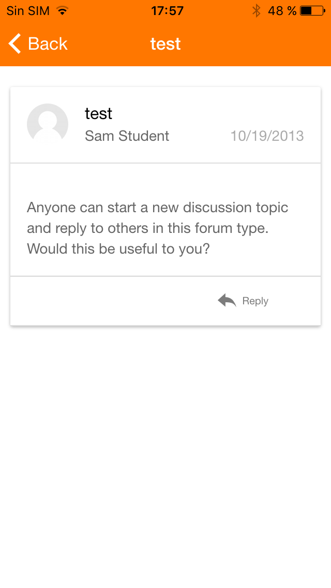

Release date: 8th October 2015

[Complete list of issues for Moodle Mobile 2.3](https://tracker.moodle.org/jira/secure/ReleaseNote.jspa?projectId=10070&version=15052)

## New features

- Forum - users can create new discussions and reply to existing ones
- Choice - users can now delete responses

:::note
Both features require Moodle 3.0 or the [Moodle App additional features plugin](https://moodle.org/plugins/view/local_mobile).
:::

## Improvements

- Date handling and formatting
- Notifications for deleted sites are not shown
- Scaling of large images and videos
- Option to view scaled images at full size
- Option to report errors in the background (configurable)

## Fixes

- Site notes can no longer be viewed via the app

## Complete list of issues

### Bug

- [MOBILE-991](https://tracker.moodle.org/browse/MOBILE-991) - Unable to authenticate
- [MOBILE-1025](https://tracker.moodle.org/browse/MOBILE-1025) - No sound on video
- [MOBILE-1152](https://tracker.moodle.org/browse/MOBILE-1152) - MM Does Not Present Multi-Authentication Window
- [MOBILE-1170](https://tracker.moodle.org/browse/MOBILE-1170) - Site notes cannot be seen from the app
- [MOBILE-1181](https://tracker.moodle.org/browse/MOBILE-1181) - iOS Phonegap Build: ReferenceError: Can't find variable: cordova
- [MOBILE-1219](https://tracker.moodle.org/browse/MOBILE-1219) - Not possible to create a new site using a browser
- [MOBILE-1225](https://tracker.moodle.org/browse/MOBILE-1225) - Moodle Mobile does not work with iOS9
- [MOBILE-1226](https://tracker.moodle.org/browse/MOBILE-1226) - Multi-lang in Mobile: show first option if no match found
- [MOBILE-1237](https://tracker.moodle.org/browse/MOBILE-1237) - Timeout triggered in siteExists
- [MOBILE-1239](https://tracker.moodle.org/browse/MOBILE-1239) - Error reported via the app: Uncaught TypeError: Cannot read property 'top' of undefined
- [MOBILE-1244](https://tracker.moodle.org/browse/MOBILE-1244) - Error when deleting site in browser: ReferenceError: device is not defined
- [MOBILE-1245](https://tracker.moodle.org/browse/MOBILE-1245) - Controllers instantiated twice with split view
- [MOBILE-1249](https://tracker.moodle.org/browse/MOBILE-1249) - Split view: component undefined if links are loaded fast
- [MOBILE-1250](https://tracker.moodle.org/browse/MOBILE-1250) - Teacher should be able to add discussions to any group
- [MOBILE-1251](https://tracker.moodle.org/browse/MOBILE-1251) - Single answer choices not working right on iOS9

### Improvement

<!-- cspell:disable -->

- [MOBILE-1048](https://tracker.moodle.org/browse/MOBILE-1048) - Improve date handling and formatting
- [MOBILE-1138](https://tracker.moodle.org/browse/MOBILE-1138) - Handle big images and videos in the app
- [MOBILE-1151](https://tracker.moodle.org/browse/MOBILE-1151) - Offline mode if downloadfiles is disable on a site already stored
- [MOBILE-1176](https://tracker.moodle.org/browse/MOBILE-1176) - Remove SCRIPT tags in content passed to mmFormatText
- [MOBILE-1208](https://tracker.moodle.org/browse/MOBILE-1208) - Report errors from cordova, Ionic and ydn-db in background (configurable)
- [MOBILE-1227](https://tracker.moodle.org/browse/MOBILE-1227) - Push onto the FDroid repos
- [MOBILE-1229](https://tracker.moodle.org/browse/MOBILE-1229) - Display more sensible error when creating a site without network
- [MOBILE-1230](https://tracker.moodle.org/browse/MOBILE-1230) - Upgrade PhonegapBuild version to use latest Cordova versions
- [MOBILE-1232](https://tracker.moodle.org/browse/MOBILE-1232) - Don't show notifications if site is deleted
- [MOBILE-1233](https://tracker.moodle.org/browse/MOBILE-1233) - View scaled image at full size
- [MOBILE-1235](https://tracker.moodle.org/browse/MOBILE-1235) - Support default and gravatar profile images
- [MOBILE-1238](https://tracker.moodle.org/browse/MOBILE-1238) - Remove errorreport.js from index.html

<!-- cspell:enable -->

### New Feature

- [MOBILE-1134](https://tracker.moodle.org/browse/MOBILE-1134) - Add simple posting and replying in forums
- [MOBILE-1240](https://tracker.moodle.org/browse/MOBILE-1240) - Delete answers in choice

### Task

<!-- cspell:disable -->

- [MOBILE-1041](https://tracker.moodle.org/browse/MOBILE-1041) - Decide what to do with Development settings
- [MOBILE-1243](https://tracker.moodle.org/browse/MOBILE-1243) - Export the sites list in JSON format in the sdcard
- [MOBILE-1246](https://tracker.moodle.org/browse/MOBILE-1246) - Use npm plugins in development
- [MOBILE-1247](https://tracker.moodle.org/browse/MOBILE-1247) - Create the upgrade.txt file

<!-- cspell:enable -->
