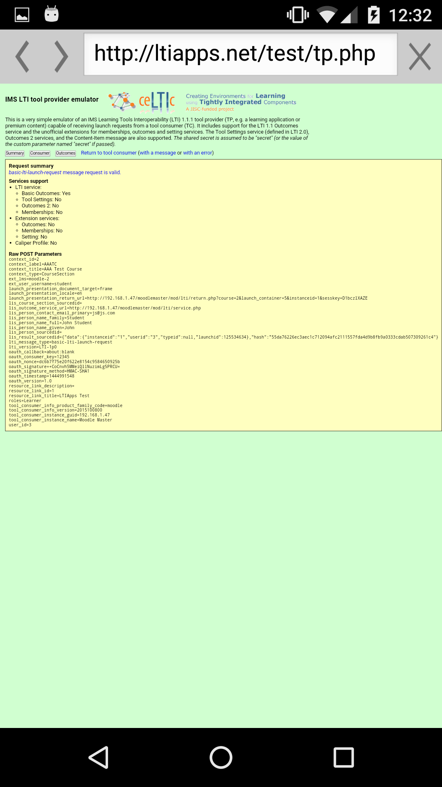

Release date: 21th October 2015

[Complete list of issues for Moodle Mobile 2.4](https://tracker.moodle.org/jira/secure/ReleaseNote.jspa?projectId=10070&version=15063)

## New features

- External tool - users can access LTI-compliant learning resources via the app
- Survey - users can now take surveys

:::note
Both features require Moodle 3.0 or the [Moodle App additional features plugin](https://moodle.org/plugins/view/local_mobile).
:::

  

## Improvements

- Improved internet connection availability checking.

## Fixes

- Formatting of titles.

## Complete list of issues

### Bug

<!-- cspell:disable -->

- [MOBILE-1252](https://tracker.moodle.org/browse/MOBILE-1252) - Some titles lack format-text
- [MOBILE-1254](https://tracker.moodle.org/browse/MOBILE-1254) - Pull to refresh in my courses doesn't refresh addons
- [MOBILE-1266](https://tracker.moodle.org/browse/MOBILE-1266) - Network checks are failing in some devices and wifis
- [MOBILE-1272](https://tracker.moodle.org/browse/MOBILE-1272) - Misspell in sites.js
- [MOBILE-1277](https://tracker.moodle.org/browse/MOBILE-1277) -  Cannot read property 'FILEOUTDATED' of undefined in mod_imscp, mod_page and mod_resource

<!-- cspell:enable -->

### Improvement

- [MOBILE-1265](https://tracker.moodle.org/browse/MOBILE-1265) - Replace the HEAD request in $mmSitesManager#siteExists with a GET request
- [MOBILE-1267](https://tracker.moodle.org/browse/MOBILE-1267) - Improve how the Moodle minium version required is checked
- [MOBILE-1271](https://tracker.moodle.org/browse/MOBILE-1271) - Populate automatically the subject field when replying a forum post

### New Feature

- [MOBILE-1253](https://tracker.moodle.org/browse/MOBILE-1253) - Add support to the external-tool activity
- [MOBILE-1255](https://tracker.moodle.org/browse/MOBILE-1255) - Add support to the survey module
