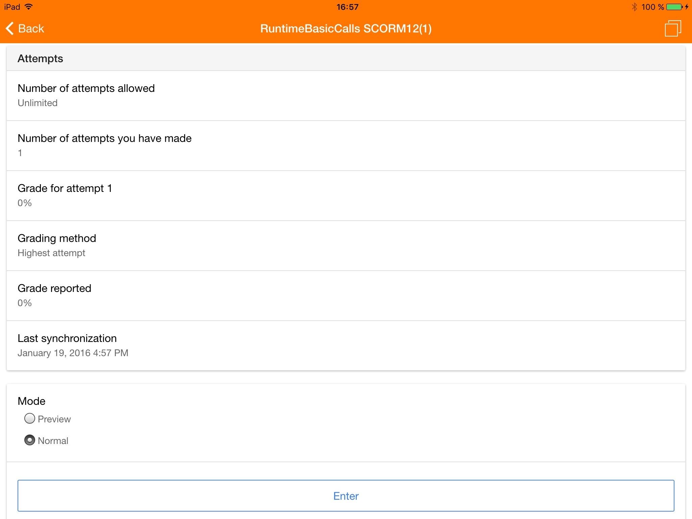
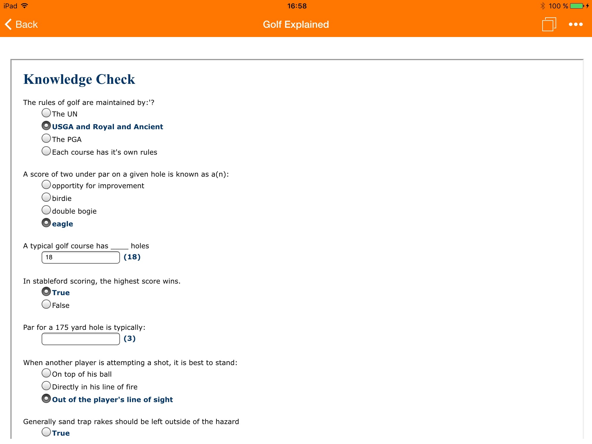
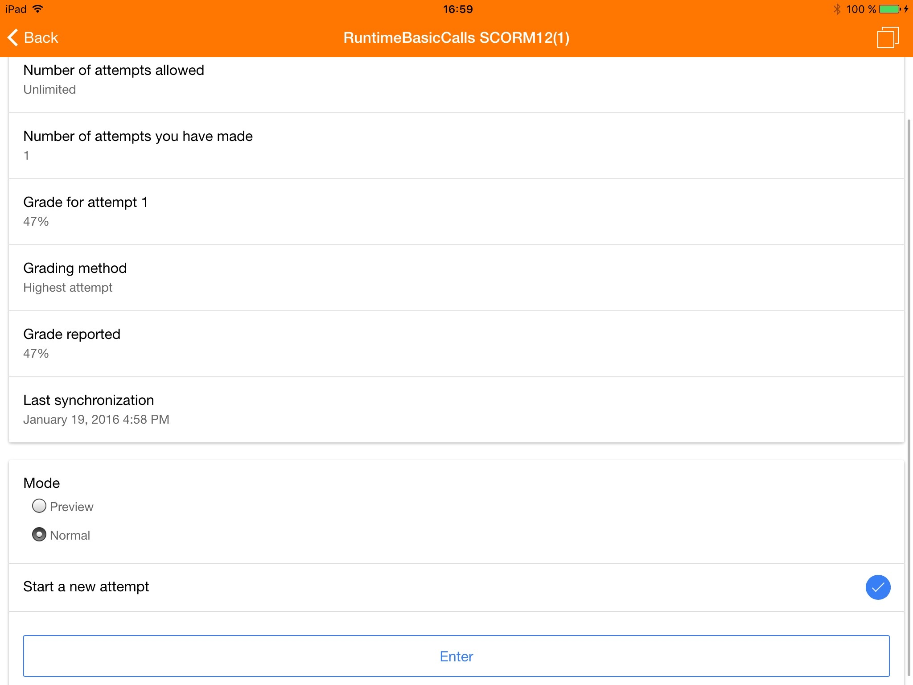

Release date: 22th January 2016

[Complete list of issues for Moodle Mobile 2.8](https://tracker.moodle.org/jira/secure/ReleaseNote.jspa?projectId=10070&version=15163)

## New features

- SCORM player: Moodle Mobile can now play SCORM 1.2 packages online and offline. The app stores all tracking information, including grades, when offline, and synchronizes with Moodle when you are online again.

- Enrolment links: The app now follows enrolment links in any resource in a course

See the user documentation [Moodle Mobile SCORM player](https://docs.moodle.org/en/Moodle_Mobile_SCORM_player) for technical details and the complete list of features.

This feature requires Moodle 3.0 or the [Moodle App additional features plugin](https://docs.moodle.org/en/Moodle_Mobile_additional_features) for sites running Moodle 2.6 to Moodle 2.9 installed.

Many thanks to Learning Lab of DanChurchAid via Danish development aid (`DANIDA`) who contributed to the funding of these developments for Moodle Mobile. The purpose is to help cater for course content access in areas where network connectivity is not always available. For the specific project in question, this development allows Syrian teachers to access learning material on risk education, which they can use to teach children, youth and the community at large about the dangers of mines and unexploded ammunitions. Read more about the work we do on: [https://www.danchurchaid.org/learning-lab/](https://www.danchurchaid.org/learning-lab/)

## Improvements

- Display a message when the Site home is empty
- Support more than one self enrol instance

## Complete list of issues

### Bug

- [MOBILE-1375](https://tracker.moodle.org/browse/MOBILE-1375) - Sections page is empty if a downloadable module doesn't return contents
- [MOBILE-1389](https://tracker.moodle.org/browse/MOBILE-1389) - Fix SCORM issues found in 2.8 release testing
- [MOBILE-1390](https://tracker.moodle.org/browse/MOBILE-1390) - SCORM not working on Android 4.1-4.2

### Improvement

- [MOBILE-1365](https://tracker.moodle.org/browse/MOBILE-1365) - Display a message when the Site home is empty (it doesn't have contents or a course summary)
- [MOBILE-1364](https://tracker.moodle.org/browse/MOBILE-1364) - Support more than one self enrol instance

### New Feature

- [MOBILE-1361](https://tracker.moodle.org/browse/MOBILE-1361) - Capture enrolment links

### Task

- [MOBILE-1381](https://tracker.moodle.org/browse/MOBILE-1381) - Check the usage of module.contents

### SCORM Sub-tasks

- [MOBILE-1300](https://tracker.moodle.org/browse/MOBILE-1300) - Implement the SCORM initial view
- [MOBILE-1301](https://tracker.moodle.org/browse/MOBILE-1301) - Implement the download of the SCORM package and unzip
- [MOBILE-1302](https://tracker.moodle.org/browse/MOBILE-1302) - Implement the basic SCORM player
- [MOBILE-1303](https://tracker.moodle.org/browse/MOBILE-1303) - Support the API runtime (online mode only)
- [MOBILE-1304](https://tracker.moodle.org/browse/MOBILE-1304) - Support offline browsing
- [MOBILE-1329](https://tracker.moodle.org/browse/MOBILE-1329) - TOC re-creation and rendering
- [MOBILE-1342](https://tracker.moodle.org/browse/MOBILE-1342) - Pre-fetch Web Services requests when the SCORM package is going to be downloaded
- [MOBILE-1344](https://tracker.moodle.org/browse/MOBILE-1344) - SCORM without organizations/items/toc should work
- [MOBILE-1345](https://tracker.moodle.org/browse/MOBILE-1345) - isScormIncomplete returns false for complete attempts
- [MOBILE-1346](https://tracker.moodle.org/browse/MOBILE-1346) - Store x.start.time when a SCO is loaded
- [MOBILE-1347](https://tracker.moodle.org/browse/MOBILE-1347) - Intercept window.open inside the iframe to prevent make the app non-usable
- [MOBILE-1350](https://tracker.moodle.org/browse/MOBILE-1350) - Interactions and objectives are not working
- [MOBILE-1351](https://tracker.moodle.org/browse/MOBILE-1351) - New attempts are created when it shouldn't
- [MOBILE-1354](https://tracker.moodle.org/browse/MOBILE-1354) - Synchronize offline data
- [MOBILE-1368](https://tracker.moodle.org/browse/MOBILE-1368) - Download icons stand out too much
- [MOBILE-1374](https://tracker.moodle.org/browse/MOBILE-1374) - For the second SCO some times the tracks are not synchronized with Moodle
- [MOBILE-1383](https://tracker.moodle.org/browse/MOBILE-1383) - Trigger the SCO launched event via mod_scorm_launch_sco
