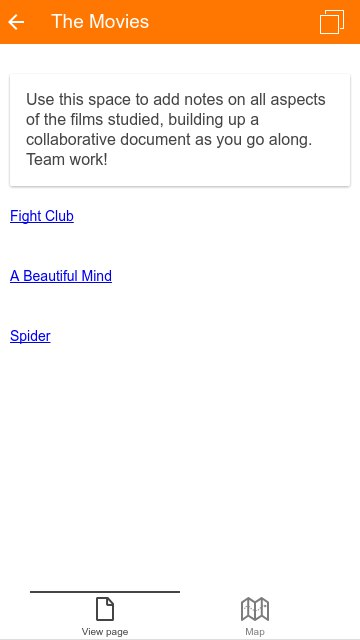
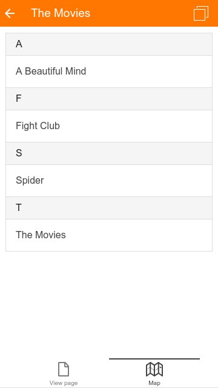

Release date: 15th April 2016

[Complete list of issues for Moodle Mobile 3.0.0](https://tracker.moodle.org/jira/secure/ReleaseNote.jspa?projectId=10070&version=15261)

## New features

- Wiki - users can browse wiki pages (requires Moodle 2.6 onwards with the Moodle App additional features plugin installed)

## Improvements

- App usability and interface improvements to the chat activity, messaging and video player
- App translated to Portuguese (Portugal) and Romanian

## Important fixes

- Images in the book resource are now displayed correctly

## Complete list of issues

### Bug

- [MOBILE-1436](https://tracker.moodle.org/browse/MOBILE-1436) - Fix package.json to make ionic state restore work
- [MOBILE-1447](https://tracker.moodle.org/browse/MOBILE-1447) - Embedded videos without type cannot be played in the app
- [MOBILE-1448](https://tracker.moodle.org/browse/MOBILE-1448) - Base64 image are not displayed in the application
- [MOBILE-1449](https://tracker.moodle.org/browse/MOBILE-1449) - Users can't to log in when using a custom URL scheme because the URL is checked against the string "moodlemobile://token="
- [MOBILE-1450](https://tracker.moodle.org/browse/MOBILE-1450) - Remove white spaces at the end of a string in the core english language
- [MOBILE-1452](https://tracker.moodle.org/browse/MOBILE-1452) - HTML5 video player controls cannot be retrieved when they disappear in Android
- [MOBILE-1454](https://tracker.moodle.org/browse/MOBILE-1454) - URL Suffix Requirement Stops Access To Internal Sites Without One
- [MOBILE-1457](https://tracker.moodle.org/browse/MOBILE-1457) - Fix courses filter (broken due to ng-if added)
<!-- cspell:disable-next-line -->
- [MOBILE-1459](https://tracker.moodle.org/browse/MOBILE-1459) - Open module in browser is being captured by contentlinks, so it's opened in the app
- [MOBILE-1460](https://tracker.moodle.org/browse/MOBILE-1460) - Force the mod_resource to open html files always inside an iframe
- [MOBILE-1462](https://tracker.moodle.org/browse/MOBILE-1462) - SCORM: Don't open link in InAppBrowser if it was already prevented
- [MOBILE-1465](https://tracker.moodle.org/browse/MOBILE-1465) - Hide not available options in user profile and my courses
- [MOBILE-1487](https://tracker.moodle.org/browse/MOBILE-1487) - Blocking a user from messaging has a typo in the button
- [MOBILE-1495](https://tracker.moodle.org/browse/MOBILE-1495) - Uploading 2 consecutive videos in iOS only stores one
- [MOBILE-1497](https://tracker.moodle.org/browse/MOBILE-1497) - If a book has several images with the same name it always displays the same image for all of them
- [MOBILE-1498](https://tracker.moodle.org/browse/MOBILE-1498) - Hide URL and allow zoom in InAppBrowser
- [MOBILE-1513](https://tracker.moodle.org/browse/MOBILE-1513) - Anchor links are navigating to frontpage instead of scrolling
- [MOBILE-1518](https://tracker.moodle.org/browse/MOBILE-1518) - Section description isn't shown in "All sections" if the course only has 1 section
- [MOBILE-1527](https://tracker.moodle.org/browse/MOBILE-1527) - Fix issues found during 3.0.0 release testing

### Improvement

- [MOBILE-1456](https://tracker.moodle.org/browse/MOBILE-1456) - They keyboard accessory bar with the next, previous and done buttons are hidden
- [MOBILE-1485](https://tracker.moodle.org/browse/MOBILE-1485) - Turn off autocorrect for search field
- [MOBILE-1499](https://tracker.moodle.org/browse/MOBILE-1499) - Chat auto reconnect and improve delay with sending messages
- [MOBILE-1502](https://tracker.moodle.org/browse/MOBILE-1502) - Refresh recent discussions if a new conversation is started
- [MOBILE-1506](https://tracker.moodle.org/browse/MOBILE-1506) - Replace the top right icon in messages with the user image
- [MOBILE-1508](https://tracker.moodle.org/browse/MOBILE-1508) - Go to message discussion from Contacts tab
- [MOBILE-1509](https://tracker.moodle.org/browse/MOBILE-1509) - Show user image in each notification
- [MOBILE-1520](https://tracker.moodle.org/browse/MOBILE-1520) - Show description of the wiki only in the main page
- [MOBILE-1524](https://tracker.moodle.org/browse/MOBILE-1524) - Show spinner while calculating status and download size when downloading a section

### New Feature

- [MOBILE-1461](https://tracker.moodle.org/browse/MOBILE-1461) - Add support for the wiki module in the app
- [MOBILE-1519](https://tracker.moodle.org/browse/MOBILE-1519) - Prefetch data for wiki Module to use it when offline
