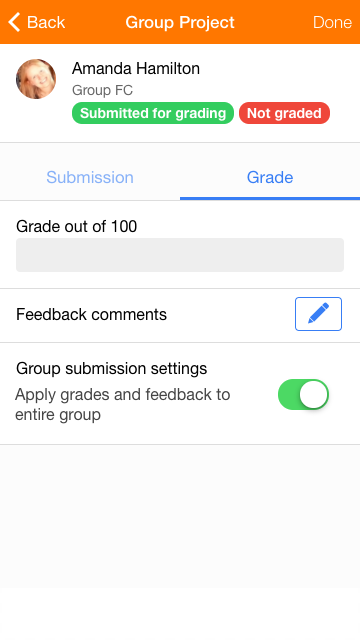
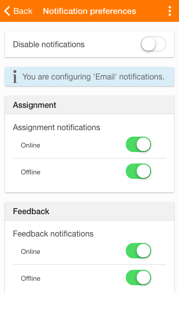
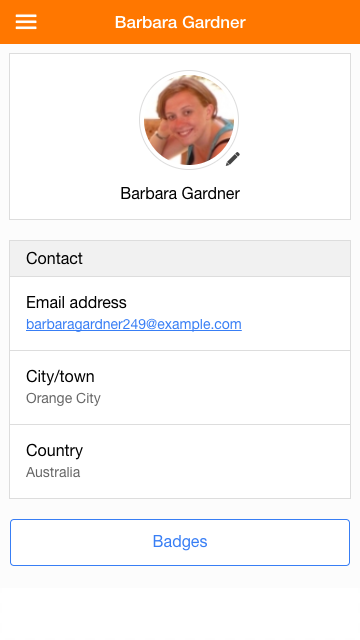

Release date: 12th December 2016

[Complete list of issues for Moodle Mobile 3.2.0](https://tracker.moodle.org/jira/secure/ReleaseNote.jspa?projectId=10070&version=15458).

## New features

All new features and improvements require Moodle 3.2 except where indicated.

- Assignment: Teachers can grade submissions, even if they are offline, using numerical points, scales, outcomes and feedback comments. Advanced grading methods such as rubrics are not yet supported.
- Auto-login: Users are automatically logged in to the site in a browser when coming from the app.
- Grades: A new grades link in the side menu provides quick access to course grades.
- Sign-up: Users can create new accounts using [email-based self-registration](https://docs.moodle.org/en/Email-based_self-registration). CAPTCHA and custom profile fields are supported.
- Notifications: A new notifications preferences screen lets users decide how to be alerted.
- SSO support: Sites using SSO auth methods such as CAS or Shibboleth no longer require the Moodle App additional features plugin.
- Profile picture: Users can easily update their profile picture by taking a photo or choosing one from the photo library. (Moodle 3.1 onward with the [Moodle App additional features plugin](https://moodle.org/plugins/view.php?plugin=local_mobile))
- Badges: Users can view their awarded badges in their profile. (Moodle 2.8 onward with the [Moodle App additional features plugin](https://moodle.org/plugins/view.php?plugin=local_mobile))

## Improvements

- Performance: Requests to the server have been greatly reduced, making the app faster and reducing data consumption.(Moodle 2.8 onward with the [Moodle App additional features plugin](https://moodle.org/plugins/view.php?plugin=local_mobile))
- When connecting to a new site, the site name and logo are displayed in the login screen.
- The 'My courses' screen has been redesigned to improve usability.
- Assignments with submission statements are now supported.
- Users can now change the password or complete missing fields in their profile when required.
- Pinned forum discussions are now displayed correctly.
- Discussion locking is supported.
- Single simple discussion forums no longer show the author of the first post.
- The size of the app bundle has been optimized, reducing it by 25%.

## Fixes

- Orphaned sections are not displayed any more.

## Developers

Please refer to [https://github.com/moodlehq/moodleapp/blob/v3.2.0/upgrade.txt](https://github.com/moodlehq/moodleapp/blob/v3.2.0/upgrade.txt)

## Complete list of issues

### New Feature

- [MOBILE-329](https://tracker.moodle.org/browse/MOBILE-329) - Profile Picture could trigger a profile update page
- [MOBILE-1504](https://tracker.moodle.org/browse/MOBILE-1504) - Display a new "My grades" option in the Mobile app
- [MOBILE-1557](https://tracker.moodle.org/browse/MOBILE-1557) - Display the user badges in the user profile
- [MOBILE-1618](https://tracker.moodle.org/browse/MOBILE-1618) - Configure the mobile notifications within the app

### Task

- [MOBILE-1705](https://tracker.moodle.org/browse/MOBILE-1705) - Support remote addons in user custom fields
- [MOBILE-1864](https://tracker.moodle.org/browse/MOBILE-1864) - Integrate the latests protractor test
- [MOBILE-1888](https://tracker.moodle.org/browse/MOBILE-1888) - Test video players and the Atto option
- [MOBILE-1894](https://tracker.moodle.org/browse/MOBILE-1894) - Phonegap build repository closed (change plugins)
- [MOBILE-1897](https://tracker.moodle.org/browse/MOBILE-1897) - Backport new Web Services in 3.2 to local_mobile

### Sub-task

- [MOBILE-1851](https://tracker.moodle.org/browse/MOBILE-1851) - Add outcome support to grading assignment
- [MOBILE-1852](https://tracker.moodle.org/browse/MOBILE-1852) - Add feedback support to grading assignment
- [MOBILE-1853](https://tracker.moodle.org/browse/MOBILE-1853) - Add simple grading support to grading assignment
- [MOBILE-1855](https://tracker.moodle.org/browse/MOBILE-1855) - Add prefetch and offline grading features for assignment
- [MOBILE-1867](https://tracker.moodle.org/browse/MOBILE-1867) - Improve new assignments Look and feel
- [MOBILE-1871](https://tracker.moodle.org/browse/MOBILE-1871) - Filter submissions need to be graded
- [MOBILE-1878](https://tracker.moodle.org/browse/MOBILE-1878) - Add scale support on simple grading for assignments
- [MOBILE-1879](https://tracker.moodle.org/browse/MOBILE-1879) - Exit without saving warning on assignment feedback page.
- [MOBILE-1884](https://tracker.moodle.org/browse/MOBILE-1884) - Allow user to grade from web on advanced grading

### Improvement

<!-- cspell:disable -->

- [MOBILE-1598](https://tracker.moodle.org/browse/MOBILE-1598) - Enable users to sign up or register an account in the app
- [MOBILE-1657](https://tracker.moodle.org/browse/MOBILE-1657) - Course actions under course are very tight
- [MOBILE-1676](https://tracker.moodle.org/browse/MOBILE-1676) - Allow submitting assignments with submission statement
- [MOBILE-1687](https://tracker.moodle.org/browse/MOBILE-1687) - Hide author of the forum post if forum_is_author_hidden() advises so
- [MOBILE-1802](https://tracker.moodle.org/browse/MOBILE-1802) - Allow to install or move the app to an external storage system (SD)
- [MOBILE-1806](https://tracker.moodle.org/browse/MOBILE-1806) - Auto-login support in the app
- [MOBILE-1808](https://tracker.moodle.org/browse/MOBILE-1808) - The app new sites checking process should use tool_mobile_get_public_config when available
- [MOBILE-1809](https://tracker.moodle.org/browse/MOBILE-1809) - Use gradereport_user_get_grade_items for quiz final grade calculation when available
- [MOBILE-1813](https://tracker.moodle.org/browse/MOBILE-1813) - Allow the user to change the password or add the missing profile fields via the app - auto-login
- [MOBILE-1840](https://tracker.moodle.org/browse/MOBILE-1840) - Add missing config.json available settings
- [MOBILE-1848](https://tracker.moodle.org/browse/MOBILE-1848) - Add a new config.json property (forcedefaultlanguage)
- [MOBILE-1860](https://tracker.moodle.org/browse/MOBILE-1860) - Retrieve the private token when log-in via browser/embed to SSO sites (tool/mobile/launch.php)
- [MOBILE-1862](https://tracker.moodle.org/browse/MOBILE-1862) - Speed-up the my courses page options loading
- [MOBILE-1863](https://tracker.moodle.org/browse/MOBILE-1863) - Support custom URL schemes in InAppBrowser
- [MOBILE-1872](https://tracker.moodle.org/browse/MOBILE-1872) - Calculate course modules status in courses via core_course_check_updates
- [MOBILE-1881](https://tracker.moodle.org/browse/MOBILE-1881) - Load first discussion instead of new discussion when accessing a forum in tablet
- [MOBILE-1882](https://tracker.moodle.org/browse/MOBILE-1882) - Display pinned discussions
- [MOBILE-1889](https://tracker.moodle.org/browse/MOBILE-1889) - Disable error reporting by default
- [MOBILE-1904](https://tracker.moodle.org/browse/MOBILE-1904) - Do not display the keyboard when going to a conversation from the messages screen
- [MOBILE-1905](https://tracker.moodle.org/browse/MOBILE-1905) - Replace the app icons for iOS
- [MOBILE-1907](https://tracker.moodle.org/browse/MOBILE-1907) - Handle window.open inside iframe
- [MOBILE-1911](https://tracker.moodle.org/browse/MOBILE-1911) - Update Ionic to version 1.3.2
- [MOBILE-1913](https://tracker.moodle.org/browse/MOBILE-1913) - Add filtered message text on messaging
- [MOBILE-1914](https://tracker.moodle.org/browse/MOBILE-1914) - Improvements in assignment grading
- [MOBILE-1915](https://tracker.moodle.org/browse/MOBILE-1915) - Fix subtitles positioning

<!-- cspell:enable -->

### Bug

- [MOBILE-1559](https://tracker.moodle.org/browse/MOBILE-1559) - core_course_view_course not working right in the app
- [MOBILE-1749](https://tracker.moodle.org/browse/MOBILE-1749) - Hidden site home blocks are shown in the app
- [MOBILE-1794](https://tracker.moodle.org/browse/MOBILE-1794) - on login, error message 'Cannot find data record in database table course' is displayed.
- [MOBILE-1825](https://tracker.moodle.org/browse/MOBILE-1825) - Moodle App 3.1.2 still shows orphan activities
- [MOBILE-1838](https://tracker.moodle.org/browse/MOBILE-1838) - Redirect to another site fails if the current site has remote addons
- [MOBILE-1839](https://tracker.moodle.org/browse/MOBILE-1839) - Can edit submission status is not using the correct field
- [MOBILE-1844](https://tracker.moodle.org/browse/MOBILE-1844) - Re-apply "Pass parameters to login/token.php only in browser"
- [MOBILE-1854](https://tracker.moodle.org/browse/MOBILE-1854) - Redirect to My Courses if Site Home is empty not working in Moodle 3.2
- [MOBILE-1856](https://tracker.moodle.org/browse/MOBILE-1856) - Launch the assign viewed event in the app so completion is triggered
- [MOBILE-1859](https://tracker.moodle.org/browse/MOBILE-1859) - Fix the bottom padding in iOS
- [MOBILE-1868](https://tracker.moodle.org/browse/MOBILE-1868) - Error when editing online text of an submission created via "Add a new attempt based on previous submission"
- [MOBILE-1876](https://tracker.moodle.org/browse/MOBILE-1876) - Fix the login typo and change the Credentials by log in
- [MOBILE-1880](https://tracker.moodle.org/browse/MOBILE-1880) - Addons in My Courses have a border top in Android
- [MOBILE-1885](https://tracker.moodle.org/browse/MOBILE-1885) - Connect to Moodle help text is incorrect
- [MOBILE-1887](https://tracker.moodle.org/browse/MOBILE-1887) - Links in error modals override the app
- [MOBILE-1893](https://tracker.moodle.org/browse/MOBILE-1893) - remote addons using directives throw security warnings
- [MOBILE-1895](https://tracker.moodle.org/browse/MOBILE-1895) - remote addon build process bundles unit test files into addon.js
- [MOBILE-1896](https://tracker.moodle.org/browse/MOBILE-1896) - $mmaCourseCompletionHandlers isEnabledForUser and isEnabledForCourse are not working as expected
- [MOBILE-1899](https://tracker.moodle.org/browse/MOBILE-1899) - Input text disappear when scrolling with keyboard open
- [MOBILE-1906](https://tracker.moodle.org/browse/MOBILE-1906) - Detecting updates in a section isn't reflected in the list of sections
- [MOBILE-1909](https://tracker.moodle.org/browse/MOBILE-1909) - Course handlers don't show spinner on PTR
- [MOBILE-1916](https://tracker.moodle.org/browse/MOBILE-1916) - Italic text is not italic in quiz in the Mobile app
