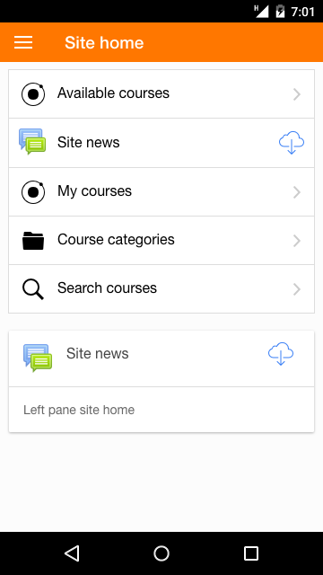
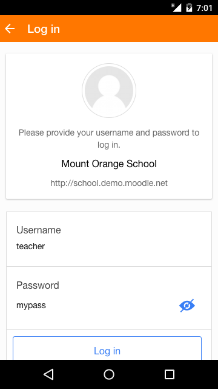

Release date: 28th February 2017

[Complete list of issues for Moodle Mobile 3.2.1](https://tracker.moodle.org/jira/secure/ReleaseNote.jspa?projectId=10070&version=15664).

## New features

:::note
Please note that new features require Moodle 3.2 or where indicated with an asterisk(\*) the [Moodle App additional features plugin](https://docs.moodle.org/en/Moodle_Mobile_additional_features).
:::

- Glossary: Users can add glossary entries with attachments.
- Unread messages and notifications count are displayed in the app icon (iOS) and in the app main menu.
- Mobile features can be configured from the Moodle site administration - custom menu items, custom language strings, disabled features and an option enabling users to log out completely from the app (requires the latest version of the "Moodle App additional features plugin" and will be included in Moodle 3.3)\*.
- The site home displays the same options as via the web - search courses, browse course categories etc\*.

## Improvements

- Course pages display labels (without needing to tap them) and activity descriptions when set.
- Messaging is faster and smoother.
- Video posters are downloaded.
- Forum: Tracking, nested discussions and forum post attachments are supported.
- The text editor adapts to the screen height.
- Text messages can be copied.
- Audio continues playing even when the screen is locked.
- The image viewer supports zoom.
- The media and file picker opens in the same page.
- Calendar events can be filtered by course.
- Users can set a default time for notifications.
- New option to view password when entering it.
- The site policy can be viewed and accepted via the app.
- Choice results display as graphs.
- Several UX and design improvements including a new Participants page and Grades page.

## Fixes

- Some bugs affecting old Samsung devices have been fixed.

## Developers

Please refer to [https://github.com/moodlehq/moodleapp/blob/v3.2.1/upgrade.txt](https://github.com/moodlehq/moodleapp/blob/v3.2.1/upgrade.txt)

## Complete list of issues

### Bug

- [MOBILE-1201](https://tracker.moodle.org/browse/MOBILE-1201) - Error reported via the app: Uncaught TypeError: Object #`<IDBFactory>` has no method 'deleteDatabase'
- [MOBILE-1475](https://tracker.moodle.org/browse/MOBILE-1475) - Send button hides keyboard in messages
- [MOBILE-1666](https://tracker.moodle.org/browse/MOBILE-1666) - "Error getting SCORM data" when opening SCORM in online in some devices
- [MOBILE-1708](https://tracker.moodle.org/browse/MOBILE-1708) - PTR for resources is not working as expected
- [MOBILE-1828](https://tracker.moodle.org/browse/MOBILE-1828) - Infinite Scrolling not working as expected on Calendar Events
- [MOBILE-1849](https://tracker.moodle.org/browse/MOBILE-1849) - Header jumps around when switching fields
- [MOBILE-1875](https://tracker.moodle.org/browse/MOBILE-1875) - Gulp tasks not running with Ionic-cli v2 on ionic serve
<!-- cspell:disable-next-line -->
- [MOBILE-1902](https://tracker.moodle.org/browse/MOBILE-1902) - Wiki: Cannot create or edit page if no subwiki
- [MOBILE-1919](https://tracker.moodle.org/browse/MOBILE-1919) - Automatic reloading of the conversation screen makes videos stop working
- [MOBILE-1922](https://tracker.moodle.org/browse/MOBILE-1922) - Strange effect when deleting a site in iOS (tested in iPhone)
- [MOBILE-1932](https://tracker.moodle.org/browse/MOBILE-1932) - Support media capture plugin for iOS 10 (NSPhotoLibraryUsageDescription error when compiling)
- [MOBILE-1940](https://tracker.moodle.org/browse/MOBILE-1940) - Keyboard not working correctly in messages
- [MOBILE-1941](https://tracker.moodle.org/browse/MOBILE-1941) - PTR on Search Results resets status
- [MOBILE-1948](https://tracker.moodle.org/browse/MOBILE-1948) - The course site should not be displayed when displaying the list of courses
- [MOBILE-1949](https://tracker.moodle.org/browse/MOBILE-1949) - Missing lang string in quizzes
- [MOBILE-1967](https://tracker.moodle.org/browse/MOBILE-1967) - Remote addons cannot register stores
- [MOBILE-1969](https://tracker.moodle.org/browse/MOBILE-1969) - Cannot reply post if going to a discussion via notifications
- [MOBILE-1970](https://tracker.moodle.org/browse/MOBILE-1970) - Push notifications not working in iOS 10.2
- [MOBILE-1972](https://tracker.moodle.org/browse/MOBILE-1972) - Don't download SCORM file if the data is outdated but the file isn't
- [MOBILE-1977](https://tracker.moodle.org/browse/MOBILE-1977) - "Back" is not internationalized
- [MOBILE-1978](https://tracker.moodle.org/browse/MOBILE-1978) - Default LTI launch button does not use Mobile browser
- [MOBILE-1980](https://tracker.moodle.org/browse/MOBILE-1980) - Deleting a site should update the badge notifications counter
- [MOBILE-1981](https://tracker.moodle.org/browse/MOBILE-1981) - Context menu is not shown when needed
- [MOBILE-1982](https://tracker.moodle.org/browse/MOBILE-1982) - Camera roll does not allow to upload videos to assignments
- [MOBILE-1983](https://tracker.moodle.org/browse/MOBILE-1983) - Calls to core_message_mark_message_read are not backwards compatible
- [MOBILE-1985](https://tracker.moodle.org/browse/MOBILE-1985) - Errors when using system emoji
- [MOBILE-1986](https://tracker.moodle.org/browse/MOBILE-1986) - Option "all participants" not show in forum
- [MOBILE-1995](https://tracker.moodle.org/browse/MOBILE-1995) - Show more cannot be read if device does not support css gradients
- [MOBILE-2008](https://tracker.moodle.org/browse/MOBILE-2008) - Available courses in Site Home are being displayed in a different order in the app
- [MOBILE-2018](https://tracker.moodle.org/browse/MOBILE-2018) - Forum shows error message in old Moodle versions
- [MOBILE-2025](https://tracker.moodle.org/browse/MOBILE-2025) - Pages containing URLs with "%" cannot be loaded

### New Feature

- [MOBILE-1632](https://tracker.moodle.org/browse/MOBILE-1632) - Support attachments in the forum
- [MOBILE-1634](https://tracker.moodle.org/browse/MOBILE-1634) - Support forum tracking
- [MOBILE-1766](https://tracker.moodle.org/browse/MOBILE-1766) - Create glossary entries
- [MOBILE-1956](https://tracker.moodle.org/browse/MOBILE-1956) - Support log-out when is configured in the site
- [MOBILE-1957](https://tracker.moodle.org/browse/MOBILE-1957) - Support custom strings (via Moodle Mobile settings)
- [MOBILE-1958](https://tracker.moodle.org/browse/MOBILE-1958) - Disable functionalities based on Moodle Mobile settings
- [MOBILE-1959](https://tracker.moodle.org/browse/MOBILE-1959) - Support additional menu items based on Moodle Mobile settings
- [MOBILE-2019](https://tracker.moodle.org/browse/MOBILE-2019) - Add privacy policy information link in the app About
- [MOBILE-1966](https://tracker.moodle.org/browse/MOBILE-1966) - Support glossary attachments when creating entries

### Task

- [MOBILE-1997](https://tracker.moodle.org/browse/MOBILE-1997) - Backport to local_mobile the new Mobile features settings
- [MOBILE-2001](https://tracker.moodle.org/browse/MOBILE-2001) - Backport core_course_get_courses_by_field

### Improvement

- [MOBILE-1387](https://tracker.moodle.org/browse/MOBILE-1387) - Allow changing the default time for calendar event notifications
- [MOBILE-1463](https://tracker.moodle.org/browse/MOBILE-1463) - Download video posters
- [MOBILE-1471](https://tracker.moodle.org/browse/MOBILE-1471) - Filter calendar events by courses
- [MOBILE-1479](https://tracker.moodle.org/browse/MOBILE-1479) - Press and hold to copy message does not work
- [MOBILE-1512](https://tracker.moodle.org/browse/MOBILE-1512) - Add prefetch info and actions like Time modified and Size to module context menu
- [MOBILE-1651](https://tracker.moodle.org/browse/MOBILE-1651) - Audio Stops With Screen Lock
- [MOBILE-1706](https://tracker.moodle.org/browse/MOBILE-1706) - The text editor should have a configurable height
- [MOBILE-1713](https://tracker.moodle.org/browse/MOBILE-1713) - Improve choice results in the app
- [MOBILE-1756](https://tracker.moodle.org/browse/MOBILE-1756) - Support nested order on forum discussions
- [MOBILE-1786](https://tracker.moodle.org/browse/MOBILE-1786) - Display the count of unread messages
- [MOBILE-1787](https://tracker.moodle.org/browse/MOBILE-1787) - Display the count of unread notifications
- [MOBILE-1790](https://tracker.moodle.org/browse/MOBILE-1790) - Long messages disappear off the screen as the user is typing them.
- [MOBILE-1791](https://tracker.moodle.org/browse/MOBILE-1791) - Update dynamically messages in the Message Discussions page
- [MOBILE-1811](https://tracker.moodle.org/browse/MOBILE-1811) - Display site home according the frontpage settings
- [MOBILE-1812](https://tracker.moodle.org/browse/MOBILE-1812) - Accept the site policy in the app
- [MOBILE-1836](https://tracker.moodle.org/browse/MOBILE-1836) - Sort site list on sites page
- [MOBILE-1845](https://tracker.moodle.org/browse/MOBILE-1845) - Do not display the username and password fields when using SSO
- [MOBILE-1846](https://tracker.moodle.org/browse/MOBILE-1846) - Do not display the confirmation modal when log in to a use using SSO via inApp Browser
- [MOBILE-1847](https://tracker.moodle.org/browse/MOBILE-1847) - Allow loading previous messages in a discussion
- [MOBILE-1903](https://tracker.moodle.org/browse/MOBILE-1903) - Add option to show the password in the Log in screen
- [MOBILE-1917](https://tracker.moodle.org/browse/MOBILE-1917) - Move grade addon to core
- [MOBILE-1920](https://tracker.moodle.org/browse/MOBILE-1920) - Improve how labels are displayed
- [MOBILE-1924](https://tracker.moodle.org/browse/MOBILE-1924) - Badges must follow links with hash
- [MOBILE-1925](https://tracker.moodle.org/browse/MOBILE-1925) - When submitting an assignment with only online-text the "upload size" warning should not be displayed
- [MOBILE-1929](https://tracker.moodle.org/browse/MOBILE-1929) - Improve the user profile page
- [MOBILE-1930](https://tracker.moodle.org/browse/MOBILE-1930) - Open a file automatically when its description is empty
- [MOBILE-1931](https://tracker.moodle.org/browse/MOBILE-1931) - Show activities description in the section/s page when the "Show description" setting is selected
- [MOBILE-1934](https://tracker.moodle.org/browse/MOBILE-1934) - Modify the shortener from format text directive to show always HTML
- [MOBILE-1935](https://tracker.moodle.org/browse/MOBILE-1935) - Labels content area shouldn't be clickable
- [MOBILE-1936](https://tracker.moodle.org/browse/MOBILE-1936) - Large URLs are not correctly displayed in the Site address field
- [MOBILE-1944](https://tracker.moodle.org/browse/MOBILE-1944) - Show badge number on application icon
- [MOBILE-1945](https://tracker.moodle.org/browse/MOBILE-1945) - Improve grade templates
- [MOBILE-1946](https://tracker.moodle.org/browse/MOBILE-1946) - Decrease network requests in section view
- [MOBILE-1953](https://tracker.moodle.org/browse/MOBILE-1953) - Disable autocapitalize and autocorrect when showing a password
- [MOBILE-1955](https://tracker.moodle.org/browse/MOBILE-1955) - Increase padding of some buttons like show password and search courses
- [MOBILE-1960](https://tracker.moodle.org/browse/MOBILE-1960) - Enable zooming on image viewer
- [MOBILE-1961](https://tracker.moodle.org/browse/MOBILE-1961) - Add outside border on grading tables
- [MOBILE-1962](https://tracker.moodle.org/browse/MOBILE-1962) - Don't prefetch after sync if data hasn't been sent
- [MOBILE-1964](https://tracker.moodle.org/browse/MOBILE-1964) - Use action sheet and modals in file picker instead of new states
- [MOBILE-1965](https://tracker.moodle.org/browse/MOBILE-1965) - Show more of format text is no calculating the height correctly.
- [MOBILE-1984](https://tracker.moodle.org/browse/MOBILE-1984) - Treat the fdk extension or avoid extension renaming for unknown types
- [MOBILE-1988](https://tracker.moodle.org/browse/MOBILE-1988) - The textarea plain text editor should have a configurable and adjustable height
- [MOBILE-1989](https://tracker.moodle.org/browse/MOBILE-1989) - Add margin between post boxes in nested view
- [MOBILE-1990](https://tracker.moodle.org/browse/MOBILE-1990) - Execute gulp tasks before generating packages
- [MOBILE-2000](https://tracker.moodle.org/browse/MOBILE-2000) - Capture links to categories
- [MOBILE-2026](https://tracker.moodle.org/browse/MOBILE-2026) - Fix language file builds ordering
- [MOBILE-2027](https://tracker.moodle.org/browse/MOBILE-2027) - File manager (action sheet) should be hidden when a file upload starts
- [MOBILE-2029](https://tracker.moodle.org/browse/MOBILE-2029) - Improve forum discussion options
