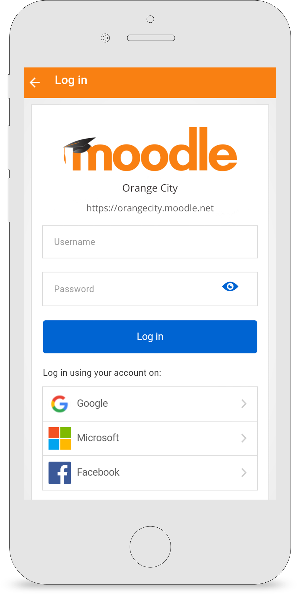

Release date: 26th May

[Complete list of issues for Moodle Mobile 3.3.0](http://moodle.atlassian.net/secure/IssueNavigator!executeAdvanced.jspa?jqlQuery=project+%3D+mobile+and+resolution+%3D+fixed+AND+fixVersion+in+%28%223.3.0%22%29).

## New features

:::note
Please note that new features require Moodle 3.3
:::

- Lesson - Students can now take lessons even offline. Teachers can review students attempts.
- Feedback - Students can submit feedback even offline. Teachers can review students submissions.
- The app supports the new OAuth methods (Facebook, Google, Microsoft) if they are enabled on the site.
- The new course overview is also supported in the app.

## Improvements

- Message searching is now supported
- Several UX and appearance improvements.
- Teachers can add forum pinned discussions via the app.
- Resources descriptions are now correctly displayed in the app.
- Activities with access restrictions are now correctly displayed in the app.
- Notifications sound can be disabled
- Several improvements when using files linked from external repositories

## Developers

- The project now supports Node 6
- Please refer to [https://github.com/moodlehq/moodleapp/blob/v3.3.0/upgrade.txt](https://github.com/moodlehq/moodleapp/blob/v3.3.0/upgrade.txt)
