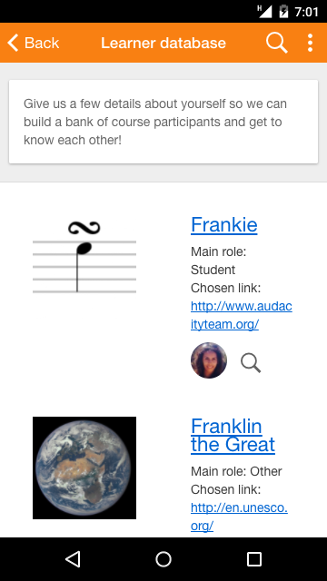

Release date: 28th July

[Complete list of issues for Moodle Mobile 3.3.1](http://moodle.atlassian.net/secure/IssueNavigator!executeAdvanced.jspa?jqlQuery=project+%3D+mobile+and+resolution+%3D+fixed+AND+fixVersion+in+%28%223.3.1%22%29).

## New features and improvements

:::note
Please note that new features require Moodle 3.3
:::

- Database activity - Students can browse and add database entries even when offline.
- New translations:  Lithuanian and Serbian (Cyrillic and Latin alphabets)
- Lesson - Improvements in media (audio, video) handling.
- Improvements to connection problem notifications.

## Complete list of issues

### Bug

- [MOBILE-2155](https://moodle.atlassian.net/browse/MOBILE-2155) - YouTube videos don't work in Lesson
- [MOBILE-2158](https://moodle.atlassian.net/browse/MOBILE-2158) - Moodle mobile; Lesson doesn't have navigation buttons
- [MOBILE-2170](https://moodle.atlassian.net/browse/MOBILE-2170) - Mouse scrolling is not functional when hovering over course text
- [MOBILE-2180](https://moodle.atlassian.net/browse/MOBILE-2180) - Focus desktop app if launched again
- [MOBILE-2185](https://moodle.atlassian.net/browse/MOBILE-2185) - Videos filtered by videojs in Moodle 3.3 sites are not working in the app

### New Feature

- [MOBILE-2117](https://moodle.atlassian.net/browse/MOBILE-2117) - Add database module support on Mobile app
- [MOBILE-2073](https://moodle.atlassian.net/browse/MOBILE-2073) - Support main info of database activity
- [MOBILE-2118](https://moodle.atlassian.net/browse/MOBILE-2118) - Support database list view
- [MOBILE-2119](https://moodle.atlassian.net/browse/MOBILE-2119) - Support database single view
- [MOBILE-2120](https://moodle.atlassian.net/browse/MOBILE-2120) - Support database search
- [MOBILE-2121](https://moodle.atlassian.net/browse/MOBILE-2121) - Support database add and edit entry
- [MOBILE-2122](https://moodle.atlassian.net/browse/MOBILE-2122) - Support database comments
- [MOBILE-2123](https://moodle.atlassian.net/browse/MOBILE-2123) - Support database approve entry
- [MOBILE-2125](https://moodle.atlassian.net/browse/MOBILE-2125) - Support database delete entry
- [MOBILE-2127](https://moodle.atlassian.net/browse/MOBILE-2127) - Support database syncing and offline
- [MOBILE-2131](https://moodle.atlassian.net/browse/MOBILE-2131) - Refurbish database according UX
- [MOBILE-2145](https://moodle.atlassian.net/browse/MOBILE-2145) - Pull notifications in desktop app to simulate push notifications
- [MOBILE-2147](https://moodle.atlassian.net/browse/MOBILE-2147) - Support main features of MoodleMobile in desktop app
- [MOBILE-2148](https://moodle.atlassian.net/browse/MOBILE-2148) - Package the Electron app to be published in Windows Store
- [MOBILE-2156](https://moodle.atlassian.net/browse/MOBILE-2156) - Translations for more languages

### Task

- [MOBILE-1832](https://moodle.atlassian.net/browse/MOBILE-1832) - Screenshots for iPhone and iPad

### Improvement

- [MOBILE-2136](https://moodle.atlassian.net/browse/MOBILE-2136) - Connect mobile app to a selected section
- [MOBILE-2139](https://moodle.atlassian.net/browse/MOBILE-2139) - Fix config.xml to match branded apps one
- [MOBILE-2140](https://moodle.atlassian.net/browse/MOBILE-2140) - Add variables to app scss to make it even more flexible
- [MOBILE-2146](https://moodle.atlassian.net/browse/MOBILE-2146) - Allow recording audio/video and taking pictures in desktop apps
- [MOBILE-2169](https://moodle.atlassian.net/browse/MOBILE-2169) - Improve error messages when offline
- [MOBILE-2175](https://moodle.atlassian.net/browse/MOBILE-2175) - Support a new type of custom menu item
