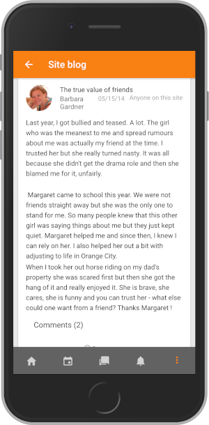

Release date: 29th March 2019

[Complete list of fixed issues in Moodle App 3.6.1](https://tracker.moodle.org/jira/secure/ReleaseNote.jspa?projectId=10070&version=16653).

## New features and improvements

- Support for blogs: Users can view and comment on the site, personal and course blogs.
- Support for ratings in forum, glossary and database activities: User can view and rate those items.
- Support for SCORM packages full screen
- Push notification improvements. Faster and contextual notifications.
- Support for multiple calendar event alerts
- Offline activities synchronisation improvements
- Accessibility improvements: For mobile screen readers.
- Two separated notification channels now available in Android: You can separately enable/disable Push and local (calendar) notifications.

More improvements bellow.

## Complete list of issues

### Bug

- [MOBILE-1516](https://tracker.moodle.org/browse/MOBILE-1516) - Push Notification icon is not show in Android
- [MOBILE-2188](https://tracker.moodle.org/browse/MOBILE-2188) - Performance and data consumption problem when viewing single entries in large databases
- [MOBILE-2429](https://tracker.moodle.org/browse/MOBILE-2429) - Feedback add-on with "allow multiple submissions" doesn't show previous responses.
- [MOBILE-2663](https://tracker.moodle.org/browse/MOBILE-2663) - question_out_of_sequence_exception when running on iOS Moodle App
- [MOBILE-2781](https://tracker.moodle.org/browse/MOBILE-2781) - when assignment grader hidden, mobile app has caching issues.
- [MOBILE-2785](https://tracker.moodle.org/browse/MOBILE-2785) - Assignment Submission not working while offline
- [MOBILE-2799](https://tracker.moodle.org/browse/MOBILE-2799) - User picture - same user, same site, different images in different devices
- [MOBILE-2811](https://tracker.moodle.org/browse/MOBILE-2811) - In quiz review mode the matching question dropdowns should not be active
- [MOBILE-2819](https://tracker.moodle.org/browse/MOBILE-2819) - Accessibility issues on VoiceOver and TalkBack
- [MOBILE-2825](https://tracker.moodle.org/browse/MOBILE-2825) - Error on resubmitting entry with files
- [MOBILE-2827](https://tracker.moodle.org/browse/MOBILE-2827) - Local notifications icon is not displaying correctly
- [MOBILE-2841](https://tracker.moodle.org/browse/MOBILE-2841) - Discussion doesn't scroll to bottom when opened in iOS devices
- [MOBILE-2855](https://tracker.moodle.org/browse/MOBILE-2855) - Student is not able to see the assessment of it's own submission
- [MOBILE-2861](https://tracker.moodle.org/browse/MOBILE-2861) - Moodle mobile infinity loading screen when using deep links
- [MOBILE-2869](https://tracker.moodle.org/browse/MOBILE-2869) - No option displayed when trying to add a file in an assignment
- [MOBILE-2875](https://tracker.moodle.org/browse/MOBILE-2875) - Map "remoteAddOn*" to "sitePlugin*" in disabled features
- [MOBILE-2876](https://tracker.moodle.org/browse/MOBILE-2876) - Error in the app when assessing submissions (assessment form)
- [MOBILE-2891](https://tracker.moodle.org/browse/MOBILE-2891) - Inline reply form is not being displayed when replying a post in iPad
- [MOBILE-2892](https://tracker.moodle.org/browse/MOBILE-2892) - URL module hangs if accessed before its finished loading
- [MOBILE-2902](https://tracker.moodle.org/browse/MOBILE-2902) - Database: css template is not applied
- [MOBILE-2908](https://tracker.moodle.org/browse/MOBILE-2908) - Multiple WS Requests to core_course_get_contents to obtain information for URL resources
- [MOBILE-2912](https://tracker.moodle.org/browse/MOBILE-2912) - App doesn't use "en-us" lang strings defined by site plugins
- [MOBILE-2913](https://tracker.moodle.org/browse/MOBILE-2913) - Errors on prefetch section

### New Feature

- [MOBILE-1633](https://tracker.moodle.org/browse/MOBILE-1633) - Support forum posts rating
- [MOBILE-1928](https://tracker.moodle.org/browse/MOBILE-1928) - Support retrieve chat past sessions for review
- [MOBILE-2386](https://tracker.moodle.org/browse/MOBILE-2386) - Support blog entries to view
- [MOBILE-2485](https://tracker.moodle.org/browse/MOBILE-2485) - Support database entries rating
- [MOBILE-2486](https://tracker.moodle.org/browse/MOBILE-2486) - Support glossary entries rating

### Task

- [MOBILE-2837](https://tracker.moodle.org/browse/MOBILE-2837) - Create a docker image
- [MOBILE-2839](https://tracker.moodle.org/browse/MOBILE-2839) - Post-release process
- [MOBILE-2859](https://tracker.moodle.org/browse/MOBILE-2859) - Edit ionic.project and config.xml to match the requirements.

### Improvement

<!-- cspell:disable -->

- [MOBILE-1834](https://tracker.moodle.org/browse/MOBILE-1834) - Handling notifications for Calendar Events
- [MOBILE-1973](https://tracker.moodle.org/browse/MOBILE-1973) - Improve performance when syncing expired/logged out sites
- [MOBILE-1979](https://tracker.moodle.org/browse/MOBILE-1979) - Launch view events when synchronizing offline activities
- [MOBILE-2114](https://tracker.moodle.org/browse/MOBILE-2114) - Prefetch data after syncing and just when leaving a SCORM activity
- [MOBILE-2527](https://tracker.moodle.org/browse/MOBILE-2527) - Download embedded files when prefetching a course or section
- [MOBILE-2746](https://tracker.moodle.org/browse/MOBILE-2746) - Completion checkboxes should only trigger a reload if completion status is used
- [MOBILE-2796](https://tracker.moodle.org/browse/MOBILE-2796) - Allow longer time options for calendar event notifications
- [MOBILE-2797](https://tracker.moodle.org/browse/MOBILE-2797) - Add a .gitattributes file for line ending settings
- [MOBILE-2807](https://tracker.moodle.org/browse/MOBILE-2807) - Add a setting to configure send option on messaging
- [MOBILE-2812](https://tracker.moodle.org/browse/MOBILE-2812) - Make the shortanswer question display more like the website display
- [MOBILE-2814](https://tracker.moodle.org/browse/MOBILE-2814) - Update local-notifications plugin
- [MOBILE-2818](https://tracker.moodle.org/browse/MOBILE-2818) - Allow any site plugin handler to specify the Moodle plugin that is supporting
- [MOBILE-2822](https://tracker.moodle.org/browse/MOBILE-2822) - Assignment word count doesn't handle new lines right in the app
- [MOBILE-2824](https://tracker.moodle.org/browse/MOBILE-2824) - Support chapterid parameter in book links
- [MOBILE-2832](https://tracker.moodle.org/browse/MOBILE-2832) - Display more calendar events on first access
- [MOBILE-2843](https://tracker.moodle.org/browse/MOBILE-2843) - Redo Notes workflow
- [MOBILE-2846](https://tracker.moodle.org/browse/MOBILE-2846) - Update travis scripts to support Desktop Linux building
- [MOBILE-2847](https://tracker.moodle.org/browse/MOBILE-2847) - improve short answer input box inside text
- [MOBILE-2850](https://tracker.moodle.org/browse/MOBILE-2850) - Prefetch data after synching and when leaving an activity
- [MOBILE-2858](https://tracker.moodle.org/browse/MOBILE-2858) - Improve grade table preformat
- [MOBILE-2864](https://tracker.moodle.org/browse/MOBILE-2864) - Update Ionic to 3.9.3
- [MOBILE-2871](https://tracker.moodle.org/browse/MOBILE-2871) - Display grading summary for groups correctly in the app
- [MOBILE-2886](https://tracker.moodle.org/browse/MOBILE-2886) - Do not display the bottom tab menu when displaying SCORMS configured to open in new Window
- [MOBILE-2887](https://tracker.moodle.org/browse/MOBILE-2887) - Implement link handlers for blogs
- [MOBILE-2888](https://tracker.moodle.org/browse/MOBILE-2888) - Make URL optional in multi-selector
- [MOBILE-2910](https://tracker.moodle.org/browse/MOBILE-2910) - Accessibility fixes on core-icon
- [MOBILE-2911](https://tracker.moodle.org/browse/MOBILE-2911) - Consistency on per page navigation

<!-- cspell:enable -->
