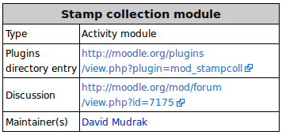

Plugin developers, maintainers and users are welcome to include documentation about their plugin in the [English Moodle Docs](https://docs.moodle.org). Of course it is fine to have documentation elsewhere, such as the Github wiki, however one advantage of including documentation in the English Moodle Docs is that 'Moodle Docs for this page' links in Moodle (when logged in as a teacher or admin) can lead directly to your plugin documentation (as explained in the [Header and footer](https://docs.moodle.org/en/Header_and_footer) documentation). And, very important, it will then be very easy for translators of Moodle Docs to add translations for this information.

## Where should the documentation go?

To create a page for your documentation, type in the browser address bar: `https://docs.moodle.org/en/Plugin_name` (where *Plugin name* is the name of the plugin in the plugins directory).

If your plugin has a page in Moodle, you can redirect this page to your documentation page as follows:

1. Log in to your Moodle site as admin and go to the page for your plugin.
2. Follow the 'Help and documentation' link in the footer to *docs.moodle.org/en/mod/pluginname* (or similar).
3. Create this page and add a redirect by adding the text `#redirect [Plugin name](https://docs.moodle.org/dev/Plugin_name)`.

## What should the documentation include?

Copy and complete the following template code to obtain an infobox listing details of the plugin:

```
{{Infobox plugin
|type = Enter the plugin type e.g. activity, block, filter
|entry = Enter the plugins directory link
|tracker = Enter the bug tracker URL
|discussion = Enter the link to the forum or discussion thread
|maintainer = [Maintainer name](https://docs.moodle.org/User/Maintainer_name)
|float = Enter left or right to make the box float to that side (optional)
}}
```



:::tip

If there is not yet a discussion thread about your plugin, please create one in the [General plugins forum](http://moodle.org/mod/forum/view.phpid=44).

:::

:::note

Please make sure that the page linked in `User:Maintainer name|Maintainer name` actually has your relevant details (profile), or a link to an existing profile in Moodle or elsewhere.

:::

The documentation may also include:

- A features overview with screenshots or videos.
- Installation instructions

:::info Plugin documentation examples

- [Stamp collection](https://docs.moodle.org/en/Stamp_collection_module)
- [Profile switches](https://docs.moodle.org/en/Profile_switches)

:::

## Which version of the user docs should the documentation be added to?

Plugin documentation should be added to the most recent version wiki in which the plugin works, for example if the plugin works in Moodle 4.0, it should be added to the [Moodle 4.0 docs wiki](https://docs.moodle.org/400/en/).

## I need help!

If any of the above sounds too complicated, please don't worry - just email Moodle Docs wiki admin Helen ([helen@moodle.org](mailto:helen@moodle.org)) who will be happy to help you :-) (Restoring and redirecting pages etc. are quick and easy for a wiki admin to do!)

## See also

- [Wiki editing help](http://docs.moodle.org/en/Help:Editing)
- [MDL-34035](https://moodle.atlassian.net/browse/MDL-34035) A way to have more help links relative to wwwroot
