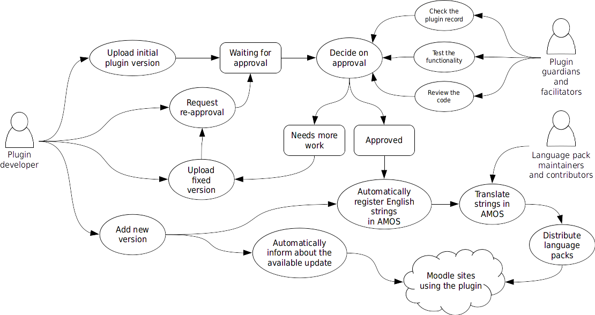

This page describes how to contribute your code into the [Plugins directory](../../community/plugincontribution/pluginsdirectory/index.md) to share it with the Moodle community.

## Why

You are encouraged to share your plugin with the community. But firstly, to be clear and honest, you do not necessarily need to submit your plugin into the Plugins directory. Maybe it is a custom plugin that solves one particular site's needs and you do not really want to share it with others.

:::note

Remember you can always simply host your plugin on your own site and let users download it manually from there.

:::

Having your plugin registered with the Plugins directory has several benefits.

- Your plugin is easier to install. Plugins directory integrates with Moodle. Administrators can simply install your plugin from the plugins directory via the web interface.
- Your plugin is easier to update. Whenever you release a new version of your plugin, all administrators having it installed are notified about the available update. They can easily upgrade to the new version from within the Moodle administration UI.
- You reserve the component name ([frankenstyle](../../development/policies/codingstyle/frankenstyle.md)) of your plugin. Plugins directory is the official register of Moodle plugins. As with the internet domain names, there can't be two plugins having the same component name.
- The plugin can be localised. Plugins in the Plugins directory are implicitly registered with [AMOS](https://docs.moodle.org/en/AMOS_manual) and can be localised using the same tools that are used for localising the standard Moodle UI.
- The plugin must be approved. Many institutions respect the approval review procedure and do not allow to install a plugin on their servers unless it has been approved in the plugins directory.

## Before you start

Before submitting your work to the Plugins directory, you should make sure you have all required and recommended resources available.

- **Plugin type** - Different [plugin types](/docs/apis/plugintypes/) are best suited for certain types of functionality. It is important to choose the appropriate plugin type to implement the desired features.
- **Plugin name** - See the [Frankenstyle](../../development/policies/codingstyle/frankenstyle.md) page for details.
- **Repository** - You are expected to have the plugin code published and shared in a way that facilitates collaboration on further development. Ideally, you have the code available in a public Git repository. Most developers found [Github](https://github.com) a good place to host their code on. The [Repository](#repository) section below provides more details.
- **Tracker** - You are expected to have a system where users can report issues, bugs and feature requests for the plugin. Again, many developers use [Github issues](https://guides.github.com/features/issues/) happily these days. You can also use the Moodle tracker if you prefer. See [Tracker](#tracker) section for more details.
- **Documentation** - The plugin should have a good documentation available. See [Plugin documentation](../../community/plugincontribution/documentation.md) for options.
- **Screenshots** - Prepare good screenshots that illustrate your plugin's essential features.

## Sharing code in the Plugins directory

So you've written a new plugin and want to share it in the [Plugins directory](../../community/plugincontribution/pluginsdirectory/index.md)? Great! The workflow of publishing and maintaining your plugin in the Plugins directory looks like this:

1. You upload the initial plugin version for approval from the [Register a new plugin](https://moodle.org/plugins/registerplugin.php) link, available  in the Navigation block in the blocks drawer on the right. To help the approval review go smoothly, please feel encouraged to review the [Plugin contribution checklist](../../community/plugincontribution/checklist.md) and follow all the guidelines there.
1. After you submit the plugin for approval, please brace yourself with patience. You will likely wait some weeks before you get initial review results. We generally try and provide the feedback sooner, but it is not always possible. The actual approval queue stats [are available](https://moodle.org/plugins/queue.php).
1. The plugin goes through the validation and approval process.
1. Almost all plugins are sent back as "needing more work" as a result of the initial review, and there is no reason to feel bad about that. It is natural part of the workflow. You may find particular issues reported so you have an opportunity to demonstrate your ability to co-operate with the reporter to resolve them.
1. Once the plugin is approved, its strings are registered with [AMOS](https://docs.moodle.org/en/AMOS_manual) and can be translated. The plugin itself should ship with English strings only. The page [Translating plugins](https://docs.moodle.org/en/Translating_plugins) has more details.
1. We do not automatically pull from Github. You have to explicitly release new version via the Plugins directory. Still you are encouraged to use Git tags - releasing new version is easier then.

### Repository

- Git is de-facto standard source code management system for Moodle plugins.
- You are supposed to publish and share your plugin code so that others can clone it easily and eventually contribute patches for it easily.
- [Github](https://github.com/) is a popular choice of many Moodle developers these days.
- The layout should be that the root of the repository is the root of the plugin folder. In other words, in the root of your repository there should be files like version.php and folders like lang or classes. That way, your plugin can be directly cloned (checked out) into existing Moodle installation without conflicting with other contributed plugins of the same type, also obtained via Git.
- It is suggested to follow the common naming convention of Moodle related repositories: moodle-`{plugintype}_{pluginname}`. For example, the birthday block has a repository name of `moodle-block_birthday` and is located at https://github.com/arborrow/moodle-block_birthday. Other developers can fork the code and work from their repositories.

### Tracker

You are expected to have a system where users can report feature requests, bugs, and other code issues. Following the open source best practise, these reports should be open and public and the associated procedures should be as transparent as possible.

:::info

There are multiple options on where to host the issues tracker. Most plugin developers today prefer to have the issue tracker close to their source code management system - so they use the native issue tracker built into Github, BitBucket or some similar system. It is suggested to use a system that your users are likely to be familiar with.

:::

## Tutorial

There is a [Tutorial](https://docs.moodle.org/dev/Tutorial) to help you learn how to write plugins for Moodle from start to finish, while showing you how to navigate the most important developer documentation along the way.

## See also

- [Moodle icons](https://docs.moodle.org/dev/Moodle_icons)
- [Overview](../../community/intro.md) of Moodle development
- Using Moodle [Best practices for code modification?](http://moodle.org/mod/forum/discuss.php?d=99037) forum discussion
- [Moodle in The Architecture of Open Source Applications](http://aosabook.org/en/moodle.html), by Tim Hunt - an overview of all aspects of how Moodle works, it focuses on those areas where Moodle's design is particularly interesting.
- [The Moodle 3.0 database schema](https://moodledev.io/docs/apis/core/dml/database-schema) reverse engineered and [Database schema introduction](https://docs.moodle.org/dev/Database_schema_introduction).
- [Preparing plugins for Moodle 3.0](https://moodle.org/mod/forum/discuss.php?d=322196) excellent summary in this forum thread. Also applies for Moodle 3.1 and newer.
