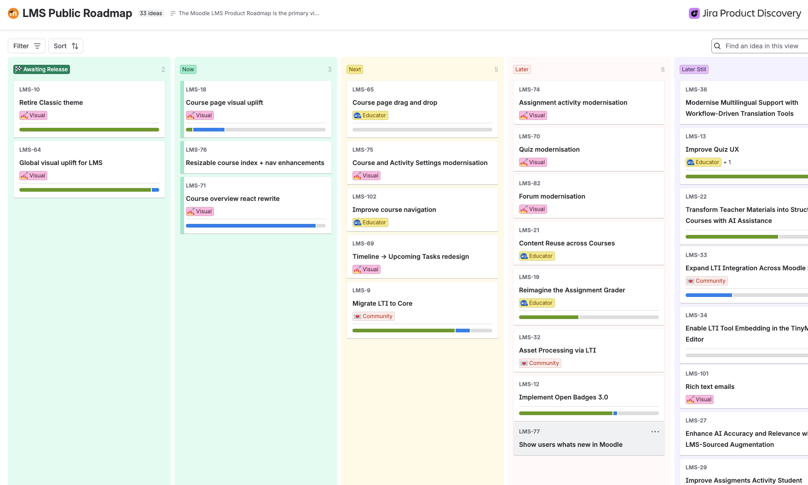
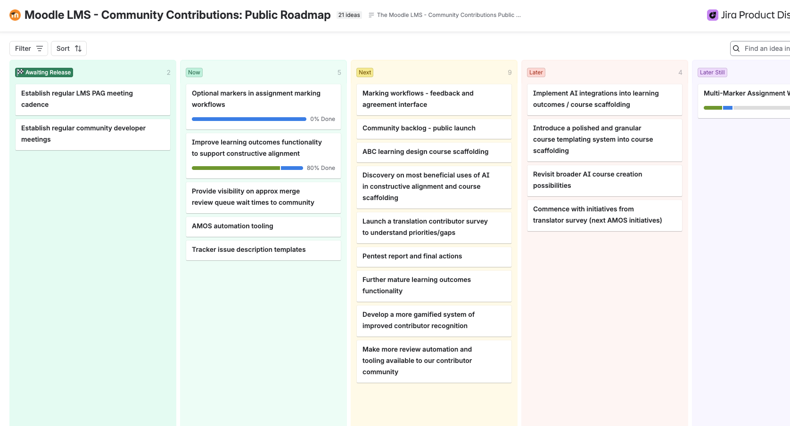
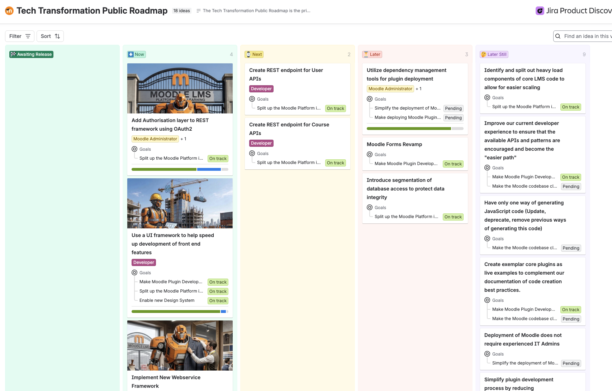

Our Moodle LMS Products roadmaps are designed to provide visibility on the development priorities of each of our Moodle LMS teams, consisting of Moodle LMS Core, Community Contributions and Tech Transformation.

Our roadmaps for Moodle LMS are public, open, and living - you can see them at any time by clicking on the links below.

import Link from '@docusaurus/Link';

:::tip[LMS Core Roadmap]

Our Moodle LMS Core team focuses on work that enhances the usability and core functionality of the platform.

<Link
  to="https://moodle.atlassian.net/jira/discovery/share/views/51c88795-9eba-4540-b530-5a6da3ea06e1"
  title="LMS Core Roadmap"
  >

  

</Link>
:::

:::tip[Community Contributions Roadmap]
Our Community Contributions team works on core functionality via project-based collaboration with developers from our community, including Moodle Certified Partners.
<Link
  to="https://moodle.atlassian.net/jira/discovery/share/views/7d68825c-2660-4596-bbc5-7cdf64d1b0a0"
  title="Community Contributions Roadmap"
  >

  

</Link>
:::

:::tip[Tech Transformation Roadmap]
Our Tech Transformation team focuses on work that modernises the technical foundations of the platform.
<Link
  to="https://moodle.atlassian.net/jira/discovery/share/views/ac00910e-a895-4d4d-9edc-580dc087bafe"
  title="Tech Transformation Roadmap"
  >

  

</Link>
:::

## What is Moodle's LMS product strategy?

Moodle exists to make learning accessible to everyone, regardless of location or financial situation, cultivating a community of lifelong learners and helping every person unlock their full potential.

Every product decision is guided by our commitment to creating solutions that are user-focused, mindfully changing our platform to avoid unnecessary disruption to our users, and a non-negotiable commitment to security, accessibility and compliance.

These principles sit alongside our belief that AI should support teaching and learning, not replace it, always human-centred and always leaving educators in control.

Moodle LMS carries that mission into reality by equipping educators to design courses grounded in good practice. As learning content becomes commoditised and AI can generate a course in minutes, our focus is on what AI can't replace: learning designed with intent, connected to outcomes, and worth a learner's time.

By FY29, Moodle LMS will be both intuitive and powerful: the most educator-focused LMS in the world, chosen because it drives better teaching outcomes at scale.

To get there, we will focus on the following areas when developing future versions of Moodle LMS

**Unlocking Creativity**

We aim to help educators focus on what they want to teach, not how to use the platform, making Moodle LMS more intuitive so imagination and pedagogy come first. This will be achieved through:

- A platform-wide visual uplift, delivering a smoother first impression and a consistent, modern design language
- Outcomes-first course design, with guided design and modern authoring support built in
- Embedding Learning Design frameworks directly into course creation, diversifying how educators build content

**Facilitating Collaboration**

We will keep Moodle LMS working seamlessly within broader technology ecosystems, making it easier to extend and upgrade, without compromising our open source foundation. This will be achieved through:

- Supporting plugin development, giving partners and developers a stable foundation to innovate on
- Deepening LTI integration, moving LTI into the core so tools embed flexibly rather than as bolt-ons
- Capitalising on our open source model for AI integrations, choice and diversity of model options, no lock-in

**Optimising Outcomes**

We aim to reduce the friction educators face in managing courses and helping learners succeed, so that Moodle continues to earn their advocacy. This will be achieved through:

- Premium marking workflows, including multiple marking, individual feedback management, and moderated double marking
- A leaner, more modern platform that reduces time and cost in course management
- Helping educators align activities to learning outcomes with confidence, giving learners clearer paths to success

**How can I get involved?**

To join the voice of our community, provide input on our roadmaps and guide what we build next, you can join our different LMS PAGs. To find out more, visit the sites below:

&nbsp;&nbsp;&nbsp; [Moodle LMS Community PAG](https://moodle.org/lms-community-pag)

&nbsp;&nbsp;&nbsp; [Developer meetings](https://moodle.org/mod/bigbluebuttonbn/view.php?id=8596)

&nbsp;&nbsp;&nbsp; [Technical Transformation PAG](https://moodle.org/course/view.php?id=17257)

To find out more about Moodle release timeframes, please visit our [Releases](../../releases.md#general-release-calendar) page.
