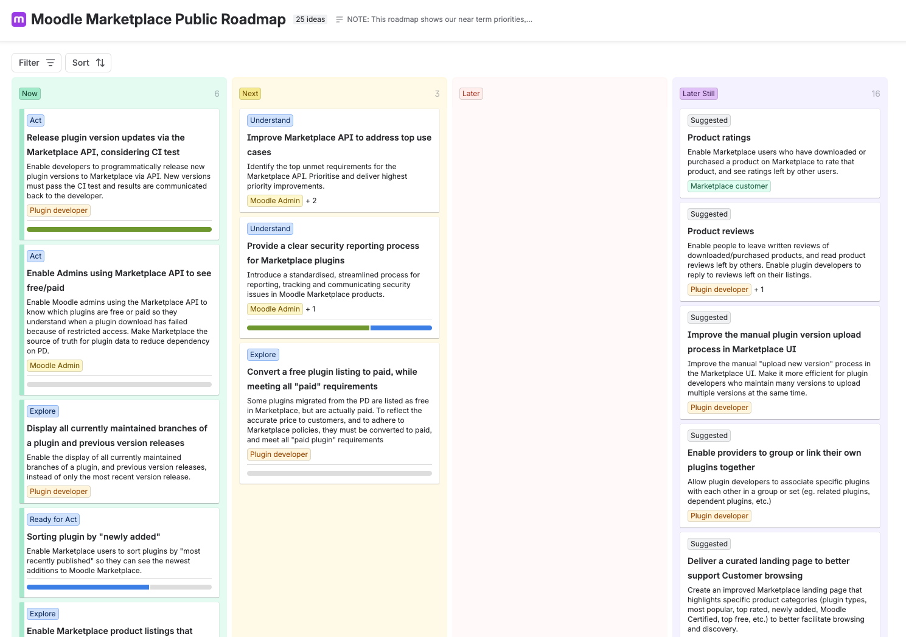

Our Moodle Marketplace roadmap is designed to provide Moodle users and the Community Developers who contribute to the Moodle plugin and extensions ecosystem with visibility of upcoming enhancements and changes to that platform.  

import Link from '@docusaurus/Link';

:::tip[Marketplace Roadmap]
Our Moodle Marketplace roadmap is public, open, and living - you can see them at any time by clicking on the links below.

<Link
  to="https://moodle.atlassian.net/jira/discovery/share/views/7fc6e7cf-e7ca-433d-a13b-d0682301a1fa)"
  title="Moodle Marketplace Public Roadmap"
  >

  

</Link>
:::

## What is the Moodle Marketplace product strategy?

Moodle exists to make learning accessible to everyone, regardless of location or financial situation, cultivating a community of lifelong learners and helping every person unlock their full potential.

Every product decision is guided by our commitment to creating solutions that are user-focused, mindfully changing our platform to avoid unnecessary disruption to our users, and a non-negotiable commitment to security, accessibility and compliance.

Moodle Marketplace is the new platform for discovering, evaluating and accessing Moodle-compatible plugins and integrations.

We created Moodle Marketplace to make it easier for Moodle users to find high-quality free and paid plugins and integrations to enhance their Moodle sites.

Moodle Marketplace prioritises the health and vibrancy of the Moodle ecosystem; it supports the HQ-led development of Moodle LMS while giving developers in our community a way to showcase and sustain their work.

**How can I get involved?**

To join the voice of our community, provide input on our roadmap and guide what we build next, you can join our Marketplace PAG. To find out more, visit the site below:

&nbsp;&nbsp;&nbsp;[Moodle Marketplace PAG](https://moodle.org/course/view.php?id=17260)
