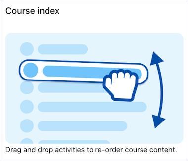

## What does accessibility mean?

At Moodle, we prioritise accessibility, ensuring our software meets the latest standards. Accessibility means that everyone can access the same information and participate in the same activities in a similar amount of time and effort. This includes people with disabilities and those who use assistive technologies, such as screen readers or voice recognition software. Making something accessible also makes it easier to use for everyone, improving the overall experience.

Our [content principles](./contentprinciples.md) make sure that we write in an accessible, useful, and inclusive way. While these principles already incorporate accessibility best practices, this section highlights key writing guidelines specifically aimed at meeting WCAG 2.2 AA compliance. Use these guidelines to create accessible product experiences in Moodle.

## Writing accessible interfaces

### Links

Clear and descriptive links help users understand the purpose of each link without needing extra context. People using assistive technologies often navigate a page by moving from link to link using the tab key, or generating a list of links for quick navigation. Meaningful link text ensures these users can easily find what they need.

To make your link text meaningful and useful:

#### Describe the destination of the link

Use clear language to let the user know where the link will take them.

<ValidExample title="Do">

View accessibility guidelines

</ValidExample>

<InvalidExample title="Don't">

Click here

</InvalidExample>

#### Avoid using generic phrases

Generic phrases such as 'Read more' are ambiguous, so use descriptive text instead. Screen readers often allow users to navigate from link to link in isolation, meaning they will not hear the surrounding text for context. Descriptive link text ensures users know where the link will take them, even without additional context.

<ValidExample title="Do">

**Learn more about our plans**

A user hearing this will know where the link will take them.

</ValidExample>

<InvalidExample title="Don't">

**Learn more**

Even if this link is under a section called 'Our plans', people using screen readers might navigate directly to the link and not have the section title context.

</InvalidExample>

#### Don't use the same link text for different destinations

This is confusing for users, especially those using screen readers, as they might assume the links lead to the same place. If you must use the same link text, make sure each link has a descriptive aria-label that clearly explains its purpose.

#### Be consistent with link text for the same destination

Use the same text for the same destination, even if the link appears in different places or components on the page.

For example, if a link to a map appears in a paragraph and also in a button, you should use the same link text. This helps users recognise repeated links, understand their purpose, and navigate with confidence.

#### Match the link text to the title of the destination page

This helps users know they are in the right place.

<ValidExample title="Do">

A link with the text **Assign system roles** takes to a page with the title **Assign system roles**.

</ValidExample>

<InvalidExample title="Don't">

A link with the text **Assign system roles** takes to a page with the title **Manage roles in system**

</InvalidExample>

#### Avoid links opening in new windows

Opening links in new windows can confuse users, especially those with cognitive difficulties, as it disables the back button.

The only exception to opening links in new windows is when the link provides help or additional information needed to complete a form or activity on the current page.

For more information, see [WebAim: Links to New Windows, Pop-ups, Other Frames, or External Web Sites](https://webaim.org/techniques/hypertext/hypertext_links#new_window).

### Headings

Use headings to organise content hierarchically.

Headings must provide a clear outline of the content, to make it easier for everyone to understand the page structure, especially people using screen readers.

To ensure your headings are effective:

#### Follow a logic hierarchy

Use H1 for the main title of the page, H2 for main sections, H3 for subsections, and so on.

<ValidExample title="Do">

Use headings to create a clear content or information hierarchy.

</ValidExample>

<InvalidExample title="Don't">

Pick headings or paragraphs based on font size or style.

</InvalidExample>

#### Don't skip heading levels

Skipping from H1 to H3, for instance, breaks the reading order and can be confusing for people using assistive technologies.

<ValidExample title="Do">

```
<h1>Main title</h1>
<h2>Section title</h2>
<h3>Subsection title</h3>
```

</ValidExample>

<InvalidExample title="Don't">

```
<h1>Main title</h1>
<h3>Section title</h3>
```

</InvalidExample>

For more information, see [WebAIM: Headings](https://webaim.org/techniques/headings/).

### Alternative (alt) text

Alt text, or alternative text, is a short description of an image. It is read aloud by screen readers to make content accessible to people with visual impairments. It also appears if the image fails to load. Alt text should provide meaning and context without unnecessary detail.

To make your alt text effective:

#### Be specific and concise

Keep alt text short and to the point.

If an image conveys so much information that it requires more than three sentences to describe, provide a more detailed explanation in the surrounding text, or link to an accessible format, such as a long description.

#### Focus on the image's purpose

Describe what the image does, not what it looks like. If an image is not necessary for the user to complete a task or understand information, it most likely doesn't need alt text.

#### Avoid redundancy

Consider the context of the image and avoid repeating information already provided in nearby text. For example, if you write a clear, detailed description on how to do something, and also include a screenshot to illustrate it, adding alt text may be redundant.

Example:



In this case, the alt text 'A mouse hand drags an activity in the course index to reorder it' would be redundant with the image caption.

#### Skip decorative images

Images that don't provide essential information don't need alternative text.


In this case, the image is only decorative and doesn't add any information needed to complete the task of searching for a user.

:::info

**Exception**

If an image is the only content within a link, then you must write alternative text for it, even if it may seem repetitive or redundant. In these cases, screen readers will read something like 'Link, Image, [Your alt text]'.
Without alternative text, screen readers may announce the image's file name or the URL, which is not as useful as knowing where the link will go.

:::

For more information, see [WebAIM: Alternative text](https://webaim.org/techniques/alttext/).

### ARIA labels

ARIA labels ensure that people who use assistive technologies, like screen readers, can fully understand and interact with all the elements on our site, such as buttons or forms.

When writing aria labels:

#### Avoid redundancy

If an element already has visible text, don't repeat it in the ARIA label. For example, a button that reads "Submit" does not need an ARIA label because it's already accessible.

<ValidExample title="Do">

```
<button>Submit form</button>
```

No aria-label needed, because the button already explains the action.

</ValidExample>

<InvalidExample title="Don't">

```
<button aria-label="Submit form">Submit form</button>
```

</InvalidExample>

#### Focus on purpose, not appearance

Describe what the element does, not what it looks like or what it is. For example, for a search icon, use "Search the site" instead of "Magnifying glass icon".

<ValidExample title="Do">

'Open site menu' explains what that element does.

</ValidExample>

<InvalidExample title="Don't">

'Site menu' says what this element is, but not what it does.

</InvalidExample>

#### Be precise and informative

Instead of generic labels like "Close", use "Close menu" or "Close dialog" to provide context.

<ValidExample title="Do">

'Close menu' or 'Close dialog' provide context and are precise.

</ValidExample>

<InvalidExample title="Don't">

'Close' is ambiguous.

</InvalidExample>

For more information, see [WebAIM: ARIA Labels and Descriptions](https://webaim.org/techniques/aria/#labeling).

### HTML page titles

The HTML 'title' element sets the page title that is displayed in browser tabs, and is the first thing screen reader users hear when they access a page.

To ensure users can easily identify and navigate between different pages, do the following when writing page titles:

#### Write a short title

#### Describe the purpose or topic of the page

This helps the user understand where they are and what they can do there.

<ValidExample title="Do">

Change password | [Site short name]

</ValidExample>

<InvalidExample title="Don't">

Password | [Site short name]

</InvalidExample>

#### Make page titles specific and unique

Write a title that is specific to the page and not easily used on other pages of your site or related sites.

<ValidExample title="Do">

Edit Assignment: [Assignment name] | [Course name] | [Site short name]

</ValidExample>

<InvalidExample title="Don't">

Edit activity

</InvalidExample>

#### Put important, unique information at the beginning

This makes the important information visible in the browser tab, and also means screen readers will read that first.

<ValidExample title="Do">

Edit Assignment: [Assignment name] | [Course name] | [Site short name]

</ValidExample>

<InvalidExample title="Don't">

[Site short name] | [Course name] | Edit Assignment: [Assignment name]

</InvalidExample>

#### Reflect the page status

Make sure the title indicates the current status of the page. For example, if a page involves editing, the title should clearly state this:

<ValidExample title="Do">

Edit Assignment: [Assignment name] | [Course name] | [Site short name]

This title tells users that they're editing an assignment.

</ValidExample>

<InvalidExample title="Don't">

Assignment [Assignment name] | [Course name] | [Site short name]

This title doesn't tell users that they're editing an assignment.

</InvalidExample>

#### Maintain consistency with link text

When users click a link, the title of the page they navigate to should match the link they clicked. This reinforces their sense of continuity and location.

<ValidExample title="Do">

Users click on a link with the text **Course participants**, and the destination page title is **Course participants**.

</ValidExample>

<InvalidExample title="Don't">

Users click on a link with the text **Course participants**, and the destination page title is **Enroled participants**

</InvalidExample>

For more information, see [WEBAIM: Page titles](https://webaim.org/techniques/pagetitle/).

## References

We encourage you to read these comprehensive guidelines for more detailed information, specific examples, and a deeper understanding of general accessibility best practices.

[Australian Government Style Manual](https://www.stylemanual.gov.au/)

[Open Accessibility Standards](https://pauljadam.github.io/a11y-standards/index.html)

[WCAG 2.1 Understanding Docs](https://www.w3.org/WAI/WCAG21/Understanding/)

[WebAim: Simplified examples of how to implement WCAG 2](https://webaim.org/articles/)

You can also check out the free course [Accessible Development Practices](https://moodle.academy/enrol/index.php?id=54) at Moodle Academy.
