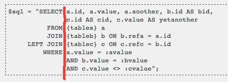

This page describes recommended coding style for complex database queries.

Full SQL queries are used in `$DB->get_records_sql()`, `$DB->get_recordset_sql()`, or `$DB->execute()`.

SQL fragments may be used in DML method with _select() suffix.

## General rules

- Use parameter placeholders.
- All SQL keywords are in UPPER CASE.
- All SQL queries and fragments should be enclosed in double quotes.
- Complex SQL queries should be on multiple lines.
- Multiline SQL queries should be right aligned on SELECT, FROM, JOIN, WHERE, GROUPY BY and HAVING.
- Use JOIN instead of INNER JOIN.
- Do not use right joins.
- Always use AS keyword for column aliases.
- Never use AS keyword for table aliases.
- Use `<>` for comparing if values are not equals and do not use `!=`.

## Double quotes

All sql queries and fragments should be enclosed in double quotes, do not concat SQL from multiple parts if possible. The single quotes are used for sql strings, it also helps with visual highlighting and SQL code completion in some IDEs.

```php
$records = $DB->get_records_select('some_table', "id > ?", [111]);
```

## Parameter placeholders

All variable query parameters must be specified via placeholders. It is possible to use three different types of placeholders: `:named`, `?` and `$1`. It is recommended to use named parameters if there is more than one parameter.

```php
$sql = "SELECT *
          FROM {some_table}
         WHERE id > :above";
$records = $DB->get_records_sql($sql, ['above'=>111]);
```

## Indentation



## Subqueries

There are no strict rules for subquery indentation, the deciding factor is good readability - see [MDLSITE-1914](https://tracker.moodle.org/browse/MDLSITE-1914).

## See also

- [Data manipulation API](/docs/apis/core/dml)
- [Database](https://docs.moodle.org/dev/Database)
- [Coding style](./index.md)
