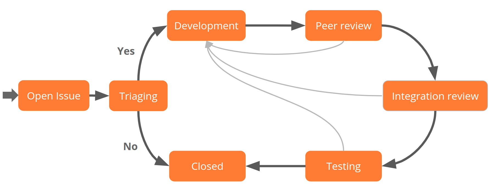

This document summarises the various development processes used in developing Moodle. There are four main processes that overlap.

## Integration workflow in the tracker

The Moodle tracker keeps track of the status of all bug fixes and new features.

We use a workflow that ensures that new code receives multiple reviews by different people before it is included into the core Moodle code.



- The [triaging](#issue-triage) is done by the Component leads.
- Anybody can participate in the issue [development](./index.md), by creating a patch for [a bug](#fixing-a-bug), [an improvement](#new-feature-development) or [a security issue](#security-issues).
- Anybody can also [peer review](./process/peer-review/index.md) code developed by other developers.
- There is a dedicated team in Moodle HQ in charge of the [integration review](./process/integration/index.md), to ensure consistent quality across the codebase.
- Every time an issue is integrated, the [testing](./process/testing/index.md) instructions are run by a dedicated team of testers.

## Roles

A number of roles make this work:

### Users

Users report bugs and make feature requests directly in the tracker, by creating new issues with a summary and a description.

### Developers

Developers work on the issues in the tracker to specify solutions and write code that implements these solutions. They will often ask other developers to _peer review_ their code in the early stages to avoid problems later on.

While many of the developers work for Moodle.com, a large number are part of the global development community around Moodle. If you're interested in becoming a recognised developer, see [Tracker groups and permissions](./tracker/guide#tracker-groups-and-permissions).

### CiBoT

CiBoT is not a person but a bot who monitors the tracker and performs the [Automated code review](./tools/cibot.md) when issue is submitted for Peer review or when developer added `cime` label.

### Component leads

[Component leads](https://tracker.moodle.org/projects/MDL?selectedItem=com.atlassian.jira.jira-projects-plugin:components-page) are developers with some responsibility for particular components (plugins or modules) in Moodle. They have authority to decide that a particular fix is suitable and complete enough to be considered for integration in Moodle core and should be called upon to complete peer reviews for code in their components. Note that, apart from that, every component also has some [HQ Component leads](https://docs.moodle.org/dev/Component_Leads) that will specifically work on associated issues, triaging, monitoring, reviewing, fixing them.

### Component leads reviewers

Component Lead Reviewers are Component Leads who have the added responsibility of performing a second and final review of a selection of issues within their component.
After reviewing the code, it is sent to the integration team to be pulled without further review.

### Integrators

From Monday to Thursday, the integration team (a small team of senior developers employed by Moodle HQ) conducts a code-level review of all issues in the integration queue. This is often called the "pull" process. If the fix is judged appropriate they will integrate the code into our git integration repository for further testing and it gets added to the testing queue.

If they find problems they reject the issue and send it back to the developer for further work.

### Testers

During each week the testers look at all the issues in the testing queue, trying each fix and feature to make sure that it does actually fix the problem it was supposed to, and that there are no regressions in the web version and the Moodle mobile app.

If they find problems they reject the issue and integrators may remove it from the integration repository and push it back to the developer for further work.

See [Testing of integrated issues](./process/testing/integrated-issues.md) for more details.

### Production maintainers

On Thursday each week, production maintainers merge all the issues that passed testing into the git production repository, and it becomes available for use on production systems via git and download packages.

## Stable maintenance cycles

Moodle releases regular updates of the stable version of the software to fix bugs and other issues. Releases like 2.2.1, 2.2.2, 2.2.3 etc only include fixes based on the latest major release (2.2) and never any significant new features or database changes.

At Moodle HQ there are teams of developers using the [Scrum framework](http://www.scrum.org/) to work on these issues (as well as new features for [major releases](https://docs.moodle.org/dev/#Major_release_cycles)).

### Minor release (point release) timing

After [major releases](https://docs.moodle.org/dev/#Major_release_cycles) there will be minor releases.

- x.x.1 will occur approximately two months after each major release (eg. 4.x).
- There will then be another point release every two months after that.
See the [General release calendar](../releases.md#general-release-calendar) for details.

### Issue triage

[Issue triage](./process/triage) involves evaluating new issues, making sure that they are recorded correctly. One of the most important jobs triagers do is to identify issues that should be fixed in the stable branch. These are set with a priority ranging from _Trivial_ up to _Blocker_ and other features are checked.

At Moodle HQ there are currently teams working on stable issues (mostly bugs reported by users) and improvements and new features (Partners, Moodle Association, user suggestions and Martin Dougiamas).

### Scrum

At Moodle HQ, every three weeks, the stable team takes a number of the most urgent issues from the backlog to work on during a period known as a _sprint_.

At the start of a sprint there is a period of planning and estimation. All issues on the backlog are given a relative rank that is based on issue features including priority, security, Partner interest, patches and votes. Issues are given a relative size in Story Points and these points are summed to allow the teams to determine how many issues they can work on in the sprint.

During the sprint, the team meets daily to discuss solutions and progress, as well as to organise testing and peer reviews of code. The team has a _Scrum master_ to help everyone stay organised, to "unblock" any barriers to progress and to protect the team from distracting influences (mostly people attempting to add to the developers' workloads) during the sprint. The teams' work is documented publicly in the tracker.

Whenever a solution for an issue is finished, it is submitted to the standard integration workflow process described above.

## Major release cycles

Moodle release versions are in the format x.y.z where the x.y is a major release, and the z is a minor release.

<Since version="2.0"/>

Since Moodle 2.0, we have a policy of release major versions (for example 4.0, 4.1) every six months in May and November.

<Since version="4.2"/>

Since Moodle 4.2, Moodle major versions (for example 4.2, 4.3, 4.4, etc.) are released every six months in April and October.

Releases are in weeks 17, and 43 of the year.

There will be a point release every two months following a major release. See the [General release calendar](../releases.md#general-release-calendar) for more details.

:::note

Each release can be different, but generally the cycles work as follows.

:::

### Define roadmap

The roadmap is prioritised based on user research, stakeholder inputs, community wishes, third-party developments and important issues within the existing code.

Sometimes new features might be based on earlier features, sometimes they may be something developed by a third party that needs to be evaluated and sometimes it might be something completely new.

### Planning and development

The product teams together with UX, employed at Moodle HQ, work on specifications of major new features throughout the cycle, specifying projects ahead of development time.

The process of [new feature development](#new-feature-development) is described below. When specifications are in place, new code is developed during sprints, where designs and implementation are iterated as required, and goes through the standard weekly integration workflow described above.

### Testing

During development, as new code is integrated, automated testing conducted at the [code](./tools/phpunit/index.md) and [interface](./tools/behat/index.md) levels, to make sure there are no regressions caused by new features.

In the last month before the release, a feature freeze is called (no new features can be added) and volunteer testers from the Moodle community perform manual [QA testing](./process/testing/qa.md) of Moodle features. The current set of functional tests is listed in [MDLQA-1](https://tracker.moodle.org/browse/MDLQA-1). The list of tests is extended as new features are added, though we're also trying to reduce the number as more automated [acceptance tests](./tools/behat/index.md) are developed.

There is also a set of tests for manually testing any major theme changes - [MDLQA-11592](https://tracker.moodle.org/browse/MDLQA-11592).

For more details, see [Testing](./process/testing/index.md).

### Sprints

At Moodle HQ, development takes place in sprints. The sprints are two or three-week periods during which developers to focus on a fixed list of issues. For example, sprints can be arranged within each release cycle as shown in the diagram below.

### Events during cycle

During each cycle there are a periods and events that occur between and around sprints.


**Planning and bug fixing** <br/>
A period during which the Roadmap is explored, specs are written and prototypes are created. Regressions in the recent release are fixed as they arise.

**End sync period** <br/>
During the [on-sync period](./process/integration/index.md#on-sync-period), the recent release and main versions are kept synchronised. No new code is added during this period, which ensures regressions are fixed rapidly. This also allows for planning and provides relief for developers after a release.

**Personal projects** <br/>
Affecting full-time HQ developers only, this period allows for individual creations to be explored and provides a break from sprints.

**Code freeze** <br/>
A point after which no new code (only fixes to existing code) is accepted until beyond the release. This stabilisation allows for [QA testing](./process/testing/qa.md).

**QA, bug fixing, continuous integration** <br/>
A period after the code freeze where quality assurance testing takes place. No new code is added, which means developers are able to respond rapidly to bugs found. Integration becomes [continuous](./process/integration/index.md#during-continuous-integrationfreezeqa-period), meaning that failed QA tests can be re-run within days rather than having to wait for the weekly release.

**Release candidate** <br/>
A point prior to the full release where a candidate is made public for wider testing.

## New feature development

Major new features in Moodle usually should go through the following process.

### Specification

The User Experience (UX) team members create detailed wireframes and features and goals for the new feature, based on iterative user research, design sprints, user testing and co-design as part of the product team.

For bigger features there should be a clear overall vision for the outcomes that are to achieved. During implementation design may continue to iterate based on new findings.

Developers create a detailed spec (here in the developer docs) outlining their goals for the development and their design for meeting those goals.

Developers should also create an issue in the tracker (linking to your docs) to keep track of the project status.

### Community consultation

Get the community involved in looking at the spec to see if it meets their needs and to get further feedback. Please post in the [Future major features forum](http://moodle.org/mod/forum/view.php?id=8052) on moodle.org. You could also blog/tweet about it etc.

Community developers proposing a new feature will want to talk with HQ core developers to make sure the ideas make sense, and possibly get some review on database design, architecture and so on.

### Develop the code using Git

Develop your code on an open Git repository, like github.com. That enables people to see your code and to help you as it develops. Testers and early adopters also have the opportunity to try it early in the process and give you more valuable feedback.

Coverage with automated tests ([PHPUnit](https://docs.moodle.org/dev/PHPUnit) or [Behat integration](https://docs.moodle.org/dev/Behat)) is mandatory for new features.

It is essential that your code follows the [Moodle Coding Guide](./policies.md).

### Submit your code for peer review

Click on _Request peer review_ button in the tracker.

You need to fill in the information about your public git repository and which branches the fixes are on. Make sure you are listed as Assignee.

This would be a good time to fill in the testing instructions (read the [instructions guide](./process/testing/guide)) for how to verify your fix is correct. You may also wish to add a comment in the bug.

Component leads should put issues, which affect code in their components, up for peer review to allow interested parties to provide feedback. However, if it is not reviewed in a week, a component lead may send the issue to integration. If integrators consider that the issue has not been given proper chance for peer review (for example is extremely large or complex) it can be decided to move the issue back in the process.

All other developers, including people who are component leads but working outside their component, should have their issues peer reviewed before they are sent to integration.

### Peer review

The [HQ component leads](https://docs.moodle.org/dev/HQ_component_leads) should peer-review the change. If there is no component lead for an affected component, any other recognised developer may complete the peer review. The peer reviewer will either give you comments on the code and if it needs more work.

Process and the list of things to check are described in [Peer reviewing](process/peer-review).

### Submit the code for integration

The developer is responsible for acting on the feedback from the peer reviewer. If changes have been made and the developer is satisfied that this has accommodated the feedback from the peer reviewer, then the developer can submit the issue for integration. If there have been significant changes after the peer review, or if the peer reviewer has raised concerns about the approach taken, then the developer should offer the issue up for peer review again, most often to the same peer reviewer, but not necessarily.

Submitting an issue to integration is much the same as for any Moodle code. In some cases the Component Lead may perform a Component Lead Review instead of the integration team. See [Integration Review](./process/integration/index.md) and the information about the integration workflow above.

## Fixing a bug

Bug fixes, and minor features or enhancements should go through the following process. (The only exception is English language string typo fixes or suggested improvements, which may be contributed to the `en_fix` language pack on the [Moodle translation site](http://lang.moodle.org/).)

### Make sure there is a tracker issue

Every change must have an issue in the tracker. If you are fixing a bug, there is probably one there already, but if not, create one. [Tips for searching tracker](./tracker/tips/index.md).

### Decide which branches the fix is required on

Bugs should normally be fixed on all the supported stable branches that are affected. New features should just go into main, but sometimes minor enhancements are made on the most recent stable branch.

### Develop your change using git

Develop your fix and push the change to an open git repository, for example on github.com. See also [Git for developers](/docs/guides/git/)

It is essential that your code follows the [Moodle Coding Guide](./policies.md).

You will need to push one commit for each branch the fix needs to be applied to. Often people use branch names like `MDL-12345-31_brief_name` so it is clear what each branch is. [git cherry-pick](http://kernel.org/pub/software/scm/git/docs/git-cherry-pick.html) can help with replicating the fix onto different branches.

Consider setting up [GitHub Actions integration](https://moodledev.io/general/development/tools/gha) with your repository so tests will be automatically run for you whenever you push work on your fix.

### Submit your code for peer review

Once your fix is done, it should be submitted for a peer review.

The following information is necessary for this:

- Information about your public git repository
  - repository URL
  - branch name(s)
  - diff URL
- [Testing instructions](./process/testing/guide) for how to verify your fix is correct.
If you have never contributed to Moodle and don't see a button _Request peer review_, just comment on the issue with the above information. The component lead or another user with sufficient privileges will then send the issue up for peer review for you.

After your first fix is integrated you will be added to developers group and will be able to send issues for peer review yourself. In this case make sure you are listed as Assignee and click on _Request peer review_ button in the tracker.

If you've set up [GitHub Actions integration](https://moodledev.io/general/development/tools/gha), the issue will automatically show the GHA build status for the branch(es) you've submitted for peer review.

### Peer review

The [HQ component leads](https://docs.moodle.org/dev/HQ_component_leads) should peer-review the change. If there is no component lead for an affected component, any other recognised developer may complete the peer review. The peer reviewer will either give you comments on the code and if it needs more work.

Process and the list of things to check are described in [Peer reviewing](process/peer-review).

### Submit your code for integration

It will then be reviewed the following week by one of the integration team and either integrated or rejected. Once integrated, the fix will be tested, and then included in the next weekly release. For details see [Integration Review](./process/integration/index.md).

## Security issues

Issues identified as [security issues](./policies/security/index.md) are resolved in a slightly different way, in order to achieve responsible disclosure as described in [Moodle security procedures](./process/security/index.md).

- Security issues should be labelled as "Minor" or "Serious" in order control visibility of the issue.
  - An issue reported with a security level of "Could be a security issue" should be evaluated as soon as possible and either set as "Minor" or "Serious" or the security level should be set to "None".
- Solutions to security issues should not:
  - be made available in public repositories.
    - If a developer has shared a solution as Git branches via Github, they should be asked to provide the solutions as [stand-alone patches](https://docs.moodle.org/dev/How_to_create_a_patch) attached to the issue and to [remove the solution from Github](https://docs.moodle.org/dev/#How_to_remove_a_branch_from_Github).
  - contain details about the security problem in the commit message.
    - Instead use generic terms like, "improve", "better handling of"
- The solution will not be integrated until the week before a [minor release](#stable-maintenance-cycles) following the normal [Release process](./process/release/index.md). In short, the issue will be incorporated into the integration version, rebased, tested and made ready for release as a normal issue would, but not until as late as possible.
- Details of security issues will be shared with registered admins with the minor release.
- Details of security issues will not be publicly announced until one week after a minor release to allow admins to update.
Note that not all the labelled (minor) security issues are always handled following the procedure above. It's possible that, after discussion, it's decided a given issue is not a real Moodle security problem (say external disclosures/potential attacks using Moodle as vector, not as target, discussions revealing some private details). Those issues will be processed as normal issues, generating the needed user documentation if necessary and will be part of the habitual weekly releases.

### How to remove a branch from Github

To remove a branch from Github, you can use the following command.

```
git push github :remote_branch
```

Where `remote_branch` is the name of your remote branch, for example `wip-mdl-1234`.
This effectively replaces the remote branch with nothing, removing the remote branch, but leaving the branch intact in your local Git repository. Please note that its likely that your commit will still exist on github due to the nature of git, so its best to avoid doing this in the first place.

## Policy issues

Occasionally within Moodle we run into policy issues where a high-level decision needs to be made about how things are to be done.

In these cases the process is as follows:

- Create an issue in the tracker with a [Policy component](https://tracker.moodle.org/browse/MDL/component/12733) and put `POLICY:` as a prefix on the summary.
- In the description describe the problem clearly as well as all the options. If it's long then make a page here in Moodle Dev Docs and link to it.
- Do not use this issue for code. If there are issues that depend on this policy decision, then add tracker links to them as dependencies.
- Feel free to encourage people to come and talk about the policy to support various points of view. The more evidence we have (from everyone in the community) the better.
Some time has been scheduled in the weekly Moodle HQ meeting to look at Policy issues and try to make decisions on them. We discuss all the evidence and try to achieve a high amount of consensus. Deadlocked issues can be resolved by a decision from Martin Dougiamas (this is rarely needed).

Decisions will be posted on the issue and that issue will be closed, allowing any dependent issues to continue to integration (or not). Decisions are final and bribes hardly ever work.

## See also

- [Detailed workflow](./process/_files/workflow.jpg)
- [Release process](./process/release)
- [Deprecation](./policies/deprecation/index.md)
- [Integration dashboard](http://tracker.moodle.org/secure/Dashboard.jspa?selectPageId=11350)
Walks-though of the process for contributors:
- By Dan Poltawski, Integrator: http://www.slideshare.net/poltawski/how-to-guarantee-your-change-is-integrated-to-moodle-core, https://www.youtube.com/watch?v=836WtnM2YpM
- By Tim Hunt, contributor: http://tjhunt.blogspot.co.uk/2012/03/fixing-bug-in-moodle-core-mechanics.html and https://www.youtube.com/watch?v=gPPA3h7OGQU and https://youtu.be/Hu8ne0NCRAg?t=11659
