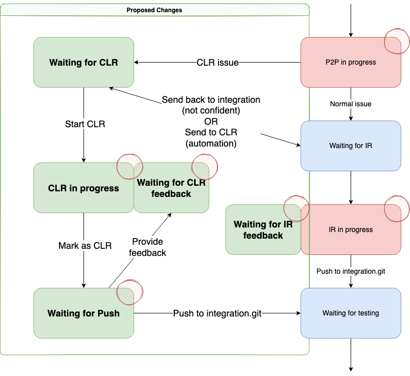

This document summarises the intent, purpose, and process surrounding component lead reviews (CLR).

:::warning Please note:

The component lead review process (CLR) is new and currently open by invitation only.

:::

## Purpose

The purpose of the component lead review is to:

- Ensure consistent quality across the codebase
- Ensure that the pedagogical aims of Moodle are at the forefront of any change
- Take into consideration the holistic view of moodle, looking at the impact beyond where the original developer was focused
- Provide guidance and feedback to developers, helping them learn and improve
- Consider **other perspectives** of other users perhaps not considered by original developers, for example:
  - Teachers
  - Students
  - Administrators
  - The Moodle mobile app
  - Third-party developers

The component lead review process must consider the [Integration principles](./index.md#integration-principles) at all times.

## Issues appropriate for CLR

:::caution Attention

You should only consider issues which belong to your own component for CLR.

:::

Not all changes are suited to the component lead review process. Whilst most of these will be automatically categorised and will not be included in the CLR queue, some situations may be missed. If in doubt, the following are not suited to the CLR process:

1. Major API changes
1. Major User Interface changes
1. Introduction of new components (plugins, or subsystems)
1. Introduction of new third-party libraries
1. Changes to core subsystems and/or infrastructure
1. Changes to themes

If you are uncertain about a change, and do not feel confident in landing it, please pass it to the **Integration Review** queue instead.

## Considerations

The Component lead review process requires you to:

1. Check the result of automated pre-checks run against the continuous integration server.
1. Perform a final code review, much like the peer review, except that this is the final check. This:
   1. Takes place in-situ (against the integration branches) to examine the impact of the changes with other integrated issues
   1. Includes checks:
       1. for the coding guidelines - syntax/whitespace
       1. for Moodleisms - using the built-in API functions where appropriate
       1. with regards Cross-DB compatibility
       1. security
1. Check the purpose of the change - the patch needs to fix the issue reported.
1. Verify that target branches are appropriate -- they must match 100% the rules defined for [backporting issues](../../policies/backporting.md).
1. Ensure backwards compatibility is maintained. As a starting point backwards compatibility must always be maintained. Where backwards compatibility is affected it should be:
   1. Well discussed with evidence of justification
   1. Documented and communicated to the community
1. Ensure backwards compatibility with the Moodle mobile app. Especially in areas where the Moodle app uses pre-rendered content from the site (like Quiz or Lesson)
1. Verify that components are correct and check the right people have been involved (for example, component maintainers)
1. Tests - must be written to guide tester to verify the fix is working.
   1. Manual tests should adhere to the [testing guidelines](../testing/guide.md)
   1. Unit tests - very much preferred if applicable
   1. Behat tests - preferred if relevant
1. Check performance - we have to look at maintaining optimum code here, as far as simple patches that can affect performance. (simple optimisations)

## Process

The process of component lead review is summarised in the following process workflow:

To summarise:

1. Component leads who have been allocated the CLR role are able to take issues from the [Waiting for CLR queue](https://tracker.moodle.org/) and progressed them the `CLR in progress` state.
1. If information, or changes are required from the original developer then they may optionally be progressed to the `Waiting for CLR feedback` status to allow the assignee time to respond.
1. After the review has been completed, and all issues addressed, the issue status is updated to the `Waiting for Push` state.
1. An integrator will pick issues from the push queue, and perform final superficial checks on them, before landing them.

:::note

- Component leads may only review issues in their own component
- Only issues in the CLR queue should be picked
- If you are uncertain about a change, or feel that it does not meet the criteria for component lead review, please send the issue to the standard Integration queue.

:::

## Schedule

Component lead reviews may take place at any time, however, the push queue is progressed according to the standard [integration review schedule](./index.md#schedule).

## Becoming a component lead reviewer

:::info

At this time the CLR process is by invitation only while the finer details are confirmed.

:::

The role of component lead reviewer is only available to those who are a component lead, and who have demonstrated a high level of detail in their own issues, and peer reviews.
