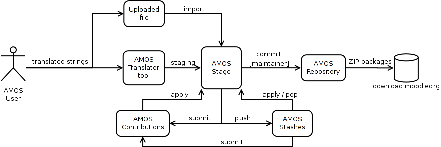
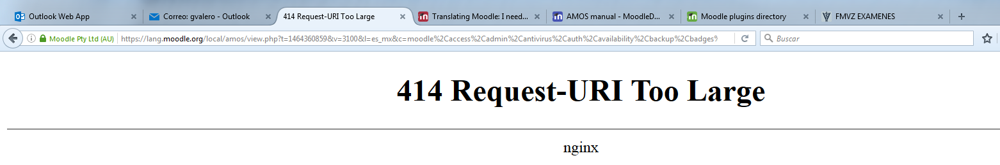
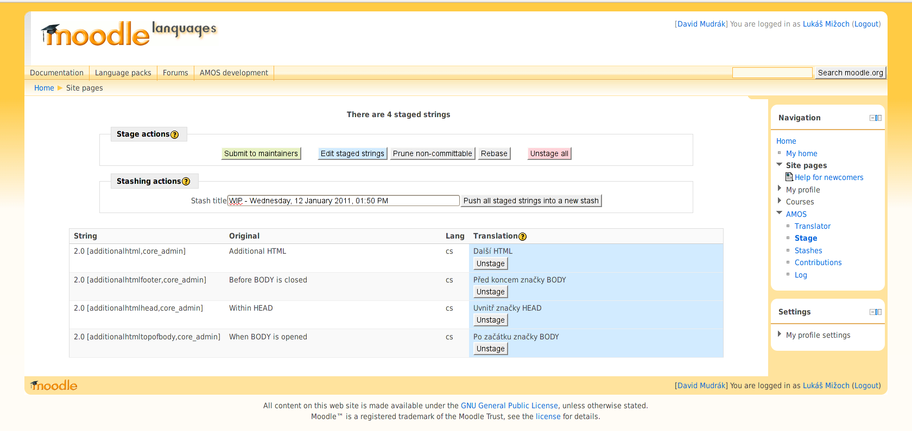
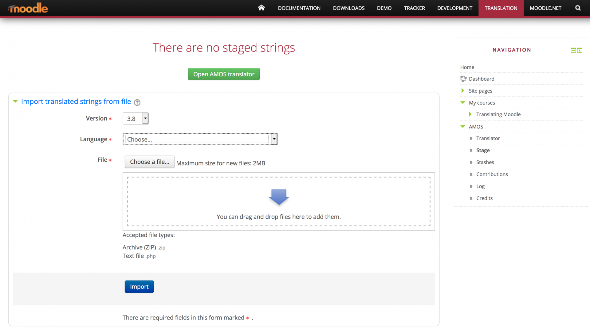

:::note

**AMOS** stands for **Automated Manipulation Of Strings**. AMOS is a central repository of Moodle strings and their history. It tracks the addition of English strings into Moodle code, gathers translations, handles common translation tasks and generates language packages to be deployed on Moodle servers.

The name was chosen in honour of [John Amos Comenius](https://en.wikipedia.org/wiki/John_Amos_Comenius), the author of `Janua linguarum reserata` (Gate to Languages Unlocked). Sorry Tori ;-)

:::

AMOS is hosted on our **[Moodle translation site](https://lang.moodle.org)**.

## Basic concepts

AMOS consists of several tools available via the main navigation block: Translator, Stage, Stashes, Contributions and Log.

- **Translator** is a tool that allows you to filter strings you want to work on and translate them.
- **Stage** is a temporary working area that holds the strings you have translated during the current session. Maintainers can permanently commit the stage into the strings repository. Contributors can submit the stage for maintainers.
- **Stashes** are snapshots of the stage. Imagine them as ordinary files at your computer where you can save your work. You can submit your stash to the language pack maintainers.
- **Contributions** is a database tracking all submitted contributions and their current status. Records in this database are like issues in the Moodle tracker with the translated strings attached.
- **Repository** a database of all Moodle strings and their history running at lang.moodle.org server.
- **Log** displays the log of all modifications of Moodle strings.

## Translation workflow

The following data flow diagram illustrates how AMOS tools are used during the translation process:



The key AMOS component is the staging area or shortly the stage. It holds translated strings temporarily during your current login session. If you log out, the stage is cleared (though there is a backup - see below). There are several ways how translations can be staged, that is how translated strings can be put into the stage:

- by using the AMOS translator
- by importing strings from an uploaded file
- by applying a previously created stash
- by applying a submitted contribution

Language pack maintainers have write access to the AMOS strings repository. Therefore they can commit their stage permanently. Once the stage is committed, staged strings are stored in the AMOS repository. Every hour, AMOS generates ZIP packages from the most recent snapshot of the repository. These ZIP packages are published on the language pack download pages https://download.moodle.org/langpack/. In addition, Moodle sites can install and update language packages automatically via **Site administration > Language > Language packs**.

Community members do not have write access to the repository so they can't commit their stage. Instead, they can submit it to the maintainers. By submitting a stage, a new contribution record is created and language pack maintainers are notified by automatic email message. Maintainers can review the submitted contribution and, if they accept it, commit it on behalf of the contributor.

The stage can be also saved so you can interrupt your work and continue next time you come back to the site. The stage is saved into the so called 'stashing area'. The stashing area consists of stashes. A new stash is simply a snapshot copy of your current stage. AMOS automatically keeps one stash for you as a backup copy of your most recent stage. A stash can be submitted to the maintainers too.

## AMOS tools

### Using the translator tool

The translator tool page has two main parts. At the top, there is a filter form `(1)`. You use that filter to get the strings you want to translate. When the filter settings are saved `(2)`, a table with the filtered strings is displayed below.

Every row in the table represents a single string. The table has four columns. The first column `(3)` describes the version (or branch) where the string is used, its identifier and its component.

:::note You can see a text like:

```
4.0 [completiondate,coursereport_completion]
```

That reads: this string is used in Moodle 4.0, its identifier is 'completiondate' and it belongs to 'courserepor_completion' component.

:::

The second column `(4)` contains the English original of the string. Below the text, you can see Google icon. Click that icon to get automatic translation of the string into the language being translated. The next column contains a code of the language that this string is being translated to (for example "cs" for Czech).

Finally the last column, `(5)`, contains the translation itself. If it is empty, the string is not translated yet, otherwise it displays the current translation. **Click in the cell to turn it into the input editor.** Insert the translation and click outside the cell to stage the translation. Note there is no submit button, the text is sent to the stage automatically in the background. You can see that the colour of the cell turned blue. Blue colour signalizes that the translation is currently staged.


You have many options of how to use the strings filter. You can work on a single component or all missing strings at once. You can search for strings containing a given text (either in English or the translated string) etc. You can check for strings in older versions, too but those strings are read-only. They get automatically pulled into AMOS from the Git repository of previous translations.

The `permalink` below the filter's submit button can be used to keep the current filter settings. For example, you can bookmark a setting use regularly or you can copy the link URL and send it to somebody so they can set their filter just by visiting that URL.

When you finish translating, do not forget to visit the stage page. You probably want either commit it (if you are a lang pack maintainer) or submit it to maintainers so they can review your work and include it into the language pack.

Sadly, sometimes, AMOS may consider that your request-URI is too large to handle :(



### Using the stage

The translated strings are put into a temporary area called **stage** immediately after the cursor leaves the editor field. The stage holds your work before it is either committed into the repository (if you are language pack maintainer) or submitted to the maintainers for inclusion or stashed.



:::warning

The stage is cleared when you logout. You have to explicitly commit or stash the stage so it is saved permanently. If you forget to do it, or there is a problem with the connectivity, your browser crashes or whatever, you can find your most recent snapshot of the stage in autosave stash.

:::

If you are language pack maintainer, you can commit the stage into the repository so your work is registered and the translated strings become part of the official language package. You can also propagate the strings to other branches by selecting the branches you want the string to go to and hit the propagate button. It is a wise thing to do that, to save work and to keep consistency in the wording over the versions.

:::info

Updated language packages in ZIP format are published hourly at https://download.moodle.org/releases/latest/ - access to any language packs and look at the bottom of the page to see the last update. At the same time, they become available for Moodle sites for automatic update.

:::

The stage can also be used to import strings from files and to merge or compare versions of language packs.

### Importing a file

Strings can be translated offline and uploaded back to AMOS using the stage page. The only supported format at the moment is common PHP format used by Moodle where strings are defined in associative array called $string. For obvious security reasons, AMOS can not actually execute PHP files uploaded by users. Instead, it parses the uploaded file in a similar way as PHP parser, looking for patterns that are considered as valid string definition. That means that not every valid PHP code is valid string definition. AMOS parser requires following conditions are met:

- the filename is valid component name used by Moodle, for example `moodle.php`, `enrol_manual.php` or `workshop.php`
- the file is valid PHP code without syntax errors - that means is passes the PHP lint check
- strings are defined as elements of global array $string
- strings are single quoted constants



<details>
  <summary>Example of a valid file to import into AMOS (filename countries.php, Czech translation)</summary>
  <div>

```php
 <?php

$string['AE'] = 'Spojené Arabské emiráty';
$string['AF'] = 'Afghánistán';
$string['CH'] = 'Švýcarsko';
$string['HU'] = 'Maďarsko';

```

  </div>
</details>

During the import, strings found in the file are added into your stage as if they were translated via web. You can commit them into repository if you have such privilege.

You can import several .php files at once if you put them into a ZIP file (Maximum size: 2MB) and import this ZIP file.

### Using stashes

At any moment, you can save a snapshot of the current stage. We call such snapshot a *stash*. Stashed strings are kept forever until you drop them manually (please do not abuse this and keep your stashes reasonable big). To manage your stash, click on **Stashes** in the right menu of AMOS. You just see a list of the stashes. There are **peekaboo** buttons that appear when you mouse hoover over the stashes. The stash can be *applied* so that the stashed strings are copied back to the stage. What the *pop* does is apply and drop (delete) the stash. *drop* is like delete. *submit to maintainer* opens a form for doing just that.

There is one special stash record for every user called *autosave* stash. This stash keeps the most recent state of the stage. You may find it useful if you loose the current stage for any reason - your browser crashes, your internet connectivity dies or you accidentally `unstage` all strings. If that happens, just apply the autosave stash to get your work back. The autosave stash is updated every time you stage a string. So if your stage is empty and your autosave stash is full of strings and you go into the translator first without applying the stash, the autosave will be replaced with the new translated string. We recommend to experiment a bit with this feature first.

### Using the log tool

The **Log** page allows even anonymous users to search in the history of commits tracked by AMOS. At the top of the page there is a filter that allows you to look for a particular information or report. It is important to realize how the filter actually works. Searching and filtering happens in two steps (this was necessary for performance reasons):

- Firstly, commit records are searched based on the criteria specified in the Commit filter form. If there are more commits found matching the filter settings, only 100 most recent commits are processed.
- Then, within the commits found, either all string modification records are returned, or you can filter these records, too. Settings in String filter form section are used in that case.

By default, the filter looks for all commits since the last time you logged in and than displays only strings at the currently translated branch modified by those commits.

### Language packs and Moodle versions

When a new Moodle version is released, it will become the default version on your **AMOS - Translator** page (see tick boxes at the top).

The suggested workflow is to continue your translation work for the new Moodle version and merge your work in the older versions.
Some time ago, people used to do that using the **AMOS - Stage** page: set the source version to the version you were working in and set the target version to the version you want the strings to be copied to. Nowadays AMOS automatically propagates (most of) the strings to all suitable branches.

## Keeping track of your 'favorite' plugins strings to translate

You can use the *permalink* feature for frequently checking a finite set of additional plugins for missing or outdated string.

The permalink feature is supposed to work like this:

- You use the AMOS filter settings (that is, you define which versions, components, etc, you want to see). For example, you can select version 3.1, then all core components and some additional components.
- You press **Show strings** and let AMOS show you the strings.
- Then you can copy or bookmark the URL that is available via the **Permalink** link.
- Following that URL should set the filter back to the current settings.
- The problem is that AMOS does not allow you to mix strings from one component version with strings from another component version at the moment. So you can't see things like "Workshop 3.1 strings together with Essential 3.0 strings". You would have to select both 3.0 and 3.1 version fields, and both `Workshop` and `Essential` components. But that would lead to `Workshop` strings being displayed twice.

:::tip

It would be useful for you to have a couple of bookmarked / saved permalinks per version. So you would have one for "3.11 core and interesting additional plugins", another one for "3.10 interesting plugins", another one for "3.9 interesting plugins", and so on. That way, you can regularly check these three or four links and have your areas of interested monitored well.

:::

## See also

- [Automated Manipulation of Strings 2.0](/general/projects/api/amos) for the AMOS developer spec
- [Accepting submissions](https://www.youtube.com/watch?v=JtY5zvEHnQ8) Instruction video for language pack maintainers
- [Contributing to a language pack](https://www.youtube.com/watch?v=XClUZOuFfWo) Instruction video for language pack contributors
- [Changing the default language](https://www.youtube.com/watch?v=xT2-ElTaH6M) Instruction video on how to change your default language

## Translations

<!-- cspell:disable -->

- [fr: AMOS](http://docs.moodle.org/fr/AMOS)
- [es: AMOS](http://docs.moodle.org/es/AMOS)

<!-- cspell:enable -->
