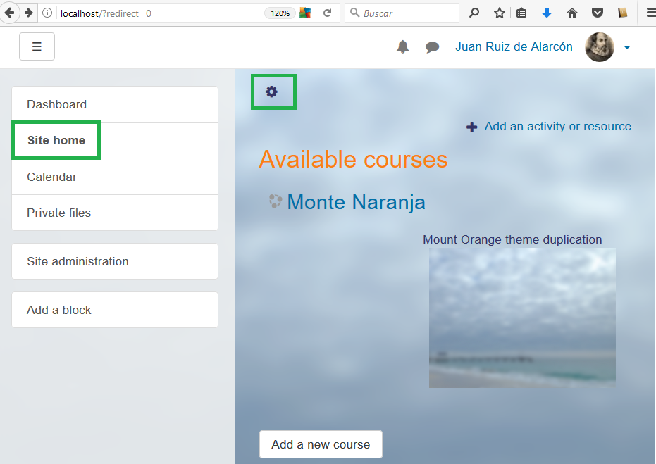
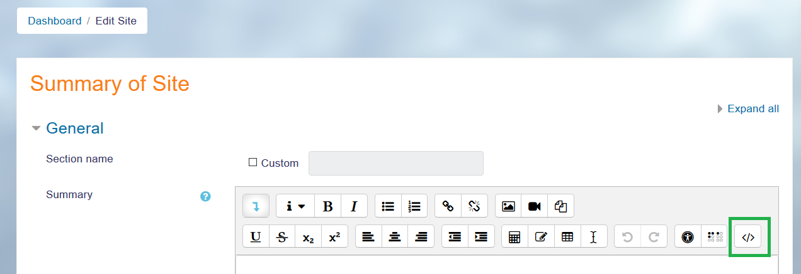
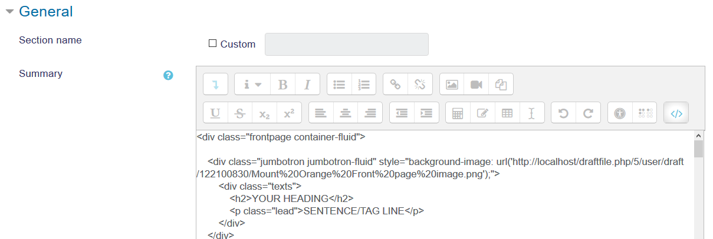
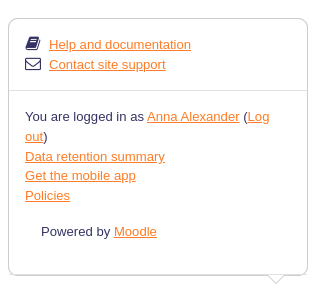

## Contributing to the documentation

Moodle Docs pages are wiki pages available in [several languages](https://docs.moodle.org/overview/). Any registered Moodle user can contribute to Moodle Docs and improve or translate these wiki pages. Please make sure to follow the [guidelines for contributors](http://docs.moodle.org/en/Guidelines_for_Contributors).

You might find it useful to add the original English documentation pages that you have just translated to your watchlist (alt-shift-w), so that you will know when your translation might need to be re-checked for a possible update.

## Translating the screen images used in Moodle Docs

If you want to recreate the bright orange-coloured screen images used in the Documentation pages (for example, [Moodle New features Docs page](https://docs.moodle.org/en/New_features)), you can replicate the [Mount Orange school](https://school.moodledemo.net/) theme in your local server by following the details outlined [here for the boost theme in the latest branches](https://docs.moodle.org/en/Standard_themes#Example_of_a_customised_Boost_theme).

<!-- cspell:ignore Escuela Naranja -->
### Replicating the Mount Orange theme look in a local server with the Boost theme

- You will need to download the cloudy background from [here](https://docs.moodle.org/en/File:bg6.png) and the Mount Orange image from [here](https://docs.moodle.org/30/en/File:Mount_Orange_Front_page_image.jpg).
- You may insert these two images in a label in a Moodle course and notice (write down) the paths that references where these images have been stored, as you will need to input these paths later.
- Go to your site home and edit the site home summary.

- You need to click on the very first tool button in order to show all the tools buttons in the Atto editor.

- You need to click on the `</>` button in order to input HTML code:

- You must input the code described in [**Front page topic section** of the Standard themes](https://docs.moodle.org/en/Standard_themes#Example_of_a_customised_Boost_theme) page. Do not click the **Save** button yet:

- Replace **YOUR UPLOADED FRONT PAGE IMAGE.jpg** with the path to your recently uploaded front page image, that you carefully wrote down earlier.
- Now is the time when you replace the **YOUR HEADING** text with the translated text for your Orange-coloured School ('Escuela Monte Naranja' for this Spanish language example).
- Replace the `SMALLER  HEADING` text in both places with your language text strings.
- Replace `Paragraph of text` in both places.
- Replace `BUTTON TEXT` in both cases-
- When you click again on the `</>` button, the HTML code will be interpreted and you will see the graphics displayed and the texts rendered in a nice orange-colored style:

- Check the result, and correct if necessary.
  - You can now save your changes.
- Go to **Administration > Appearance > Themes > Boost > Advanced settings**.
- Paste the 'Boost theme Advanced settings - Raw initial CSS:' and 'Boost theme Advanced settings - Raw SCSS:' codes from the [Standard themes](https://docs.moodle.org/en/Standard_themes#Example_of_a_customised_Boost_theme) page.
- In the 'Boost theme Advanced settings - Raw SCSS:' section, replace `YOUR UPLOADED BACKGROUND IMAGE.jpg` with the path to your recently uploaded cloudy background image.
- Replace the original English language text with the appropriate text for your language pack.
- Check that your Mount Orange clone site looks good.
- Compare your site's front page with the image of [Mount Orange front page](https://docs.moodle.org/en/File:MountOrangeFrontPage.png), or better yet, compare your site with [the current Mount Orange](https://school.moodledemo.net/) page.
  - Correct if necessary.
- If all is fine, save the changes.
- You can now use your emulated translated Orange site to replicate the beautiful images Moodle HQ used to illustrate [Moodle new features](https://docs.moodle.org/en/New_features) in Moodle Docs.

## Which documentation pages are most important or useful to translate?

Many Moodle users will start reading the [English docs main page](http://docs.moodle.org/en/Main_Page). This might be a good page to have translated.

The [new features in the latest version](http://docs.moodle.org/en/New_features) would surely be of interest to the users of previous Moodle versions that want to catch up with the new available features.

The [quick guides](http://docs.moodle.org/en/Category:Quick_guide) are very short pages (that hopefully you can very quickly translate) that teachers can quickly check, in order to grasp how an important Moodle feature works, without having to read the standard detailed (long) Moodle full documentation pages.

The [Table of contents](http://docs.moodle.org/en/Table_of_Contents) has a very comprehensive and organized list of important Moodle topics. This might be a worthy addition to your language documentation.

If you see a post which has been rated as 'Useful' several times in a [Forum in a language other than English](https://moodle.org/course/), which links to an untranslated English documentation page, it might be a good idea to translate this page.

The English Documentation Special Page with the [Most linked-to pages](https://docs.moodle.org/30/en/index.php?title=Special:MostLinkedPages&limit=100&offset=0) shows the English pages that have the highest number of links and (except for all the User: pages) you will find there many pages highly useful for Moodlers of all languages and worth translating to your language (eg, [Managing a Moodle site](https://docs.moodle.org/en/Managing_a_Moodle_site) & [Managing a Moodle course](https://docs.moodle.org/en/Managing_a_Moodle_course)).

:::info

If you are a Moodle site admin or teacher, using a language other than English, and you use the 'Moodle Docs for this page' link in your daily work, please consider translating the English pages that helped you most to do your job and solve your problems.

:::

## Translating the Documentation pages for 'Help and documentation' and 'More help' links

- When logged in as an admin or teacher, **Help and documentation** links at the bottom of each page in Moodle take you to documentation about that page in your language, if it exists, otherwise in English.

- You might be tempted to start typing the documentation in your own language (if such a page exists), but please don't do it. Instead, change your language to English and then click in the 'Help and documentation' link.
- In the English documentation page that just opened, add a language link for your language (see [Interlanguage-linking](https://docs.moodle.org/dev/Starting_a_new_docs_wiki)), save it and then open the given translation page.
- If the English Documentation page has only a redirect instruction, please add a translation for the redirection and then save the English page with the redirection

- Make sure that you add a translation link for the redirection, check that it works (create the page if it did not exist) and save the page.

- You can now jump to the redirected page in your own language and work on it.

- The **More help** links have the same icon `(i)` and work the same way as the 'Moodle Docs for this page' links.

## Is it important to translate English Documentation pages that only have one #Redirect instruction?

Yes, it is very, very fast and it will make your translated wiki more efficient, because you will replicate all the automatic redirections that exist in the English Docs in your own language Docs, specially with the Docs pages related to online help for specific pages in your Moodle server (see the example above).

If you have translated Documentation pages with `#Redirect` instructions, it will then be a good idea to go to the **TOOLS** column at the bottom of the page (in your language wiki documentation) and click on **Special pages**. There, check the **Broken redirects** and **Double redirects** links and fix any pages that might show up there.

## Which English documentation pages will change when there is a new Moodle version release

- If you have a translation of https://docs.moodle.org/dev/Releases you will need to update it
- The [new features in the latest version](http://docs.moodle.org/en/New_features) mentioned above must now have the new available features.
- You might need to update the version numbers in your translated documentation for these pages:
  - [https://docs.moodle.org/en/Upgrading](https://docs.moodle.org/en/Upgrading)
  - [https://docs.moodle.org/en/Installation_Quickstart](https://docs.moodle.org/en/Installation_Quickstart)
  - [https://docs.moodle.org/en/Installing_Moodle](https://docs.moodle.org/en/Installing_Moodle)
  - [https://docs.moodle.org/en/Git_for_Administrators](https://docs.moodle.org/en/Git_for_Administrators)
  - [https://docs.moodle.org/en/Upgrade_overview](https://docs.moodle.org/en/Upgrade_overview)
  - [https://docs.moodle.org/en/Language_packs](https://docs.moodle.org/en/Language_packs)

## See also

- [Starting a new docs wiki](https://docs.moodle.org/dev/Starting_a_new_docs_wiki)
- [Help strings](https://docs.moodle.org/dev/Help_strings) in the developers documentation
