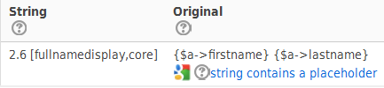
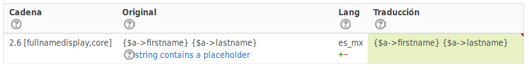
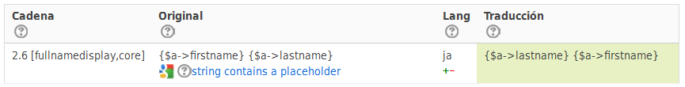
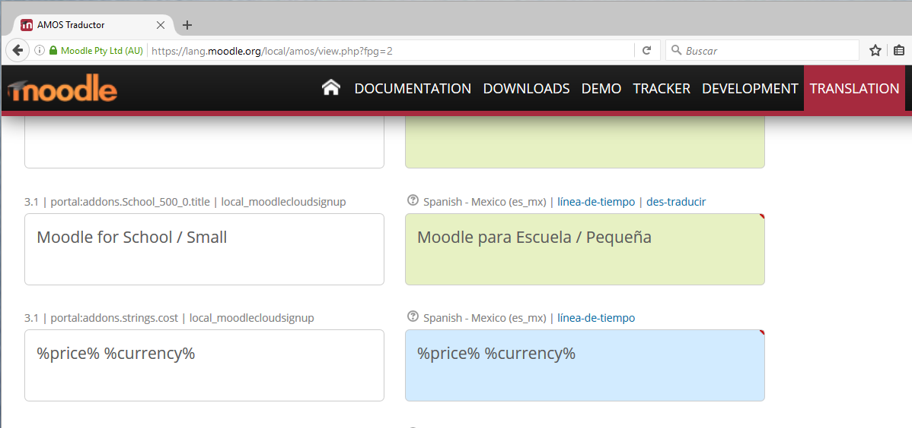
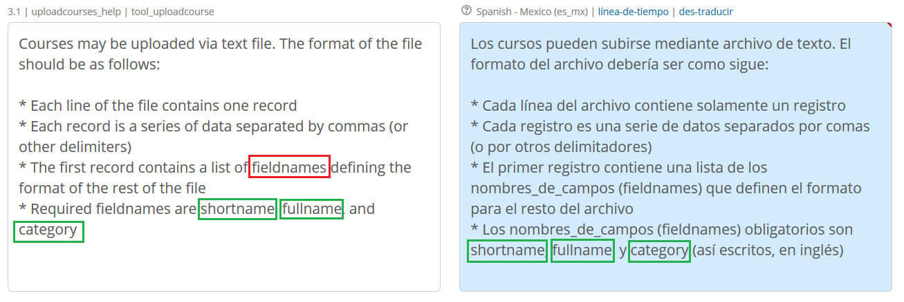
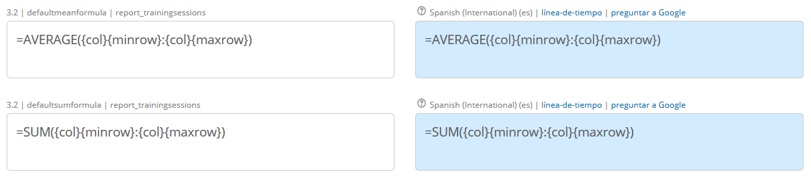
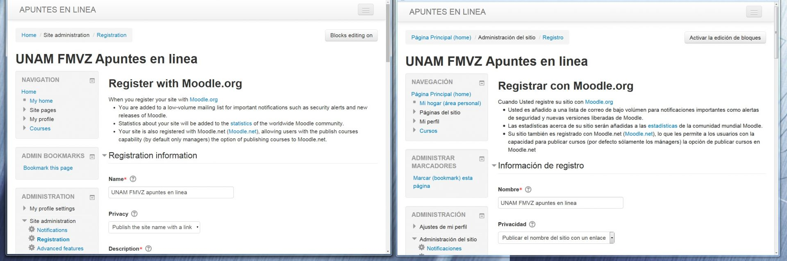

import Tabs from '@theme/Tabs';
import TabItem from '@theme/TabItem';

<!-- cspell:ignore fieldnames -->

## How can I help with translating Moodle?

Please see the guide [Contributing a translation](/general/development/process/translation/contributing).

## I've found an error in a language pack. What do I do?

- You are welcome to [contribute a fix](/general/development/process/translation/contributing) for the error. Alternatively you can contact the language pack maintainer as listed in the [Translation credits](http://lang.moodle.org/local/amos/credits.php).
- English language string typo fixes and suggested improvements can be [contributed to the English (fixes) (en fix) language pack](https://docs.moodle.org/dev/Improving_English_language_strings).

## The month names and days are displayed in English. How can I translate them?

This is neither Moodle bug nor a missing translation. Names of days and months are pulled out of your operating system. Your server, where the Moodle is running, does not seem to have the specific [locale](https://en.wikipedia.org/wiki/Locale_(computer_software)) installed. You need to contact the server administrator and ask them to install the needed locale. See [Table of locales](/general/development/process/translation/langpack/locales) for details.

The particular locale to use for the given language is configured in the [langconfig.php](./langpack/langconfig) file in strings `locale` (for Unix like operating systems) and `localewin` (for Windows operating systems).

- On Ubuntu/Debian, the package `locale-all` can be installed to support all existing languages.
- Mac OS is known to have a very limited support for locales. This can not be fixed.

## Why are log descriptions displayed in English?

In log reports, descriptions are intended to be displayed in English only; it is not possible to translate them. For example:

>"The user with id '2' viewed the course with id '4'."

## I'm starting a new language pack or I'm contributing to one. Can I do the user interface strings first?

No, there is no way to know which strings will be shown for users and which not. But to help you a little bit, there are some unofficial priorities you can take into account.

First:

- make sure [langconfig](/general/development/process/translation/langpack/langconfig) is properly set up.
- take a look at [Translation priority](/general/development/process/translation/langpack/priority). All files have a rating according to how urgent they need translating.
- less urgent are also the contributed plugins, since they are not part of a standard Moodle distribution. There is a list of [the 20 top plugins downloads for Moodle](https://moodle.org/plugins/stats.php) which might be worth considering for translation priority.

## How many words are there in the English language pack?

See the discussion [How many words are there in the English language pack?](http://lang.moodle.org/mod/forum/discuss.php?d=3651).

## Moodle languages with several available language packs

### Are there translations for the American (and other branches of the) English language?

The ["official"](http://lang.moodle.org/mod/forum/discuss.php?d=2617) language for Moodle is actually **Australian English** (*G'day mate!*) , which is almost 100% the same as UK English. [Someone](http://english.stackexchange.com/questions/74737/what-is-the-origin-of-the-phrase-two-nations-divided-by-a-common-language) once said "America and England are two nations divided by a common language".

- The English - United States (`en_us`)] language pack mostly contains different spellings (color *vs* colour, enroll *vs* enrol, etc).
- The English - Pirate (`en_ar`)] language pack is used in the '[Talk Like a Pirate](https://moodle.org/mod/forum/discuss.php?d=132888)' day.
- The English - United States K12 (`en_us_k12`) language pack is used in the [K-12](https://en.wikipedia.org/wiki/K%E2%80%9312) (kindergarten to grade 12) primary and secondary education in the USA, Canada, and other English speaking countries. It includes spellings from the `en_us` language pack and the term "course" is renamed as "class".
- The English for kids (`en_kids`) language pack seems to be a simplified version of the most common English strings seen by Moodle users, considered easier/suitable for small children.
- The English (fixes) (`en_fix`) language pack is used to suggest Moodle core language strings improvements and typo fixes, as described in the guide [Improving English language strings](https://docs.moodle.org/dev/Improving_English_language_strings).

<!-- cspell:ignore dein -->
<!-- cspell:ignore Ihre -->
<!-- cspell:ignore Ihnen -->
### Why do Moodle has four different language packs for the German language?

- In Germany we have a formal language where people are talking with „Sie" to each other. This is the language of the formal adults. I think it's something like using „Sir" in English language. The normal German language pack is using this formal language. Nearly all strings in the Moodle language pack and in the translated plugins are translated in the formal language.
- You can't use these formal words in school. There you are using an informal language with „du". Students are talking to each other like friends. Therefore we made the language pack „German personal" (`de_du`). It come with the personal words „du", „dein", „dir" and so on where the formal words are „Sie", „Ihre", „Ihnen" (yes, these words are written with an uppercase letter).
- For my (**Ralf Krause**) personal use I take „German personal" (`de_du`) or „German Kids" (`de_kids`). „German Kids" uses the personal words „du", „dein" and „dir" but it also uses an easier to understand language.
- Some time ago we tried to make Moodle as a platform for social communication but nobody wanted to use it. Therefore we made "German community". In a social platform, nobody would talk about teachers or students or participants or classrooms or courses. In a social platform, you would use members of a group and meetings. I don't know if this pack will be used in future.

### Why do Moodle has several different language packs for the Spanish language?

- Spain and many South American countries use a (comma) [Decimal separator](https://docs.moodle.org/dev/Decimal_separator) that is different from the (decimal point) used in Mexico and Central America.
  - Moodle core in English uses by default a decimal point for calculations, and Moodle Docs do too.
  - This caused many problems in the [Gradebook](https://docs.moodle.org/en/Grader_report) calculations and with the [Spanish Moodle Docs](https://docs.moodle.org/all/es/P%C3%A1gina_Principal).
- Just as "America and England are two nations divided by a common language", so are Spain and Mexico. See [the Mexican Spanish documentation page](https://docs.moodle.org/all/es/Espa%C3%B1ol_de_M%C3%A9xico) in Spanish.
- The Venezuelan Spanish (`es_ve`) is a very small child language of the international Spanish language.
- The Colombian Spanish (`es_co`) is a very small child language of the international Spanish language.
- The Mexican Spanish (`es_mx`) is a very modern, comprehensive, independent, language pack, specially made for Mexican Moodlers.
- The Mexican Spanish for kids (`es_mx_kids`) is a simplified version of the most common Mexican Spanish strings seen by Moodle users, considered easier/suitable for small children.
- You can read about [two (now defunct) other Spanish child languages](https://docs.moodle.org/all/es/Espa%C3%B1ol_internacional#Idiomas_hijos_que_depend.C3.ADan_del_Espa.C3.B1ol_internacional).

### Why do other languages have child languages?

- Languages with `-kids` in their code names are all child languages with a simplified version of common language strings aimed at small children.
- If you have the time, it is probably a good idea to have one such child language for kids for your main language pack.

<!-- cspell:disable -->

- Some languages for kids are:
  - Deutsch - Kids
  - English for kids
  - Español de México para niños (Mexican Spanish for kids)
  - עברית בתי־ספר (hebrew for kids)
  - Japanese - kids
  - Deutsch - Kids
- Norwegian (Primary) language pack is aimed at primary education.
- Finnish for companies is aimed at companies.
- Languages ending in `_wp` are supplementary languages for [Moodle Workplace](https://docs.moodle.org/en/Moodle_Workplace). They are maintained by the companies offering [Moodle Workplace](https://moodle.com/solutions/workplace/).

<!-- cspell:enable -->

## Are there items which are NOT to be translated?

### Moodle variables enclosed within {curly brackets}

The following words, when enclosed within `{curly brackets}`, are placeholders for Moodle names of variables. They should not be translated, but must remain as they are within the curly brackets:

<!-- cspell:disable -->

>firstname, lastname, username, email, city, country, lang, timezone, mailformat, maildisplay, maildigest, htmleditor, ajax, autosubscribe , institution, department, idnumber, skype , msn, aim, yahoo, icq, phone1, phone2, address, url, description, descriptionformat, password, auth, oldusername , deleted, suspended, course1, course2, course3, course4

<!-- cspell:enable -->

They must also be written exactly like this in all translations of the documentation pages (such as this page.) However, the translator might like to include a translation enclosed in brackets. For example, in the Spanish documentation pages you might find: `password (*contraseña*)`.

The fact is: **no placeholders can be translated in AMOS**. There is no official list of "reserved" `$a` properties. Whatever `xyz` is put in `{$a->xyz}`, it must be kept as it is in AMOS.

Example:



**Must** be (in this case, when translated into Mexican Spanish):



unless your language uses `lastname` before the `firstname`, as Japanese does, which translates to:



### Placeholders enclosed within `%` characters (`%example%`) must not be translated

The [Moodle Cloud Sign up and Portal strings](https://moodle.org/plugins/local_moodlecloudsignup) local plugin is used for accessing the [MoodleCloud](https://moodle.com/cloud/) and it includes several strings that have some words surrounded by `%` characters (for example, `%date%`). These words must not be translated, they must be copied exactly into the language pack translation, but the rest of the string might or might not be translated.

:::info Example

One string that can not be translated and must be copied exactly:



:::

:::info Example

One string with one placeholder (highlighted) and some regular text that can be easily translated:


:::

### Placeholders in H5P prefixed with `%` or `:` characters must not be translated

The [H5P editor](http://h5p.org/) integrated with Moodle since 3.9 has some variables prefixed with `%` or `:` that must not be translated because they are transformed internally with the correct value. They should be treated as the Moodle curly brackets variables.

<!-- cspell:disable -->

<details>
  <summary>Example of variables with <code>%</code> that can not be translated and must be copied exactly:</summary>
  <div>
    <div><pre>"Parameters contain %used while only %supported or earlier are supported."</pre>
    In that case, <code>%used</code> and <code>%supported</code> must not be translated. So, for instance, the Spanish translation would be something like:
    <pre>"Parámetros contiene %used mientras que sólo se soportan %supported o anterior." </pre>
    </div>
  </div>
</details>

<details>
  <summary> Example of variables with <code>:</code> that can not be translated and must be copied exactly:</summary>
  <div>
    <div><pre>"The :property value exceeds the maximum of :max."</pre>
    In that case, <code>:property</code> and <code>:max</code> must not be translated. The Spanish translation for this string would be something like:
    <pre>"El valor de :property excede el máximo de :max."</pre>
    </div>
  </div>
</details>

<!-- cspell:enable -->

### All `fieldnames` must be kept in English

- These names are hooks that are used in the software. You should not translate them.

:::info Example

See the example below for the string `uploadcourses_help` in the file `tool_uploadcourse`:



Notice that the string text indicates (red rectangle) that these words (enclosed in green rectangles) are fieldnames. Also notice that the Spanish translation clearly indicates, at the final part of the paragraph `(así escritos, en inglés)` that these fieldnames must be written in English as they are written here.

:::

- Some used fieldnames in Moodle are:

<!-- cspell:disable -->

>category, category_id, category_idnumber, category_path, context, course, description, descriptionformat, email, enrolmentkey, firstname, fullname, groupname, hidepicture, idnumber, intro, lastname, maxgrade, maxrequest, name, password, picture, section, shortname, teachers, timeopen, timeclose, timeend, timestart, username, visible

<!-- cspell:enable -->

- Examples of strings where these fieldnames appear are `uploadcohorts_help | core_cohort`, `importgroups_help | core_group`, `uploadcourses_help | tool_uploadcourse` and `uploadusers_help | tool_uploaduser`.
- Note that these fieldnames may appear as real fieldnames (must not be translated) or as regular words in another context (can and must be translated). You should exercise caution and, If possible, always check that Moodle works correctly by testing your translations with some data in a real or test server.

### Local addresses after `<a href="../`

Addresses inside a Language string that have `<a href="../` reference a specific URL inside your Moodle server and you must keep the address part of the expression, but you can translate the descriptive name part. See the following example:

```
 noassignableroles | tool_cohortautoroles
 There are currently no roles that can be assigned in the user context. <a href="../../roles/manage.php">Manage roles</a>
```

- You must keep the `<a href="../../roles/manage.php">` part, as this references to the [PHP](https://docs.moodle.org/en/PHP) code in your Moodle server that will be executed in order to manage roles
- You can/should/must translate **Manage roles**
- Do not forget to keep the ending `</a>`

### Moodle Docs addresses after `<a href="http://docs.moodle.org/en/`

Addresses inside a language string that have `<a href="http://docs.moodle.org/en/` reference a specific URL in the Moodle English Documentation. You must look at that address and **only** if your language has a valid translation for that page, you can/should replace the original English Docs address with your own language address. See the following example:

```
 core backup | nonisowarning
 Warning: this backup is from a non-Unicode version of Moodle (pre 1.6). If this backup contains any non-ISO-8859-1 texts then they may be CORRUPTED if you try to restore them to this Unicode version of Moodle. See the <a href="http://docs.moodle.org/en/Backup_FAQ">Backup FAQ</a> for more information about how to recover this backup correctly.
```

- There are six different language translations for that page. So, you can only replace this address if your language is one of these.

### Other internet addresses after `<a href="http://`

- You must proceed as with Moodle Docs addresses:
- Example:

```
 auth_radius | auth_radiusdescription
 This method uses a <a href="http://en.wikipedia.org/wiki/RADIUS">RADIUS</a> server to check whether a given username and password is valid.
```

- You must check the (English language wikipedia) page about the RADIUS server, and then you can decide whether to keep this address or replace it with your own language matching wikipedia translation.

### HTML codes that must not be translated

The following HTML codes are reserved words that must not be translated. However, it is important for the translators to understand their meaning in order to decide whether to keep them in the translation and if so, whether they can be rearranged.

- `&nbsp` - non-breaking space, for example, a space but there will never be a line-break inserted instead of this space at the end of a line.
- `&ensp` and `&emsp` - denote an `en` space and an `em` space respectively, where an en space is half the point size and an em space is equal to the point size of the current font. For fixed pitch fonts, the user agent can treat the en space as being equivalent to a single space character, and the em space as being equivalent to two space characters.
- `&amp` - ampersand sign (`&`)
- `&apos` - apostrophe sign (`'`)
- `&plusmn` - "plus or minus" sign (`±`)
- `&times - multiply sign` (`*`)
- `&divide - divide sign` (`/`)
- `&gt` - "greater than" sign (`>`)
- `&lt` - "less than" sign (`<`)
- `&laquo` - quotation mark (`'`)
- `&lsquo` - left single quotation sign (`'`)
- `&rsquo` - right single quotation sign (`'`)
- `&ouml` - small letter o with diaeresis (`ö`)
- `&mdash` - [em dash](https://en.wikipedia.org/wiki/Dash#Em_dash) sign (`—`)

### Calculation functions must not be translated

[Calculation functions](https://docs.moodle.org/en/Grade_calculations#Calculation_functions) start with an equal sign (`=`). Following is an expression using operators and functions supported by the system.



### The `thisdirection` and `thisdirectionvertical` strings in `core_langconfig` should never be translated

The `thisdirection` and `thisdirectionvertical` strings in `core_langconfig` should never be translated, as they are not variables meant to be translated. They are prefixing selectors used by the themes to display left-to-right or right-to-left languages. Read [more about problems with these variables](https://moodle.org/mod/forum/discuss.php?d=328567#p1323101).

### MoodleBox

The word `MoodleBox` must be kept in all languages.

<!-- cspell:ignore Navegador de Examen Seguro -->

### Safe Exam Browser

A feedback by the Safe Exam Browser main developer:

>The software is called "Safe Exam Browser" in any language, we don't translate the name of the application. So it doesn't make sense to translate it in any plugin, you could use it as a subtitle or in brackets, like "Safe Exam Browser (Navegador de Examen Seguro)".

## Is there a way to check the integrity of all placeholders in a language pack?

- Not a at the moment. See [MDL-51775](https://tracker.moodle.org/browse/MDL-51775) .
- You can use [this trick](https://lang.moodle.org/mod/forum/discuss.php?d=4661) to check for integrity:
  - Load the language pack in a [local instance of Moodle](https://download.moodle.org/windows/).
  - In order to generate a [translation memory](https://lang.moodle.org/mod/forum/discuss.php?d=4098), load the language pack in the [Language customization](https://docs.moodle.org/en/Language_customisation) tool, so that the texts are loaded in the database.
  - Run the sql instance in the file (`tm_generator.txt`)
  - Insert the result of the query in `template.tmx` file
  - The result is a translation memory that can be analysed with [Checkmate](http://www.opentag.com/okapi/wiki/index.php?title=CheckMate).
  - The problem: probably you will get many errors due to some characters that are not allowed by Checkmate so you will have to remove manually some translation units. After doing it, you will get a report with some possible errors (see the attached image).
  - Of course, it would be great to have an integrated quality check system in Moodle. Vote for [MDL-51775](https://tracker.moodle.org/browse/MDL-51775) .

- The contents of the file `tm_generator.txt` are (**change the language from `eu` to your language**):

```sql
 SELECT concat('<tu tuid="',mdl_tool_customlang_components.name,'|',mdl_tool_customlang.stringid,'">
 <tuv xml:lang="en"><seg>',mdl_tool_customlang.original,'</seg></tuv>
 <tuv xml:lang="',mdl_tool_customlang.lang,'"><seg>',mdl_tool_customlang.master,'</seg></tuv>
 </tu>') as txt
 FROM mdl_tool_customlang INNER JOIN mdl_tool_customlang_components ON mdl_tool_customlang.componentid =  mdl_tool_customlang_components.id
 WHERE (((mdl_tool_customlang.lang)="eu") AND ((mdl_tool_customlang.original) Is Not Null) AND ((mdl_tool_customlang.master)  <>mdl_tool_customlang.original));
```

- The contents of the template.tmx file are:

```xml
 <?xml version="1.0" encoding="UTF-8"?>
<tmx version="1.4"><header creationtool="SQLQuery" creationtoolversion="unknown" segtype="paragraph" o-tmf="unknown" adminlang="en" srclang="en" datatype="unknown"></header><body>
 PLACE HERE THE RESULT OF THE SQL QUERY
 </body>
 </tmx>
```

## What is a `translation memory` and how can I create a translation memory out of a Moodle language pack?

- Read the **Is there a way to check the integrity of all placeholders in a language pack?** section above.
- See [this post](https://lang.moodle.org/mod/forum/user.php?id=1489&page=1).

## How can I help with translating Moodle documentation?

Please see the guide [Translating Moodle Docs](/general/development/process/translation/docs).

## How can I find out the context of the strings?

You can find where a language string is located as described in the user docs [Finding the component and string identifier](http://docs.moodle.org/en/Language_customisation#Finding_the_component_and_string_identifier) and [Language FAQ](http://docs.moodle.org/en/Language_FAQ).

You may wish to use two windows (perhaps using two monitors), with one displaying the page in English and the other displaying the page in your language.



If you think the original English language strings have more than one meaning and you can't guess which one applies, you are welcome to post in the [AMOS translation forum](https://lang.moodle.org/mod/forum/view.php?id=5).

## Is there a list of Moodle error messages which can be translated?

Error messages are listed in the user docs [Category:Error](http://docs.moodle.org/en/Category:Error).

## Can the subtitles for Moodle HQ YouTube videos be translated?

Unfortunately this is currently not possible. In September 2020, Youtube disabled community contributed subtitles.

For the Moodle HQ videos on Moodle available in https://www.youtube.com/c/moodle/playlists the user can choose to have automatically generated closed captions being automatically translated to a user language different from English.

The user watching a YouTube video must choose the cog symbol, choose **Auto-translate** and choose the target language. Obviously the `CC` icon must be activated for the auto-translated closed captions to be shown in these YouTube videos.

<!-- cspell:ignore XAMP -->

## How can I test my plugins translations of several (different) Moodle branches?

<Tabs>
  <TabItem value="linux" label="Linux" default>
    You can have several Moodle branches in one Ubuntu (or any other Linux distro) machine by following <a href="https://docs.moodle.org/en/Step-by-step_Installation_Guide_for_Ubuntu#Hosting_several_Moodle_branches_in_one_Ubuntu_server)">these steps</a>.
  </TabItem>
  <TabItem value="windows" label="Windows">
    You can have several <a href="https://download.moodle.org/windows/">local Moodle servers</a> in different folders in a Windows (7, 8, 10) PC. It is very easy to start one branch server, work on it, stop it and then start a different branch.<br/><br/>
    <strong>INFO</strong>: Some early local Moodle (versions before 3.0) server packages from <a href="https://download.moodle.org/windows/">https://download.moodle.org/windows/</a> only work in Windows 7, but apparently not in Windows 8 and definitely not in Windows 10, regardless of compatibility settings. For these you would need to install XAMP separately. Moodle 3.0 and newer branches do work under Windows 10.
  </TabItem>
  <TabItem value="mac" label="Mac">
    We need to write about this.
  </TabItem>
</Tabs>

<!-- cspell:ignore Geany -->
<!-- cspell:ignore Gedit -->

## Can I translate a language pack offline / can I use another language then English as source language?

Yes you can, but it is not recommended because there is a high risk of causing problems

:::caution Remember

Sites update language packs automatically, so your problem spreads quickly over the world.

:::

One problem is that you absolutely have to avoid untranslated strings or strings in the wrong language in the language pack. This should **never** happen. Another problem is that there is no way to know which strings are already translated. There is also a higher risk for syntax errors. If you have to, you can follow the following procedure:

- Download the English language pack (or another one if you want a different source language)
- Translate directly in the PHP file, preferably using something with syntax highlighting (Geany, Gedit, Notepad++ on Windows, ...)

:::warning Important

Delete all not-translated lines from the file, before uploading - therefore it is probably best to translate line by line and keep the original source files, so you can work with a record of processed line numbers.

:::

- Import the files in the translation portal following the manual on [AMOS manual](./amos#importing-a-file)

:::important

zip file cannot contain any folders

:::

<!-- cspell:ignore Weblate -->

## How can I translate H5P content types?

Use [the Weblate H5P project translation page](https://translate-h5p.tk/weblate/projects/h5p/) or see the h5p.org guide [Adding content type translations via GitHub](https://h5p.org/adding-content-type-translation-via-github) and the forum discussion [Translate H5P items](https://moodle.org/mod/forum/discuss.php?d=414325).

## See also

- [Language customization](http://docs.moodle.org/en/Language_customization) in the user docs for information on how to edit an existing language pack
- [String Deprecation](/general/projects/api/string-deprecation) was introduced in Moodle 2.8 to help minimize the language files but avoid accidental lost of translations by simply removing strings.
- [Generating a translation memory and running a quality test](https://lang.moodle.org/mod/forum/discuss.php?d=4098#p4879) forum discussion
- [Translation in context](https://moodle.org/mod/forum/discuss.php?d=347843) forum discussion

## Translations

<!-- cspell:disable -->

- [de: Übersetzung FAQ](https://docs.moodle.org/dev/de:Übersetzung_FAQ)

<!-- cspell:enable -->
