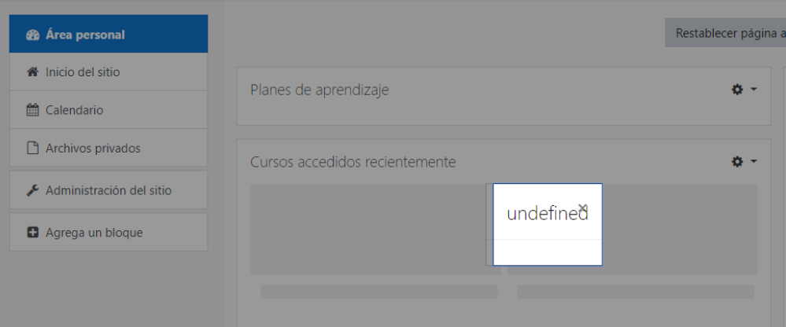

`Langconfig` is an important file in a language pack, dealing with all the configuration parameters of that language. It is good practice to review this first when starting of a new language pack or when taking on responsibility of an existing language pack. You can edit it by going to lang.moodle.org and find it as the `core_langconfig` component for your language.

On this page you find a little documentation for each setting to help you deciding what should go there for your language.

| Parameters  | Description |
| ----------- | ----------- |
| `alphabet,core_langconfig`  | The alphabet in your language. Used e.g. for the list of letters on the participants page. |
| `backupnameformat,core_langconfig`  | The format for the backup name, which usually includes current date when it's created. |
| `decsep,core_langconfig`  | How decimals are separated in your language. [Usually a dot or a comma](http://en.wikipedia.org/wiki/Decimal_separator). Take note that some countries which seem to share the same language may have a different character to separate the integer part from the fractional part of a number written in decimal form. For example, Central American Spanish-speaking countries use the decimal point, while South American Spanish-speaking countries use the decimal comma.  Example:<ul><li>English: 36.5</li><li>Dutch: 36,5</li></ul> |
| `firstdayofweek,core_langconfig`  | The first day of the week in your language. Allowed values are 0,1,2,3,4,5,6, where 0 stands for Sunday. |
| `iso6391,core_langconfig`  | The ISO 639.1 value for your language. You can find this value easily on [Wikipedia](https://en.wikipedia.org/wiki/List_of_ISO_639-1_codes). |
| `iso6392,core_langconfig`  | The ISO 639.2 value for your language. You can find this value easily on [Wikipedia](https://en.wikipedia.org/wiki/List_of_ISO_639-2_codes). |
| `labelsep,core_langconfig`  |  |
| ``  | How a label is separated from a form. Could be a colon, a space and a colon or something different, according to what's generally used in your language. This character is not read by screen readers for accessibility reasons. |
| `listsep,core_langconfig`  | The symbol usually used in your language, for separating items in a list. This is used, for example, when using formulas with multiple items in the gradebook. This must be a symbol different from the `decsep` symbol. |
| `locale,core_langconfig`  | Locale for `*nix` servers. If your Moodle calendar is not translated, then this string is wrong (or your server is not configured to support the language).  **INFO**: Locales, used in language packs should come only from the [table of locales](./locales).  An unsupported locale in a Mac or Linux site will produce the following error when you try to update your language pack:  And, more important, it may produce an intermittent `undefined` error message: |
| `localecldr,core_lanconfig`  | More information can be found in the [Unicode Common Locale Data Repository](http://cldr.unicode.org/index/cldr-spec/picking-the-right-language-code) page. |
| `localewin,core_langconfig`  | Locale for Windows servers. If your Moodle calendar is not translated, then this string is wrong (or your server is not configured to support the language). There are quite a few languages that are not supported by Windows servers and the `localewin` server can not be set. In that case, you have to run your Moodle on a `*nix` server to make the translation of your Moodle calendar work |
| `localewincharset,core_langconfig`  | The character set to use when Moodle is installed on a Windows server |
| `oldcharset,core_langconfig`  | Necessary to upgrade from prior to 1.6. This string defines the charset used in 1.5 and earlier for this language pack. For language packs that start later then Moodle 1.5, this can be left empty |
| `parentlanguage,core_langconfig`  | The original Moodle default Australian language pack has this field empty (as the Australian English language IS the official Moodle language). If your language pack relies on another one (it is a 'child' language of a 'parent' language), then this is the place to point out which language pack. **For most language packs, this should be left empty**, to default to English if strings are missing.  **Example**: Canadian French (`fr_ca`) is mostly the same as French (`fr`) apart from a few changes. Creating a language pack with as parent language French will shop French if a string does not exist in the language pack Canadian French. If a string doesn't exist in both language packs, English is shown.  On the [download page for the language packs](https://download.moodle.org/releases/latest/) you can see how many strings are different from the parent language pack.  **NOTE**: Using language customization for `parentlanguage` inside `langconfig.php` in an existing Moodle server, where you add a parent language (while the AMOS `parentlanguage` string is actually empty) will ask for the installation of said parent language in the server, but will not substitute the missing translations in the child language with those of the parent language; English will be shown. Surgically editing (a dangerous, never recommended procedure) the `langconfig.php` file of the server would work, until the next language pack update -manual or cron made-  erases the change. |
| `strftimedate,core_langconfig`  | How time and date are displayed in Moodle. Usually it is fine to check the order of the English one and use the same symbols. If that doesn't serve your needs, the complete reference for what is possible can be found on http://www.w3schools.com/php/func_date_strftime.asp |
| `strftimedatefullshort,core_langconfig`  | How time and date are displayed in Moodle. Usually it is fine to check the order of the English one and use the same symbols. If that doesn't serve your needs, the complete reference for what is possible can be found on http://www.w3schools.com/php/func_date_strftime.asp |
| `strftimedateshort,core_langconfig`  | How time and date are displayed in Moodle. Usually it is fine to check the order of the English one and use the same symbols. If that doesn't serve your needs, the complete reference for what is possible can be found on http://www.w3schools.com/php/func_date_strftime.asp |
| `strftimedatetime,core_langconfig`  | How time and date are displayed in Moodle. Usually it is fine to check the order of the English one and use the same symbols. If that doesn't serve your needs, the complete reference for what is possible can be found on http://www.w3schools.com/php/func_date_strftime.asp |
| `strftimedatetimeshort,core_langconfig`  | How time and date are displayed in Moodle. Usually it is fine to check the order of the English one and use the same symbols. If that doesn't serve your needs, the complete reference for what is possible can be found on http://www.w3schools.com/php/func_date_strftime.asp |
| `strftimedaydate,core_langconfig`  | How time and date are displayed in Moodle. Usually it is fine to check the order of the English one and use the same symbols. If that doesn't serve your needs, the complete reference for what is possible can be found on http://www.w3schools.com/php/func_date_strftime.asp |
| `strftimedaydatetime,core_langconfig`  | How time and date are displayed in Moodle. Usually it is fine to check the order of the English one and use the same symbols. If that doesn't serve your needs, the complete reference for what is possible can be found on http://www.w3schools.com/php/func_date_strftime.asp |
| `strftimedayshort,core_langconfig`  | How time and day are displayed in short in Moodle. Usually it is fine to check the order of the English one and use the same symbols. If that doesn't serve your needs, the complete reference for what is possible can be found on http://www.w3schools.com/php/func_date_strftime.asp |
| `strftimedaytime,core_langconfig`  | How time and day are displayed in Moodle. Usually it is fine to check the order of the English one and use the same symbols. If that doesn't serve your needs, the complete reference for what is possible can be found on http://www.w3schools.com/php/func_date_strftime.asp |
| `strftimemonthyear,core_langconfig`  | How month and year are displayed in Moodle. Usually it is fine to check the order of the English one and use the same symbols. If that doesn't serve your needs, the complete reference for what is possible can be found on http://www.w3schools.com/php/func_date_strftime.asp |
| `strftimerecent,core_langconfig`  | How time and date are displayed in Moodle. Usually it is fine to check the order of the English one and use the same symbols. If that doesn't serve your needs, the complete reference for what is possible can be found on http://www.w3schools.com/php/func_date_strftime.asp |
| `strftimerecentfull,core_langconfig`  | How time and date are displayed for recent activities in Moodle. Usually it is fine to check the order of the English one and use the same symbols. If that doesn't serve your needs, the complete reference for what is possible can be found on http://www.w3schools.com/php/func_date_strftime.asp |
| `strftimetime,core_langconfig`  | How time is displayed in Moodle. Usually it is fine to check the order of the English one and use the same symbols. If that doesn't serve your needs, the complete reference for what is possible can be found on http://www.w3schools.com/php/func_date_strftime.asp |
| `thisdirection,core_langconfig`  | In which direction your language should be displayed on the screen. The only possible options are LTR (left to right) or RTL (right to left).**Do not attempt to translate these**, or [you will wreak havoc on many themes](https://moodle.org/mod/forum/discuss.php?d=328567#p1323101). |
| `thisdirectionvertical,core_langconfig`  | How text that is printed vertical on the screen is oriented (like in a docked block).  The only possible values can be BTT (bottom to top) or TTB (top to bottom). **Do not attempt to translate these**, or [you will wreak havoc on many themes](https://moodle.org/mod/forum/discuss.php?d=328567#p1323101). |
| `thislanguage,core_langconfig`  | The name of your language in your own language |
| `thislanguageint,core_langconfig`  | The name of your language in English |
| `thousandssep,core_langconfig`  | How you separate thousands in your language.  **IMPORTANT**: this can not be a space (more information [in this discussion](http://lang.moodle.org/mod/forum/discuss.php?d=1450#p1730)). If you want a space, you can try with `&amp;nbsp;` but that is not fully tested yet.  **Example**:<ul><li>in Dutch 1.000.000 (with a dot)</li><li>in English 1,000,000 (with a comma)</li></ul> |

## Translations

<!-- cspell:disable -->

- [es: Langconfig](http://docs.moodle.org/es/Langconfig)

<!-- cspell:enable -->
