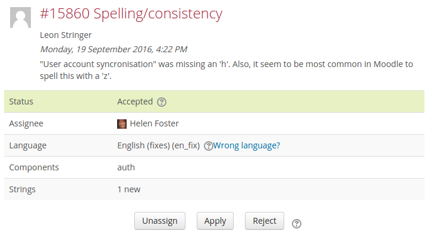

## Volunteering to become a language pack maintainer

If your language currently doesn't have a language pack maintainer, and you would like to volunteer, please [create an account on the Translation site](http://lang.moodle.org/login/signup.php) and contact our Moodle translation coordinator through [translation@moodle.org](mailto:translation@moodle.org).

## The role of language pack maintainer

A language pack maintainer for a Moodle language pack takes responsibility for that language pack. It means contributing to the translation, reviewing contributions of other contributors and approving, improving or rejecting them within a reasonable time frame. The language pack maintainer must pay special attention to the consistency of all Moodle and other terminology all over the language pack. They must also pay special attention to the technical correctness of what goes in the language pack since problematic strings can ultimately cause a site in that language to break.

The aim of a language pack maintainer is to get the language pack complete for a standard Moodle installation.

## Steps for the maintainer, making own contributions

1. Use AMOS translator interface to translate missing strings or amend the current translation
1. Go to the **Stage** page
1. Make a meaningful comment about your work in the **Commit message** form
1. Click on **Commit**

## Approving contributions from others

AMOS allows community members to help with the translation of Moodle strings.

1. When a user submits a new contribution, you will receive an automatically generated email from AMOS containing a link to the contribution.
1. Press **Start review** button. That will assign the contribution to yourself, change the status from `New` to `In review`, send an automatically generated email to the contributor and will copy the submitted strings into your stage. You should check that your stage is empty before you apply the submitted strings unless you want to merge several contributions into one commit.
1. Review the submitted strings, eventually edit them. Commit the stage. It is nice to mention the contributor's name in the commit message and attribute the original authorship to them.
1. Go back to the contribution record and change the status to `Accepted` or `Rejected`. An automatically generated email will be sent to the contributor whenever you change the status.
1. Use contribution record comments for further communication with the contributor about the submitted translation.
1. `Accepted` and `Rejected` contributions are not shown at the contributions page unless you click the **Show resolved contributions** button.
1. You will get a weekly reminder of contributed strings that are not processed yet.

## Translating strings offline

You can use the [Language customisation](http://docs.moodle.org/en/Language_customization) tool in your local Moodle server to enhance the translation of language strings for the Moodle core files.
If you want to translate the strings of a particular plugin, you must have that plugin installed on your server first.
Your translated files will be located inside the local language folder in your Moodle server.
You can upload these files to AMOS, one file at a time, or zip many files and upload the zip file (which will be un-zipped automatically inside AMOS).

## Uploading a file of translations

To avoid making changes one by one, you can do your translations offline (as above) and upload them to AMOS.

1. Click **Stage** in the Navigation block.
1. Choose **Import translated strings from file**.
1. Drag and drop the file.
1. Click the **Import** button.

:::note

You can import several files at once if you zip them first and upload the zip file. The zip file is not allowed to contain any folders, only files.

:::

## See also

- [AMOS manual](./amos) for further information about the AMOS translation toolkit
- [Language packs](http://docs.moodle.org/en/Language_packs) user documentation
