## Looking for translated plugins in the Moodle plugins database

- Almost all contributed plugins published in Moodle Plugins directory have been imported into [AMOS](http://lang.moodle.org/) and are ready to be translated.
- Watch this video tutorial on [Translating a Moodle plugin](https://www.youtube.com/watch?v=E_20uU1ibcA&feature=youtu.be)
- When a user is looking at the [Moodle plugins database](https://moodle.org/plugins/),in the **Translations** tab there is a link to **Contribute translation for (your preferred language)** that points to [AMOS](http://lang.moodle.org/).

:::note Example:

Have a look at an example for the very popular [HotPot](https://moodle.org/plugins/view.php?plugin=mod_hotpot) plugin:

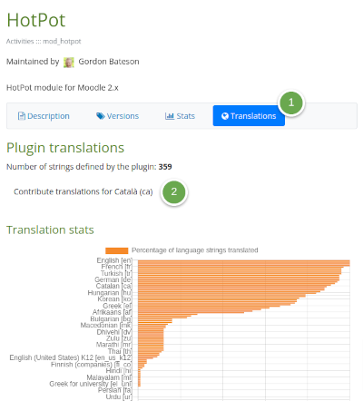

:::

- You can click on the **Contribute translation for (your preferred language)** link.
  - If you do not have an AMOS account, you would have to **Create a new account** by using the appropriate link.
  - If you have a translator account in AMOS, you can use AMOS to contribute the translation.
- If you select all the language packs (except English fixes) and write `pluginname` in the box for **String identifier**, AMOS will display the name of the plugin in all available translations.
- Make sure that you have selected the Moodle `Latest available version`.

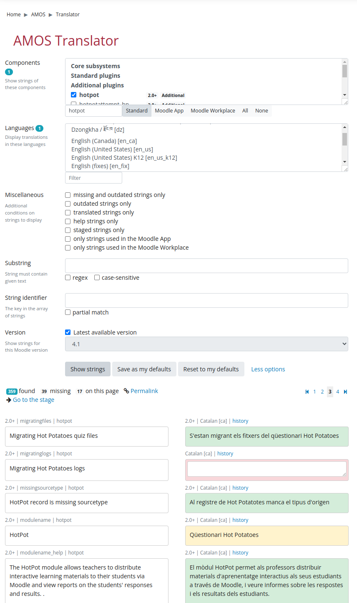

:::note

In the above example, there are a total of 359 different strings registered in AMOS for the Catalan language; 39 of these are missing a translation for HotPot, which means that there are 320 string translations already available for the HotPot plugin, a fair number for this popular plugin :)

:::

- When no translation is available for any/many language(s), the box named **Translation** will be empty for those languages.
- If a plugin name has been translated, there is a fair chance (but no certainty) that this plugin has been (completely) translated into that language. You can change the settings in AMOS and check for yourself.

<!-- cspell:ignore Henrick -->
## Plugin translation priority

- Please help Moodle users in other languages by translating your favourite plugins.
- Moodle has a continuously updated [list of the most favourite plugins](https://moodle.org/plugins/report/index.php?report=favourites&p=0&l=50&s=favourited&d=DESC), which might be worth considering for translation  :)
- You can find the plugins with the largest number of downloads in the last three months at [statistics page](https://moodle.org/plugins/stats.php). These are the plugins most likely to be most useful when translated to your language. It would probably be a good idea to translate them first.
- Moodle has a list of plugins that have received the [Reviewers' choice award](https://moodle.org/plugins/browse.php?list=award&id=1). These are given by the plugins guardians and reviewers for particularly useful, well coded or otherwise interesting plugins. It would be very desirable/useful to have these translated.
- See the [list of (year 2015) favorite plugins](https://moodle.org/mod/forum/discuss.php?d=325804) by Gavin Henrick
- Special cases:
  - All plugins with **mobile** in their name, and all [server side plugins](https://moodle.org/plugins/browse.php?list=set&id=62) to support the  [Moodle mobile app](https://docs.moodle.org/en/Moodle_Mobile)
  - [MoodleCloud strings](https://moodle.org/plugins/local_moodlecloudsignup) are used for accessing the [MoodleCloud](https://moodle.com/cloud/) free and paid hosting services.

### Elementary school teaching

If your Moodle site will serve kids, consider [making a language pack for kids](https://docs.moodle.org/en/Language_packs#Can_I_make_a_language_pack_for_kids.3F).

<!-- cspell:ignore Quizventure -->
### Plugins for K-12 teaching

For [K-12](https://en.wikipedia.org/wiki/K%E2%80%9312) teaching and learning environments, please consider translating the plugins that are included in the [Moodle for School at MoodleCloud](https://moodle.com/solutions/moodlecloud/):

- [Attendance](https://moodle.org/plugins/mod_attendance)
- [BigBlueButton](http://bigbluebutton.org/)
- [Checklist](https://moodle.org/plugins/mod_checklist)
- [Chemistry editor](https://moodle.org/plugins/atto_chemistry)
- [Group choice](https://moodle.org/plugins/mod_choicegroup)
- [Level up!](https://moodle.org/plugins/block_xp)
- [Quizventure](https://moodle.org/plugins/mod_quizgame)
- [Word count](https://moodle.org/plugins/tinymce_wordcount)

### Plugins for University teaching

For universities, there is a [list of plugins by/for Universities](https://docs.moodle.org/en/Tertiary_education#Moodle_plugins_by.2Ffor_Universities), and a [link to discipline-specific plugins](https://docs.moodle.org/en/Tertiary_education#Discipline-specific_plugins), which might be worth translating.

## Non-translatable strings

While AMOS does a great job for translating the Moodle core and most Moodle plugin language strings, some English language strings are not available for translation with AMOS.

### Plugins in the [Other](https://moodle.org/plugins/browse.php?list=category&id=38) category

The plugins classified as [Other](https://moodle.org/plugins/browse.php?list=category&id=38) (Utilities, Experimental or Incubating) are not translatable by AMOS (see [this forum thread](http://lang.moodle.org/mod/forum/discuss.php?d=3113)). You can use the [language customization](http://docs.moodle.org/en/Language_customization) tool within your Moodle (production or local) server to produce the `.php` file containing the translated language strings for your language and email this file to the particular 'other' plugin maintainer, so that it can be included in the lang folder within the downloadable Zip file for the plugin.

<!-- cspell:ignore nowdoc -->
### Plugins with coding errors

Some plugins (of types different from **Other**) available for download in the [Moodle plugins directory](https://moodle.org/plugins/) may not  have English language strings available for translation in [AMOS](https://lang.moodle.org/) because of [coding errors](https://docs.moodle.org/dev/Plugin_contribution_checklist), that must be identified and fixed by the plugin maintainer. See the **Strings** section in the [Plugin contribution checklist](https://docs.moodle.org/dev/Plugin_contribution_checklist#Strings):

- The plugin code must not rely on trailing and leading whitespace in strings.
- The string file must be considered as pure data file with the syntax `$string['id'] = 'value';`
- No other PHP syntax such as [concatenation](http://php.net/manual/en/language.operators.string.php), [heredoc and nowdoc](http://php.net/manual/en/language.types.string.php) is supported by the tools that AMOS use when processing the strings (even if it may work in Moodle itself).
- Use neither string concatenation operators nor other PHP logic inside string files. Those should really be considered as plain data files with simple `$string['key'] = 'value';` syntax, nothing more.

### Plugins with hard-wired English language strings

Sometimes you might have translated 100% of the strings available in AMOS for a given plugin, and you can still view the original English (non-translated) strings.

- Check that you have purged your browser cache and the server cache, waited for one hour (for AMOS to update the language packs), and updated your language packs.
- If the problem persists, please write the plugin maintainer by clicking at the **Bug tracker** link shown in the given plugin's page in the [Moodle plugins database](https://moodle.org/plugins/index.php).
- If the plugin author has nested additional **Lang** folders inside any subdirectories within the plugin folder structure, the English language strings in these nested Lang folder will not be available for AMOS, and they would seem to be hard-wired. Please contact the plugin author.
- Most Moodle plugin authors have been very fast at replacing the English hard-coded strings with strings variables that can now be translated in AMOS.
- If you suspect the problem is in a core plugin, you can post an issue in the [AMOS translation forum](https://lang.moodle.org/mod/forum/view.php?id=5).

### Log descriptions can not be translated

- See [why log descriptions are not translated](./faq#why-are-log-descriptions-displayed-in-english).

### Items that must NOT be translated

- See the [Items that are not to be translated](./faq#are-there-items-which-are-not-to-be-translated) in the [Translation FAQ](./faq)

## If translations are available in AMOS for some Moodle branches but not available for other branches

Sometimes a plugin may have its English language strings available for translations for some Moodle branches (for example, 2.0 to 2.4), but not for other branches (2.5 to 2.7), even though the plugin itself is indeed available for download for all branches (2.0 to 2.7) in the Moodle plugins database.

Please see an example in [this post](http://lang.moodle.org/mod/forum/discuss.php?d=3939). The cause is very likely a programming error (see **Plugins with coding errors** above), that must be fixed by the plugin maintainer.

## What happens if a plugin ZIP file includes translation(s) inside the lang folder

If a site has debugging on, there will be a warning message about **Found language file** when the user installs the plugin, but the installation may proceed.
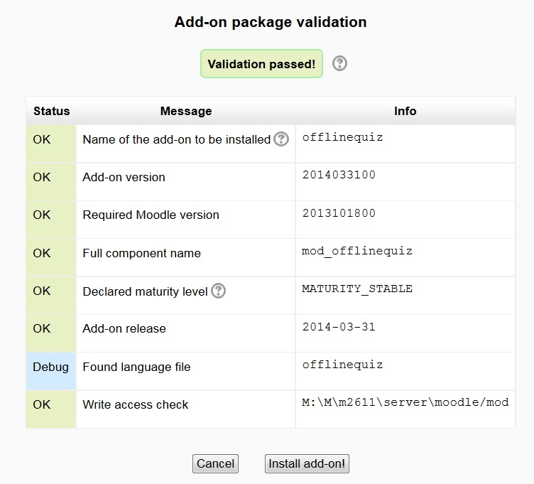

The language strings inside a properly installed downloaded plugin will overwrite the strings translations of the language pack, but they can be overwritten by the strings defined with the Language customization.

### Strings priority

When displaying text language strings, Moodle 2.x onwards have the following priority:

1. Strings defined by the [language customization](http://docs.moodle.org/en/Language_customization) tool
1. Strings defined in an installed child language pack (for example, the `es_ve` language pack)
1. Strings defined in an installed parent language pack (for example, the `es` language pack)
1. Strings enclosed inside the `plugin_name/lang/xx/yy.php` folder (where `xx` is a language code other than the `en` folder) from a downloaded and installed plugin ZIP file (for example, inside the `/server/moodle/theme/adaptable/lang/es/theme_adaptable.php` file)
1. Original Australian English language strings shipped with the downloaded Moodle branch.
1. Original Australian English language strings inside the `/lang/en` folder in the downloaded/updated plugin ZIP file

:::note

See the [local String override plugin](https://moodle.org/plugins/local_string_override) that makes it possible for plugins to override existing translations regardless if they're bundled with Moodle or they're originated from a community plugin.

:::

## H5P plugin

### H5P translations in AMOS

If you're using the third-party plugin in the plugins directory, you must translate all the H5P (and hvp) related plugins in AMOS:

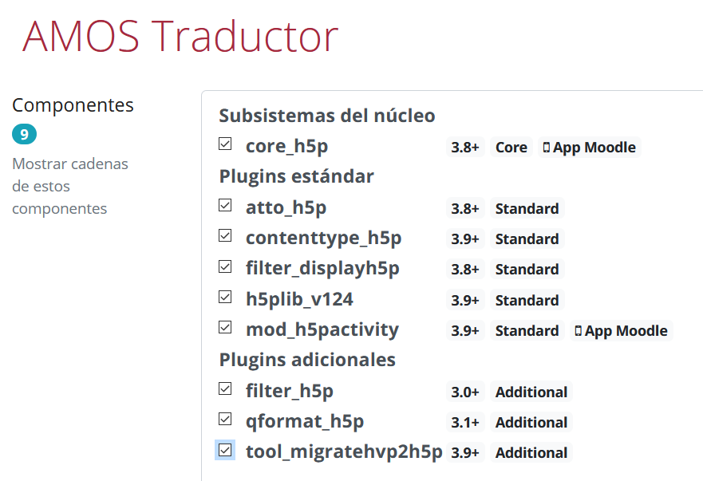

<!-- cspell:ignore weblate -->
<!-- cspell:ignore Joubel -->
<!-- cspell:ignore LUMI -->

Then, you will also have to translate the H5P module strings in the H5P site. You can do it either using weblate (preferred method) or GitHub (old method).

### H5P translation using weblate (preferred method)

Visit [https://translate-h5p.tk/contributing/](https://translate-h5p.tk/contributing/) and register.

If there is a maintainer for your language, you can make suggestions for string translations.

Check [https://h5p.org/forum/6](https://h5p.org/forum/6) for the FAQs and your questions/doubts/problems.

If there are no maintainers for your language, you may request to become a maintainer (send an email to serettig@posteo.de).

If one (or a few) of the English source strings is blank, you can simply leave it blank in your translation, too. Weblate might complain about an untranslated string, but you can ignore that!

:::important

Make sure that all the English language strings have been translated. If that file has only been partially translated, you should use the original English language strings. If you leave an empty field, there will be a serious ERROR that will block weblate progress. See the following screens:

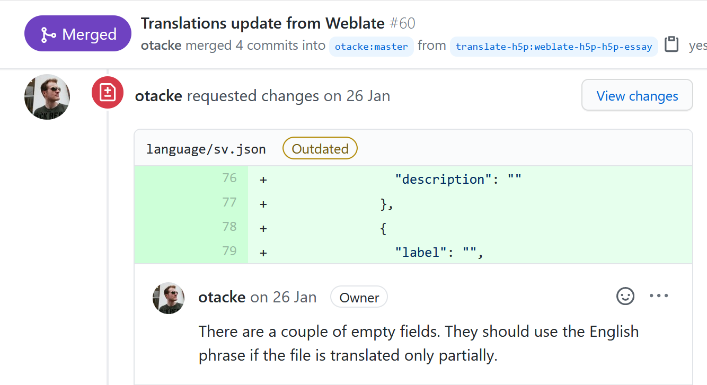

And the weblate will CLOSE this module for translation:

:::

If weblate closes a module for translation, you can only add or change language strings via GitHub (see below).

If you are a language maintainer, **only** after making sure all the strings for one H5P module have been properly translated into your language, you should commit your changes to `wordslate` **'Manage' -> Commit**. Then, you should push your changes (**'Manage' ->  Repository maintenance -> PUSH**). You must then wait for the people responsible for the GitHub code to review and accept your pull requests by way of weblate.

Don't forget to always push your changes once you've finished a library so that Joubel can review and accept them.

:::note

If you notice a typo or any other error in the original English language strings, you can write an issue (or a Pull request) in the GitHub page of the original H5P module. They will be very happy to check it and fix it if necessary.

:::

#### Translation of H5P module's names using weblate

After translating all the H5P strings using weblate, you may consider translating [LUMI](https://next.lumi.education/) using weblate, as that will allow H5P users to see the H5P modules' names and descriptions in languages other than English when they use the free [LUMI](https://next.lumi.education/) app to produce .h5p files to be used in a Moodle course.

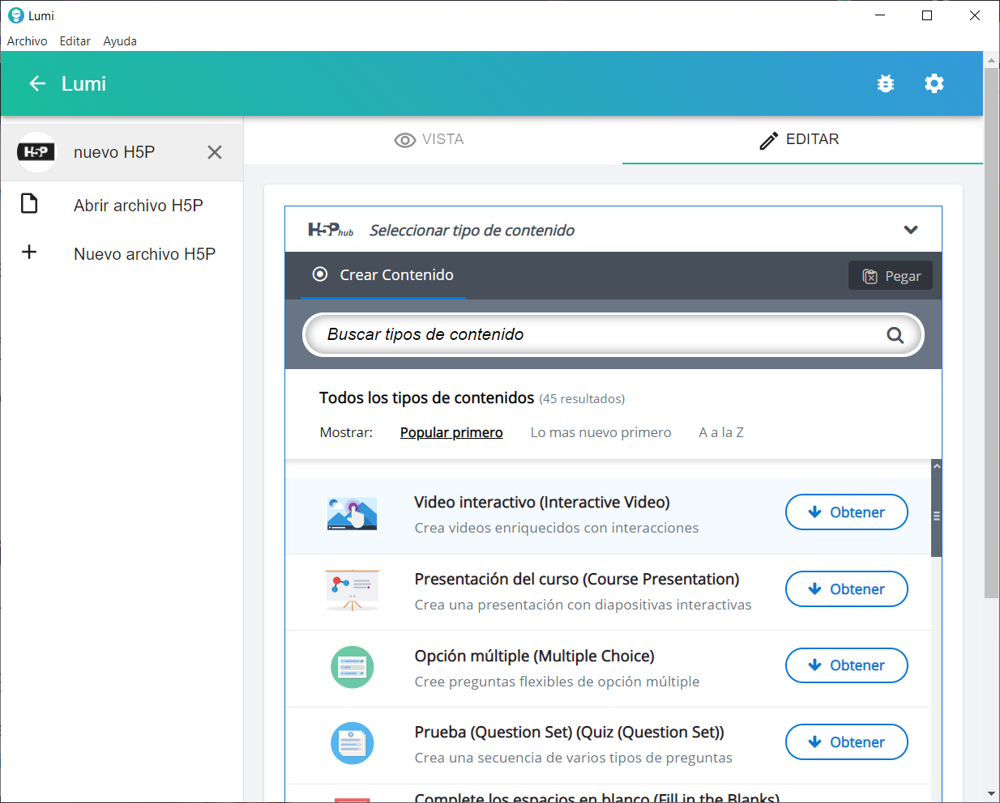

The description of each H5P module in other languages might make it easier for many new Moodle users of H5P:

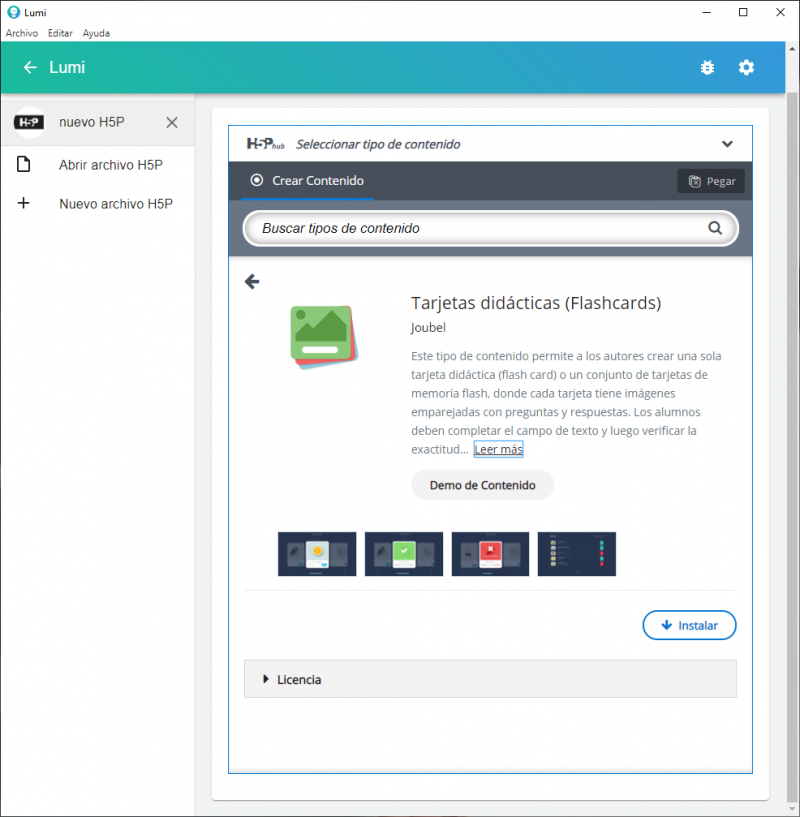

### H5P translation using GitHub (old method)

After translating the [H5P core plugin](https://docs.moodle.org/en/H5P) or the [H5P plugin for Moodle](https://moodle.org/plugins/mod_hvp) in AMOS, most users of this plugin in languages other than English may see (partly or totally) untranslated strings when using it. This is because all H5P libraries ("components" / "plugins") have their own separate [translation infrastructure](https://github.com/h5p/h5p-contribution-docs/blob/master/en/translations.md) which is not related to the H5P Moodle plugin and we are not sure what is the frequency of merging and distributing the contributed translation pull requests that we see on each library's repository on GitHub.

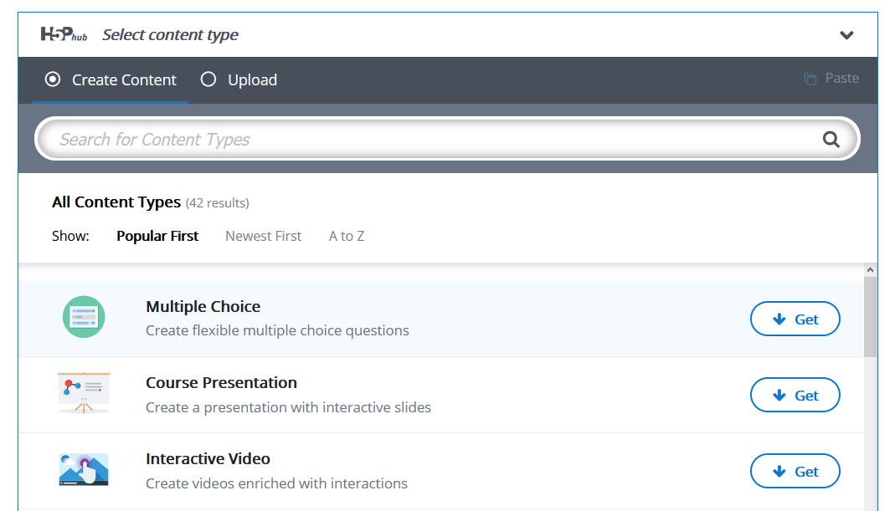

There is a page providing an overview of the H5P content-type translation status at [https://localization.h5p.org/](https://localization.h5p.org/)

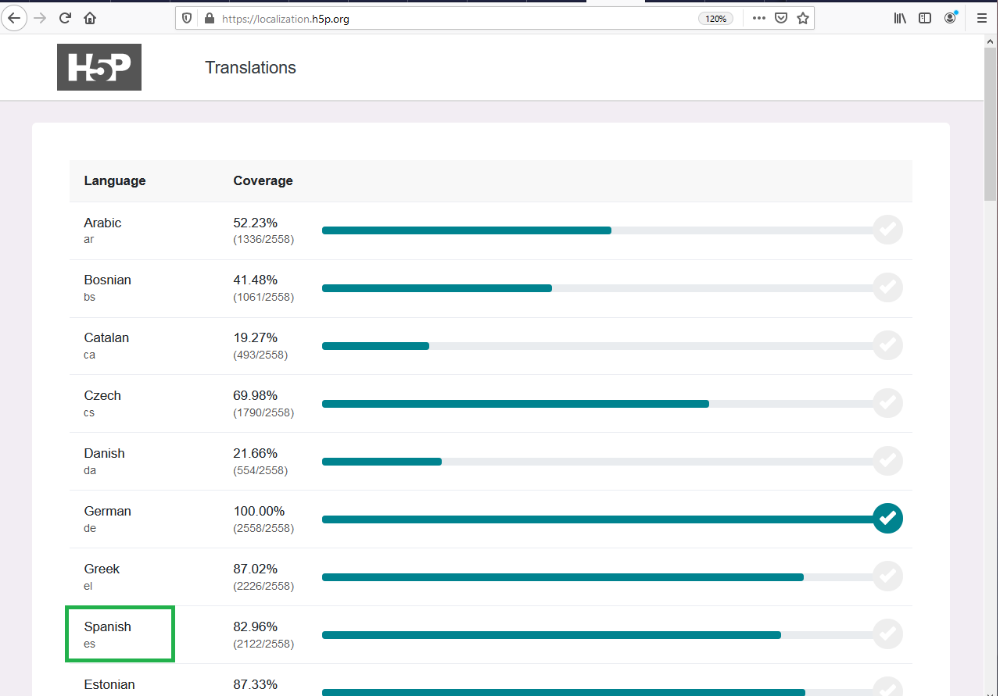

When you click on a language (`Spanish` in this example), you will see all the H5P modules with the proportion of strings translated into that language.

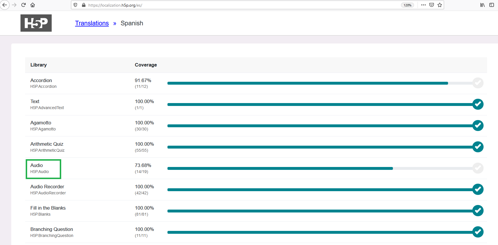

When you click on a module (`Audio` in this example) you will see a list of all the untranslated and translated strings for that language for that module

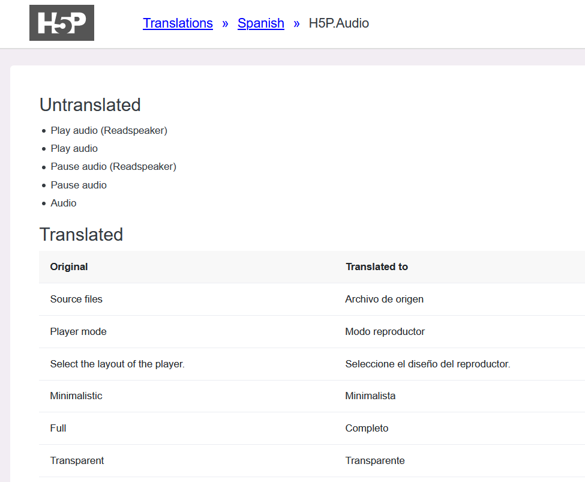

At the botton of that page, there will be a link to **Head over to the source repository**. If you click on that link, you will be taken to the GitHub page for that module, where you can fix or add the translations for your language and make a 'Pull request' to contribute this translation.

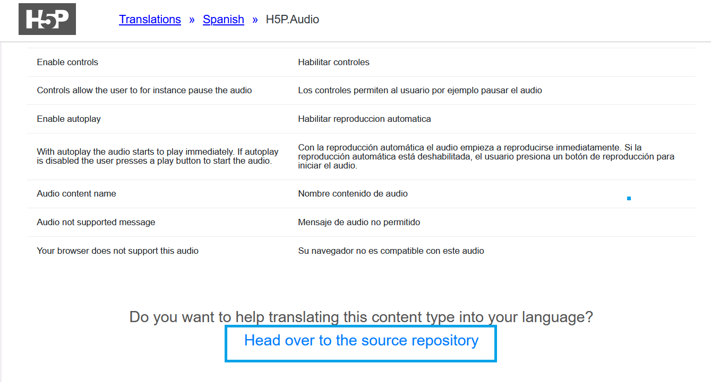

See also:

- [h5p.tk](https://translate-h5p.tk/) - a user-friendly platform that you can use to translate H5P strings.
- The [Guide for Adding content type translations via GitHub](https://h5p.org/adding-content-type-translation-via-github).

## See also

- [Contributed plugins are now automatically imported into AMOS](http://lang.moodle.org/mod/forum/discuss.php?d=2485) announcement explaining the mechanism
- [Items that are not to be translated](./faq#are-there-items-which-are-not-to-be-translated) in the [Translation FAQ](./faq)
