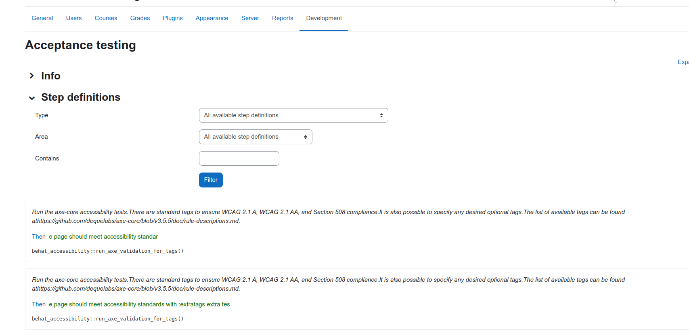

This page describes the internals of Behat and the integration with Moodle.

Behat is a framework for behavior driven development (BDD) which allows us to specify Moodle functionalities (aka features) as a human-readable list of steps. It parses these steps to executable actions to simulate user interaction against headless browsers (without JavaScript support, only curl-kind requests) or user simulation tools like Selenium, which interacts with browsers and allows JavaScript events simulation.

## Objective

The aim of this integration is to allow Moodle components to have its own set of features and step definitions. This allows us to periodically execute sets of tests to detect regressions and Moodle features in different environments (browsers, DBs engines, web servers...). The Moodle QA tests will be progressively rewritten according to this format to run automatically.

## How Behat works

This section aims to explain the basics about BDD and Behat and a quick view of how Behat internally works from the CLI command execution to the results output.

:::note

Note that all those examples are not necessarily real nor part of the suite, they are meant to help understand the concepts, see [Acceptance testing](./running.md) for real examples

:::

Some terms used:

- **Features**: Human-readable list of scenarios that describes a feature

  ```gherkin
  @auth
  Feature: Login
    In order to login
    As a moodle user
    I need to be able to validate the username and password against moodle

  Scenario: Login as an existing user
    Given I am on "login/index.php"
    When I fill in "username" with "admin"
    And I fill in "password" with "admin"
    And I press "loginbtn"
    Then I should see "Moodle 101: Course Name"

  Scenario: Login as an non-existing user
    Given I am on "login/index.php"
    When I fill in "username" with "admin"
    And I fill in "password" with "admin"
    And I press "loginbtn"
    Then I should see "Invalid login"
  ```

- **Scenario**: Human-readable list of steps to describe an expected behaviour

  ```gherkin
  Scenario: Login as an existing user
    Given I am on "login/index.php"
    When I fill in "username" with "admin"
    And I fill in "password" with "admin"
    And I press "loginbtn"
    Then I should see "Moodle 101: Course Name"
  ```

- **Steps**: Human-readable sentences that describe an action. There are 3 types of steps, `Given` describing the initial context, `When` the event that provokes a change and `Then` where the outcomes should be asserted.

  ```gherkin
  I click on the "Add user" button
  ```

- **Steps definitions**: PHP methods referenced by steps when matching its regular expression. The `@Given`, `@When` and `@Then` tags are descriptive and they are not taken into account when matching steps with steps definitions. The regular expressions placeholders are returned to the PHP method as arguments so methods can use them to tell the browser which button (for example) they want to click.

  ```php
  /**
  - @When /^I click on the "(.*)" button$/
   */
  public function i_click_on_the_button($button) {
    // Simulates the user interaction (see Mink description below for more info)
    $this->getSession()->getPage()->pressButton($button);
  }
  ```

<!-- cspell:ignore Sahi, dataroot -->
- **Behat**: PHP framework and CLI application that wraps the whole process of features files loading + features files parsing + execution of actions in the browser + results output (http://behat.org/)
- **Gherkin**: Human-readable language used to define features that can be parsed and translated into PHP methods. For more info, it's the same language used by Cucumber, the BDD Ruby framework (https://github.com/cucumber/cucumber/wiki/Gherkin)
- **Context**: In Behat scope a context is a PHP class that groups steps definitions (as methods)
- **Mink**: Is the component which interacts with browsers, simulating a real user interaction. It allows us to write PHP code (or use the available PHP methods) to send requests to the different browsers APIs through a common interface or extend it to allow browser-specific actions. The supported browsers includes Selenium, Selenium2, Sahi... http://mink.behat.org/
- **Selenium 2**: Web browser automation tool, applications like Mink can communicate with it through a RESTful API (http://code.google.com/p/selenium/wiki/JsonWireProtocol) to execute actions simulating user interaction.
- **Selector type**: Related with **locator**, is a way to select a node inside the page DOM
- **Locator**: Is what we are looking for inside the page DOM, it completely depends on the associated selector type, a few examples of it:
  - Selector type = `"link"`, Locator = `"Link text"`
  - Selector type = `"field"`, Locator = `"Field legend text"`
  - Selector type = `"css"`, Locator = `".css-class #id"`
  - Selector type = `"xpath"`, Locator = `"//input[](@id='id-value')"`
All these components are written in PHP, open sourced and packaged in a single and extensible framework.

### Quick view of the whole process

1. Behat CLI execution
   - Behat application initialization and loading of arguments (features files to execute, output format...)
   - Reads the Behat config file (browser servers are specified here)
   - Extensions overrides management
   - Gherkin initialization
1. Features files selection
   - According to the arguments Gherkin looks for .features files
      - It can use different features loaders (single file, a directory, the default directory...)
      - The framework can be extended to allow multiple folders loading
1. Features parsing (Gherkin)
   - Loops through the loaded features files looking for scenarios
   - Gets the list of steps of each scenario
   - There are hooks at different levels (https://docs.behat.org/en/latest/user_guide/context/hooks.html)
1. Steps parsing (Gherkin)
   - Gherkin looks in the available steps definitions for a regular expression that matches the step text
1. Step definition execution
   - The step definition code is executed
   - Steps definitions most of the time uses the Mink component to communicate with the browser API sending requests like "click on that button" or "go to XXX page"
1. Scenario outcomes
   - The scenario counts as failed if an exception is thrown when executing a step definition (for example trying to click a non-existing button)
   - The scenario counts as passed if no exception is thrown during it's steps execution
1. Finishing CLI execution
   - A summary with all the scenario results is displayed
   - It accepts different output formats (like JUnitXML) to it's execution in continuous integration systems (http://docs.behat.org/guides/6.cli.html#format-options)

## Moodle integration

It follows the approach chosen with PHPUnit:

- It comes disabled by default, Behat is not included within Moodle and it has to be installed separately with the composer installer
- Moodle components (subsystems and plugins) can have a tests/behat/ folder
- The scenarios are executed in a test environment, the production database and dataroot are not affected by the tests modifications
- The scenarios specifies their own fixtures and it's execution is isolated from other scenarios and features, resetting the test database and the test dataroot before each scenario
- Moodle lists the features files and steps definitions of it's components in a behat.yml file, similar to the phpunit.xml manifest
- A basic behat.yml.dist config file has been included

### Alternative environment

Acceptance testing implies interaction with the browser like real users does, so it requires the site to be accessible via URL. The Moodle integration creates a new moodle site installation in parallel to the production one to run the tests in a sandbox without affecting the production environment, switching the regular `$CFG->wwwroot`, `$CFG->dataroot` and `$CFG->prefix` to alternatives, which should be only accessible from localhost or internal networks. Info about how to run the tests in [Running acceptance test](./running.md).

<!-- cspell:ignore saucelabs, subcontexts -->
This default configuration is useful when developing in a local host, but to run the tests automatically with Jenkins, travis, other CI systems or with saucelabs we provide a few extra settings.

All the behat CLI utilities we provide within the Moodle codebase (admin/tool/behat/cli/*) are using `$CFG->behat_wwwroot`, `$CFG->behat_prefix` and `$CFG->behat_dataroot` instead of `$CFG->wwwroot`, `$CFG->prefix` and `$CFG->dataroot`, this scripts are self-contained, but as we are accessing through a browser, we also need to switch the whole Moodle instance to test mode. For this there are two requirements:

- Test mode is enabled if
  - **php admin/tool/behat/cli/init.php** or **php admin/tool/behat/cli/util.php --enable** has been executed
- Test mode is requested if
  - The vendor/bin/behat command is running, we know it because we hook the Behat process before the tests begins to run, and we require moodle `config.php` after it
  - We set `$CFG->behat_wwwroot` in `config.php` and we are accessing the moodle instance through it
The unique `$CFG->behat_wwwroot` prevents unintended execution of acceptance tests on production sites.

### JavaScript

There are two types of tests depending on if their scenario needs a real browser capable of execute JavaScript or if they can run in a headless browser.

- Tests with JavaScript requires interaction with a browser through a user simulation tool like Selenium or ZombieJS to be executed; see http://mink.behat.org/#different-browsers-drivers for all available drivers
- Test that does not requires JavaScript are faster to run but can not test rich applications like Moodle

In most of the cases a JavaScript test would be more appropriate because most of the users uses JavaScript-capable browsers, non-JavaScript tests can be useful to ensure that Moodle maintains its functionality without JavaScript enabled and to ensure there are no big issues, regressions or exceptions in general.

### Admin tool "Acceptance testing"

There is an admin tool to run and ease the creation of acceptance tests.

- Web interface: The web interface allows you to list and filter the available steps definitions, a non-technical user can use this interface to write new features (`admin/tool/behat/index.php`)
- CLI: Command to enable and disable the test environment and to update the `behat.yml` file with the system tests and steps definitions (`admin/tool/behat/cli/util.php` and `admin/tool/behat/cli/init.php` for a quick start)


### Available steps to create tests

There are behat libraries with tons of steps definitions to run all sort of processes and interactions with the browser, some of them overlaps Moodle-specific libraries and tests writers can be confused not only by this also by the amount of steps and vague or too technical steps descriptions. Moodle provides a set of steps definitions written in a common format to make tests writers life easier. New steps definitions must follow these [guidelines](./writing.md#writing-new-acceptance-test-step-definitions)

### Behat extension

A new Behat extension (https://github.com/moodlehq/moodle-behat-extension) has been created to maintain Behat and its dependencies as they comes from upstream.

The aim of this extension is:

- Load features from multiple folders (Moodle subsystems and plugins)
- Load steps definitions from multiple folders and add them as subcontexts (Moodle subsystems and plugins)
- Return the available steps definitions in a more human-readable format without regexps
- Look for exceptions, debugging() calls, PHP error messages and other backtraces in Moodle's output
- Extend the Selenium2 behat driver to allow extra Selenium capabilities
- Add a new formatter method based on progress (the moodle default one) to display info about the moodle site being tested
All the other particularities of this integration can managed playing with different Behat config parameters.

## Translations

- [es - Behat](https://docs.moodle.org/es/Behat)
