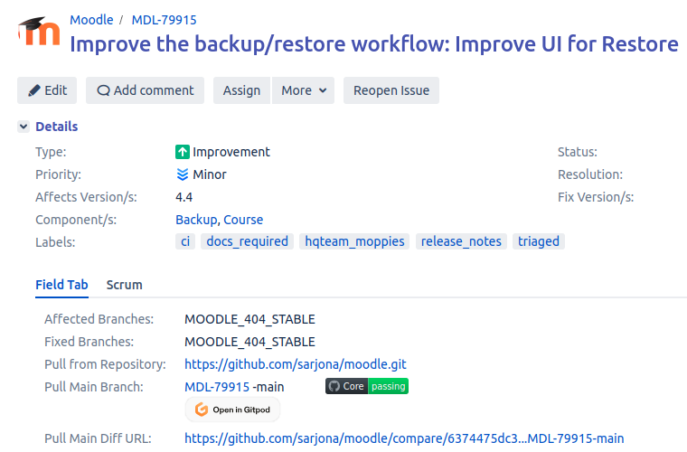

<!-- cspell:ignore Tampermonkey -->

[Gitpod](https://www.gitpod.io/) is a free, cloud-based platform with IDE integration that provides a suitable development environment directly in a browser.

It has been integrated with [moodle-docker](https://github.com/moodlehq/moodle-docker/) so that you can open any Moodle repository/branch in a Gitpod workspace.

When launching a workspace in Gitpod, it will automatically:

1. Clone the Moodle repo into the `<workspace>/moodle` folder.
1. Initialise the Moodle database.
1. Start the Moodle webserver.

More information about the Gitpod integration with moodle-docker, like the parameters it supports, can be found in the [project's page](https://github.com/moodlehq/moodle-docker/#quick-start-with-gitpod).

:::caution Important

Gitpod is an alternative to local development and completely optional. We recommend [setting up a local development environment](../gettingstarted#a-quick-start-to-moodle-development) if you plan to contribute regularly.

:::

## How to use Gitpod with Moodle?

A [Tampermonkey](https://www.tampermonkey.net/) script has been created to facilitate the initiation of a Gitpod workspace from any Moodle repository/branch. When the script is installed, a button is displayed near each branch in the [Moodle tracker](https://tracker.moodle.org/) within the Moodle repository, facilitating the initiation of a Gitpod workspace. It can be used for testing any Moodle repository/branch without requiring a local environment installed.

To use it, follow these steps:

1. Install the [Tampermonkey extension](https://www.tampermonkey.net/) for your preferred browser.
1. Go to **Dashboard** in the Tampermonkey extension and access the **Utilities** tab.
1. In the **Import from URL** field, paste the following Gitpod script: https://gist.githubusercontent.com/sarjona/9fc728eb2d2b41a783ea03afd6a6161e/raw/gitpod.js
1. Go to the [Moodle Tracker](https://tracker.moodle.org/) and open any issue.
1. Click the **Open in Gitpod** button that should appear near any of the branches in the issue.

The first time you open a workspace, you will need to register in [gitpod.io](https://www.gitpod.io/) (you can use your Github account).

After waiting for 5-8 minutes, a Moodle site will open in your IDE (web VSCode by default) and you'll be able to start playing with it!!

:::info

The password for the `admin` user is `test` ;-)

:::

## About the Gitpod workspaces

- By default, all Gitpod workspaces become inactive after 30 minutes of no activity. They can be reopened from the [Gitpod dashboard](https://gitpod.io/workspaces/).
- Workspaces are automatically deleted after 14 days.
- You can view a list of your workspaces on the [Gitpod dashboard](https://gitpod.io/workspaces/). From there, you can open any existing workspaces, which will be resumed with the Moodle site displayed in the IDE just as it was when it became inactive.
- It's recommended to rename workspaces manually to something more meaningful (like the tracker issue).

## What can be done with this integration?

The following list is just a sample of the things that can be done with the integration of Gitpod with Moodle:

- Test Moodle Tracker issues easily. Especially useful for non-developers or QA testers.
- Test third-party plugins.
- Remote development environment.
- Run tests (behat, PHPUnit…).

## See also

- [Moodle docker](https://github.com/moodlehq/moodle-docker/#quick-start-with-gitpod)
- [Gitpod samples](https://github.com/gitpod-samples)
  - [gitpod.yml](https://www.gitpod.io/docs/references/gitpod-yml)
  - [gitpod-cli](https://www.gitpod.io/docs/references/gitpod-cli)
  - [Environment variables](https://www.gitpod.io/docs/configure/projects/environment-variables)
