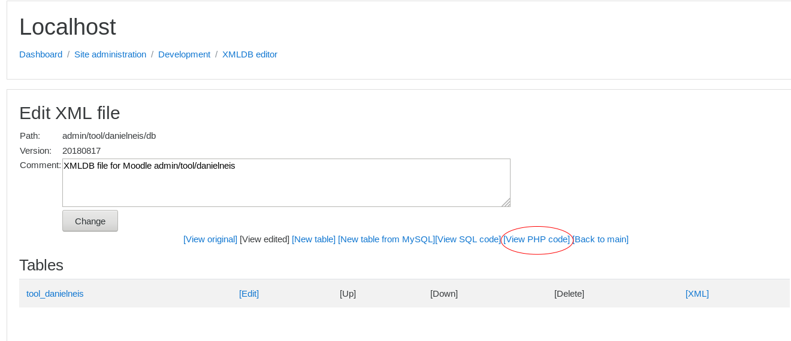

Location: *Site administration > Development > XMLDB editor*

- The XMLDB editor is a tool for making the .xml files that specify how moodle should set up its database tables. Previously, developers had to make separate .sql install files for mysql and postgres, but now only database-neutral file is needed, which supports many more databases.

- It makes the editing of tables/fields/keys/indexes almost a trivial task, allowing developers to spend  the time coding and improving things instead of fighting with XML files and the errors caused by manual editing (of course, developers are free to use such extra time as desired - beers, dance, books, music...) ;-)

- All new *install.xml* files present under each *db* directory in Moodle can be edited (and we recommend it) with just some clicks and keystrokes. Those *install.xml* will contain all the info needed to generate the specific objects needed for each RDBMS supported.

- Note: To be able to handle files properly, the web server needs write access to all *db* directories where the *install.xml* files reside (and to the files themselves, of course). If you cannot click either the load or create link, that means that you either have not created the /db directory, or that it is not writeable by the webserver.

## Quick Start

To use the XMLDB editor to create tables for a new plugin:

TIP for moodle ver 2.8: it would seem you need a "version.php" and a "settings.php" file within your mod/mymodule/ folder, along with a "db" folder that has "WRITE PERMISSION" inside your mod/mymodule/ folder. i assume the 2 files version.php and settings.php are for security, so XMLDB editor does not get abused some how. i would also assume settings.php and version.php need to be filled out to some extent. if you have above things, then you should be able to find your "mod/mymodule/" and be able to click the "create" link.

1. Under your plugin's directory, create a **`db`** directory, e.g. **`mod/mymodule/db`**. Make sure the web server has write access to this directory.
2. In Moodle, navigate to Site administration->Development->XMLDB editor
3. You should now see **`mod/mymodule/db`** in the list of XMLDB locations, and the **Create** link should now be clickable. (If you see your directory but none of the links are clickable, make sure the web server has write access to this directory!)
4. Click **Create**. (This will create a blank install.xml file)
5. Click **Load**. (This will load the contents of the install.xml file into memory)
6. Click **Edit**.
7. Now you can actually use the XMLDB editor, to create and edit tables for your plugin.
8. When you're done, keep clicking **Back** and **Back to Main** until you get back to the list of XMLDB locations, and then click **Save**.

This will create an *install.xml* file, which can be used to load your tables into the database in conjunction with a *version.php* file. See [Installing and upgrading plugin database tables](https://docs.moodle.org/dev/Installing_and_upgrading_plugin_database_tables) for more information.

After the initial installation of a plugin, for subsequent updates to the plugin's table structure you'll need to manually create an *upgrade.php* file in your module's *db* folder. The *upgrade.php* file should start off looking something like this:

```php
<?php

function xmldb_mymodule_upgrade($oldversion) {
    global $CFG;

    $result = TRUE;

// Insert PHP code from XMLDB Editor here

    return $result;
}
?>
```

To get the code for the '// Insert PHP code here' bit, open the XMLDB Editor and load the relevant *install.xml* file.

Choose the 'View PHP Code' option and then copy and paste the generated code.



## Use

- The XMLDB editor is pretty easy to use so there's no need for a complete guide here. Playing with it for a while is highly recommended, viewing how it works and how it modifies the *install.xml* files.

- It's organised in a top-bottom structure, where you start *loading** (or *creating*) a new XMLDB file. Then, you can *edit* the file and its *general structure* will be shown. This structure has two types of elements, *tables* and *statements* and the XMLDB editor allows you to *add*, *edit*, *delete*, and *move* them easily. Also, for initial creation of tables, one small but effective **reverse-enginery*' tool has been developed (only under MySQL) allowing you to retrofit any table from the DB to the XMLDB Editor.

- Whilst editing tables you will see their *fields*, *keys* and *indexes* and you'll be able to handle all them easily. Note that some fields can be non-editable. This is because they are being used in some way (part of one key or index) and the idea is to warn you about that.

- Fields can be edited and you can specify their *name*, *type*, *length*, *decimals*, *null-ability*, *defaults* and so on. Exactly the same for both *keys* and *indexes*.

- Whilst editing statements, you must think about them like "collections of sentences". Once you select the *type* (only inserts are allowed for now) and *table* you are interested in, you'll be able to introduce the exact values easily, being able to *duplicate* them easily to gain some speed if you have a lot of sentences in your development. Sentences can be *edited* and *deleted* easily too.

- One interesting feature is that all the XMLDB editor pages allow you to enter a *comment* about the item being modified (table, index, key, field, statement). Use it as you wish, sure that it helps other developers to understand a bit more about the DB model.

- If you define a field as an **enum**, you should provide the enum options as a comma-separated list, with each option surrounded by single quotes. Example: **`'option1','option2','option3'`**. However, enum has been deprecated in Moodle 2.0, so it is probably better just to avoid enum types altogether.

## Conventions

Apart from the [Database Structures guidelines](https://docs.moodle.org/dev/Database), some more conventions should be followed:

1. About names:
2. All lowercase names (tables, indexes, keys and fields).
3. Table names and field names must use only a-z, 0-9 and _ chars. Max 28 characters.
4. Key and index names under the XMLDB Files must be formed by concatenating the name of the fields present in the key/index with the '"-" (minus) character.
5. Primary key always must be named "primary" (this is one exception to the previous convention).
6. It's highly recommended to avoid [reserved words](https://docs.moodle.org/dev/XMLDB_reserved_words) completely. We know we have some of them now but they should be completely out for next releases.
7. About NULLS
8. Avoid to create all the fields as NOT NULL with the *silly* default value `*` (empty string). The underlying code used to create tables will handle it properly but the XMLDB structure must be REAL. Read more in the [Problems Page](https://docs.moodle.org/dev/XMLDB_Problems#NOT_NULL_fields_using_a_DEFAULT_*_clause).
9. About FOREIGN KEYS
10. Under the tables of every XMLDB file, you must define the existing **Foreign Keys** (FK) properly. This will allow everybody to know a bit better the structure, allow to evolve to a better constrained system in the future and will provide the underlying code with the needed info to create the proper indexes.
12. Note that, if you define any field combination as FK you won't have to create any index on that fields, the code will do it automatically!
13. Respect Convention 1.3
14. About UNIQUE KEYS
15. Declare any fields as UNIQUE KEY (UK) only if they are going to be used as target for one FK. Create unique indexes instead.
16. Respect Convention 1.3

## See also

- [XMLDB defining an XML structure](https://docs.moodle.org/dev/XMLDB_defining_an_XML_structure)
- [Installing and upgrading plugin database tables](https://docs.moodle.org/dev/Installing_and_upgrading_plugin_database_tables)
- Using Moodle [Using XMLDB editor](http://moodle.org/mod/forum/discuss.php?d=82231) forum discussion
- [Appendix B - The XMLDB Editor](http://dev.moodle.org/mod/resource/view.php?id=55) from the Introduction to Moodle Programming course
