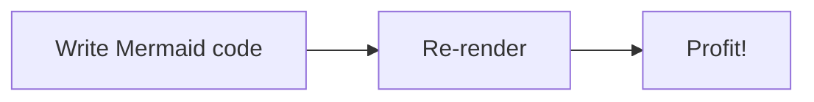

The [Moodle](https://moodle.org) Developer Resources is the official source for all Moodle documentation. It's here to make your life as a Moodle Developer easier. To serve that purpose it has to be up-to-date, and as accurate and complete as possible. Every contribution is important in achieving that goal and we hope that you are able to be a part of that mission.

The documentation is written in Markdown (specifically [CommonMark (docs link)](https://commonmark.org/help/) which is built into the website using a tool called [Docusaurus](https://docusaurus.io/docs/next/markdown-features). You don't need to understand all the details of that to make simple contributions.

If you are new to Open Source contributions, or you are interested in learning how to run or contribute to an open source project, then these resources from the [Open Source Guides](https://opensource.guide/) website may give you some help and insight into common practices. It has a collection of resources for individuals, communities, and companies who are interested in open source contributions. The following guides may be especially useful to you:

- [How to Contribute to Open Source](https://opensource.guide/how-to-contribute/)
- [Building Welcoming Communities](https://opensource.guide/building-community/)

## Code of Conduct

Moodle is in the process of updating and modernising its [Code of Conduct](./code-of-conduct.md). If you would like to be a part of this process, please see the [GitHub issue](https://github.com/moodle/devdocs/issues/47) and give us your thoughts.

## Get Involved

Anyone can get involved with, and add to, these resources - you don't have to be a developer or documentation aficionado. Here are a few ideas to get started:

- Make a small change such as a typo fix
- Look at our list of [good first issues](https://github.com/moodle/devdocs/labels/good%20first%20issue)
- [Migrate a document](#migrating-legacy-docs) from the legacy docs
- Document new Moodle features
- Mark a deprecated feature as deprecated
- Raise issues in GitHub for [features which need to be documented](https://github.com/moodle/devdocs/issues/new?assignees=&labels=documentation%2C+help+wanted%2C+enhancement&template=documentation-request.yml&title=%5Bdocs%5D+Create+documentation+for+%5BFeature%5D)
- [Triage existing issues](#triaging-issues-and-pull-requests)

If you need help, please reach out to us and we will do our best to advise you.

## Making a small change

To make a small change, such as a typo fix:

1. Follow the link at the bottom of the page 'Edit this page'.
2. Edit the text to make the change then click the Preview button to check it looks OK.
3. When you're happy with your edit, click the button 'Commit changes...'.
4. In the 'Commit message' field, add a short message describing the change.
5. Click 'Propose changes'.
6. Click 'Create pull request'.
7. Optional: add a description of the change.
8. Click 'Create pull request' again.

## Getting started with a development environment

Our documentation is built using [Docusaurus](https://docusaurus.io), a powerful open source documentation project written in JavaScript. For more detailed information, see our [installation guide](./installation.md) to install your development environment and get started.

:::tip

If you're eager to jump in the fastest way to set up your development environment is to, after cloning this repository onto your computer, have [NVM](https://github.com/nvm-sh/nvm) installed and then run:

```console
nvm install
npm i -g yarn
yarn
yarn start
```

Once this completes, the docs will open in your browser. You can just edit the .md source files in your editor and reload the pages to see the effect of your changes.

Once you have made changes in your local checkout, you can commit them, and submit a pull request through github as usual.

:::

### Migrating legacy docs

We are currently migrating documentation from our [legacy documentation site](https://docs.moodle.org/dev), and one of the best ways to contribute with documentation is to help with this migration process.

We have created a number of tools to make this a little easier and to automate as much as possible. These are mostly focused around our migration assistant. You can find its full documentation by running:

```console
yarn migrate --help
```

#### What we automate

The migration assistant will:

- try to guess the:
  - page title
  - relevant tags
- create the directory structure to the new markdown file
- fetch any images included in the original page
- convert:
  - WikiText tables to either Markdown tables, or HTML tables as appropriate
  - page headings
  - lists
  - common font formatting like bold, and italics
  - code blocks
  - some common `*Note*` syntaxes to use an [Admonition](https://docusaurus.io/docs/next/markdown-features/admonitions)
  - InterWiki links to fully-qualified links
  - Regular links to markdown links
- run markdownlint in fix mode to automatically fix any common, fixable issues
- update the links for any internal documentation which has already been migrated
- add the migrated page to our [list of migrated pages](https://github.com/moodle/devdocs/main/blob/data/migratedPages.yml)
- update any links to the migrated page

#### Using the assistant

In most circumstances you should not need to pass any special options, and you will just need to pass the name of the document you are migrating, and the path to the location you'd like to migrate it to, for example:

```console title="General migration usage"
yarn migrate [Name or URL of legacy document] [/path/to/new/document]
```

:::tip

You can either pass the full URL to the legacy document on the legacy devdocs site, or the name of the legacy document is the name within the URL, for example, in the following URL:

```
https://docs.moodle.org/dev/Moodle_and_PHP
```

The page name is `"Moodle_and_PHP"`.

:::

When choosing a location to migrate the document to, first ask whether the page contains information which relates to a particular version of Moodle - this may be a guide for a subsystem, or plugintype for example. If so, then this _must_ go into the `docs` folder. Most other content should go into the `general` folder.

:::info

The [structure of the documentation](./structure.md#general-structure) describes these two locations in further detail.

:::

```console title="Migrate the 'Moodle and PHP' documentation to a new policies page"
yarn migrate Moodle_and_PHP ./general/development/policies/php.md
```

:::note

The migration assistant is not perfect and is not aware of all WikiText features. Additionally if the formatting is not correct in the WikiText, some aspects may become incorrectly formatted during the conversion.

:::

:::danger After running the migration

After performing a migration it is important to review the page content. You should attempt to:

- update any relevant styling
- remove legacy content which is no longer relevant
- update code examples to meet current coding style rules

:::

### Triaging Issues and Pull Requests

One of the many ways that you can contribute is to help triage the [list of pending issues](https://github.com/moodle/devdocs/issues?q=is%3Aissue+is%3Aopen+label%3Aneeds-triage).

When doing so you should may want to:

- Ask for more information if you believe the issue does not provide all the details required to solve it.
- Suggest [labels](https://github.com/moodle/devdocs/labels) to can help categorise issues.
- Flag issues that are stale or that should be closed.
- Review code.

## Adding diagrams

The diagram tool [Mermaid](https://mermaid.js.org/intro/) is integrated into this docs site. This lets you define simple diagrams in the source of the page. For example:

````

````

... which produces:


To work out the Mermaid syntax you need for the diagram you are trying to create, the [Live editor](https://mermaid.live/) is highly recommended.

## Our Development Process

While our development of Moodle is managed in the [Moodle Tracker](https://tracker.moodle.org/), all development of these Developer Resources takes place in this [GitHub repository](https://github.com/moodle/devdocs). All work takes place in public, in this repository.

We make use of GitHub actions for our continuous integration and have a range of unit tests, end-to-end tests, style and lint tests, and build tests.

## Issues

When [creating a new issue](https://github.com/moodle/devdocs/issues/new/choose), always make sure to fill out the issue template.

### Bugs

We use [GitHub Issues](https://github.com/moodle/devdocs/issues) for our documentation bugs. If you would like to report a problem, take a look around and see if someone already opened an issue about it. If you are certain this is a new, unreported bug, you can submit a [bug report](https://github.com/moodle/devdocs/issues/new?template=documentation-bug.yml).

Please provide as much information as possible and, if you are able to, provide screenshots. Fixes are always welcomed.

### Documentation requests

If you would like to request documentation for new features, or the migration of documentation from the [legacy devdocs](https://docs.moodle.org/dev) you can use the appropriate issue templates.

- [Request to migrate legacy documentation](https://github.com/moodle/devdocs/issues/new?template=documentation-migration-request.yml)
- [Request to create new documentation](https://github.com/moodle/devdocs/issues/new?template=documentation-request.yml)

For migrated documentation, if you can provide updated code examples, then this will make it easier to prioritise your issue.

### Contributing

We welcome contributions to these developer resources. If you've not contributed before and would like to do so, then you may like to look at our list of [good first issues](https://github.com/moodle/devdocs/labels/good%20first%20issue) to get you started.

If you have domain-specific knowledge in an area which has outstanding documentation then the [`help wanted`](https://github.com/moodle/devdocs/labels/help%20wanted) search may give you some inspiration.

## Development

### Style guidelines

A set of writing and coding style guidelines for this documentation will be documented in more detail in the [style guides](./style-guides.md).

:::important

See our [linting and spelling](./linting.md) documentation for more information on how to check for common issues.

:::

### Pull Requests

All pull requests should be opened against the `main` branch, and pushed to your own GitHub fork of the repository.

When you open your pull request we will automatically run a number of continuous integration jobs against your branch to check for errors and you'll be notified if any of these fail. We recommend looking out for any failures and fixing them as soon as you can.

The project maintainers will review your code and may provide feedback before it's merged into the project.

### Commit Messages

Every commit tells a story, and the commit message is the key narration of that story. It can be extremely useful to have a bit more information about your changes so try to provide any extra information that might be useful. For example:

- If you remove some old documentation, or part of a file, it may be useful to explain why it is no longer necessary.
- When you add a new documentation for a new feature, it may be useful to include the Moodle Tracker issue in your commit message to tie everything together.
- When noting the deprecation of a Moodle feature, it may be useful to include a link to the Moodle Tracker issue.

The first line of your commit should meet the following format:

```
[<type>] <area>: <subject>
```

We currently use the following types:

- `repo` - For anything related to the repository, or documentation system
- `docs` - For changes to the developer resource documentation itself

The `<area>` tag is primarily used for `docs` changes to describe the section of documentation you have made changes to.

### Versioned Docs

Some of this documentation related to a specific version of Moodle:

- `general` - This section is not documented at all
- `docs` - Relates to the current Moodle development branch, known as `main`
- `versioned_docs/version-X.Y` - Related to a specific major version of Moodle

If you are documenting a feature which should be documented across older versions, we request that you backport it to the relevant stable versions.

### Licensing

By contributing to the Moodle Developer Resources, you agree that your contributions will be licensed under the GPLv3 license.

The following header should be present in all non-documentation code files:

```js
/**
 * Copyright (c) Moodle Pty Ltd.
 *
 * Moodle is free software: you can redistribute it and/or modify
 * it under the terms of the GNU General Public License as published by
 * the Free Software Foundation, either version 3 of the License, or
 * (at your option) any later version.
 *
 * Moodle is distributed in the hope that it will be useful,
 * but WITHOUT ANY WARRANTY; without even the implied warranty of
 * MERCHANTABILITY or FITNESS FOR A PARTICULAR PURPOSE.  See the
 * GNU General Public License for more details.
 *
 * You should have received a copy of the GNU General Public License
 * along with Moodle.  If not, see <http://www.gnu.org/licenses/>.
 */
```

### Linking to Moodle Academy

These Moodle Developer Resources are one of many key sources of information for Moodle developers. One of the other most important sources of knowledge is the [Moodle Academy](https://moodle.academy/).

You may wish to link documentation to relevant courses on the Moodle Academy, and we provide an easy way to do so.

A list of relevant courses is [maintained as JSON within the documentation repository](https://github.com/moodle/devdocs/blob/main/data/academycourses.json). Each entry in the list of courses includes:

- a unique name
- the id of the course
- a short name for the course
- a brief summary of the course
- a longer description
- a list of relevant tags

You can also make of a React element, `<AcademyLink /` which takes both a `courseName`, and `subject`.

- The `courseName` relates to the key of the course metadata within the `academycourses.json`.
- The `subject` is used in the text of the information box.

As an example, the following will create a link to the Moodle Academy course with information on setting up your Moodle Development environment:

```
<AcademyLink
  subject="Setting up your Moodle Development environment"
  courseName="setup"
/>
```

<AcademyLink
  subject="Setting up your Moodle Development environment"
  courseName="setup"
/>
