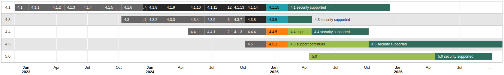

<!-- markdownlint-disable no-inline-html -->

import SupportedReleases, { styles as ReleaseStyles } from '@site/src/components/SupportedReleases';
import ReleaseTable from '@site/src/components/ReleaseTable';
import Link from '@docusaurus/Link';

This page lists all official releases of Moodle, grouped by branch in reverse chronological order.

## Version support

The most recent [long-term support release (LTS)](https://en.wikipedia.org/wiki/Long-term_support) version is Moodle 4.5. The next LTS version will be Moodle 5.3.

<SupportedReleases />

    
Release graph key

    

<table>
    <tbody>
        <tr>
            <th scope="row" className={ReleaseStyles['release-state-current']}>
                Current stables
            </th>
            <td>Currently supported stable releases.</td>
        </tr>
        <tr>
            <th scope="row" className={ReleaseStyles['release-state-security']}>
                Current security
            </th>
            <td>Current release of versions still receiving security-only updates.</td>
        </tr>
        <tr>
            <th scope="row" className={ReleaseStyles['release-state-future']}>
                Future stables
            </th>
            <td>Future point releases receiving bug fixes, as well as security updates.</td>
        </tr>
        <tr>
            <th scope="row" className={ReleaseStyles['release-state-future-security']}>
                Future security
            </th>
            <td>Future point releases receiving security-only updates.</td>
        </tr>
        <tr>
            <th scope="row" className={ReleaseStyles['release-state-past-stables']}>
                Past stables
            </th>
            <td>Previously released versions containing bug fixes, as well as security updates. Updating to a currently supported version is recommended.</td>
        </tr>
        <tr>
            <th scope="row" className={ReleaseStyles['release-state-past-security']}>
                Past security
            </th>
            <td>Previously released versions containing security updates only. Updating to a currently supported version is recommended.</td>
        </tr>
    </tbody>
</table>

## General release calendar

These are the target dates for releases. These dates may vary slightly due to unforeseen circumstances.

| Release type | Frequency | Months | Timing |
| --- | --- | --- | --- |
| [Major](./development/process.md#major-release-cycles) (eg. 3.x) | 6 monthly | April, and October | Weeks 17, and 43 of the year |
| [Minor](./development/process.md#stable-maintenance-cycles) (Point) (eg. 3.x.y) | 2 monthly | February, April, June, August, October, December | Usually every 8 weeks |

:::tip

Upcoming release dates can be found in the Moodle development calendar, which is available as an [iCal feed](https://www.google.com/calendar/ical/moodle.com_p4c2oe7hsb77ltaro5qtihb5d4%40group.calendar.google.com/public/basic.ics), or to [browse](https://calendar.google.com/calendar/embed?src=moodle.com_p4c2oe7hsb77ltaro5qtihb5d4@group.calendar.google.com&pli=1).

:::

:::note

Minor releases dates differ slightly from release to release depending on the timing of public holidays in Western Australia.

:::

## Moodle 4.6 (Experimental)

Please note that Moodle 4.6 is an experimental version integrating MDL-71378 with the Moodle 4.5.x code, intended as a preview and testing release.  It is not recommended that it be used as part of general production.

<ReleaseTable releaseName="4.6" />

:::info

Bug fixes for general core bugs in 4.6.x will end 14 April 2025 (4 months). 
Bug fixes for security issues in 4.6.x will end 14 April 2025 (4 months).

:::

## Moodle 4.5 (LTS)

<ReleaseTable releaseName="4.5" />

:::info

Bug fixes for general core bugs in 4.5.x will end 6 October 2025 (12 months). 
Bug fixes for security issues in 4.5.x will end October 2027 (36 months).

:::

## Moodle 4.4

<ReleaseTable releaseName="4.4" />

:::info

Bug fixes for general core bugs in 4.4.x will end 21 April 2025 (12 months). 
Bug fixes for security issues in 4.4.x will end 8 December 2025 (18 months).

:::

## Moodle 4.3

<ReleaseTable releaseName="4.3" />

:::info

Bug fixes for general core bugs in 4.3.x ended 7 October 2024 (12 months). 
Bug fixes for security issues in 4.3.x will end 21 April 2025 (18 months).

:::

## Moodle 4.2

<ReleaseTable releaseName="4.2" />

:::info

Bug fixes for general core bugs in 4.2.x ended 22 April 2024 (12 months). 
Bug fixes for security issues in 4.2.x ended 7 October 2024 (18 months).

:::

## Moodle 4.1 (LTS)

<ReleaseTable releaseName="4.1" />

:::info

Bug fixes for general core bugs in 4.1.x ended 11 December 2023 (13 months). 
Bug fixes for security issues in 4.1.x will end 8 December 2025 (37 months).

:::

## Moodle 4.0

<ReleaseTable releaseName="4.0" />

:::info

Bug fixes for general core bugs in 4.0.x ended 12 June 2023 (13 months). 
Bug fixes for security issues in 4.0.x ended 11 December 2023 (19 months).

:::

## Moodle 3.11

<ReleaseTable releaseName="3.11" />

:::info

Bug fixes for general core bugs in 3.11.x ended 14 November 2022 (12 months plus 6 months extension). 
Bug fixes for security issues in 3.11.x ended 11 December 2023 (18 months plus 13 months extension).

:::

## Moodle 3.10

<ReleaseTable releaseName="3.10" />

:::info

Bug fixes for general core bugs in 3.10.x ended 8 November 2021 (12 months). 
Bug fixes for security issues in 3.10.x ended 9 May 2022 (18 months).

:::

## Moodle 3.9 (LTS)

<ReleaseTable releaseName="3.9" />

:::info

Bug fixes for general core bugs in 3.9.x ended 10 May 2021 (12 months).  
Bug fixes for security issues in 3.9.x ended 11 December 2023 (36 months plus 7 months extension).

:::

## Moodle 3.8

<ReleaseTable releaseName="3.8" />

:::info

Bug fixes for general core bugs in 3.8.x ended 9 November 2020 (12 months).  
Bug fixes for security issues in 3.8.x ended 10 May 2021 (18 months).

:::

## Moodle 3.7

<ReleaseTable releaseName="3.7" />

:::info

Bug fixes for general core bugs in 3.7.x ended 11 May 2020 (12 months). 
Bug fixes for security issues in 3.7.x ended 9 November 2020 (18 months).

:::

## Moodle 3.6

<ReleaseTable releaseName="3.6" />

:::info

Bug fixes for general core bugs in 3.6.x ended 11 November 2019 (12 months).  
Bug fixes for security issues in 3.6.x ended 11 May 2020 (18 months).

:::

## Moodle 3.5 (LTS)

<ReleaseTable releaseName="3.5" />

:::info

Bug fixes for general core bugs in 3.5.x ended May 2019 (12 months).  
Bug fixes for security issues in 3.5.x ended 10 May 2021 (36 months).

:::

## Moodle 3.4

<ReleaseTable releaseName="3.4" />

:::info

Bug fixes for general core bugs in 3.4.x ended 12 November 2018 (12 months).  
Bug fixes for security issues in 3.4.x ended 13 May 2019 (18 months).

:::

## Moodle 3.3

<ReleaseTable releaseName="3.3" />

:::info

Bug fixes for general core bugs in 3.3.x ended 17 May 2018 (12 months).  
Bug fixes for security issues in 3.3.x ended 12 November 2018 (18 months).

:::

## Moodle 3.2

<ReleaseTable releaseName="3.2" />

:::info

Bug fixes for general core bugs in 3.2.x ended 13 November 2017 (12 months).  
Bug fixes for security issues in 3.2.x ended 17 May 2018 (18 months).

:::

## Moodle 3.1 (LTS)

<ReleaseTable releaseName="3.1" />

:::info

Bug fixes for general core bugs in 3.1.x ended 8 May 2017 (12 months).  
Bug fixes for security issues in 3.1.x ended 13 May 2019 (36 months).

:::

## Moodle 3.0

<ReleaseTable releaseName="3.0" />

:::info

Bug fixes for general core bugs in 3.0.x ended 14 November 2016 (12 months).  
Bug fixes for security issues in 3.0.x ended 8 May 2017 (18 months).

:::

## Moodle 2.9

<ReleaseTable releaseName="2.9" />

:::info

Bug fixes for general core bugs in 2.9.x ended 9 May 2016 (12 months).  
Bug fixes for security issues in 2.9.x ended 14 November 2016 (18 months).

:::

## Moodle 2.8

<ReleaseTable releaseName="2.8" />

:::info

Bug fixes for general core bugs in 2.8.x ended 9 November 2015 (12 months).  
Bug fixes for security issues in 2.8.x ended 9 May 2016 (18 months).

:::

## Moodle 2.7 (LTS)

<ReleaseTable releaseName="2.7" />

:::info

Bug fixes for general core bugs in 2.7.x ended 11 May 2015 (12 months).  
Bug fixes for security issues in 2.7.x ended 8 May 2017 (36 months).

:::

## Moodle 2.6

<ReleaseTable releaseName="2.6" />

:::info

Bug fixes for general core bugs in 2.6.x ended 10 November 2014 (12 months).  
Bug fixes for security issues in 2.6.x ended 11 May 2015 (18 months).

:::

## Moodle 2.5

<ReleaseTable releaseName="2.5" />

:::info

Bug fixes for general core bugs in 2.5.x ended May 2014 (12 months).  
Bug fixes for security issues in 2.5.x ended 10 November 2014 (18 months).

:::

## Moodle 2.4

<ReleaseTable releaseName="2.4" />

:::info

Bug fixes for general core bugs in 2.4.x ended December 2013 (12 months).  
Bug fixes for security issues in 2.4.x ended June 2014 (18 months).

:::

## Moodle 2.3

<ReleaseTable releaseName="2.3" />

:::info

Bug fixes for general core bugs in 2.3.x ended June 2013 (12 months).  
Bug fixes for security issues in 2.3.x ended December 2013 (18 months).

:::

## Moodle 2.2

<ReleaseTable releaseName="2.2" />

:::info

Bug fixes for general core bugs in 2.2.x ended December 2012 (12 months).  
Bug fixes for security issues in 2.2.x ended June 2013 (18 months).

:::

## Moodle 2.1

<ReleaseTable releaseName="2.1" />

:::info

Bug fixes for general core bugs in 2.1.x ended June 2012 (12 months).  
Bug fixes for security issues in 2.1.x ended December 2012 (18 months).

:::

## Moodle 2.0

<ReleaseTable releaseName="2.0" />

:::info

Bug fixes for general core bugs in 2.0.x ended December 2011 (12 months).  
Bug fixes for security issues in 2.0.x ended June 2012 (18 months).

:::

## Moodle 1.9

<ReleaseTable releaseName="1.9" />

:::info

Bug fixes for general core bugs in 1.9.x has ended June 2011 (3.5 years).  
Bug fixes for security issues in 1.9.x by Moodle HQ ended June 2012 (4.5 years).

:::

:::note

Bug fixes for security issues in 1.9.19+ branch by [Catalyst IT](http://catalyst.net.nz) ended [Dec 2013](http://moodle.org/mod/forum/discuss.php?d=199706) (6 years).

:::

## Moodle 1.8

- [Moodle 1.8](./releases/1.8.md) - 30 March 2007
- [Moodle 1.8.1](./releases/1.8/1.8.1.md) - 14 June 2007
- [Moodle 1.8.2](./releases/1.8/1.8.2.md) - 8 July 2007
- [Moodle 1.8.3](./releases/1.8/1.8.3.md) - 11 October 2007
- [Moodle 1.8.4](./releases/1.8/1.8.4.md) - 11 January 2008
- [Moodle 1.8.5](./releases/1.8/1.8.5.md) - 8 April 2008
- [Moodle 1.8.6](./releases/1.8/1.8.6.md) - 11 July 2008
- [Moodle 1.8.7](./releases/1.8/1.8.7.md) - 15 October 2008
- [Moodle 1.8.8](./releases/1.8/1.8.8.md) - 28 January 2009
- [Moodle 1.8.9](./releases/1.8/1.8.9.md) - 15 May 2009
- [Moodle 1.8.10](./releases/1.8/1.8.10.md) - 26 October 2009
- [Moodle 1.8.11](./releases/1.8/1.8.11.md) - 25 November 2009
- [Moodle 1.8.12](./releases/1.8/1.8.12.md) - 27 March 2010
- [Moodle 1.8.13](./releases/1.8/1.8.13.md) - 8 June 2010
- [Moodle 1.8.14](./releases/1.8/1.8.14.md) - 3 December 2010
- Support has ended

## Moodle 1.7

- [Moodle 1.7](./releases/1.7.md) - 7 November 2006
- [Moodle 1.7.1](./releases/1.7/1.7.1.md) - 17 January 2007
- [Moodle 1.7.2](./releases/1.7/1.7.2.md) - 30 March 2007
- [Moodle 1.7.3](./releases/1.7/1.7.3.md) - 11 October 2007
- [Moodle 1.7.4](./releases/1.7/1.7.4.md) - 11 January 2008
- [Moodle 1.7.5](./releases/1.7/1.7.5.md) - 11 July 2008
- [Moodle 1.7.6](./releases/1.7/1.7.6.md) - 15 October 2008
- [Moodle 1.7.7](./releases/1.7/1.7.7.md) - 28 January 2009
- Support has ended

## Moodle 1.6

- [Moodle 1.6](./releases/1.6.md) - 20 June 2006
- [Moodle 1.6.1](./releases/1.6/1.6.1.md) - 20 July 2006
- [Moodle 1.6.2](./releases/1.6/1.6.2.md) - 12 September 2006
- [Moodle 1.6.3](./releases/1.6/1.6.3.md) - 10 October 2006
- [Moodle 1.6.4](./releases/1.6/1.6.4.md) - 17 January 2007
- [Moodle 1.6.5](./releases/1.6/1.6.5.md) - 30 March 2007
- Moodle 1.6.6 - 11 January 2008
- Moodle 1.6.7 - 11 July 2008
- [Moodle 1.6.8](./releases/1.6/1.6.8.md) - 15 October 2008
- [Moodle 1.6.9](./releases/1.6/1.6.9.md) - 28 January 2009
- Support has ended

## Moodle 1.5

- [Moodle 1.5](./releases/1.5.md) - 5 June 2005
- [Moodle 1.5.1](./releases/1.5/1.5.1.md) - 8 July 2005
- [Moodle 1.5.2](./releases/1.5/1.5.2.md) - 16 July 2005
- [Moodle 1.5.3](./releases/1.5/1.5.3.md) - 11 November 2005
- [Moodle 1.5.4](./releases/1.5/1.5.4.md) - 21 May 2006
- Support has ended

## Moodle 1.4

- Moodle 1.4 - 31 August 2004
- Moodle 1.4.1 - 12 September 2004
- Moodle 1.4.2 - 5 November 2004
- Moodle 1.4.3 - 21 December 2004
- Moodle 1.4.4 - 7 March 2005
- [Moodle 1.4.5](./releases/1.4/1.4.5.md) - 7 May 2005
- Support has ended

## Moodle 1.3

- Moodle 1.3 - 25 May 2004
- Moodle 1.3.1 - 4 June 2004
- Moodle 1.3.2 - 9 July 2004
- Moodle 1.3.3 - 16 July 2004
- Moodle 1.3.4 - 11 August 2004
- Moodle 1.3.5 - 9 September 2004
- Support has ended

## Moodle 1.2

- Moodle 1.2 - 20 March 2004
- Moodle 1.2.1 - 25 March 2004
- Support has ended

## Moodle 1.1

- Moodle 1.1 - 29 August 2003
- Moodle 1.1.1 - 11 September 2003
- Support has ended

## Moodle 1.0

- Moodle 1.0 - 20 August 2002
- Moodle 1.0.1 - 26 August 2002
- Moodle 1.0.2 - 2 September 2002
- Moodle 1.0.3 - 5 September 2002
- Moodle 1.0.4 - 10 September 2002
- Moodle 1.0.5 - 27 September 2002
- Moodle 1.0.6 - 26 October 2002
::1.0.6.1 - 6 November 2002
::1.0.6.2 - 11 November 2002
::1.0.6.3 - 14 November 2002
::1.0.6.4 - 25 November 2002
- Moodle 1.0.7 - 9 December 2002
- Moodle 1.0.8 - 7 January 2003
- Moodle 1.0.9 - 30 May 2003
- Support has ended

## See also

- [Roadmap](./community/roadmap.md) - future versions
- [Moodle versions](https://docs.moodle.org/dev/Moodle_versions) - an explanation of how our versions work plus version numbers for each release (for $plugin->requires)

## Translations

<!-- cspell:disable -->

- [Historique des versions](https://docs.moodle.org/fr/Historique_des_versions)
- [dev/Historia de las versiones](https://docs.moodle.org/es/dev/Historia_de_las_versiones)
- [Versionshistorie](https://docs.moodle.org/de/Versionshistorie)
