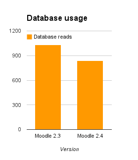
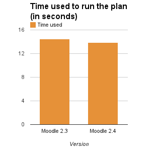
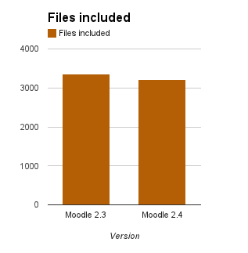
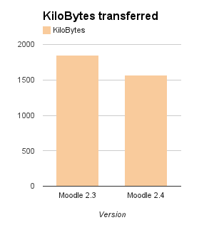
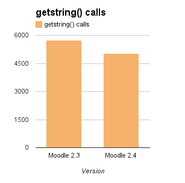

Release date: 3 December 2012

Here is [the full list of fixed issues in 2.4](https://tracker.moodle.org/issues/?jql=project%20%3D%20mdl%20AND%20resolution%20%3D%20fixed%20AND%20fixVersion%20in%20(%222.4%22)%20ORDER%20BY%20priority%20DESC).

Many thanks to [everyone that worked on the new features in this release](http://moodle.org/dev/contributions.php?version=2.4.x)

A special thanks to our incredible **Integration Team** from Moodle HQ who worked tirelessly with all developers to review, test and help finish code for inclusion in Moodle core:

- Eloy Lafuente
- Sam Hemelryk
- Dan Poltawski
- Aparup Bannerjee

Finally, thanks to all our testers both within Moodle HQ and from the whole community, who have contributed to producing our most exciting and stable release yet!

### Requirements

- Recommended minimum browser: Firefox 4, Internet Explorer 8  (IE 10 required for drag and drop of files from outside the browser into Moodle), Safari 5, Google Chrome 11
- Moodle upgrade:  Moodle 2.2 or later (if upgrading from earlier versions, you must upgrade to 2.2 as a first step)
- Minimum DB versions: PostgreSQL 8.3, MySQL 5.1.33 ([MDL-33984](https://tracker.moodle.org/browse/MDL-33984)), MSSQL 2005 or Oracle 10.2
- Minimum PHP version: PHP 5.3.2

NOTE: We will drop support for IE8 after Moodle 2.5 (June 2013).  This means IE8 will probably still work for 2.6, but developers will not be required to test their new code on that browser.  Moodle, like most of the world's web sites and browser producers, encourages you to keep your browsers current to improve security and functionality while saving us valuable time.  ([For example see what Google is doing](http://googleappsupdates.blogspot.ca/2012/09/supporting-modern-browsers-internet.html))

### Major new features

#### Performance improvements

A variety of improvements have been made under the hood to improve performance in a number of ways.  Some require configuration by the admin to take advantage of them but used properly they can allow you to make better use of your hardware for faster speed and more students.

- [MDL-33018](https://tracker.moodle.org/browse/MDL-33018) - New context index to substantially improve system performance on large PostgreSQL installations.
- [MDL-30643](https://tracker.moodle.org/browse/MDL-30643) - Improved daily statistics performance.
- [MDL-33017](https://tracker.moodle.org/browse/MDL-33017) - Significant size reduction of navigation widget.
- [MDL-25290](https://tracker.moodle.org/browse/MDL-25290) - MUC Stage 1: Implement some core caching architecture (MUC).
- [MDL-34343](https://tracker.moodle.org/browse/MDL-34343) - Database meta information caching.
- [MDL-34399](https://tracker.moodle.org/browse/MDL-34399) - Question related caching.
- [MDL-36211](https://tracker.moodle.org/browse/MDL-36211) - Performance improvement by not locking guests and not-logged-in users sessions

These results show out-of-the-box improvements without tuning or adding special MUC-supported backends (which would improve things even more).

| style="text-align:center;"|Database usage (-19.2%) | style="text-align:center;"|Time used (-4.1%) | style="text-align:center;"|Files included (-4.5%) |
| --- | --- | --- |
|  |  |  |

| style="text-align:center;"|KiloBytes downloaded (-15.2%) | style="text-align:center;"|Session size (+5.1%) | style="text-align:center;"|getstring() calls (-12.5%) |
| --- | --- | --- |
|  | +0.91KB per user |  |

- [More info about the tests environment](https://docs.moodle.org/dev/Moodle_2.4_release_notes/Performance_tests)
- [Other tests](http://www.iteachwithmoodle.com/2012/11/17/moodle-2-4-beta-performance-test-comparison-with-moodle-2-3/) have even better results

#### Plugin updating from within Moodle

- [MDL-35238](https://tracker.moodle.org/browse/MDL-35238) - Not only will Moodle tell you when one of your plugins is out-of-date, but you can also now [update it via the web interface](https://docs.moodle.org/24/en/Installing_plugins).

#### Course format plugins

Moodle has always supported pluggable course formats, but now we've given developers even more flexibility than before.  Course formats can now provide their own settings for courses and sections, and they can also have a lot more control of all the pages in a course.

- [MDL-35218](https://tracker.moodle.org/browse/MDL-35218) - [Course formats re-factoring](https://docs.moodle.org/dev/Course_formats_2)

We're looking forward to seeing some exciting course formats from the community in future.    (Note that in 2.4 the standard course formats have not been changed).

#### Icons

The default icons used for activities and editing actions have been updated for the first time since Moodle 1.0.  Not only are they a little bigger and more colourful but they are SVG format and support full scaling on all devices, so they always look good.  (Developers, see [Moodle icons 2.4](https://docs.moodle.org/dev/Moodle_icons_2.4))

- [MDL-22955](https://tracker.moodle.org/browse/MDL-22955) - Support for SVG icons.
- [MDL-34080](https://tracker.moodle.org/browse/MDL-34080) - Complete overhaul of all icons.

#### Themes

- [MDL-34299](https://tracker.moodle.org/browse/MDL-34299) - All pages are now served with HTML5 doctype by default. This allows us to improve usability, add new features, developers can use reliable iframe tag instead of broken object embedding, data attributes may simplify JavaScript code, etc.
- [MDL-36487](https://tracker.moodle.org/browse/MDL-36487), [MDL-36481](https://tracker.moodle.org/browse/MDL-36481) - Improved compatibility with Internet Explorer 8-10.
- [MDL-34915](https://tracker.moodle.org/browse/MDL-34915) - SimpleYUI enables similar coding style to JQuery, it is intended especially for theme designers.
- Multiple RTL fixes and improvements.
- [MDL-36544](https://tracker.moodle.org/browse/MDL-36544) - Remove special border-radius on course/site description block, standard theme
- [MDL-34257](https://tracker.moodle.org/browse/MDL-34257), [MDL-31365](https://tracker.moodle.org/browse/MDL-31365) - New 'secure' page layout type, for use with [the quiz's 'Full screen pop-up with some JavaScript security' setting](https://docs.moodle.org/24/en/Quiz_settings#Extra_restrictions_on_attempts). If you don't update your theme, it seems you might get problems: 

#### Improved TinyMCE editor integration

The integration of TinyMCE  editor was significantly improved:

- [MDL-33041](https://tracker.moodle.org/browse/MDL-33041) - Support for fully configurable add-on plugins extending standard TinyMCE.
- [MDL-35172](https://tracker.moodle.org/browse/MDL-35172) - New TinyMCE editor settings allowing an admin to [customise the toolbar](https://docs.moodle.org/24/en/Text_editor), enable/disable icons such as insert equation and insert emoticon.
- [MDL-35955](https://tracker.moodle.org/browse/MDL-35955) - Support for built-in browser spell checking.
- [MDL-34875](https://tracker.moodle.org/browse/MDL-34875) - Other minor fixes and improvements.

(Developers, see [TinyMCE plugins](https://docs.moodle.org/dev/TinyMCE_plugins))

#### Enrolment related improvements

- [MDL-31437](https://tracker.moodle.org/browse/MDL-31437) - **Cohorts can now be synchronised to course groups!**
- [MDL-35071](https://tracker.moodle.org/browse/MDL-35071) - Completely reworked support for enrolment restore, fully implemented in manual, self, cohort and database plugins.
- [MDL-35064](https://tracker.moodle.org/browse/MDL-35064) - Option to move users to manual enrolment method when uninstalling other enrolment plugins.
- [MDL-35062](https://tracker.moodle.org/browse/MDL-35062), [MDL-35063](https://tracker.moodle.org/browse/MDL-35063) - New configurable expiration action in [self](https://docs.moodle.org/24/en/Self_enrolment) and [manual enrolment](https://docs.moodle.org/24/en/Manual_enrolment) plugins.
- [MDL-28980](https://tracker.moodle.org/browse/MDL-28980), [MDL-35843](https://tracker.moodle.org/browse/MDL-35843) - Pending expiration notification in [self](https://docs.moodle.org/24/en/Self_enrolment) and [manual](https://docs.moodle.org/24/en/Manual_enrolment) enrolment plugins.
- [MDL-23875](https://tracker.moodle.org/browse/MDL-23875) - Self enrolment can be restricted to cohort members.
- [MDL-35061](https://tracker.moodle.org/browse/MDL-35061) - More custom fields into enrol table.
- [MDL-34696](https://tracker.moodle.org/browse/MDL-34696) - Other minor enrolment fixes and improvements.

#### Integration of external calendars

The most-voted feature request in the tracker has been completed!

- [MDL-16660](https://tracker.moodle.org/browse/MDL-16660) - You can now [stream your external calendars (such as Google Calendar, or a calendar from another Moodle site) into Moodle's calendar](https://docs.moodle.org/24/en/Calendar_import) via the iCal standard.

#### Full support for Unicode file names in Zip archives

- [MDL-33710](https://tracker.moodle.org/browse/MDL-33710) - Moodle creates valid Zip archives with Unicode file names.
- [MDL-33753](https://tracker.moodle.org/browse/MDL-33753) - Moodle now extracts most Zip archives with Unicode file names.

Please note that the built-in Windows zip/unzip is not Unicode compatible. It is possible to extract the windows zips if you set the same language in Moodle and in Windows. Windows can not extract any valid Zip archives with Unicode file names, please use other tools such as 7-Zip, WinZip or WinRar.

#### Assignment enhancements

A number of significant - and very welcome - [enhancements to the assignment module](https://docs.moodle.org/24/en/Assignment_settings) have been made:

- [MDL-31284](https://tracker.moodle.org/browse/MDL-31284) - Group assignments - It will now be possible to set an assignment which a group can work on collaboratively -and receive a common (or individual) grade.
- [MDL-31291](https://tracker.moodle.org/browse/MDL-31291) - Blind marking i.e. not knowing the identity of students when grading. Students' names will be replaced by randomly generated Participant numbers.
- [MDL-31295](https://tracker.moodle.org/browse/MDL-31295) - Submission date extensions - Teachers can set a cut-off date (and time) beyond which submissions will no longer be accepted. They can also grant extensions for those who miss the deadline.
- [MDL-31288](https://tracker.moodle.org/browse/MDL-31288) - Submission statement - It will be possible to set a submission statement so students have to check a box promising their work is original before submitting it.
- [MDL-31276](https://tracker.moodle.org/browse/MDL-31276) - Offline marking - Teachers can download all assignments plus the grading sheet, view, grade and give feedback offline and then upload back to Moodle and have the grades/files/comments transferred into Moodle's gradebook.

### Other highlights

#### Workshop module enhancements

- [MDL-36135](https://tracker.moodle.org/browse/MDL-36135) Full support for alternative grading evaluation methods.
- [MDL-26349](https://tracker.moodle.org/browse/MDL-26349) Final grades are displayed to workshop participants when the activity is closed.
- [MDL-35421](https://tracker.moodle.org/browse/MDL-35421) Ability to define a conclusion text to be displayed to workshop participants when the activity is closed.
- [MDL-36209](https://tracker.moodle.org/browse/MDL-36209) Teachers can assess submissions in the grading evaluation phase without the need to switch to the assessment phase.

#### Miscellaneous

- [MDL-8249](https://tracker.moodle.org/browse/MDL-8249) - Standard role names and descriptions are now fully localised in new installations. Admins may remove hardcoded role names in existing installations if necessary.
- [MDL-19430](https://tracker.moodle.org/browse/MDL-19430) - Users can set [the order and number of courses displayed on their My home page.](https://docs.moodle.org/24/en/My_Moodle)
- [MDL-34088](https://tracker.moodle.org/browse/MDL-34088) - Students can now see the content of advanced grading forms on their assignment page [before they submit.](https://docs.moodle.org/24/en/Rubrics)
- [MDL-29538](https://tracker.moodle.org/browse/MDL-29538) - Activities and topics can be [restricted according to user profile fields](https://docs.moodle.org/24/en/Conditional_user_fields).
- [MDL-30643](https://tracker.moodle.org/browse/MDL-30643) - Statistics performance has been improved which should have impact for large sites primarily.
- [MDL-22259](https://tracker.moodle.org/browse/MDL-22259) - Rename "Course Prerequisites" to "Completion Dependencies"
- [MDL-30901](https://tracker.moodle.org/browse/MDL-30901) - The screen reader profile setting has been removed - all pages should now work with a screen reader
- [MDL-31341](https://tracker.moodle.org/browse/MDL-31341) - [Submission](https://docs.moodle.org/24/en/Activity_completion_settings) added to the Activity Completion tracking options
- [MDL-32797](https://tracker.moodle.org/browse/MDL-32797) - The default Wiki ["First page name" is now blank, but required.](https://docs.moodle.org/24/en/Wiki_settings)
- [MDL-36119](https://tracker.moodle.org/browse/MDL-36119) - LDAP authentication synchronisation now includes PHP 5.4 paged support
- [MDL-34657](https://tracker.moodle.org/browse/MDL-34657) - When searching for users exact matches are listed first
- [MDL-4655](https://tracker.moodle.org/browse/MDL-4655) - The number of summaries per page limit is now configurable
- [MDL-34992](https://tracker.moodle.org/browse/MDL-34992) - The  [messaging providers page](https://docs.moodle.org/24/en/Messaging_settings) has been tidied and ordered
- [MDL-31968](https://tracker.moodle.org/browse/MDL-31968) - Apache mod_ntlm login has been restored as a working authentication plugin
- [MDL-34848](https://tracker.moodle.org/browse/MDL-34848) - SCORM activities are shown selectively on the My home page.
- [MDL-15471](https://tracker.moodle.org/browse/MDL-15471) - Course tags improvements
- [MDL-32309](https://tracker.moodle.org/browse/MDL-32309) - Calendar event hide/show links are now consistent on page and in block
- [MDL-31365](https://tracker.moodle.org/browse/MDL-31365) - Safe Exam Browser window no longer includes a logout link
- [MDL-34899](https://tracker.moodle.org/browse/MDL-34899), [MDL-35042](https://tracker.moodle.org/browse/MDL-35042) - Allow HTML block instances to [specify additional CSS classes](https://docs.moodle.org/24/en/HTML_block)
- [MDL-25012](https://tracker.moodle.org/browse/MDL-25012) - Blog system can be completely disabled
- [MDL-22937](https://tracker.moodle.org/browse/MDL-22937) - Message styles have been consolidation across chat/messaging/comments
- [MDL-27831](https://tracker.moodle.org/browse/MDL-27831) - Delete Event button is now displayed only once on the event page
- [MDL-32148](https://tracker.moodle.org/browse/MDL-32148) - [Automated course backup settings](https://docs.moodle.org/24/en/Automated_course_backup) include options to specify whether the backup of certain courses should be skipped
- [MDL-21572](https://tracker.moodle.org/browse/MDL-21572) - Options to include selected user profile fields and custom profile fields in [grade export](https://docs.moodle.org/24/en/Grade_export)

### Security issues

All security issues that were fixed in 2.3.x and 2.2.x were also fixed in 2.4.

### For developers: API changes

Abbreviated descriptions of API changes are always kept up to date in the "upgrade.txt" within each plugin area.  We do this so that the information is always exactly right for the version of Moodle you are using. Changes in this release:

- [Core](http://git.moodle.org/gw?p=moodle.git;a=blob;f=lib/upgrade.txt;hb=master)
- [Authentication Plugins](http://git.moodle.org/gw?p=moodle.git;a=blob;f=auth/upgrade.txt;hb=master)
- [Backup](http://git.moodle.org/gw?p=moodle.git;a=blob;f=backup/upgrade.txt;hb=master)
- [Calendar](http://git.moodle.org/gw?p=moodle.git;a=blob;f=calendar/upgrade.txt;hb=master)
- [Course formats](http://git.moodle.org/gw?p=moodle.git;a=blob;f=course/format/upgrade.txt;hb=master)
- [Enrolment plugins](http://git.moodle.org/gw?p=moodle.git;a=blob;f=enrol/upgrade.txt;hb=master)
- [TinyMCE plugins](http://git.moodle.org/gw?p=moodle.git;a=blob;f=lib/editor/tinymce/upgrade.txt;hb=master)
- [Activity modules](http://git.moodle.org/gw?p=moodle.git;a=blob;f=mod/upgrade.txt;hb=master  See also [Moodle icons 2.4](https://docs.moodle.org/dev/Moodle_icons_2.4) for information on the new icons.)
- [Chat module](http://git.moodle.org/gw?p=moodle.git;a=blob;f=mod/chat/upgrade.txt;hb=master)
- [Quiz access rules](http://git.moodle.org/gw?p=moodle.git;a=blob;f=mod/quiz/accessrule/upgrade.txt;hb=master)
- [Portfolio plugins](http://git.moodle.org/gw?p=moodle.git;a=blob;f=portfolio/upgrade.txt;hb=master)
- [Question format plugins](http://git.moodle.org/gw?p=moodle.git;a=blob;f=question/format/upgrade.txt;hb=master)
- [Question types](http://git.moodle.org/gw?p=moodle.git;a=blob;f=question/type/upgrade.txt;hb=master)
- [Repository plugins](http://git.moodle.org/gw?p=moodle.git;a=blob;f=repository/upgrade.txt;hb=master)
- [Tags](http://git.moodle.org/gw?p=moodle.git;a=blob;f=tag/upgrade.txt;hb=master)
- [Themes](http://git.moodle.org/gw?p=moodle.git;a=blob;f=theme/upgrade.txt;hb=master)

#### Core API changes

- [MDL-36145](https://tracker.moodle.org/browse/MDL-36145) - Latest YUI 3.7.3 imported, includes full IE 10 compatibility.
- [MDL-34741](https://tracker.moodle.org/browse/MDL-34741) - Custom integration of YUI2 was replaced by 2in3. All legacy code needs to be updated to use new YUI3 modules, 2in3 dependency or SimpleYUI.
- [MDL-31973](https://tracker.moodle.org/browse/MDL-31973) - Component field in group_members table. Group membership can be linked to other plugins.
- [MDL-8249](https://tracker.moodle.org/browse/MDL-8249) - Improved API for role translation and customisations. See http://git.moodle.org/gw?p=moodle.git;a=blob;f=enrol/upgrade.txt;hb=master
- [MDL-34960](https://tracker.moodle.org/browse/MDL-34960) - Dropped support for Google Maps V2 API, use V3 instead.
- [MDL-35218](https://tracker.moodle.org/browse/MDL-35218) - Improved course-related functions.
- [MDL-35506](https://tracker.moodle.org/browse/MDL-35506) - PostgreSQL rolls back transactions on errors
- [MDL-34648](https://tracker.moodle.org/browse/MDL-34648) - A new capability has been added to control moving a section in a course
- [MDL-31926](https://tracker.moodle.org/browse/MDL-31926) - The function obfuscate_mailto allows a link to include a subject
- Latest versions of 3rd party libraries - ADOdb 5.17, Flowplayer 3.2.14, phpMailer 5.2.1, TCPDF 5.9.181.

#### Plugin API changes

- [MDL-34270](https://tracker.moodle.org/browse/MDL-34270) - The ability to [add blocks to My Moodle and to courses](https://docs.moodle.org/24/en/Managing_blocks) is now controlled by capabilities
- [MDL-17444](https://tracker.moodle.org/browse/MDL-17444) - Local plugins now have backup and restore hooks
- [MDL-27799](https://tracker.moodle.org/browse/MDL-27799) - Question type constants have been removed from the question import/export code

#### Unit tests

Unit tests are now required in most pull requests.

- [MDL-36701](https://tracker.moodle.org/browse/MDL-36701) - Composer dependency manager support.
- [MDL-33180](https://tracker.moodle.org/browse/MDL-33180) - SimpleTest support was removed, use PHPUnit instead.
- [MDL-35479](https://tracker.moodle.org/browse/MDL-35479) - New debugging support in PHPUnit tests - simplified testing of code that uses debugging().
- [MDL-36031](https://tracker.moodle.org/browse/MDL-36031) - Message redirection in PHPUnit tests - simplified testing of code that sends messages.
- [MDL-36703](https://tracker.moodle.org/browse/MDL-36703) - Basic enrolment support in data generator.
- More unit tests for cohorts, enrolments and other areas.

#### Authentication plugins

- [MDL-34685](https://tracker.moodle.org/browse/MDL-34685) Auth plugins may provide custom user signup forms.

#### Theming

- [MDL-34299](https://tracker.moodle.org/browse/MDL-34299) - HTML5 Doctype is now used

## See also

- [User documentation of new features in Moodle 2.4](https://docs.moodle.org/24/en/Category:New_features)
- [Upgrading to Moodle 2.4](https://docs.moodle.org/24/en/Upgrading_to_Moodle_2.4) - information for admins who are upgrading from earlier versions
- [Moodle 2.3 release notes](/general/releases/2.3)
- [2.4 Test Plan](https://docs.moodle.org/dev/2.4_Test_Plan) - Moodle 2.4 test plan.

## Translations

- [Notas de Moodle 2.4](https://docs.moodle.org/es/Notas_de_Moodle_2.4)
- [Notes de mise à jour de Moodle 2.4](https://docs.moodle.org/fr/Notes_de_mise_à_jour_de_Moodle_2.4)
