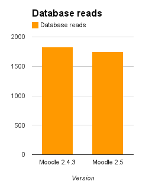
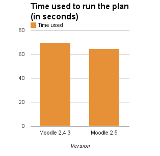
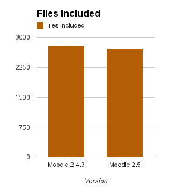
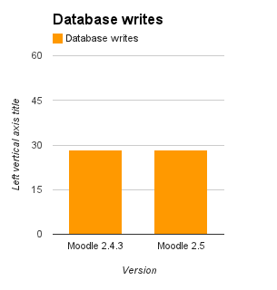
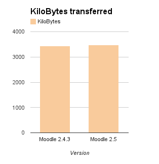
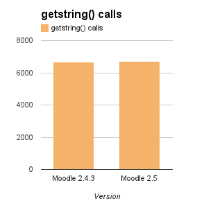

Release date: 14 May 2013

Here is [the full list of fixed issues in 2.5](https://tracker.moodle.org/secure/IssueNavigator!executeAdvanced.jspa?jqlQuery=project+%3D+mdl+AND+resolution+%3D+fixed+AND+fixVersion+in+%28%222.5%22%29+ORDER+BY+priority+DESC&runQuery=true&clear=true).

See [New features](https://docs.moodle.org/25/en/New_features) for a user-friendly tour with screenshots.

Many thanks to [all the developers that worked on fixes and features in this release](http://moodle.org/dev/contributions.php?version=2.5.x).

Our release process continues to evolve and improve with more testing (human AND automated) than ever before.  Thanks especially to the Moodle HQ integration team for tirelessly reviewing and improving all new code, David Monllao for our excellent new behat-based interface testing mechanism, as well as all the QA testers, peer reviewers and issue testers who tested every single addition in Moodle 2.5 (3 times!)

### Requirements

These are just minimums.  We recommend keeping all your software updated.

- Recommended minimum browser: Google Chrome 11, Firefox 4, Safari 5, Internet Explorer 8 (IE 10 required for drag and drop of files from outside the browser into Moodle)
- Moodle upgrade:  Moodle 2.2 or later (if upgrading from earlier versions, you must upgrade to 2.2.9 as a first step)
- Minimum DB versions: PostgreSQL 8.3, MySQL 5.1.33, MariaDB 5.2, MSSQL 2005 or Oracle 10.2 (oci_native_moodle_package.sql needs to be executed before upgrade on Oracle servers)
- Minimum PHP version: PHP 5.3.3
- New PHP extension requirements: GD

NOTE: We will drop support for IE8 in Moodle 2.6 (to be released November 2013).  This means IE8 will probably still work for 2.6, but developers will not be required to test their new code on that browser.  Moodle, like most of the world's web sites and browser producers, encourages you to keep your browsers current to improve security and functionality while saving us valuable time.  ([For example see what Google is doing](http://googleappsupdates.blogspot.ca/2012/09/supporting-modern-browsers-internet.html))

### Major new features

#### Open Badges integration

- [MDL-35073](https://tracker.moodle.org/browse/MDL-35073) - [Badges](https://docs.moodle.org/25/en/Badges) may be awarded manually or for course or activity completion. Users can choose to display their badges in their Moodle profile and in their Mozilla backpack.  Thanks to Yuliya Bozhko from Totara for the bulk of work on this.

#### Add-on installer

- [MDL-38509](https://tracker.moodle.org/browse/MDL-38509) - New admin tool for [installing add-ons](https://docs.moodle.org/25/en/Installing_add-ons)

#### Themes

- [MDL-38016](https://tracker.moodle.org/browse/MDL-38016) - Bootstrap-based themes, with responsive design for all screen sizes (including a new *[Clean theme](https://docs.moodle.org/dev/Clean_theme)* as an example).  Thanks to Bas Brands, David Scotson, Stuart Lamour and Mary Evans for their volunteer work on getting this done.  
- [MDL-23504](https://tracker.moodle.org/browse/MDL-23504) - Transparency and RGB support in themes colour picker

#### Forms improvements

- [MDL-30637](https://tracker.moodle.org/browse/MDL-30637) and [MDL-38012](https://tracker.moodle.org/browse/MDL-38012) - Improvements to the usability of big complex Moodle forms in general
- [MDL-38614](https://tracker.moodle.org/browse/MDL-38614) - Reduced size description field with collapsible editor

#### Enrolment

- [MDL-26956](https://tracker.moodle.org/browse/MDL-26956) - You can now search the list of [users enrolled](https://docs.moodle.org/25/en/Enrolled_users) in a course
- [MDL-36514](https://tracker.moodle.org/browse/MDL-36514) - New option for preventing new [self-enrolments](https://docs.moodle.org/25/en/Self_enrolment) in the course
- [MDL-7537](https://tracker.moodle.org/browse/MDL-7537) - All PayPal-supported currencies are available for use in [Paypal enrolment](https://docs.moodle.org/25/en/Paypal_enrolment)
- [MDL-32387](https://tracker.moodle.org/browse/MDL-32387) - New PayPal enrolment setting 'Enrolment expiration action'
- [MDL-37291](https://tracker.moodle.org/browse/MDL-37291) - Restore support for PayPal enrolments
- [MDL-37187](https://tracker.moodle.org/browse/MDL-37187) - Various [Flat file enrolment](https://docs.moodle.org/25/en/Flat_file) fixes
- [MDL-28705](https://tracker.moodle.org/browse/MDL-28705) - Configurable mapping between IMS course names and Moodle course names for [IMS Enterprise enrolment](https://docs.moodle.org/25/en/IMS_Enterprise)

See [MDL-36504](https://tracker.moodle.org/browse/MDL-36504) for the full list of all enrolment-related improvements.

#### Assignment activity

- [MDL-36804](https://tracker.moodle.org/browse/MDL-36804) - New [assignment settings](https://docs.moodle.org/25/en/Assignment_settings) for handling resubmissions
- [MDL-37337](https://tracker.moodle.org/browse/MDL-37337) - Assignment settings page improvements

#### Database activity

- [MDL-38166](https://tracker.moodle.org/browse/MDL-38166) - [Database activity](https://docs.moodle.org/25/en/Building_Database) URL field includes option to open link in new window
- [MDL-7660](https://tracker.moodle.org/browse/MDL-7660) - Option to delete database activity entry attachment

#### Glossary activity

- [MDL-20131](https://tracker.moodle.org/browse/MDL-20131) - Global glossary entries can be displayed in the [random glossary entry block](https://docs.moodle.org/25/en/Random_glossary_entry_block)
- [MDL-35842](https://tracker.moodle.org/browse/MDL-35842) - New option for displaying entries in alphabetical order in the [random glossary entry block](https://docs.moodle.org/25/en/Random_glossary_entry_block)

#### Quiz activity

- [MDL-38538](https://tracker.moodle.org/browse/MDL-38538) - Option to auto-save during quiz attempts
- [MDL-37417](https://tracker.moodle.org/browse/MDL-37417) - Question editing forms improvements
- [MDL-36955](https://tracker.moodle.org/browse/MDL-36955) - Better grading for partially correct Cloze questions with Interactive behaviour
- [MDL-35793](https://tracker.moodle.org/browse/MDL-35793) - Defaults for when a question is previewed
- [MDL-10516](https://tracker.moodle.org/browse/MDL-10516) - [Essay questions](https://docs.moodle.org/25/en/Essay_question_type) can have a template, so the student starts answering from the template, not a blank editor

#### Workshop activity

- [MDL-37602](https://tracker.moodle.org/browse/MDL-37602) - Overall assessment feedback support in the [Workshop activity](https://docs.moodle.org/en/Workshop_module)
- [MDL-37806](https://tracker.moodle.org/browse/MDL-37806) - New 'Save and show next' button for workshop submissions

#### Resources

- [MDL-33206](https://tracker.moodle.org/browse/MDL-33206) - [Book](https://docs.moodle.org/25/en/Book_module) print dialogue link
- [MDL-37455](https://tracker.moodle.org/browse/MDL-37455) - New [folder resource setting](https://docs.moodle.org/25/en/Folder_resource_settings) to display folder contents on the course page
- [MDL-30790](https://tracker.moodle.org/browse/MDL-30790) - New [folder resource setting](https://docs.moodle.org/25/en/Folder_resource_settings) to display sub-folders expanded or collapsed
- [MDL-34137](https://tracker.moodle.org/browse/MDL-34137) - Option to drag and drop a media file onto the course page to [create a label](https://docs.moodle.org/25/en/Using_Label)
- [MDL-33946](https://tracker.moodle.org/browse/MDL-33946) - Option to drag and drop text onto the course page to [create a label](https://docs.moodle.org/25/en/Using_Label)

#### Repositories

- [MDL-37217](https://tracker.moodle.org/browse/MDL-37217) - Folders are now displayed in the [Google Drive repository](https://docs.moodle.org/25/en/Google_Drive_repository) (renamed from Google Docs repository). An administrator must enable the Drive API in the Google APIs Console, as described in [Google OAuth 2.0 setup](https://docs.moodle.org/25/en/Google_OAuth_2.0_setup).
- [MDL-33669](https://tracker.moodle.org/browse/MDL-33669) - Option to access Equella site when using [EQUELLA repository](https://docs.moodle.org/25/en/EQUELLA_repository)
- [MDL-37641](https://tracker.moodle.org/browse/MDL-37641) - Improved file names when a file already exists in a repository

#### Course listings

- [MDL-37009](https://tracker.moodle.org/browse/MDL-37009) - Course listings are displayed consistently throughout the site (theme [changes](https://docs.moodle.org/dev/Courses_lists_upgrade_to_2.5) may be required)
- [MDL-38708](https://tracker.moodle.org/browse/MDL-38708) - [Course settings](https://docs.moodle.org/25/en/Course_settings) option to add images and other files to course summaries, displayed in course listings
- [MDL-37572](https://tracker.moodle.org/browse/MDL-37572) - Categories edit page is separated from view and does not depend any more on global editing mode

#### Performance improvements

- [MDL-35716](https://tracker.moodle.org/browse/MDL-35716) - New performance overview report
- [MDL-35685](https://tracker.moodle.org/browse/MDL-35685) - Improved login performance
- [MDL-36809](https://tracker.moodle.org/browse/MDL-36809) - Support for persistent connections to MariaDB/MySQL servers
- [MDL-34344](https://tracker.moodle.org/browse/MDL-34344) - CFG caching in MUC
- [MDL-34346](https://tracker.moodle.org/browse/MDL-34346) - New repository caching
- [MDL-34401](https://tracker.moodle.org/browse/MDL-34401) - New caching of plugin information
- [MDL-37718](https://tracker.moodle.org/browse/MDL-37718) - Improved database recordset memory use
- [MDL-38212](https://tracker.moodle.org/browse/MDL-38212) - Workaround for some memory issues in cron
- [MDL-38391](https://tracker.moodle.org/browse/MDL-38391) - Improved YUI module loading performance
- [MDL-37127](https://tracker.moodle.org/browse/MDL-37127) - Use of minified YUI modules to reduce content size

<!--
  Github Flavoured Markdown does not support tables without headers.
  We must use an HTML table here.
  Please note that Spacing in this table is important.
  Markdown must have empty newlines between it and HTML markup.
-->
<table><tbody>
<tr><td>

</td><td>

</td><td>

</td></tr>
<tr><td>

</td><td>

</td><td>

</td></tr>
</tbody></table>

- [More info about the tests environment](https://docs.moodle.org/dev/Moodle_2.5_release_notes/Performance_tests)

#### Security related improvements

- [MDL-35332](https://tracker.moodle.org/browse/MDL-35332) - Improved security of hashed passwords
- [MDL-21342](https://tracker.moodle.org/browse/MDL-21342) - New user account lockout mechanism (settings in [Site policies](https://docs.moodle.org/25/en/Site_policies))

#### Automated functional testing

- [MDL-35611](https://tracker.moodle.org/browse/MDL-35611) - [Behat integration](https://docs.moodle.org/dev/Behat_integration), the framework for testing of user expectations, has been incorporated into Moodle.

### Other highlights

#### Drag and drop improvements

- [MDL-33688](https://tracker.moodle.org/browse/MDL-33688) - Drag and drop file upload progress indicator in filepicker
- [MDL-32652](https://tracker.moodle.org/browse/MDL-32652) - Block drag & drop now works throughout the site (not just on course pages)!

#### Forum activity

- [MDL-5875](https://tracker.moodle.org/browse/MDL-5875) - New [forum setting](https://docs.moodle.org/25/en/Forum_settings) 'Display word count'

#### Upload users

- [MDL-36602](https://tracker.moodle.org/browse/MDL-36602) - mnethostid available as an [upload users](https://docs.moodle.org/25/en/Upload_users) field
- [MDL-38494](https://tracker.moodle.org/browse/MDL-38494) - Upload users accepts date-time format custom profile field

#### Settings block rename

- [MDL-31983](https://tracker.moodle.org/browse/MDL-31983) - The Settings block has been renamed ['Administration'](https://docs.moodle.org/25/en/Administration_block) and [reports](https://docs.moodle.org/en/Reports) have been moved there.

#### Miscellaneous

- [MDL-28585](https://tracker.moodle.org/browse/MDL-28585) - Improved LDAP authentication password expiry handling
- [MDL-37644](https://tracker.moodle.org/browse/MDL-37644) - New setting for showing course full names in the navigation block
- [MDL-37728](https://tracker.moodle.org/browse/MDL-37728) - Role definition overview improvements
- [MDL-32341](https://tracker.moodle.org/browse/MDL-32341) - New [calendar settings](https://docs.moodle.org/25/en/Calendar_settings) for specifying a custom export date range
- [MDL-34917](https://tracker.moodle.org/browse/MDL-34917) - Jump to section navigation for 'One section per page' setting in [course formats](https://docs.moodle.org/25/en/Course_formats)
- [MDL-36395](https://tracker.moodle.org/browse/MDL-36395) - New setting Maximum users per page for specifying the number of users shown in search results
- [MDL-37596](https://tracker.moodle.org/browse/MDL-37596) - Scheduled maintenance mode
- [MDL-35775](https://tracker.moodle.org/browse/MDL-35775) - Group import allows new groups to be assigned to groupings
- [MDL-26649](https://tracker.moodle.org/browse/MDL-26649) - Date picker usability improvements
- Multiple improvements in MS SQL Server and Oracle database drivers
- [MDL-37284](https://tracker.moodle.org/browse/MDL-37284) - Unicode support in MariaDB/MySQL is now configured automatically during installation
- [MDL-35819](https://tracker.moodle.org/browse/MDL-35819) - Rewrite tooltip help to improve UI consistency, and performance.

### Security issues

- [MSA-13-0020](https://moodle.org/mod/forum/discuss.php?d=228930) Capability issue in Assignment
- [MSA-13-0021](https://moodle.org/mod/forum/discuss.php?d=228931) Potential information leak in Gradebook
- [MSA-13-0022](https://moodle.org/mod/forum/discuss.php?d=228933) Information leak in hub registration
- [MSA-13-0023](https://moodle.org/mod/forum/discuss.php?d=228934) Permission issue in blog comments
- [MSA-13-0024](https://moodle.org/mod/forum/discuss.php?d=228935) Form filtering issue

Moodle 2.5 also includes fixes to security issues resolved in earlier minor versions released after [Moodle 2.4](https://docs.moodle.org/dev/Moodle_2.4_release_notes). See the release notes for [Moodle 2.4.1](https://docs.moodle.org/dev/Moodle_2.4.1_release_notes), [Moodle 2.4.2](/general/releases/2.4/2.4.2) and [Moodle 2.4.3](/general/releases/2.4/2.4.3) for more details.

### For developers: API changes

- [MDL-34640](https://tracker.moodle.org/browse/MDL-34640) - Improvements to how the question engine handles uploaded files. This should make it possible to write question types that automatically grade uploaded files.
- [MDL-37287](https://tracker.moodle.org/browse/MDL-37287) - 3rd party libraries updated, ex.: YUI 3.9.1, TinyMCE 3.5.8, latest tcpdf and others
- [MDL-15727](https://tracker.moodle.org/browse/MDL-15727) - jQuery and jQuery UI supported in add-ons
- [MDL-29996](https://tracker.moodle.org/browse/MDL-29996) - Legacy filters are not supported any more, developers need to migrate filters from modules to standard filter location
- [MDL-35356](https://tracker.moodle.org/browse/MDL-35356) - Excel and ODS export improvements
- [MDL-35434](https://tracker.moodle.org/browse/MDL-35434) - Theme developers may use new admin setting type for user uploaded logo images
- [MDL-37726](https://tracker.moodle.org/browse/MDL-37726) - PREVIOUS and NEXT attributes are not required in install.xml files
- [MDL-38558](https://tracker.moodle.org/browse/MDL-38558) - It is now possible to run local pre-upgrade script
- [MDL-38391](https://tracker.moodle.org/browse/MDL-38391) - Convert YUI_config to class in lib/outputrequirements.php.
- [MDL-35819](https://tracker.moodle.org/browse/MDL-35819) - JS M.util.help_icon deprecated in favour of moodle-core-popuphelp

#### Upgrade notes for developers

- [Activity modules](http://git.moodle.org/gw?p=moodle.git;a=blob;f=mod/upgrade.txt;hb=master)
- [Assignment](http://git.moodle.org/gw?p=moodle.git;a=blob;f=mod/assign/upgrade.txt;hb=master)
- [Backup](http://git.moodle.org/gw?p=moodle.git;a=blob;f=backup/upgrade.txt;hb=master)
- [Cache](http://git.moodle.org/gw?p=moodle.git;a=blob;f=cache/upgrade.txt;hb=master)
- [Calendar](http://git.moodle.org/gw?p=moodle.git;a=blob;f=calendar/upgrade.txt;hb=master)
- [Core](http://git.moodle.org/gw?p=moodle.git;a=blob;f=lib/upgrade.txt;hb=master)
- [Course formats](http://git.moodle.org/gw?p=moodle.git;a=blob;f=course/format/upgrade.txt;hb=master)
- [Enrolment plugins](http://git.moodle.org/gw?p=moodle.git;a=blob;f=enrol/upgrade.txt;hb=master)
- [Filters](http://git.moodle.org/gw?p=moodle.git;a=blob;f=filter/upgrade.txt;hb=master)
- [Forum](http://git.moodle.org/gw?p=moodle.git;a=blob;f=mod/forum/upgrade.txt;hb=master)
- [Question types](http://git.moodle.org/gw?p=moodle.git;a=blob;f=question/type/upgrade.txt;hb=master)
- [Repositories](http://git.moodle.org/gw?p=moodle.git;a=blob;f=repository/upgrade.txt;hb=master)
- [Themes](http://git.moodle.org/gw?p=moodle.git;a=blob;f=theme/upgrade.txt;hb=master)
- [TinyMCE plugins](http://git.moodle.org/gw?p=moodle.git;a=blob;f=lib/editor/tinymce/upgrade.txt;hb=master)

## See also

- [User documentation of new features in Moodle 2.5](https://docs.moodle.org/25/en/Category:New_features)
- [Upgrading to Moodle 2.5](https://docs.moodle.org/25/en/Upgrading_to_Moodle_2.5) - information for admins who are upgrading from earlier versions
- [Moodle 2.4 release notes](/general/releases/2.4)

## Translations

- [Notas de Moodle 2.5](https://docs.moodle.org/es/Notas_de_Moodle_2.5)
- [Notes de mise à jour de Moodle 2.5](https://docs.moodle.org/fr/Notes_de_mise_à_jour_de_Moodle_2.5)
