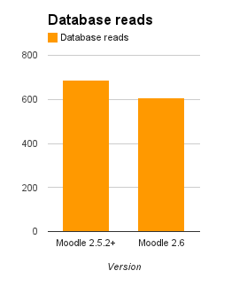
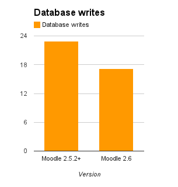
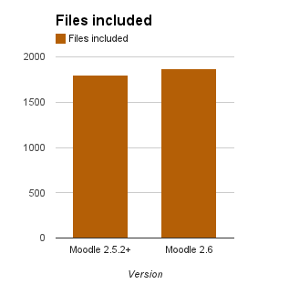
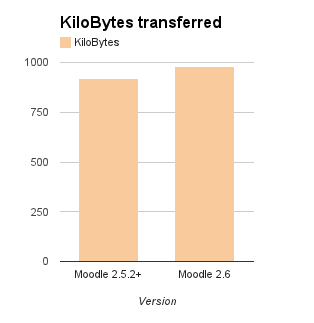
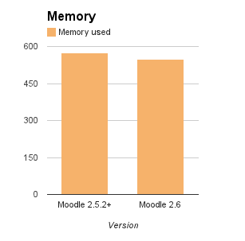
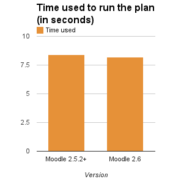

Release date: 18th November 2013

Here is [the complete list of fixed issues in 2.6](https://tracker.moodle.org/secure/IssueNavigator!executeAdvanced.jspa?jqlQuery=project+%3D+mdl+AND+resolution+%3D+fixed+AND+fixVersion+in+%28%222.6%22%29+ORDER+BY+priority+DESC&runQuery=true&clear=true).       <strong>See [New features](https://docs.moodle.org/26/en/New_features) for a user-friendly highlights tour with screenshots!</strong>

### Requirements

These are just minimums.  We recommend keeping all your software updated.

- Recommended minimum browser: recent Google Chrome, recent Mozilla Firefox, Safari 6, Internet Explorer 9 (IE 10 required for drag and drop of files from outside the browser into Moodle)
- Moodle upgrade:  Moodle 2.2 or later (if upgrading from earlier versions, you must upgrade to 2.2.11 as a first step)
- Minimum DB versions: PostgreSQL 8.3, MySQL 5.1.33, MariaDB 5.3.5, MSSQL 2005 or Oracle 10.2
- Minimum PHP version: PHP 5.3.3 (always use latest PHP 5.4.x or 5.5.x on Windows - http://windows.php.net/download/)
- New recommended PHP extensions: zlib, [OPcache](https://docs.moodle.org/26/en/OPcache)

### Known problems

- IE8 and Safari 5 are no longer fully supported. They should still work but they are not tested regularly and there might be some problems. Like most of the world's Web sites and browser producers, we encourage you to keep your browsers current to improve security and functionality while saving us valuable time. (For example [see what Google is doing.](http://googleappsupdates.blogspot.ca/2012/09/supporting-modern-browsers-internet.html))
- IE6 and IE7 are not recommended for Moodle 2.6 at all.  You will encounter difficulties trying to use those old browsers in today's Internet.
- [We are considering dropping our Oracle support in future versions](https://tracker.moodle.org/browse/MDL-41310).  There are known performance and compatibility problems, many add-ons are not compatible. Most of these problems are caused by the fact that Oracle databases do not implement necessary industry SQL standards and contain several legacy limitations.  If you are using Oracle, or planning to, then we highly encourage you to think about using one of the open source databases that we support.
- IMS Enterprise plugin was not deleting user accounts properly, execute admin/cli/fix_deleted_users.php script to fix deleted users if you use this authentication plugin.
- There are known problems with some PHP opcode accelerators, it is recommended to switch to the fully supported, standard OPcache PHP extension if possible.

### Platform highlights

#### Administration and settings

- [MDL-31776](https://tracker.moodle.org/browse/MDL-31776) - [Additional name fields](https://docs.moodle.org/26/en/Additional_name_fields)
- [MDL-31830](https://tracker.moodle.org/browse/MDL-31830) - Improved category and course management interface
- [MDL-13114](https://tracker.moodle.org/browse/MDL-13114) - [Bulk course creation tool](https://docs.moodle.org/26/en/Upload_courses)
- [MDL-17081](https://tracker.moodle.org/browse/MDL-17081) - [Roles import and export](https://docs.moodle.org/26/en/Role_export_and_import)
- [MDL-38189](https://tracker.moodle.org/browse/MDL-38189) - Restoring of very large courses possible
- [MDL-41866](https://tracker.moodle.org/browse/MDL-41866), [MDL-18375](https://tracker.moodle.org/browse/MDL-18375) - Support for alternative calendars (ie not just Gregorian)
- [MDL-23692](https://tracker.moodle.org/browse/MDL-23692) - Simplified recovery of forgotten username and password reset
- [MDL-41845](https://tracker.moodle.org/browse/MDL-41845) - Make default completion tracking selection an admin option
- [MDL-40368](https://tracker.moodle.org/browse/MDL-40368) - Improved capability overview tool
- [MDL-42110](https://tracker.moodle.org/browse/MDL-42110) - Add-on installer is using parent directory permissions for new directories and files
- [MDL-41245](https://tracker.moodle.org/browse/MDL-41245), [MDL-41437](https://tracker.moodle.org/browse/MDL-41437),  [MDL-41086](https://tracker.moodle.org/browse/MDL-41086) - Multiple installation and upgrade fixes and improvements
- [MDL-42078](https://tracker.moodle.org/browse/MDL-42078) - Standardised plugin uninstallation and management.
- [MDL-38155](https://tracker.moodle.org/browse/MDL-38155) - User enrolment may be suspended via CSV upload
- [MDL-16073](https://tracker.moodle.org/browse/MDL-16073) - New test pages for external database authentication and enrolment plugins

#### Course design

- [MDL-40121](https://tracker.moodle.org/browse/MDL-40121) - New Single Activity Course Format (and removed SCORM course format [MDL-40122](https://tracker.moodle.org/browse/MDL-40122))
- [MDL-39814](https://tracker.moodle.org/browse/MDL-39814) - Improved course activity/resource edit icons for usability on all screens

#### Usability

- [MDL-31830](https://tracker.moodle.org/browse/MDL-31830) - Improved category and course management interface
- [MDL-37565](https://tracker.moodle.org/browse/MDL-37565) - Toolbar switching in TinyMCE editor (one or multiple lines)
- [MDL-23646](https://tracker.moodle.org/browse/MDL-23646) - Improvement to TinyMCE editor resizing
- [MDL-40770](https://tracker.moodle.org/browse/MDL-40770), [MDL-42102](https://tracker.moodle.org/browse/MDL-42102) - New TinyMCE editor icons and buttons improved
- [MDL-28019](https://tracker.moodle.org/browse/MDL-28019) - Plugin to manage embedded files in TinyMCE editor
- [MDL-39851](https://tracker.moodle.org/browse/MDL-39851) - Popups become full-screen on small screens
- [MDL-39813](https://tracker.moodle.org/browse/MDL-39813) - Login page simplified for a mobile devices
- [MDL-36002](https://tracker.moodle.org/browse/MDL-36002) - Move action for activities and course sections are keyboard accessible with JavaScript enabled
- [MDL-41305](https://tracker.moodle.org/browse/MDL-41305) - Group forms improved
- [MDL-40493](https://tracker.moodle.org/browse/MDL-40493) - Users may select preferred text editor
- [MDL-42887](https://tracker.moodle.org/browse/MDL-42887) - Make the collapsing of form fields for bootstrap and non-bootstrap themes responsive
- [MDL-40685](https://tracker.moodle.org/browse/MDL-40685) - Improvements to the consistency of headings
- [MDL-37717](https://tracker.moodle.org/browse/MDL-37717) - Teachers are warned before suspending own enrolment in course

#### Performance

Many important changes have been made to improve Moodle's performance: a new sessions infrastructure with 100% support that adds a new memcached session handler and improves the existing ones;  OPcache support; changes to reduce memory usage and lots of new cache definitions to reduce database queries by using fast cache stores.  (Some of these improvements have also been backported to Moodle 2.5.x so not all the improvements are reflected in 2.5/2.6 comparisons.)

- [MDL-41811](https://tracker.moodle.org/browse/MDL-41811) - Admin settings menu is loaded only when necessary
- [MDL-37761](https://tracker.moodle.org/browse/MDL-37761) - File-less backup/restore when importing and duplicating
- [MDL-38228](https://tracker.moodle.org/browse/MDL-38228) - Improvements to course validation during upgrades
- [MDL-34397](https://tracker.moodle.org/browse/MDL-34397) - Course modinfo cache is stored in MUC instead of DB, fields calculated on first request only
- [MDL-40415](https://tracker.moodle.org/browse/MDL-40415) - [OPcache extension](https://docs.moodle.org/26/en/OPcache) fully supported and recommended
- [MDL-38570](https://tracker.moodle.org/browse/MDL-38570) - Automatic temp directory cleanup
- [MDL-42206](https://tracker.moodle.org/browse/MDL-42206) - Meta enrolments are not synchronised after every course edit
- [MDL-31501](https://tracker.moodle.org/browse/MDL-31501) - New session drivers supporting files, database and memcached storage
- [MDL-40545](https://tracker.moodle.org/browse/MDL-40545) - New $CFG->localcachedir setting (intended for clustered servers)
- [MDL-40563](https://tracker.moodle.org/browse/MDL-40563) - Improved theme resource caching (local cache compatible)
- [MDL-40546](https://tracker.moodle.org/browse/MDL-40546) - Improved javascript  caching (local cache compatible)
- [MDL-41019](https://tracker.moodle.org/browse/MDL-41019) - Language caching improvements (local cache compatible)
- [MDL-41017](https://tracker.moodle.org/browse/MDL-41017) - HTMLPurifier caching improvements (local cache compatible)
- [MDL-39474](https://tracker.moodle.org/browse/MDL-39474) - Developer debug checks improved
- [MDL-42016](https://tracker.moodle.org/browse/MDL-42016) - Simplify and speed up shortcut synchronisation
- [MDL-37028](https://tracker.moodle.org/browse/MDL-37028) - Integrity check of course data on-the-fly plus CLI script
- [MDL-42387](https://tracker.moodle.org/browse/MDL-42387) - Standardised file lifetime handling

<!--
  Github Flavoured Markdown does not support tables without headers.
  We must use an HTML table here.
  Please note that Spacing in this table is important.
  Markdown must have empty newlines between it and HTML markup.
-->
<table><tbody>
<tr><td>

</td><td>

</td><td>

</td></tr>
<tr><td>

</td><td>

</td><td>

</td></tr>
</tbody></table>

- [More info about the tests environment](https://docs.moodle.org/dev/Moodle_2.6_release_notes/Performance_tests)

#### Operating environment

- [MDL-11270](https://tracker.moodle.org/browse/MDL-11270) - Significantly improved MS SQL Server compatibility (warning: upgrade step for MS SQL servers may take very long time)
- [MDL-39985](https://tracker.moodle.org/browse/MDL-39985) - Full MariaDB support
- [MDL-33955](https://tracker.moodle.org/browse/MDL-33955) - Support for open_basedir restriction

#### Other

- [MDL-41838](https://tracker.moodle.org/browse/MDL-41838) - Ability to backup and restore courses bigger than 4GB
- [MDL-38192](https://tracker.moodle.org/browse/MDL-38192) - Backup and restore: Allow selection by activity type
- [MDL-19390](https://tracker.moodle.org/browse/MDL-19390) - Email notification for new users added manually
- [MDL-40874](https://tracker.moodle.org/browse/MDL-40874) - Retired MyMobile as a standard theme
- [MDL-40550](https://tracker.moodle.org/browse/MDL-40550) - It is now clearer with badges will be issued immediately on activation
- [MDL-28463](https://tracker.moodle.org/browse/MDL-28463) - Grade-based conditional availability is updated immediately after grading
- [MDL-42668](https://tracker.moodle.org/browse/MDL-42668) - The [Box.net portfolio](https://docs.moodle.org/26/en/Box.net_portfolio) has been updated to use Box.net API v2. Note that *Moodle sites must now use HTTPS in order to access Box.net*. See [Box.net APIv1 migration](https://docs.moodle.org/26/en/Box.net_APIv1_migration) for details.

### Module highlights

#### Assignment activity

- [MDL-42023](https://tracker.moodle.org/browse/MDL-42023) - PDF submissions can now be directly annotated by teachers (requires Ghostscript to be installed on the server)
- [MDL-38359](https://tracker.moodle.org/browse/MDL-38359) - New marker allocation and grading workflow settings
- [MDL-37621](https://tracker.moodle.org/browse/MDL-37621) - Admins can set assignment setting defaults
- [MDL-37148](https://tracker.moodle.org/browse/MDL-37148) - Lots more web services
- [MDL-41131](https://tracker.moodle.org/browse/MDL-41131) - Assignment plugins can be on automatically

#### Database activity

- [MDL-40871](https://tracker.moodle.org/browse/MDL-40871) - Multiple entries can be deleted in the [database activity](https://docs.moodle.org/26/en/Using_Database)
- [MDL-29069](https://tracker.moodle.org/browse/MDL-29069) - Database and glossary entries can be unapproved (after previously being approved)
- [MDL-39040](https://tracker.moodle.org/browse/MDL-39040) - Database activity description is visible on all tabs

#### External Tool (LTI)

- [MDL-40531](https://tracker.moodle.org/browse/MDL-40531) - External Tool module has full compliance with LTI v1p1 (http://www.imsglobal.org/cc/detail.cfm?ID=192)
- [MDL-36224](https://tracker.moodle.org/browse/MDL-36224) - External Tool module now supports pluggable extensions

#### Forum activity

- [MDL-29663](https://tracker.moodle.org/browse/MDL-29663) - Forum read tracking options now Off, Optional, and Forced
- [MDL-41933](https://tracker.moodle.org/browse/MDL-41933) - Option to set default read tracking option
- [MDL-4908](https://tracker.moodle.org/browse/MDL-4908) - Per-forum digest settings

#### Quiz and question bank

- [MDL-32188](https://tracker.moodle.org/browse/MDL-32188) - Big improvements to how certainty-based marking (CBM) works. There is now much better feedback for students about how they have done, and what they need to do to improve in future.
- [MDL-9873](https://tracker.moodle.org/browse/MDL-9873)  - Question text is now a required field when creating and editing questions.
- [MDL-39155](https://tracker.moodle.org/browse/MDL-39155) - Option for what size user picture to show during quiz attempts.
- [MDL-12403](https://tracker.moodle.org/browse/MDL-12403) - Backups no longer include unnecessary questions from the Question Bank.

#### SCORM activity

- [MDL-28579](https://tracker.moodle.org/browse/MDL-28579), [MDL-41580](https://tracker.moodle.org/browse/MDL-41580) - Allow use of file aliases and direct linking to imsmanifest.xml inside an extracted zip in the file system repository.
- [MDL-39910](https://tracker.moodle.org/browse/MDL-39910) - Improved SCORM player with responsive design elements and better support for mobile devices.
- [MDL-39926](https://tracker.moodle.org/browse/MDL-39926) - New objectives report
- [MDL-41290](https://tracker.moodle.org/browse/MDL-41290) - Improved user level reporting with ability to export data.
- [MDL-41434](https://tracker.moodle.org/browse/MDL-41434) - When updating a SCORM package we no longer delete and re-create the scorm_scoes table - we now use a sortorder field.

#### Repositories

- [MDL-30740](https://tracker.moodle.org/browse/MDL-30740) - [Microsoft Skydrive repository](https://docs.moodle.org/26/en/Skydrive_repository)
- [MDL-41940](https://tracker.moodle.org/browse/MDL-41940) - Option to prevent users from adding new files and directories to legacy course files
- [MDL-23044](https://tracker.moodle.org/browse/MDL-23044) - Filesystem repository shows images thumbnails
- [MDL-42666](https://tracker.moodle.org/browse/MDL-42666) - The [Box.net repository](https://docs.moodle.org/26/en/Box.net_repository) has been updated to use Box.net API v2. Moodle sites which have used the Box.net repository previously need to *run the Box.net-alias-to-copy-conversion tool as soon as possible*. Also, HTTPS is now required for sites to access Box.net. See [Box.net APIv1 migration](https://docs.moodle.org/26/en/Box.net_APIv1_migration) for details.

### Security issues

- [MSA-13-0036](https://moodle.org/mod/forum/discuss.php?d=244479) Incorrect headers sent for secured resources
- [MSA-13-0037](https://moodle.org/mod/forum/discuss.php?d=244480) Cross site scripting in Messages
- [MSA-13-0038](https://moodle.org/mod/forum/discuss.php?d=244481) Access to server files through repository
- [MSA-13-0039](https://moodle.org/mod/forum/discuss.php?d=244482) Cross site scripting in Quiz

### For developers: API changes

- [MDL-39854](https://tracker.moodle.org/browse/MDL-39854) - Automatic class loader
- [MDL-39797](https://tracker.moodle.org/browse/MDL-39797) - New events infrastructure
- [MDL-41267](https://tracker.moodle.org/browse/MDL-41267) - Support for sub-plugins in admin tool plugins
- [MDL-26943](https://tracker.moodle.org/browse/MDL-26943) - Support for sub-plugins in local plugins
- [MDL-20045](https://tracker.moodle.org/browse/MDL-20045) - Unofficial support for custom context levels
- [MDL-40359](https://tracker.moodle.org/browse/MDL-40359) - 3rd party libraries updated to latest versions
- [MDL-40305](https://tracker.moodle.org/browse/MDL-40305), [MDL-40940](https://tracker.moodle.org/browse/MDL-40940) - PHPUnit testcase autoloader
- [MDL-23493](https://tracker.moodle.org/browse/MDL-23493) - Support for including a font through theme CSS
- [MDL-40248](https://tracker.moodle.org/browse/MDL-40248) - Better support for subplugins in Activity chooser
- [MDL-41953](https://tracker.moodle.org/browse/MDL-41953) - Plugin name restrictions were relaxed, multiple trailing numbers are allowed
- [MDL-42040](https://tracker.moodle.org/browse/MDL-42040) - New API for registration of shutdown handlers
- [MDL-42148](https://tracker.moodle.org/browse/MDL-42148) - New admin page listing all third party libraries, thirdpartylibs.xml now supported in plugins
- [MDL-38197](https://tracker.moodle.org/browse/MDL-38197), [MDL-41402](https://tracker.moodle.org/browse/MDL-41402) - New large courses generators for testing and development
- [MDL-41421](https://tracker.moodle.org/browse/MDL-41421) - New JMeter test plan generator
- [MDL-32188](https://tracker.moodle.org/browse/MDL-32188) - As part of this issue, the question behaviour API was changed, and plugins will need to be updated, though this is not hard. As a result Behaviours can display summary information on the quiz review page. See CBM behaviours for an example.
- [MDL-22236](https://tracker.moodle.org/browse/MDL-22236) - Files can be uploaded to web services.
- [MDL-39152](https://tracker.moodle.org/browse/MDL-39152), [MDL-39153](https://tracker.moodle.org/browse/MDL-39153) - web service functions no longer require context ID.
- [MDL-42407](https://tracker.moodle.org/browse/MDL-42407) - new method of reporting HTML elements with zIndex value for consideration when presenting a Moodle Core Dialogue
- [MDL-39339](https://tracker.moodle.org/browse/MDL-39339) - zip_archive ignores system files.
- [MDL-40103](https://tracker.moodle.org/browse/MDL-40103) - Changes to temp table creation.
- [MDL-38019](https://tracker.moodle.org/browse/MDL-38019) - Filter changes are logged
- [MDL-41438](https://tracker.moodle.org/browse/MDL-41438) - Core renderer methods produce plain headings by default.
- [MDL-41806](https://tracker.moodle.org/browse/MDL-41806) - Accessors added for scheme, host and port to moodle_url class.
- [MDL-41956](https://tracker.moodle.org/browse/MDL-41956) - Attachments accepted in message_send() in email messaging provider.
- [MDL-42400](https://tracker.moodle.org/browse/MDL-42400) - Generators for almost all module types to use in testing with possibility to use completion/condition
- [MDL-41311](https://tracker.moodle.org/browse/MDL-41311) - Partially working code in tool_generator was removed.

#### Upgrade notes for developers

- [Authentication plugins](https://github.com/moodle/moodle/blob/v2.6.0/auth/upgrade.txt)
- [Assignment](https://github.com/moodle/moodle/blob/v2.6.0/mod/assign/upgrade.txt)
- [Backup](https://github.com/moodle/moodle/blob/v2.6.0/backup/upgrade.txt)
- [Blocks](https://github.com/moodle/moodle/blob/v2.6.0/blocks/upgrade.txt)
- [Cache](https://github.com/moodle/moodle/blob/v2.6.0/cache/upgrade.txt)
- [Cohort](https://github.com/moodle/moodle/blob/v2.6.0/cohort/upgrade.txt)
- [Core](https://github.com/moodle/moodle/blob/v2.6.0/lib/upgrade.txt)
- [Course formats](https://github.com/moodle/moodle/blob/v2.6.0/course/format/upgrade.txt)
- [Enrolment plugins](https://github.com/moodle/moodle/blob/v2.6.0/enrol/upgrade.txt)
- [Forum](https://github.com/moodle/moodle/blob/v2.6.0/mod/forum/upgrade.txt)
- [Filters](https://github.com/moodle/moodle/blob/v2.6.0/filter/upgrade.txt)
- [Gradebook reports](https://github.com/moodle/moodle/blob/v2.6.0/grade/report/upgrade.txt)
- [Modules](https://github.com/moodle/moodle/blob/v2.6.0/mod/upgrade.txt)
- [Messages](https://github.com/moodle/moodle/blob/v2.6.0/message/upgrade.txt)
- [Question system](https://github.com/moodle/moodle/blob/v2.6.0/question/upgrade.txt)
- [Question engine system](https://github.com/moodle/moodle/blob/v2.6.0/question/engine/upgrade.txt)
- [Question behaviours](https://github.com/moodle/moodle/blob/v2.6.0/question/behaviour/upgrade.txt)
- [Question types](https://github.com/moodle/moodle/blob/v2.6.0/question/type/upgrade.txt)
- [Quiz reports](https://github.com/moodle/moodle/blob/v2.6.0/mod/quiz/report/upgrade.txt)
- [Quiz](https://github.com/moodle/moodle/blob/v2.6.0/mod/quiz/upgrade.txt)
- [Repositories](https://github.com/moodle/moodle/blob/v2.6.0/repository/upgrade.txt)
- [Tags](https://github.com/moodle/moodle/blob/v2.6.0/tag/upgrade.txt)
- [Themes](https://github.com/moodle/moodle/blob/v2.6.0/theme/upgrade.txt)
- [TinyMCE plugins](https://github.com/moodle/moodle/blob/v2.6.0/lib/editor/tinymce/upgrade.txt)
- [Webservices](https://github.com/moodle/moodle/blob/v2.6.0/webservice/upgrade.txt)

## Development numbers

[800px](https://docs.moodle.org/file/moodle26devnumbers.png)

## See also

- [User documentation of new features in Moodle 2.6](https://docs.moodle.org/26/en/Category:New_features)
- [Upgrading to Moodle 2.6](https://docs.moodle.org/26/en/Upgrading_to_Moodle_2.6) - information for admins who are upgrading from earlier versions

## Translations

- [Notas de Moodle 2.6](https://docs.moodle.org/es/Notas_de_Moodle_2.6)
- [Notes de mise à jour de Moodle 2.6](https://docs.moodle.org/fr/Notes_de_mise_à_jour_de_Moodle_2.6)
