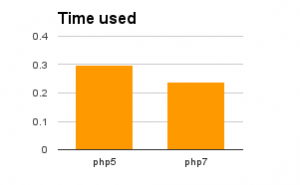
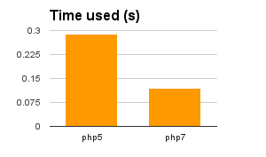
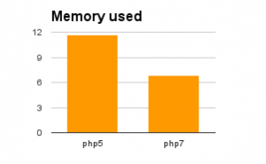
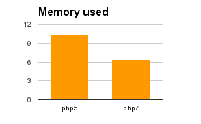

Release date: 21 December 2015

Here is [the full list of fixed issues in 3.0.1](https://moodle.atlassian.net/secure/IssueNavigator!executeAdvanced.jspa?jqlQuery=project+%3D+mdl+AND+resolution+%3D+fixed+AND+fixVersion+in+%28%223.0.1%22%29+ORDER+BY+priority+DESC&runQuery=true&clear=true).

## Highlights

Moodle 3.0.1 is a special release outside of the normal release schedule. The main highlight is support of PHP 7.0. This is the new major version of the programming language Moodle is written in; it has significantly better performance but at the same time lots of changes in the engine. Please note that Moodle 2.9 will show errors if run on PHP 7.

Before upgrading to PHP 7 version on production servers, you are recommended to **test all plugins thoroughly**. See [Moodle and PHP7](https://docs.moodle.org/dev/Moodle_and_PHP7) for developer documentation.

PHP 7 was released on 3 December 2015 and is still very young. Not all libraries and/or drivers are available yet for PHP 7. For example, **there are no drivers for SQL*Server**. Other drivers required by your plugins may also be missing.

**PHP 7 compatibility makes Moodle faster**

<!--
  Github Flavoured Markdown does not support tables without headers.
  We must use an HTML table here.
  Please note that Spacing in this table is important.
  Markdown must have empty newlines between it and HTML markup.
-->
<table><tbody>
<tr><td>

</td><td>

</td></tr>
<tr><td>

20% faster when logging in*

</td><td>

59% faster when loading the course page*

</td></tr>
</tbody></table>

**PHP 7 compatibility significantly reduces memory used**

<!--
  Github Flavoured Markdown does not support tables without headers.
  We must use an HTML table here.
  Please note that Spacing in this table is important.
  Markdown must have empty newlines between it and HTML markup.
-->
<table><tbody>
<tr><td>

</td><td>

</td></tr>
<tr><td>

42% less memory used when logging in*

</td><td>

38% less memory used when viewing a course*

</td></tr>
</tbody></table>

: * Test results obtained on a test Moodle instance with one course in topics format with over 100 activities and resources.

## Other fixes and improvements

- [MDL-44330](https://moodle.atlassian.net/browse/MDL-44330) - When using assignment grading in several tabs the links to individual students grades work correctly
- [MDL-37834](https://moodle.atlassian.net/browse/MDL-37834) - Excel can be used to edit the assignment offline grading worksheet
- [MDL-42571](https://moodle.atlassian.net/browse/MDL-42571) - Edit PDF: Fixed bug with viewing a second PDF on the assignment grading page
- [MDL-43069](https://moodle.atlassian.net/browse/MDL-43069) - Assignment grading: "Submission comments" fail to expand if you hide the "file submissions" column
- [MDL-37308](https://moodle.atlassian.net/browse/MDL-37308) - Uploaded PNG images preserve transparency when resized
- [MDL-49490](https://moodle.atlassian.net/browse/MDL-49490) - Fixed export to portfolio link in assignment with additional files
- [MDL-52194](https://moodle.atlassian.net/browse/MDL-52194) - Fixed Flowplayer not working with insecure configuration of request_order

## For developers

- [MDL-51582](https://moodle.atlassian.net/browse/MDL-51582) - Switch to grunt to compile LESS as recess is no longer maintained

## Security issues

There are no security issues in this release. Security issues will be included in Moodle 3.0.2 which is due for release in January 2016.

## Translations

- [Notes de mise à jour de Moodle 3.0.1](https://docs.moodle.org/fr/Notes_de_mise_à_jour_de_Moodle_3.0.1)
- [Notas de Moodle 3.0.1](https://docs.moodle.org/es/Notas_de_Moodle_3.0.1)
