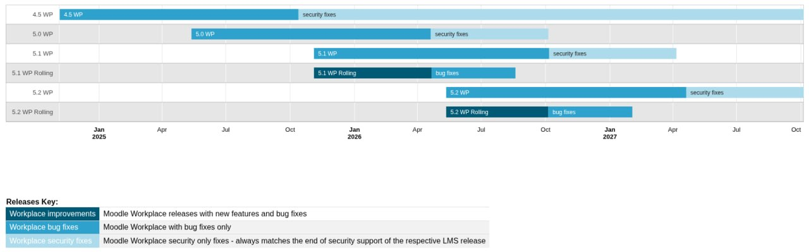

<!-- markdownlint-disable no-inline-html -->

import { ReleaseTable, SupportedReleases, SupportedReleasesStyles } from '@site/src/components/Workplace';

This page lists all official releases of Moodle Workplace, grouped by branch in reverse chronological order.

## Release cycle {/* #release-cycle */}

Moodle Workplace is based on top of Moodle LMS. Moodle Workplace releases always follow the Moodle LMS releases. The minors are normally released the next day and the majors are normally released after three-four weeks.

These are the target dates for releases. These dates may vary slightly due to unforeseen circumstances. When the Moodle LMS release is delayed, the Moodle Workplace release is delayed respectively. See also [Moodle LMS Releases](https://moodledev.io/general/releases).

<table>
    <thead>
        <tr>
            <th colSpan="2" scope="col">
                Release
            </th>
            <th colSpan="2" scope="col" className={SupportedReleasesStyles['moodle-workplace-release']}>
                Moodle Workplace
            </th>
            <th colSpan="2" scope="col">
                Moodle LMS
            </th>
        </tr>
        <tr>
            <th scope="col"> Release type </th>
            <th scope="col"> Frequency </th>
            <th scope="col" className={SupportedReleasesStyles['moodle-workplace-release']}> Release </th>
            <th scope="col" className={SupportedReleasesStyles['moodle-workplace-release']}> Includes </th>
            <th scope="col"> Release </th>
            <th scope="col"> Includes</th>
        </tr>
    </thead>
    <tbody>
        <tr>
            <td>[Major](../../development/process.md#major-release-cycles) (eg. 3.x)</td>
            <td>6 monthly</td>
            <td>3-4 weeks after Moodle LMS major</td>
            <td>New features, improvements and bug fixes (Moodle LMS and Workplace)</td>
            <td>April and October</td>
            <td>New features, Improvements and fixes</td>
        </tr>
        <tr>
            <td>[Minor](../../development/process.md#stable-maintenance-cycles) (Point) (eg. 3.x.y)</td>
            <td>2 monthly</td>
            <td>1 day after Moodle LMS minor</td>
            <td>Workplace new features, improvements and bug fixes and Moodle LMS fixes</td>
            <td>February, April, June, August, October and December</td>
            <td>Fixes based on the latest major release and never any significant new features or database changes</td>
        </tr>
    </tbody>
</table>

Starting from 4.1 release, we package two Workplace versions in every release:

- **Standard version**: no new features in minor releases, this version is supported for bug fixes and security fixes while the corresponding version of LMS is supported
- **Rolling version**: features are added continuously up until the new major release of LMS, after that it has bug fixes for four more months and then support stops completely (which is approximately 3 months after the next Workplace major release).

### End-of-life dates for currently supported releases {/* #end-of-life-dates-for-currently-supported-releases */}

<SupportedReleases />

<!-- START RELEASES -->
 
## Moodle Workplace 5.1 Rolling {/* #moodle-workplace-51-rolling */}
<ReleaseTable releaseName="5.1" isRolling/>

 
## Moodle Workplace 5.1 {/* #moodle-workplace-51 */}
<ReleaseTable releaseName="5.1" />

 
## Moodle Workplace 5.0 Rolling {/* #moodle-workplace-50-rolling */}
<ReleaseTable releaseName="5.0" isRolling/>

 
## Moodle Workplace 5.0 {/* #moodle-workplace-50 */}
<ReleaseTable releaseName="5.0" />

 
## Moodle Workplace 4.5 Rolling {/* #moodle-workplace-45-rolling */}
<ReleaseTable releaseName="4.5" isRolling/>

 
## Moodle Workplace 4.5 (LTS) {/* #moodle-workplace-45-lts */}
<ReleaseTable releaseName="4.5" />

 
## Moodle Workplace 4.4 Rolling {/* #moodle-workplace-44-rolling */}
<ReleaseTable releaseName="4.4" isRolling/>

 
## Moodle Workplace 4.4 {/* #moodle-workplace-44 */}
<ReleaseTable releaseName="4.4" />

 
## Moodle Workplace 4.3 Rolling {/* #moodle-workplace-43-rolling */}
<ReleaseTable releaseName="4.3" isRolling/>

 
## Moodle Workplace 4.3 {/* #moodle-workplace-43 */}
<ReleaseTable releaseName="4.3" />

 
## Moodle Workplace 4.2 Rolling {/* #moodle-workplace-42-rolling */}
<ReleaseTable releaseName="4.2" isRolling/>

 
## Moodle Workplace 4.2 {/* #moodle-workplace-42 */}
<ReleaseTable releaseName="4.2"/>

 
## Moodle Workplace 4.1 Rolling {/* #moodle-workplace-41-rolling */}
<ReleaseTable releaseName="4.1" isRolling/>

 
## Moodle Workplace 4.1 (LTS) {/* #moodle-workplace-41-lts */}
<ReleaseTable releaseName="4.1"/>

 
## Moodle Workplace 4.0 {/* #moodle-workplace-40 */}
<ReleaseTable releaseName="4.0"/>

 
## Moodle Workplace 3.11 {/* #moodle-workplace-311 */}
<ReleaseTable releaseName="3.11"/>

 
## Moodle Workplace 3.10 {/* #moodle-workplace-310 */}
<ReleaseTable releaseName="3.10"/>

 
## Moodle Workplace 3.9 {/* #moodle-workplace-39 */}
<ReleaseTable releaseName="3.9"/>

 
## Moodle Workplace 3.8 {/* #moodle-workplace-38 */}
<ReleaseTable releaseName="3.8"/>

 
## Moodle Workplace 3.7 {/* #moodle-workplace-37 */}
<ReleaseTable releaseName="3.7"/>
