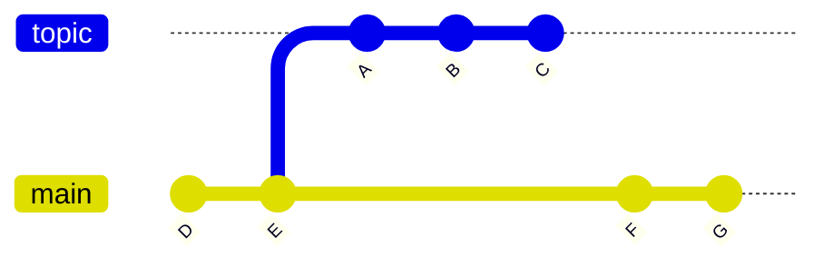
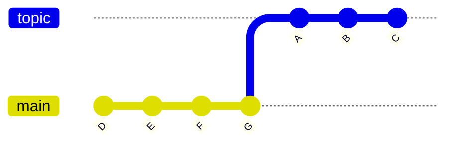

<!-- cspell:ignore pushpull -->
<!-- cspell:ignore unstaged -->

A reasonable knowledge of the Git basics is a good idea before you start to use it for development. If you are new to Git, you are encouraged to go to the [See also](#see_also) section on this page for some more general reading.

Moodle has also created a tool known as [MDK (Moodle Developer Kit)](/general/development/tools/mdk) to streamline a lot of the processes detailed on this page. It is recommended that you consider MDK as it is a very powerful tool and can be used together with Git to make Moodle development much easier.

## General workflow

A detailed explanation of Moodle's workflow can be found on the [Development process](/general/development/process) page. In short, Moodle development with Git looks like this:


1. You, the contributor, commit changes to your personal repository.
2. You push the changes to your public repository and publish links to your changes in the Moodle Tracker.
3. You request a peer review of your code from another developer.
4. When the peer reviewer is happy, they submit the issue for integration.
5. Moodle integrators pull the changes from your public repository, and if approved, they merge them into Moodle's integration repository.
6. The integrated change are tested and finally pushed into Moodle's production repository.
7. You synchronise your local repository with Moodle's production repository and the process repeats.

This workflow runs in weekly cycles. The integration happens on Monday and Tuesday and the testing on Wednesday. On Thursday (or Friday if testing takes too long), the production repository (moodle.git) is usually updated with changes from the last development week.

Most Moodle developers have their public repositories hosted at [GitHub](http://github.com/). In these examples, we'll assume you've set up your public repository there too.

:::note
When you first register on Moodle Tracker you can not assign issues to yourself or send them for peer review. You will be added to the developers group after your first bug fix is integrated. Before that, just comment on the issue with a link to your branch and a component lead, or another developer, will send the issue for peer review for you.
:::

## Installing Git on your computer

### Installing Git

Most Linux distributions have Git available as a package to install.

#### Debian/Ubuntu

```
sudo apt-get install git
```

#### MacOS (Homebrew)

```
brew install git
```

#### Windows

Download the latest Git installer at [Git for Windows](https://gitforwindows.org/).

## Configuring Git

After installation, set your name and email. Your name and email will become part of your commits and can't be changed later once your commits are accepted into Moodle code. Therefore we ask contributors to use their real names written in with proper capitalisation. E.g. "John Smith" and not "john smith", or even "john5677".

```
git config --global user.name "Your Name"
git config --global user.email yourmail@domain.tld
```

Unless you are the repository maintainer, it is wise to set your Git to not push changes in file permissions:

```
git config --global core.filemode false
```

It's recommended to verify that the your Git installation is not performing any transformation between LFs and CRLFs. Moodle use **only LFs** and you should configure your editor/IDE the same way. Note that having any "magic" enabled is known to cause [problems with unit tests](https://docs.moodle.org/dev/Common_unit_test_problems#The_test_file_.22evolution.test.22_should_not_contain_section_named_.22.5Blots_of_content.5D.22) execution. We recommend you to set:

```
git config --global core.autocrlf false
```

## Setting-up your public repository

There are many different options when considering where to host your git repository. [GitHub](http://github.com/) is a popular option that many developers use because it is free and well supported. Moodle also incorporates a series of GitHub Actions that are used to verify your code automatically and can help identify issues.

1. Go to [GitHub](http://github.com/) and create an account.

2. Go to the official [Moodle GitHub repository](http://github.com/moodle/moodle) and click on the Fork button. You now have your own GitHub Moodle repository.

3. Set up your SSH public key so you can push to your GitHub Moodle repository from your local Moodle repository. Over at GitHub, navigate to your Settings page and look for a section called **SSH and GPG keys**. Configuring your SSH key can be a little tricky, but following [GitHub's SSH setup steps](https://docs.github.com/en/authentication/connecting-to-github-with-ssh/generating-a-new-ssh-key-and-adding-it-to-the-ssh-agent#adding-your-ssh-key-to-the-ssh-agent) will ensure the hardest part of this setup is done correctly.

4. Optionally, you can set up [GitHub Actions](/general/development/tools/gha) to automatically test your code. This provides the advantage of catching issues without having to set up a testing environment locally and provides helpful feedback before you submit your code for review.

## Setting-up your local repository

Create a local clone of your GitHub repository by using this command in your terminal:

```
git clone git@github.com:YOUR_GITHUB_USERNAME/moodle.git
```

This command does several jobs for you:

- Creates a new folder
- Initialises a new local Git repository
- Sets your GitHub repository as the remote repository called 'origin'
- Makes a local checkout of the branch 'main'

:::tip
[MDK](/general/development/tools/mdk) features many commands that aid in the creation and management of your Moodle branches. If you haven't checked it out already, see how MDK can streamline your Moodle development.
:::

## Keeping your public repository up-to-date
<!-- cspell:ignore forwardable -->
Your fork at GitHub is not updated automatically. To keep it synced with the upstream Moodle repository, you have to fetch the recent changes from the official moodle.git repository. To avoid conflicts, it is strongly recommended that you never modify the standard Moodle branches. Never commit directly into `main` and `MOODLE_XXX_STABLE` branches, but instead create topic branches to work on. In Git terminology, the `main` branch and `MOODLE_XXX_STABLE` branches should always be fast-forwardable.


To keep your public repository up-to-date, we will register the remote repository `git@github.com:moodle/moodle.git` under the **upstream** alias. Then we create a script to be run regularly that fetches changes from the upstream repository and pushes them to your public repository. Note that this procedure will not affect your local repository.

To register the upstream remote use the following command in your Moodle installation root folder:

```
git remote add upstream git://git.moodle.org/moodle.git
```

The following commands can be used to keep the your forked Moodle branches at your GitHub repository synced with Moodle's upstream repository. You may wish to store them in a script so that you can run it every week after the upstream repository is updated.

```
#!/bin/bash
git fetch upstream
for BRANCH in MOODLE_{19..39}_STABLE MOODLE_{310..311}_STABLE MOODLE_{400..403}_STABLE main; do
    git push origin refs/remotes/upstream/$BRANCH:refs/heads/$BRANCH
done
```

:::caution
Never commit directly into `main` and `MOODLE_XXX_STABLE` branches
:::

:::tip
[MDK](/general/development/tools/mdk) keeps track of the official Moodle remotes for you. If you're using MDK, just issue the following command in your repository directory:

```
mdk update
```

:::

### How it works
<!-- cspell:ignore gitrevisions -->
The `git fetch` command does not modify your current working directory. It just downloads all recent changes from a remote repository and stores them into remote-tracking branches. The `git push` command takes these remote-tracking branches from upstream and pushes them to GitHub under the same name. Understanding this fully requires a bit of knowledge and experience with Git.

:::note
There is no need to switch your local branch during this. You can even execute this via cron at your machine. Just note that the upstream repository updates typically just once a week.
:::

### New branches

Occasionally, Moodle will create a new branch that does not exist in your public repository. If you try to push this new branch, you will see an error such as the following:

```
error: unable to push to unqualified destination: MOODLE_99_STABLE
The destination refspec neither matches an existing ref on the remote
nor begins with refs/, and we are unable to guess a prefix based on the source ref.
error: failed to push some refs to 'git@github.com:YOUR_GITHUB_USERNAME/moodle.git'
```

In the above example, `MOODLE_99_STABLE`, is the name of the new branch that does not exist in your public repository. To fix the error, you need to create the new branch on your public repository using the following commands, replacing `MOODLE_99_STABLE` with the name of the new branch you wish to create:

```
git checkout MOODLE_99_STABLE
git push origin MOODLE_99_STABLE:MOODLE_99_STABLE
```

The above code will create a new copy of the `MOODLE_99_STABLE` branch in your local repository. If you do not need to keep a local copy of the new branch (probably the case), you can remove it from your local repository as follows:

```
git checkout main
git branch -D MOODLE_99_STABLE
```

## Preparing a patch

### Creating a new branch

As mentioned earlier, you never work on standard Moodle branches directly. Every time you are going to edit something, switch to a local branch. Fork the local branch off Moodle's standard branch that you think it should be eventually merged to.

For example, if you are working on a patch for **4.1**, fork the branch off `MOODLE_401_STABLE`. Patches for the next [major version](https://docs.moodle.org/dev/Moodle_versions) should be based on the `main` branch.

```
git checkout -b MDL-xxxxx-main_brief_name origin/main
```

If you forget to specify the branch you want to fork from, the new branch will be based on the currently checked-out branch. It is recommended you always specify this.

To check the current branch you are on:

```
git branch
```

The current branch should be highlighted in the resulting list.

### Committing your changes

Once you have worked on some code, you should commit your changes to your local branch. The commit message used should be reflective of the issue you are developing for and respect the guidelines set out in our [Coding style](/general/development/policies/codingstyle#git-commits).

```
git status
git add .
git commit -m "MDL-XXXXX example: Developed an amazing new feature"
```

At this stage your commit has only been recorded locally. Nothing has been sent to any other server yet. To see the history of all Git commits, use:

```
git log
```

Your local branch changes may consist of several commits. Once you are happy with it, and you have checked it against Moodle's [Coding styles](/general/development/policies/codingstyle), publish your changes by pushing to your public repository.

```
git push origin MDL-xxxxx-main_brief_name
```

Now your branch is published and you can ask Moodle core developers to review it and eventually integrate it into Moodle's main repository.

### Changing commit messages

It often happens that you make a mistake in your patch, or in the commit message, and CiBot (our CI application) directs your attention to changes that must/should be made. You can "rewrite history" and change the existing commits.

There are a couple of ways this can be achieved.

#### Reset all changes and commit again

The following command will preserve your changes, but all commits on top of `main` branch will be gone and become **unstaged** and ready to be added and committed again.

```
git reset --mixed origin/main
```

#### Rebase your changes

The `git rebase` command is a powerful tool that can change the sequence of commits, change commit messages, squash commits, and more. We will not cover it all here, but there are [many articles](https://git-scm.com/book/en/v2/Git-Tools-Rewriting-History) on the Internet about it.

Rebase your branch using the following command:

```
git rebase --interactive
```

Whichever option you chose, you have "rewritten history". If you had already pushed your branch to your remote repository, you may encounter issues when trying to push the updated branch. If you try `git push MDL-xxxxx-main_brief_name` you will get an error message suggesting you to `force push`.

To force push the changed commits use:

```
git push -f origin MDL-xxxxx-main_brief_name
```

If an error occurs because you are still using the git protocol (read only), use this command:

```
git remote set-url origin https://github.com/YOUR_GITHUB_USERNAME/moodle.git
```

A prompt will ask for your credentials. If you previously setup your SSH public key, you can also use this command:

```
git remote set-url origin git@github.com:YOUR_GITHUB_USERNAME/moodle.git
```

### Checking if a branch has already been merged

After some time contributing to Moodle, you will have accumulated many branches, both in your local repository and in your public repository. To prune these branches and delete those that were accepted by Moodle's upstream, use the following:

```
git fetch upstream
git branch --merged upstream/main
git branch --merged upstream/MOODLE_XXX_STABLE
```

#### Pruning local branches

The `git fetch upstream` command fetches the changes from your upstream repository (remember that `git fetch` does not modify your working directory, so it is safe to run it whenever). The `git branch --merged` commands displays all branches that are merged into the Moodle's upstream `main` branch and `MOODLE_XXX_STABLE` branch, respectively. To delete these local branches, use:

```
git branch -d MDL-xxxxx-main_accepted_branch
```

#### Pruning remote branches

A similar approach can be used to check the branches published at your origin repository (e.g. github.com).

```
git fetch origin
git fetch upstream
git branch -r --merged upstream/main
git branch -r --merged upstream/MOODLE_XXX_STABLE
```

The `git fetch upstream` command makes sure that you have all your branches from your origin repository recorded as the remote tracking branch locally. The `git branch -r --merged` commands work the same as in the previous example, but they list remote tracking branches only ([see -r param](http://www.kernel.org/pub/software/scm/git/docs/git-branch.html)).

To delete a branch on your origin repository, use:

```
git push origin :MDL-xxxxx-main_branch_to_delete
```

This syntax may look unfamiliar, however it is pretty logical. The general syntax of the `git push` command is:

```
git push <repository> <source ref>:<target ref>
```

Deleting a remote branch can be understood as pushing an "empty (null) reference" to it.

## Peer-reviewing someone else's code

To review a branch on someone else's public repository, you do not need to register a new remote (unless you prefer to work that way).

Let us imagine your friend Alice pushed a work-in-progress branch called `wip-feature` into her GitHub repository and asked you to review it. All you need to know is the read-only address of the repository and the name of the branch.

```
git fetch git://github.com/alice/moodle.git wip-feature
```

This command will download all required data and keep the _pointer_ to the tip of the `wip-feature` branch in a local, symbolic reference known as `FETCH_HEAD`. To see what's there on that branch, use:

```
git log -p FETCH_HEAD
```

To see how a particular file looks on Alice's branch, use:

```
git show FETCH_HEAD:admin/blocks.php
```

To create a new local branch called `alice-wip-feature` containing the work by Alice, use:

```
git checkout -b alice-wip-feature FETCH_HEAD
```

To merge Alice's work into your current branch, use:

```
git merge FETCH_HEAD
```

To see what would be merged into the current branch without actually modifying anything, use:

```
git diff ...FETCH_HEAD
```

Once you have acquired the code and are ready to review it, reference Moodle's [Peer Review Checklist](/general/development/process/peer-review).

## Rebasing a branch

Rebasing is a process when you cut off the branch from its current start point and transplant it to another point. Let us assume the following history exists:



The result of the command `git rebase main topic` would transplant the `topic` branch on top of the `main` branch and look like this:



### A typical scenario

You may be asked to rebase your branch if the submitted branch was based on an outdated commit. Consider this example:

On Tuesday, we create a new topic branch, forked off the upstream `main` branch. On Wednesday, the upstream `main` branch is updated with all the changes from the last integration cycle. To make our branch easier to integrate, we rebase our branch against the newly updated `main` branch.

```
git rebase main MDL-xxxxx-main_topic_branch
```

Note that rebasing effectively rewrites the history of the branch. **Do not rebase the branch if there is a chance that somebody has already forked it and based their own branch on it.** For this reason, many Git tutorials discourage from rebasing any branch that has been published.

:::caution
All branches submitted for Moodle integration are potentially rebased and you should not base your own branches on them.
:::

### Conflicts during rebase

During the rebase procedure, conflicts may appear. The `git status` command is useful for reporting any conflicting files. Investigate them carefully and fix them before adding and continuing your rebase.

```
vim conflicted.php
git add conflicted.php
git rebase --continue
```

## Applying changes from one branch to another

Most bugs are fixed on each stable branch (e.g. `MOODLE_400_STABLE`, `MOODLE_311_STABLE`). If you are working on an fix based on one of these branches, it is possible you will need to prepare a patch for other affected stable branches too.

In Moodle, we separately maintain the stable branches and the current development branch (main). We do not merge stable branches into the main one. Typically, the contributor prepares at least two branches: one with the fix for the affected stable branch(es), and one with the fix for the main branch.

Let's assume you have a patch prepared, based on `MOODLE_400_STABLE`, called `MDL-xxxxx-400_topic`. It is possible to apply this patch to other stable branches. There are a few ways we could achieve this.

### Cherry-picking a single commit

Let's assume we have two local Git repositories:

1. `~/public_html/moodle_400` containing a local installation of Moodle 4.0, and
2. `~/public_html/moodle_main` containing a local installation of the most recent development version of Moodle.

They both use your public repository at github.com as the origin. You have a branch in `moodle_400` called `MDL-xxxxx-400_topic` that was forked off `MOODLE_400_STABLE`. It contains one commit. Now, you want to apply this commit to a new branch in `moodle_main` called `MDL-xxxxx-main_topic`.

```
cd ~/public_html/moodle_main
git checkout -b MDL-xxxxx-main_topic origin/main
git fetch ../moodle_400 MDL-xxxxx-400_topic
git cherry-pick FETCH_HEAD
```

1. The `git checkout -b MDL-xxxxx-main_topic origin/main` command creates new local branch, forked off `main`.
2. The `git fetch ../moodle_400 MDL-xxxxx-400_topic` command fetches all data needed to apply the topic branch, and sets the pointer to the tip of that branch with `FETCH_HEAD` as a symbolic reference.
3. The `git cherry-pick FETCH_HEAD` command picks the tip of the branch (the top-most commit) and tries to apply it on the current branch.

:::tip
There's a variant of the `git cherry-pick` command that supports multiple commits. Use `$ git cherry-pick A^..B` if you want to include commits from "A" to "B" (inclusive). Commit "A" should be older than "B".
:::

### Applying a set of patches
<!-- cspell:ignore patchset -->
Consider the branch `MDL-xxxxx-400_topic` from the previous example. Imagine the branch consisted of several commits. It may be easier to use the `git format-patch` and `git am` commands to apply the whole set of patches (patchset).

Firstly, you will need to export all commits from the topic branch to separate files.

```
cd ~/public_html/moodle_400
mkdir .patches
git format-patch -o .patches MOODLE_400_STABLE..MDL-xxxxx-400_topic
```

The `git format-patch -o .patches MOODLE_400_STABLE..MDL-xxxxx-400_topic` command takes all commits from the topic branch that are not in `MOODLE_400_STABLE` and exports them, one by one, to the output directory `.patches`. The generated files will contain the patch itself (in diff format), and additional information about the commit. This format allows you to easily email the files to another person for peer-review.

In this example, we will apply them to another repository.

```
cd ~/public_html/moodle_main
git checkout -b MDL-xxxxx-main_topic origin/main
git am -3 ../moodle_400/.patches/*
```

The `git am -3 ../moodle_400/.patches/*` command applies all the files from the `.patches` directory. When a patch does not apply cleanly, the command tries to fallback on a three-way merge (see the -3 parameter). If conflicts occur during the procedure, you can resolve them and use `git am --continue`, or abort the whole procedure with `git am --abort`.

## See also {#see_also}

- [Git tips](https://docs.moodle.org/dev/Git_tips)
- [Git commit cheat sheet](https://docs.moodle.org/dev/Commit_cheat_sheet)
- [Moodle's Git commit policy](/general/development/policies/codingstyle#git-commits)
- [MDK (Moodle Developer Kit)](/general/development/tools/mdk)

### Moodle forum discussions

- [GIT help needed](http://moodle.org/mod/forum/discuss.php?d=168094)
- [Best way to manage CONTRIB code with GIT](http://moodle.org/mod/forum/discuss.php?d=165236)
- [Handy Git tip for tracking 3rd-party modules and plugins](http://moodle.org/mod/forum/discuss.php?d=167063)
- [Moodle Git repositories](http://moodle.org/mod/forum/discuss.php?d=167730)
- [Git help!! I don't understand rebase enough...](http://moodle.org/mod/forum/discuss.php?d=183409)
- [add MOODLE_24_STABLE to github.com repository](http://moodle.org/mod/forum/discuss.php?d=217617)

### External resources
<!-- cspell:ignore Chacon -->
- [Everyday GIT With 20 Commands Or So](https://mirrors.edge.kernel.org/pub/software/scm/git/docs/giteveryday.html)
- ['Pro Git' complete book](https://git-scm.com/book/en/v2)
- [Getting git by Scott Chacon](http://vimeo.com/14629850) - an recording of an excellent 1-hour presentation that introducing git, including a simple introduction to what is going on under the hood.
- [Tim Hunt's blog: Fixing a bug in Moodle core: the mechanics](http://tjhunt.blogspot.co.uk/2012/03/fixing-bug-in-moodle-core-mechanics.html)
- [Flight rules for Git](https://github.com/k88hudson/git-flight-rules/blob/master/README.md#flight-rules-for-git)
