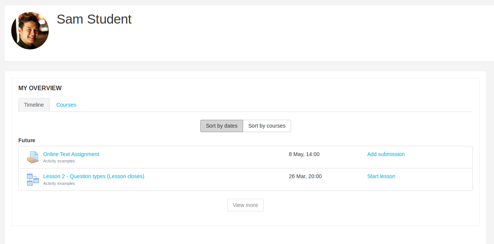

This page documents the Calendar API as it is in Moodle 3.3 and later. For the API in older versions of Moodle, see [Calendar API old](https://docs.moodle.org/dev/Calendar_API_old).

The Calendar API allows you to add, modify and delete events in the calendar for user, groups, courses and the site. As of 3.3 it also allows you to provide actions for these events so that they are then displayed on block_myoverview, which by default is shown on users' dashboard.

## Overview

The Moodle [Calendar](https://docs.moodle.org/en/Calendar) collects and displays calendar events to users. These events are generated by other plugins, like activities, to let the user know of an important date. For example, when an assignment opens for submission.

The block_myoverview plugin displays calendar events that have an action associated with them. For example, an activity may have a due date specified, in which case it will create a calendar action event so that the event will display on the dashboard for the user, as well as the calendar. In order to provide the action associated for this event you have to define a callback in your plugin which is detailed below.

## Creating an event

Creating a new calendar event. The optional parameter `$checkcapability` is used to check user's capability to add events. By default the `$checkcapability` parameter is set to true. You should set it to false if you have already checked that the user has the capabilities required for the event to be created, for example when an activity is creating an event based on a deadline.

```php
require_once($CFG->dirroot.'/calendar/lib.php');

$event = new stdClass();
$event->eventtype = SCORM_EVENT_TYPE_OPEN; // Constant defined somewhere in your code - this can be any string value you want. It is a way to identify the event.
$event->type = CALENDAR_EVENT_TYPE_STANDARD; // This is used for events we only want to display on the calendar, and are not needed on the block_myoverview.
$event->name = get_string('calendarstart', 'scorm', $scorm->name);
$event->description = format_module_intro('scorm', $scorm, $cmid, false);
$event->format = FORMAT_HTML;
$event->courseid = $scorm->course;
$event->groupid = 0;
$event->userid = 0;
$event->modulename = 'scorm';
$event->instance = $scorm->id;
$event->timestart = $scorm->timeopen;
$event->visible = instance_is_visible('scorm', $scorm);
$event->timeduration = 0;

calendar_event::create($event);
```

## Updating an event

You can update an existing event in database by providing at least the event id. If the event is a part of a chain of repeated events, the rest of series event will also be updated (depending on the value of property `repeateditall`). This function could also be used to insert new event to database, if the given event does not exist yet. The optional parameter `$checkcapability` is used to check user's capability to edit/add events. By default the `$checkcapability` parameter is set to true. You should set it to false if you have already checked that the user has the capabilities required for the event to be updated, for example when an activity is updating an event based on a change to it's settings.

```php
$eventid = required_param('id', PARAM_INT);
$event = calendar_event::load($eventid);

$data = $mform->get_data();
$event->update($data);
```

## Deleting an event

You can delete an existing event from the database. The optional parameter `$deleterepeated` is used as an indicator to remove the rest of repeated events. The default value for `$deleterepeated` is true. Deleting an event will also delete all associated files related to the event's editor context.

```php
$eventid = required_param('id', PARAM_INT);
$event = calendar_event::load($eventid);
$event->delete($repeats);
```

## Event priority

There might be cases that an activity event will have user and/or group overrides. Therefore we need a way to show only the relevant event on the user's calendar. This is where the 'priority' field comes in.

The event priority is set to the following:

- NULL for non-override events.

```php
$event->priority = null;
```

- 0 for user override events.

```php
$event->priority = CALENDAR_EVENT_USER_OVERRIDE_PRIORITY;
```

- A positive integer for group events.

For integer and non-null event priorities, the lower the value, the higher the priority is. Meaning, user overrides always have a higher priority than group overrides. Group override priorities are currently being determined in two ways in core activities:

1. In the assignment module, the event priorities for group overrides are being determined from the `sortorder` column in the 'assign_overrides' table.
1. In the lesson and quiz modules, the event priorities for group overrides are being calculated using the functions `lesson_get_group_override_priorities($lessonid)` and `quiz_get_group_override_priorities($quizid)`.

Should you ever decide to sort out group override priorities by implementing `*_get_group_override_priorities()`, the recommended return structure would be something like

```php
[
    'youreventtype1' => $prioritiesforeventtype1,
    ...
]
```

where '$prioritiesforeventtype1' is an associative array that has the timestamp of the group override event as key and the calculated priority as value. For more details, please see the implementation for the lesson module below:

```php
/**
 * Calculates the priorities of timeopen and timeclose values for group overrides for a lesson.
 *
 * @param int $lessonid The lesson ID.
 * @return array|null Array of group override priorities for open and close times. Null if there are no group overrides.
 */
function lesson_get_group_override_priorities($lessonid) {
    global $DB;

    // Fetch group overrides.
    $where = 'lessonid = :lessonid AND groupid IS NOT NULL';
    $params = ['lessonid' => $lessonid];
    $overrides = $DB->get_records_select('lesson_overrides', $where, $params, '', 'id, groupid, available, deadline');
    if (!$overrides) {
        return null;
    }

    $grouptimeopen = [];
    $grouptimeclose = [];
    foreach ($overrides as $override) {
        if ($override->available !== null && !in_array($override->available, $grouptimeopen)) {
            $grouptimeopen[] = $override->available;
        }
        if ($override->deadline !== null && !in_array($override->deadline, $grouptimeclose)) {
            $grouptimeclose[] = $override->deadline;
        }
    }

    // Sort open times in ascending manner. The earlier open time gets higher priority.
    sort($grouptimeopen);
    // Set priorities.
    $opengrouppriorities = [];
    $openpriority = 1;
    foreach ($grouptimeopen as $timeopen) {
        $opengrouppriorities[$timeopen] = $openpriority++;
    }

    // Sort close times in descending manner. The later close time gets higher priority.
    rsort($grouptimeclose);
    // Set priorities.
    $closegrouppriorities = [];
    $closepriority = 1;
    foreach ($grouptimeclose as $timeclose) {
        $closegrouppriorities[$timeclose] = $closepriority++;
    }

    return [
        'open' => $opengrouppriorities,
        'close' => $closegrouppriorities
    ];
}
```

## Action events

Action events are calendar events that can be actioned. E.g. A student submitting an assignment by a certain date. These events are displayed on the block_myoverview which by default is on users' dashboard. Creating these is the same as creating a normal calendar event except instead of using CALENDAR_EVENT_TYPE_STANDARD as your calendar event type, you use CALENDAR_EVENT_TYPE_ACTION. The events are also sorted on the dashboard by the value specified in the 'timesort' field (unixtime) for the event.

Example of the changes to the above code would be to change the `type` and to specify the `timesort` value.

```php
$event->type = CALENDAR_EVENT_TYPE_ACTION;
$event->timesort = $scorm->timeclose;
```



### The callbacks

There are 3 callbacks your module can implement that are used to control when and how your action is shown to the user.

#### mod_xyz_core_calendar_is_event_visible()

This callback determines if an event should be visible throughout the site. For example, the assignment module creates a grading event for teachers. We do not want this event being visible to users who can not perform this action (eg. students), so we return false for those users. If you do not implement this function then the event will always be visible.

```php
/**
 * Is the event visible?
 *
 * This is used to determine global visibility of an event in all places throughout Moodle. For example,
 * the ASSIGN_EVENT_TYPE_GRADINGDUE event will not be shown to students on their calendar, and
 * ASSIGN_EVENT_TYPE_DUE events will not be shown to teachers.
 *
 * @param calendar_event $event
 * @return bool Returns true if the event is visible to the current user, false otherwise.
 */
function mod_assign_core_calendar_is_event_visible(calendar_event $event) {
    global $CFG, $USER;

    require_once($CFG->dirroot . '/mod/assign/locallib.php');

    $cm = get_fast_modinfo($event->courseid)->instances['assign'][$event->instance];
    $context = context_module::instance($cm->id);

    $assign = new assign($context, $cm, null);

    if ($event->eventtype == ASSIGN_EVENT_TYPE_GRADINGDUE) {
        return $assign->can_grade();
    } else {
        return !$assign->can_grade() && $assign->can_view_submission($USER->id);
    }
}
```

#### mod_xyz_core_calendar_provide_event_action()

This function takes a calendar event and provides the action associated with it, or null if there is none in which case the event will not be shown in block_myoverview (but will still be shown in the calendar block). This is used by the block_myoverview plugin. If you do not implement this function then the events created by your plugin will not be shown on the block.

Eg.

```php
function mod_scorm_core_calendar_provide_event_action(calendar_event $event,
        \core_calendar\action_factory $factory) {
    global $CFG;

    require_once($CFG->dirroot . '/mod/scorm/locallib.php');

    $cm = get_fast_modinfo($event->courseid)->instances['scorm'][$event->instance];

    if (!empty($cm->customdata['timeclose']) && $cm->customdata['timeclose'] < time()) {
        // The scorm has closed so the user can no longer submit anything.
        return null;
    }

    // Restore scorm object from cached values in $cm, we only need id, timeclose and timeopen.
    $customdata = $cm->customdata ?: [];
    $customdata['id'] = $cm->instance;
    $scorm = (object)($customdata + ['timeclose' => 0, 'timeopen' => 0]);

    // Check that the SCORM activity is open.
    list($actionable, $warnings) = scorm_get_availability_status($scorm);

    return $factory->create_instance(
        get_string('enter', 'scorm'),
        new \moodle_url('/mod/scorm/view.php', array('id' => $cm->id)),
        1,
        $actionable
    );
}
```

The variables to pass to `create_instance()` are -

1. `string $name` The name of the event, for example `get_string('dosomething', 'mod_xyz')`.
1. `\moodle_url $url` The URL the user visits in order to perform this action.
1. `int $itemcount` This represents the number of items that require action (eg. Need to write 3 forum posts). If this is 0 then the event is not displayed.
1. `bool $actionable` This determines if the event is currently able to be acted on. Eg. the activity may not currently be open due to date restrictions so the event is shown to the user to let them know that there is an upcoming event but the url will not be active.

#### mod_xyz_core_calendar_event_action_shows_item_count()

This function determines if a given event should display the number of items to action on block_myoverview. For example, if the event type is `ASSIGN_EVENT_TYPE_GRADINGDUE` then we only display the item count if there are one or more assignments to grade. If you do not implement this function then the item count is always hidden. This is usually fine as the majority of events only have an item count of '1' (eg. Submitting an assignment) and there is no need display the item count.

Eg.

```php
/**
 * Callback function that determines whether an action event should be showing its item count
 * based on the event type and the item count.
 *
 * @param calendar_event $event The calendar event.
 * @param int $itemcount The item count associated with the action event.
 * @return bool
 */
function mod_assign_core_calendar_event_action_shows_item_count(calendar_event $event, $itemcount = 0) {
    // List of event types where the action event's item count should be shown.
    $eventtypesshowingitemcount = [
        ASSIGN_EVENT_TYPE_GRADINGDUE
    ];
    // For mod_assign, item count should be shown if the event type is 'gradingdue' and there is one or more item count.
    return in_array($event->eventtype, $eventtypesshowingitemcount) && $itemcount > 0;
}
```

## Refreshing calendar events of activity modules

A new ad-hoc task  'refresh_mod_calendar_events_task' has been created. This task basically loops through all of the activity modules that implement the '*_refresh_events()' hook.

Sample usage:

```php
// Create the instance.
$refreshtask = new refresh_mod_calendar_events_task();

// Add custom data.
$customdata = [
    'plugins' => ['assign', 'lesson', 'quiz'] // Optional. If not specified, it will refresh the events of all of the activity modules.
];
$refreshtask->set_custom_data($customdata);

// Queue it.
\core\task\manager::queue_adhoc_task($refreshtask);
```

## calendar_get_legacy_events()

This functions accepts the same inputs as 'calendar_get_events()' but is now utilising the new Moodle Calendar API system. It respects overrides and will also add the action properties, whenever appropriate.

*Note that this function will not work as expected if you pass a list of user ids as the current user session is internally used to determine which events should be visible. More info in https://tracker.moodle.org/browse/[MDL-60340](https://tracker.moodle.org/browse/MDL-60340)*

## Changes to Behat

The "And I follow "Course1"" Behat step won't work from the Dashboard anymore and has been replaced with "And I am on "Course 1" course homepage" where 'Course 1' is the fullname of the course.

## Drag & drop

The calendar supports dragging and dropping events within the calendar in order to change the start day for the event. Each type of calendar event can be dragged by a user with sufficient permissions to edit the event.

### Dragging action events

When an action event is dragged the corresponding property will also be updated in the activity instance that generated the event. For example, dragging the assignment due date event will result in the assignment activity's due date to be changed.

In order to drag an action event the logged in user must have the `moodle/course:manageactivities` capability in the activity that generated the event.

For an action event to be draggable the activity that generated it will need to have implemented at least one (but ideally both) callback to handle updating itself after the calendar event is dragged.

#### `core_calendar_event_timestart_updated` (required)

This callback is required to be implemented by any activity that wishes to have it's action events draggable in the calendar.

This callback handles updating the activity instance based on the changed action event. The callback will receive the updated calendar event and the corresponding activity instance.

Example:

```php
function mod_feedback_core_calendar_event_timestart_updated(\calendar_event $event, \stdClass $feedback) {
    global $CFG, $DB;

    if (empty($event->instance) || $event->modulename != 'feedback') {
        return;
    }

    if ($event->instance != $feedback->id) {
        return;
    }

    if (!in_array($event->eventtype, [FEEDBACK_EVENT_TYPE_OPEN, FEEDBACK_EVENT_TYPE_CLOSE])) {
        return;
    }

    $courseid = $event->courseid;
    $modulename = $event->modulename;
    $instanceid = $event->instance;
    $modified = false;

    $coursemodule = get_fast_modinfo($courseid)->instances[$modulename][$instanceid];
    $context = context_module::instance($coursemodule->id);

    // The user does not have the capability to modify this activity.
    if (!has_capability('moodle/course:manageactivities', $context)) {
        return;
    }

    if ($event->eventtype == FEEDBACK_EVENT_TYPE_OPEN) {
        // If the event is for the feedback activity opening then we should
        // set the start time of the feedback activity to be the new start
        // time of the event.
        if ($feedback->timeopen != $event->timestart) {
            $feedback->timeopen = $event->timestart;
            $feedback->timemodified = time();
            $modified = true;
        }
    } else if ($event->eventtype == FEEDBACK_EVENT_TYPE_CLOSE) {
        // If the event is for the feedback activity closing then we should
        // set the end time of the feedback activity to be the new start
        // time of the event.
        if ($feedback->timeclose != $event->timestart) {
            $feedback->timeclose = $event->timestart;
            $modified = true;
        }
    }

    if ($modified) {
        $feedback->timemodified = time();
        $DB->update_record('feedback', $feedback);
        $event = \core\event\course_module_updated::create_from_cm($coursemodule, $context);
        $event->trigger();
    }
}
```

#### `core_calendar_get_valid_event_timestart_range`

This callback should calculate the minimum and maximum allowed `timestart` property for the given calendar event. This will typically be based on the properties of the activity instance, for example the `timeopen` and `timeclose` properties of the activity could form the minimum and maximum bounds, respectively.

These values will be used to provide a visual indicator to the user in the calendar UI for which days are valid for the event to be dragged to. It will also be used to validate that the calendar event is being updated to a valid `timestart` value.

The callback should return an array with two values, the first value representing the minimum cutoff and the second the maximum.

The callback can return an array for each of the minimum and maximum cutoffs, if it has them. The array should contain the timestamp of the cutoff and an error message to be displayed to the user if they attempt to drag an event to a day that violates the limit. For example:

```php
[
     [1505704373, 'The due date must be after the sbumission start date'], // Minimum cutoff.
     [1506741172, 'The due date must be before the cutoff date'] // Maximum cutoff.
]
```

If the calendar event has no limits then it should return null in for either/both of the min and max cutoff values to indicate that it isn't limited. For example:

```php
[null, null] // No limits.
[null, [1510625037, “This is the maximum cutoff”]] // No minimum cutoff.
[[1510625037, “This is the minimum cutoff”], null] // No maximum cutoff.
```

If the calendar event has no valid `timestart` values then the callback should return `false`. This is used to prevent the drag-and-drop of override events in activities that support them (that is Assign, Quiz).

Example:

```php
function mod_feedback_core_calendar_get_valid_event_timestart_range(\calendar_event $event, \stdClass $instance) {
    $mindate = null;
    $maxdate = null;

    if ($event->eventtype == FEEDBACK_EVENT_TYPE_OPEN) {
        // The start time of the open event can't be equal to or after the
        // close time of the choice activity.
        if (!empty($instance->timeclose)) {
            $maxdate = [
                $instance->timeclose,
                get_string('openafterclose', 'feedback')
            ];
        }
    } else if ($event->eventtype == FEEDBACK_EVENT_TYPE_CLOSE) {
        // The start time of the close event can't be equal to or earlier than the
        // open time of the choice activity.
        if (!empty($instance->timeopen)) {
            $mindate = [
                $instance->timeopen,
                get_string('closebeforeopen', 'feedback')
            ];
        }
    }

    return [$mindate, $maxdate];
}
```

## Component events

Starting from Moodle 3.9 plugins other than activity modules can create calendar events, too.  These can be site-level, course category-level, course-level or user events. Events can be standard or action events.

Example of creating an event:

```php
$event->component = 'tool_yourtool';
$event->modulename = '';
$event->eventtype = 'myeventtype';
$event->instance = $instanceid; // Whatever instance you want.
$event->type = CALENDAR_EVENT_TYPE_STANDARD; // Or: $event->type = CALENDAR_EVENT_TYPE_ACTION;
// ... Other properties, see section "Create event" above.

// For site events:
$event->courseid = SITEID;
$event->categoryid = 0;

// For category events:
$event->categoryid = $categoryid;
$event->courseid = 0;

// For course events:
$event->courseid = $courseid;
$event->categoryid = 0;

// For user events:
$event->courseid = 0;
$event->categoryid = 0;
$event->userid = $userid;
```

If this is an action event, see the "Action events" section above for supported callbacks. Note that currently category-level action events are not displayed on the timeline (but they will be displayed in the calendar). Timeline only displays the site-wide events, user events and events in the courses where user is enrolled.

Events created by the plugins can not be edited or deleted by users in the calendar. Drag&drop is currently not supported for component events.

To change the icon of the event, add the file `pix/myeventtype.svg` to your plugin. You can add font-awesome mapping in `<pluginname>_get_fontawesome_icon_map()` callback.

To change the alt text for the icon add to the language file:

```php
$string['myeventtype'] = 'My event type';
```
