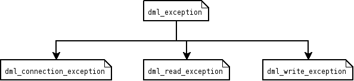

The [DML](./index.md) API uses a selection of exceptions to indicate errors.

## Types of exception

### dml_connection_exception

Thrown when can not connect to database for any reason.

### dml_read_exception

Problem occurred during reading from database. Originally indicated be returning *false* - this value was often confused with *false* return value meaning *not found*.

### dml_write_exception

Problem occurred during writing to database. Originally indicated be returning *false*.

## See also

- [Exceptions](https://docs.moodle.org/dev/Exceptions): General guidelines for using of exceptions in Moodle 2.0
- [DML functions](./index.md): Where all the functions used to handle DB data. ([DML](https://en.wikipedia.org/wiki/Data_manipulation_language)) are defined.
- [DDL functions](./ddl.md): Where all the functions used to handle DB objects ([DDL](https://en.wikipedia.org/wiki/Data_Definition_Language)) are defined.
