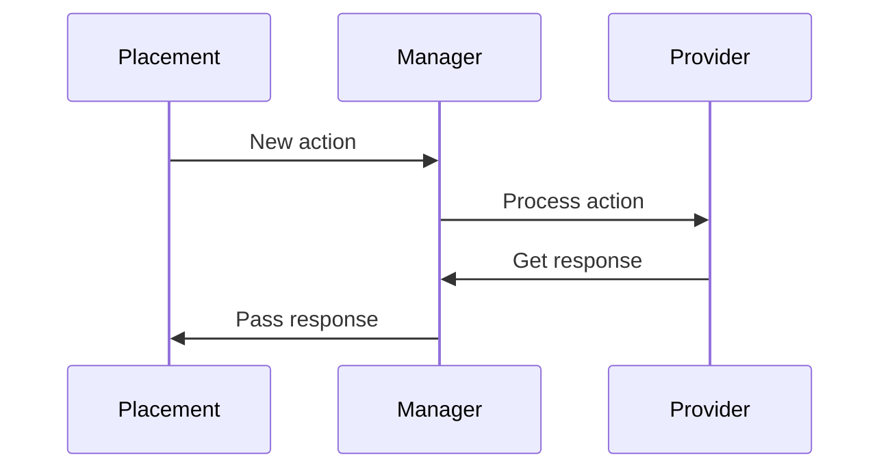

Placements provide a consistent UX and UI for users when they use AI backed functionality (e.g. generating an image).

Placement plugins leverage the functionality of the other components of the [AI subsystem](/apis/subsystems/ai/index.md).
This means plugin authors can focus on how users interact with the AI functionality, without needing to
implement the AI functionality itself.

Because Placements are plugins in their own right, it allows for greater flexibility in how AI functionality is presented to users.

Outgoing data from the Placement plugin travels via the Manager `core_ai\manager`.
The Manager is the connective tissue between the [Provider](/apis/plugintypes/ai/provider.md) and the Placement plugins.
Likewise, all responses from the Provider plugin are handed back to the Manager before being passed to the Placement plugin.

:::warning The Golden Rule:

Placements **do not** know about Providers, and Providers **do not** know about Placements.
Everything should go via the Manager.

:::

## Class implementation

Placements are defined as classes in their own namespace according to their plugin name.
The naming convention for a Placement class is `aiplacement_<plugin name>`.
For example: `aiplacement_editor` (with a corresponding namespace).

Each Placement **must** inherit from the `\core_ai\placement` abstract class.
They must also implement the following methods:

**`get_action_list(): array`**

This is the list of Actions that are supported by this Placement, for example the `aiplacement_editor` plugin defines this as:

```php
public function get_action_list(): array {
    return [
        \core_ai\aiactions\generate_text::class,
        \core_ai\aiactions\generate_image::class,
    ];
}
```

## Capabilities and permissions

Placements provide a way for a user to carry out an Action.
Placements are responsible for determining who can use a particular Action, and where it can be used.
It is not the job of Providers to determine access.

```php
$capabilities = [
    'aiplacement/editor:generate_image' => [
        'captype' => 'write',
        'contextlevel' => CONTEXT_COURSE,
        'archetypes' => [
            'manager' => CAP_ALLOW,
            'editingteacher' => CAP_ALLOW,
            'teacher' => CAP_ALLOW,
            'student' => CAP_ALLOW,
        ],
    ],
...
```

## Action processing

The following is the basic workflow in order for a placement to have an action processed for a user request:



### Step 1

- The Placement instantiates a new Action object of type they wish to use.
- The Action must be instantiated with the required data. Each action will define what configuration it needs. As an example:

```php
// Prepare the action.
$action = new \core_ai\aiactions\generate_image(
    contextid: $contextid,
    userid: $USER->id,
    prompttext: $prompttext,
    quality: $quality,
    aspectratio: $aspectratio,
    numimages: $numimages,
    style: $style,
);
```

### Step 2

- The Placement then instantiates the Manager class `core_ai\manager`.
- The Manager calls `process_action()`, passing in the configured Action object. As an example:

```php
// Send the action to the AI manager.
$manager = \core\di::get(\core_ai\manager::class);
$response = $manager->process_action($action);
```

### Step 3

- The `process_action()` method then returns a response object (instance of `responses\response_base`).
- It is up to the Placement to check for success/failure of the response and pass the result back to the
  user.

## Plugin structure

The Placement plugins reside in the `ai/placement` directory.

Each Placement is in a separate subdirectory and consists of a number of mandatory and supportive files that will
be necessary for development.

<details>
  <summary>The typical directory layout for the Placement plugin, using the Editor Placement as an example:</summary>

```console
.
├── classes
│   ├── external
│   │   ├── generate_image.php
│   │   └── generate_text.php
│   ├── placement.php
│   ├── privacy
│   │   └── provider.php
│   └── utils.php
├── db
│   ├── access.php
│   └── services.php
├── lang
│   └── en
│       └── aiplacement_editor.php
├── tests
│   └── utils_test.php
└── version.php
```

</details>

## Settings

Settings for the Placement should be defined in the `settings.php` file.
Each Placement plugin should create a new admin settings page using `core_ai\admin\admin_settingspage_provider` class.

This is the same for Provider plugins, for example:

```php
use core_ai\admin\admin_settingspage_provider;

if ($hassiteconfig) {
    // Placement specific settings heading.
    $settings = new admin_settingspage_provider(
        'aiplacement_courseassist',
        new lang_string('pluginname', 'aiplacement_courseassist'),
        'moodle/site:config',
        true,
    );
...
```
