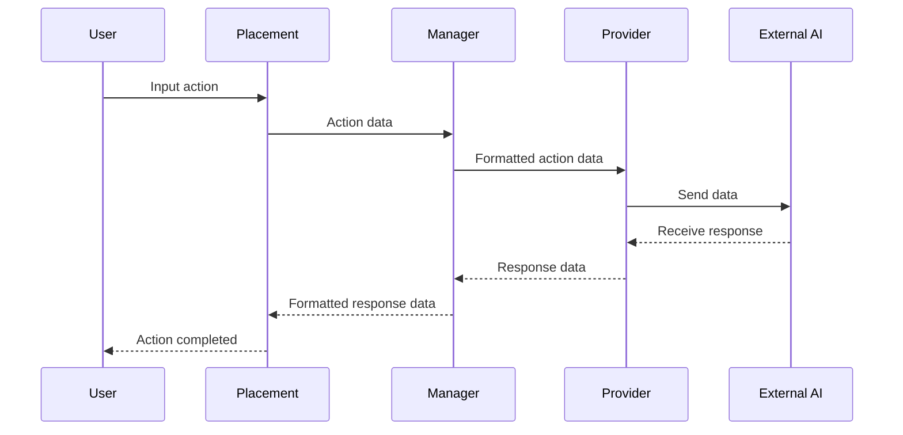

The [AI subsystem](/apis/subsystems/ai/index.md) provides a way for developers to integrate external AI services into Moodle LMS.

The design of the AI subsystem features two distinct plugin types:

- [Provider plugins](/apis/plugintypes/ai/provider.md)
- [Placement plugins](/apis/plugintypes/ai/placement.md)

This design allows for independent development of each plugin. The Provider plugin is not aware of the
Placement plugin, and the Placement plugin is not aware of the Provider plugin. All communication between the two plugins
travels through the Manager.

### Provider plugins

Providers are the interface between the [AI subsystem](/apis/subsystems/ai/index.md) and external AI.
Their focus is on formatting actions, passing them to the external AI system, and providing the response.

Currently, Moodle supports the following AI Providers in core:

- OpenAI `aiprovider_openai`
- Azure AI `aiprovider_azureai`

See the [Providers](/apis/plugintypes/ai/provider.md) documentation for more information
on developing Provider plugins.

### Placement plugins

Placements provide a consistent UX and UI for users when they use AI backed functionality (e.g. generating an image).

Placement plugins leverage the functionality of the other components of the [AI subsystem](/apis/subsystems/ai/index.md).
This means plugin authors can focus on how users interact with the AI functionality, without needing to
implement the AI functionality itself.

Because Placements are plugins in their own right, it allows for greater flexibility in how AI functionality is presented to users.

Currently, Moodle supports the following AI Placements:

- Course Assistance `aiplacement_courseassist`
- HTML Text Editor `aiplacement_editor`

See the [Placements](/apis/plugintypes/ai/placement.md) documentation for more information
on developing Placement plugins.
