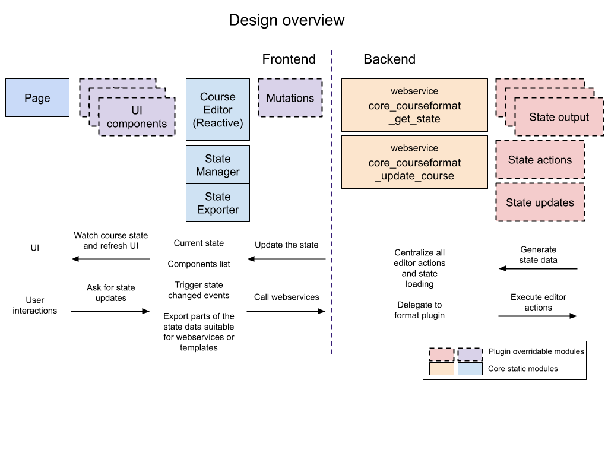
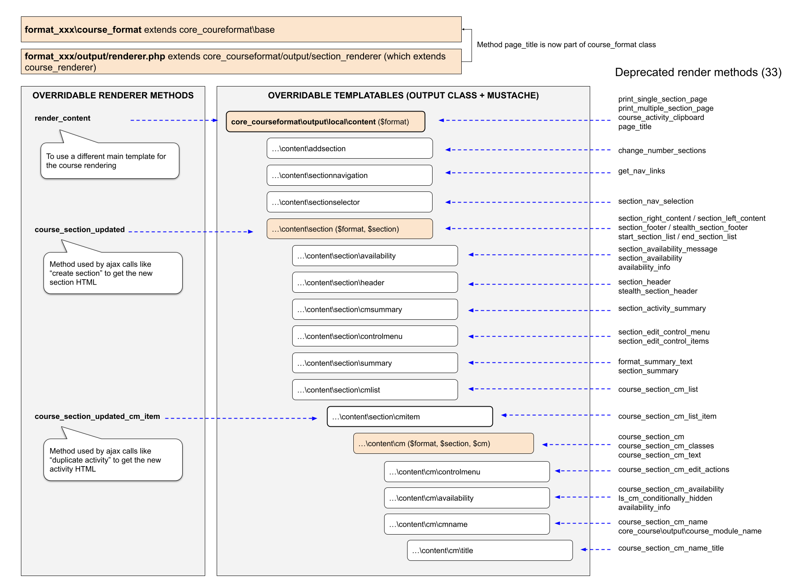

<!-- cspell:ignore cmitem -->
<!-- cspell:ignore controlmenu -->
<!-- cspell:ignore courseeditor -->
<!-- cspell:ignore dndupload -->

import { getExample } from '@site/src/moodleBridge';

The new course editor introduced n Moodle 4.0 reimplements most of the previous webservices, AMD modules, and internal logic of the course rendering. However, all formats since 3.11 will use the previous libraries by default until its final deprecation in Moodle 4.3. This document collects the main adaptations any 3.11 course format will require to continue working when this happens.

## Changes summary

The main areas affected by the new 4.0 course editor are:

- Course format plugins are now part of the `core_courseformat` subsystem
- The old format_base class is now `core_courseformat\base` and it is mandatory for all format plugins to extend.
- Format plugin renderer is now mandatory (and in most cases they will extend `core_courseformat\output\section_renderer`)
- The old format_section_renderer_base is now `core_courseformat\output\section_renderer`
- The `core_courseformat\output\section_renderer` class now it extends core_course_renderer directly. This means that `$this->courserenderer` attribute is deprecated.
- All renderer methods using html_writer are deprecated. All UI elements are now rendered using output classes and mustache files. Formats can provide alternative output classes and templates.
- The new editor uses data attributes instead of CSS classes to locate section and activities elements in the page HTML. All elements must add those attributes to use the new AMD modules.
- Most of the logic of the previous core_course/actions AMD module is now replaced with core_courseformat AMD modules, each one corresponding to the specific UI elements.
- Formats can override the `core_courseformat\base::uses_course_index` in their base class to enable the course index.
- Formats can override the `core_courseformat\base::supports_components` in their base class to use the new course editor library instead of the legacy one.
- The course frontend uses a reactive state to maintain the UI elements updated. Format plugins can create new reactive AMD modules to interact with that state or extend the core_courseformat state classes to extend the data stored in that state.
- Course formats now can implement the `core_courseformat\base::delete_format_data`  hook to clean data when the course is deleted.
- The course `format_base` class now provides a method `show_editor` to know if the user is editing or not the course depending on the page editing and the user capabilities. This method should be used instead of the previous `$PAGE->user_is_editing() && has_capability('moodle/course:manageactivities', $coursecontext)`. If you need to check for different capabilities, you can pass an array of them. If not specified, defaults to only `moodle:course/manageactivities`.

## Moodle 3.11 vs 4.0 course editor architecture

The 4.0 course editor follows a completely new pattern that is not compatible with the previous one. That new pattern is called **reactive components**.

To ensure all 3.11 formats are still usable in 4.0 the new architecture is opt-in, meaning that in order to use the new libraries old formats must indicate to the system that they are compatible (overriding the `core_courseformat\base::supports_components`).

The following table compares some of the main changes:

| Moodle 3.11 | Moodle 4.0 |
|---- | ---- |
| AMD module "core_course/actions" is responsible for capturing the course edition actions, sending them to the correct course webservice, and replacing the returned HTML into the proper page elements. | Al the functionalities from the original actions are now divided into several AMD modules:<ul><li>core_courseformat/local/courseeditor: coordinates all the UI elements via a data structure called "reactive state data" (or simply, "state data").</li><li>core_courseformat/local/courseeditor/mutations: centralizes all the backend calls and applies the results to the reactive state data before the UI components update the interface.</li><li>core_courseformat/local/content/actions: captures the user clicks on specific action links and displays modals to get more information from the user if necessary (for example the destination position in a move activity action).</li><li>core_courseformat/content/\*: ADM modules responsible for keeping some part of the UI aligned with the reactive state data.</li><li>core_courseformat/courseeditor/\*: other modules and helpers</li></ul><p>NOTE: some user actions like hiding and showing sections/activities are not yet migrated to the new architecture.</p><p>NOTE: updating a full section or activity HTML is still handled by the core_course/actions module. However, now both methods are public to the module and they are used by the new course editor.</p> |
| course/dndupload.js file is responsible for handling any file dropping on the course page. | Moodle 4.0 still uses the course/dndupload.js to handle files dropped into the course area. |
| The webservice core_course_edit_section is responsible for updating a course section and returning the section header and the activities list HTML. | <p>Except for showing and hiding a section (not migrated yet) the rest of the section actions are now handled by the new `core_courseformat_update_course` webservice.</p><p>The new webservice has the same parameters for both section and activity actions and always returns a standardized data structure to interact with the frontend reactive state data. This means that it does not return HTML fragments anymore.</p> |
| The webservice core_course_edit_module is responsible for updating activity and returning the activity HTML or other page fragments. | <p>Except for showing and hiding an activity (not migrated yet) the rest of the activity actions are now handled by the new `core_courseformat_update_course` webservice.</p><p>The new webservice has the same parameters for both section and activity actions and always returns a standardized data structure to interact with the frontend reactive state data. This means that it does not return HTML fragments anymore.</p> |
| All frontend JS logic is responsible for interacting with the backend and updating all the necessary frontend elements depending on the return value. | <p>The JS logic is now distributed into several modules called "components". Each module can only interact with a specific page element and watch a data structure called reactive state date (or simply "state data").</p><p>The main points of the new component structure are:</p><ol><li>The initial state data is loaded using the `core_courseformat_get_state` webservice</li><li>All components are registered into the core_courseformat/courseeditor page instance.</li><li>When the state data changes, the course editor instance triggers the component's watchers methods to update the UI.</li><li>Components are not able to alter the state data. If a component captures an action that requires some state change, it asks the course editor to perform a state mutation.</li></ol> |
| Formats can alter the page HTML by overriding format_section_renderer_base methods | <p>Most renderer methods are now deprecated and have been migrated to output classes and mustache templates. There are only a few rendered methods formats that can override.</p><p>Now format plugins can override output classes by simply creating the equivalent format_pluginname/output/courseformat/* class. For example, core_courseformat\output\local\content can be overridden by creating a format_pluginname\output\courseformat\content class.</p><p>Important note: the new mustache structure uses partials and blocks to include sub-templates. This opens the door to a future frontend course rendering but it also makes the template overriding a bit more complex. See the "overriding templates" section for more information.</p> |
| <p>Format renderer is optional. If none is provided the course format renderer_base is used.</p><p>Inside a format rendered the `$this->courserenderer` attribute is used to access the course renderer methods.</p> | Format renderer is mandatory. The base core_courseformat\output\section_renderer now extends the core_course_renderer class and `$this->courserenderer` is deprecated. |
| The page elements are located using css class names such as "li.activity", ".actions", or "li.section". | All page elements are now located using data attributes. See [Course elements data attributes](./index.md#course-elements-data-attributes) for more information. |
| The course is rendered using print_single_section_page or print_multiple_section_page depending on the number of sections to render. | <p>The course format base instance contains all the necessary data to determine the way a course is rendered. To Specify a single section page formats should use `$format->set_section_number` method before rendering the course.</p><p>Once the format instance setup is finished, the course is rendered using the `content` output class. See migrating old renderer methods to outputs section for more information.</p> |
| To know if the user is editing the course, the format should check for `$PAGE->user_is_editing()` to know if edit is enabled and also `has_capability('moodle/course:update', $coursecontext)` to know if the user has the required capabilities. | The format base class have a method `$format->show_editor()` that do all the user and page validations to know if the current course display has to include editor options or not. |

The following diagram represents the data flow of the new architecture:



## First steps to migrate a 3.11 course format to 4.0

From 4.0 the course/format folder has its own subsystem called core_courseformat. This subsystem contains all the course rendering logic (only some minor elements are still in the original location for retro compatibility until Moodle 4.3).

To ensure your format plugin is integrated with the new subsystem:

- The main format_pluginname class should extend `core_courseformat\base` instead of the old format_base one.
- Your plugin **must provide a renderer class**. In most cases this class **will extend `core_courseformat\output\section_renderer`**.
- Any output class your plugin needs to override should be located in format_pluginname/classes/output/courseformat

In summary, the first two things you need to adapt to your format are:

### Point 1: create a renderer class

Now renderer classes are mandatory for course format plugins. Here there are two scenarios:

Scenario 1: if you plugin already has one you should replace the old "extends format_section_renderer_base" by "extends core_courseformat\output\section_renderer".

Scenario 2: If your plugin does not have a renderer, create a file **course/format/pluginname/classes/output/renderer.php** with a content like:

<details>
  <summary>View example</summary>
  <div>

import Renderer from '!!raw-loader!./_examples/output/renderer.php';
export const RendererProps = {
    examplePurpose: 'Output renderer',
    plugintype: 'format',
    pluginname: 'pluginname',
    filepath: '/output/renderer.php',
};

<div>{getExample(RendererProps, Renderer)}</div>

  </div>
</details>

### Point 2: fix your base class

All Moodle 3.11 formats have a base format class extending format_base class from core_course. In Moodle 4.0 this class has been moved to `core_courseformat\base`. This means that you should replace the existing extends to avoid the deprecation message.

For compatibility reasons, the base class does not use a namespace and should be located in your plugin "lib.php" file. This could change after Moodle 4.3 when most old course rendering methods will be removed from core.

## The new output architecture

When the debug messages are enabled, all 3.11 format plugins will show several deprecation messages. Most of them are due to the fact that almost all previous renderer methods are now deprecated. The full list can be found in the **course/upgrade.txt** file.

Until 3.11 all course page elements are rendered using html_writer inside renderer methods. This made the UI hard to maintain because most of the methods are referring to the standard course structure (section_right_content, section_left_content, start_section_list, end_section_list…) instead of generic concepts like sections, activities, or activity menu.

With the new architecture, almost all UI elements are rendered using:

- An **output class** that generates the data to render. For example, course/format/classes/output/local/content/section.php
- A **mustache template** to render output class data. For example, course/format/templates/local/content/section.mustache
- An optional **reactive component** to update the frontend when the reactive state data changes: For example, course/format/amd/src/local/content/section.js

The following diagram represents the new output structure compared to the 3.11 one:



## Migrating old renderer methods to outputs

The process of migrating a renderer method to output can be complex depending on the element your format overrides. For these reasons, Moodle 3.11 formats will remain using the old renderer methods until they explicitly use the new outputs.

### Step 1: start using output components and renderers

As in Moodle 3.11 formats, all the course view is initialized and rendered in the "course/format/pluginname/format.php" file. However, the way the outputs are initialized is quite different from the previous version.

In Moodle 3.11 the format.php process was something like:

1. Do some param validations
2. Get the course format instance using `course_get_format` or `core_courseformat\base::instance`
3. Get the format/course renderer using: `$PAGE->get_renderer('format_pluginname')`;
4. Use the renderer `print_single_section_page` or `print_multiple_section_page` depending on the section param.

The problems with that approach were:

- There are two main renderer methods which are almost the same
- The auxiliary renderer methods require a big amount of params even if they are not needed for the method because they need to provide those parameters to all the child methods.

To avoid this situation now the format base class instance is used as a single exchange param to all output classes. Once the format instance is initialized every output class can get all necessary information from it.

The new workflow in 4.0 is:

<details>
  <summary>View example</summary>
  <div>

import Format from '!!raw-loader!./_examples/format.php';
export const FormatProps = {
    examplePurpose: 'Format course display',
    plugintype: 'format',
    pluginname: 'pluginname',
    filepath: '/format.php',
};

<div>{getExample(FormatProps, Format)}</div>

  </div>
</details>

Some important notes about the code:

- The rendered class now can be obtained using `$format->get_renderer`
- Format plugins can override any core_courseformat output class (see sections below for more details). To get the correct output you need to use `$format->get_output_classname` method.
- As you may notice, the output class is rendered directly using the render method, not the `render_from_template` one. This is possible because all output classes implement the new Moodle 4.0 `named_templatable` interface.

### Step 2: override any output class to alter the template data to your plugin needs

Instead of having several renderer methods on a single file, the core_courseformat subsystem splits the output logic through several small classes, each one for a specific UI component. Format plugins can easily override specific classes to alter the template data.

The course format base class has a special method called get_output_classname that returns the overridden class name if available in the format plugin, or the core one if not. In order to detect the format classes, your plugin must place the overridden one in your format_pluginname\output\courseformat\...

For example, if a format plugin wants to add new options to the section action menu it should override the core_courseformat\output\local\content\section\controlmenu. To do so the plugin class should be format_topics\output\courseformat\content\section\controlmenu. You can find an example of an overridden output in the "course/format/topics/classes/output/courseformat/content/section/controlmenu.php" file.

### Step 3: create the basic mustache structure

Unlike output classes, mustache files cannot be extended nor overridden. To be able to alter specific mustaches your plugin must provide a minimum template structure. Furthermore, your plugin must provide some overridden output classes providing the alternative mustache templates location.

In moodle 3.11 the course render uses html_writer to generate the course view, where each renderer method has both data collection and HTML generating inside. This is not the case in Moodle 4.0. From now on, the full output data is collected via output classes before rendering all the nested mustache templates.

The course format subsystem requires a minimum of 3 mustaches to render a course:

- **local/content**: the full course template
- **local/content/section**: a section template. Used to refresh a section via ajax
- **local/content/section/cmitem**: an activity item template: Used to refresh an activity via ajax

The first thing your plugin needs is to create that structure and link it to the output components. Follow the guide on the [create format plugin page](./index.md#creating-the-basic-output-structure) to know how to create the basic structure.

### Step 4: create your own custom mustache blocks

Once your plugin has the basic mustache structure, you can provide extra mustache blocks to override parts of the page. Follow the [Override mustache blocks](./index.md#override-mustache-blocks) on the Creating a course format page to know how to do it.

## Enabling course index in your format

If your course format plugin uses a sections-activity structure it is possible to enable the course index. Add the course index in your format is as easy as overriding a method on your format base class:

<details>
  <summary>View example</summary>
  <div>

import BaseCourseIndex from '!!raw-loader!./_examples/lib_course_index.php';
export const BaseCourseIndexProps = {
    examplePurpose: 'Format base class with course index enabled',
    plugintype: 'format',
    pluginname: 'pluginname',
    filepath: '/lib.php',
};

<div>{getExample(BaseCourseIndexProps, BaseCourseIndex)}</div>

  </div>
</details>

It is important to note that the course index drawer is only available in Boost based themes, Classic based themes won't display it.

See the course index section in the create format plugin page for more information.

## Enabling reactive components

Moodle 4.0 introduced a new reactive course editor for the frontend. However, the new modules are not compatible with the previous YUI ones. To prevent errors in the 3.11 formats the new libraries are opt-in, meaning plugins must adapt their code before using it.

Step 1: add data attributes to the HTML elements
The previous YUI editor uses CSS classes to identify sections, activities, and section headers. Nowadays, the use of CSS classes beyond styling is discouraged so the new library uses data attributes to identify the main course page elements.

To adapt your plugin to the new editor you must add the proper data attributes. The following table explains the new selectors:

| Concept | 3.11 equivalent | 4.0 data attributes |
| ---- | ---- | ---- |
| Section | `li.section#section-{SECTION.NUM}` | `data-for="section"`<br/>`data-id={SECTION.ID}`<br/>`data-number={SECTION.NUM}` |
| Section header | `#sectionid-{SECTION.ID}-title` | `data-for="section_title"`<br/>`data-id={SECTION.ID}`<br/>`data-number={SECTION.NUM}` |
| Course module item (activity) | `li.activity#module-{CM.ID}` | `data-for="cmitem"`<br/>`data-id={CM.ID}` |
| Course sections list | `.course-content>ul` | `data-for="course_sectionlist"`<br/> `Section course modules list Li.section .content .section` <br/> `data-for="cmlist"`|
| Course module action link | `a.cm-edit-action` | `data-action={ACTIONNAME}`<br/>`data-id={CM.ID}` |
| Section action link | `.section_action_menu` | `data-action={ACTIONNAME}`<br/>`data-id={SECTION.ID}` |
| Section info | `.section_availability` | `data-for="sectioninfo"` |

### Step 2: enable supports components feature

Once your plugin has all the necessary data attributes you can disable the old YUI editor and enable the new reactive one by adding this method to your plugin base class:

<details>
  <summary>View example</summary>
  <div>

import BaseComponents from '!!raw-loader!./_examples/lib_components.php';
export const BaseComponentsProps = {
    examplePurpose: 'Format base class with components enabled',
    plugintype: 'format',
    pluginname: 'pluginname',
    filepath: '/lib.php',
};

<div>{getExample(BaseComponentsProps, BaseComponents)}</div>

  </div>
</details>

### Step 3: check the reactive components are enabled.

In principle, if you create the basic mustache structure as described in the previous chapter the course editor should work as expected. However, to check if they are working properly:

1. Enable developer debug level on your site and access a course as an administrator
2. Wait for the page to load and find in the debug footer the "Reactive instances" section.
3. Click on the button "CourseEditorXXXX" (where XXXX is the current course ID)
4. Once the panel opens, click on the "Highlight OFF" button (it will change to "Highlight ON")
5. Go to the top of the page and check the course content has several thick blue borders.

If the border appears around all the course content elements (sections, section headers and activities) means that the course editor has registered all the course content as a reactive component.

If you don't have a "CourseEditorXXXX" button or the content elements don't get highlighted means that, most probably, you override the main content mustache in a peculiar way and removed the JS initialization.

To re-introduce the JS initialization you should edit the plugin's "content.mustache" file with the following:

- Add `id="{{uniqid}}-course-format"` to the course content div element.
- At the end of the template add:

```handlebars
{{#js}}
require(['core_courseformat/local/content'], function(component) {
    component.init('{{uniqid}}-course-format', {}, {{sectionreturn}});
});
{{/js}}
```

By doing that the content main reactive component should be initialized and if you enable the highlighting the content should have a blue border. If some if the inner elements does not have a blue border when highlight is ON means that some data attribute is missing. Check the step 1 of this chapter for more information.
