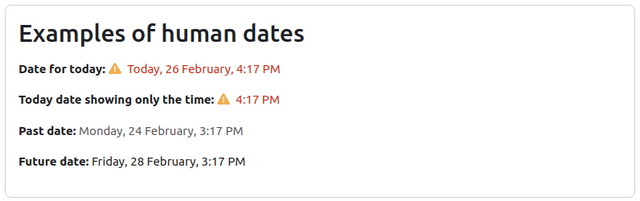

<Since version="5.0" issueNumber="MDL-83873" />

The `humandate` and `humantimeperiod` classes in Moodle are designed to render timestamps and time periods in a human-readable format. These classes provide functionality to display dates as "Today", "Yesterday", "Tomorrow", and apply alert styling if the date is near the current date.

## Using human time representation output classes

Both classes can be used as a normal output class in Moodle. Each class represent way of show dates and time in a human readable way:

- `humandate`: This renderer presents single dates and times in a user-friendly format, automatically adapting to the user's preferences and with some extra customization options.
- `humantimeperiod`: Designed for displaying date/time ranges, this renderer optimizes information presentation, eliminating redundant date information and representing time in a more user friendly way.

### `humandate` Class

The `humandate` class is used to render a single timestamp as a human-readable date.



### Example Usage

```php title='This will output "Today" if the timestamp is for the current day.'
use core_calendar\output\humandate;

$renderer = $PAGE->get_renderer('core', 'output');
$timestamp = (\core\di::get(\core\clock::class))->time();

// Basic example.
$humandate = humandate::create_from_timestamp($timestamp);
echo $renderer->render($humandate);

// Example adding a link to the date.
$humandate = humandate::create_from_timestamp(
    timestamp: $timestamp,
    link: new core\url('/calendar/view.php', ['view' => 'day', 'time' => $timestamp]),
);
echo $renderer->render($humandate);

// Example showing only the time.
$humandate = humandate::create_from_timestamp(
    timestamp: $timestamp,
    timeonly: true,
);
echo $renderer->render($humandate);
```

### `humantimeperiod` Class

The `humantimeperiod` class is used to render a time period in a human-readable format.


### Example Usage

```php
use core_calendar\output\humantimeperiod;

$renderer = $PAGE->get_renderer('core', 'output');
$starttimestamp = (\core\di::get(\core\clock::class))->time();
$endtimestamp = $starttimestamp + HOURSECS;

// Basic example.
$humantimeperiod = humantimeperiod::create_from_timestamp($starttimestamp, $endtimestamp);
echo $renderer->render($humantimeperiod);

// Example adding a link to the date.
$humantimeperiod = humantimeperiod::create_from_timestamp(
    starttimestamp: $starttimestamp,
    endtimestamp: $endtimestamp,
    link: new core\url('/calendar/view.php', ['view' => 'day', 'time' => $starttimestamp]),
);
echo $renderer->render($humantimeperiod);
```
